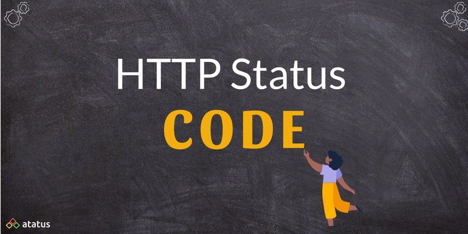
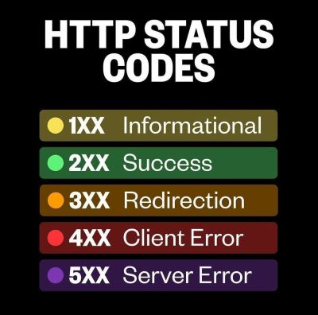

# Introduction 

## *This page contains all the HTTP response status codes*



## **What is HTTP Status Code?**

### When a browser sends a request to a server, the server responds with an HTTP status code. This HTTP code is not seen to users if the server can restore the content requested by the browser and there is no error. In the event that something goes wrong, the server will return an HTTP status code indicating that something isn't operating properly.

We can determine the type of error that has happened based on the status code provided by the server.


- ### The Browser sends requests to the SERVER as a CLIENT. The server then responds to this request with either a web page (based on files and databases) or a code if the website is unavailable for some reason. The servers follow standard protocols that control these codes.

- ### 404-Not Found and 502-Bad Gateway errors are two common codes that users encounter in their day-to-day browsing. There are numerous server status codes apart from this.

<pre>


</pre>   

|Series |   For   |Description|
|-------|-----------|------|
|**HTTP 100 Status Codes**|**Informational Responses**|A web server responds with a 1xx HTTP status code in the response when the received request is under processing by the server and these codes are kind of acknowledgement to the client.|
|**HTTP 200 Status Codes**|**Success**|2xx status codes indicate that the communication is successful and the web server could process the request received from the client browser|
|**HTTP 300 Status Codes**|**Redirection**|3xx - Redirection The client must take additional action to complete the request. This group of status codes indicates that further action needs to be taken by the user agent in order to complete the request.|
|**HTTP 400 Status Codes**|**Client Error**|A web server sends 4xx HTTP status code in the response when there is an error in the request received from the client.|
|**HTTP 500 Status Codes**|**Server Error**| 5xx error codes are returned by the web server when it encounters a problem during processing of the requested resource by the client.|





# ```HTTP 100 status codes``` 

|Series      |   For   |Description|
|------------|-----------|------|
|**HTTP 100**|**Continue**|The HTTP 100 Continue informational status response code indicates that everything so far is OK and that the client should continue with the request or ignore it if it is already finished.|
|**HTTP 101**|**Switching Protocols**|The HTTP 101 Switching Protocols response code indicates a protocol to which the server switches. The protocol is specified in the Upgrade request header received from a client.|
|**HTTP 102**|**Processing**|The HTTP 102 Processing informational status response code indicates to client that a full request has been received and the server is working on it.|
|**HTTP 103**|**Early Hints**|The HTTP 103 Early Hints information response status code is primarily intended to be used with the Link header to allow the user agent to start preloading resources while the server is still preparing a response.|

<pre>


</pre>  


# ```HTTP 200 status codes``` 

|Series      |   For   |Description|
|------------|-----------|------|
|**HTTP 200**|**Early Hints**|The HTTP 200 OK success status response code indicates that the request has succeeded. A 200 response is cacheable by default.|
|**HTTP 201**|**Created**|The HTTP 201 Created success status response code indicates that the request has succeeded and has led to the creation of a resource. The new resource, or a description and link to the new resource, is effectively created before the response is sent back and the newly created items are returned in the body of the message, located at either the URL of the request, or at the URL in the value of the Location header.|
|**HTTP 202**|**Accepted**|The HyperText Transfer Protocol (HTTP) 202 Accepted response status code indicates that the request has been accepted for processing, but the processing has not been completed; in fact, processing may not have started yet. The request might or might not eventually be acted upon, as it might be disallowed when processing actually takes place.|
|**HTTP 203**|**Non-Authoritative Information**|The HTTP 203 Non-Authoritative Information response status indicates that the request was successful but the enclosed payload has been modified by a transforming proxy from that of the origin server's 200 (OK) response.|
|**HTTP 204**|**No Content**|The HTTP 204 No Content success status response code indicates that a request has succeeded, but that the client doesn't need to navigate away from its current page.|
|**HTTP 205**|**Reset Content**|The HTTP 205 Reset Content response status tells the client to reset the document view, so for example to clear the content of a form, reset a canvas state, or to refresh the UI.|
|**HTTP 206**|**Partial Content**|The HTTP 206 Partial Content success status response code indicates that the request has succeeded and the body contains the requested ranges of data, as described in the Range header of the request.|
|**HTTP 207**|**Multi Status**|The HTTP 207 Multi-Status response code indicates that there might be a mixture of responses.|
|**HTTP 208**|**Already Reported**|The HTTP 208 Already Reported response code is used in a 207 (207 Multi-Status) response to save space and avoid conflicts. If the same resource is requested several times (for example as part of a collection), with different paths, only the first one is reported with 200. Responses for all other bindings will report with this 208 status code, so no conflicts are created and the response stays shorter.|
|**HTTP 226**|**IM Used**|In the context of delta encodings, the HTTP 226 IM Used status code is set by the server to indicate that it is returning a delta to the GET request that it received.|


<pre>


</pre>  

# ```HTTP 300 status codes``` 

|Series      |   For   |Description|
|------------|-----------|------|
|**HTTP 300**|**Multiple Choices**|The HTTP 300 Multiple Choices redirect status response code indicates that the request has more than one possible responses. The user-agent or the user should choose one of them. As there is no standardized way of choosing one of the responses, this response code is very rarely used.|
|**HTTP 301**|**Moved Permanently**|The HyperText Transfer Protocol (HTTP) 301 Moved Permanently redirect status response code indicates that the requested resource has been definitively moved to the URL given by the Location headers. A browser redirects to the new URL and search engines update their links to the resource.|
|**HTTP 302**|**Found**|The HyperText Transfer Protocol (HTTP) 302 Found redirect status response code indicates that the resource requested has been temporarily moved to the URL given by the Location header. A browser redirects to this page but search engines don't update their links to the resource (in 'SEO-speak', it is said that the 'link-juice' is not sent to the new URL).|
|**HTTP 303**|**See Other**|The HyperText Transfer Protocol (HTTP) 303 See Other redirect status response code indicates that the redirects don't link to the requested resource itself, but to another page (such as a confirmation page, a representation of a real-world object — see HTTP range-14 — or an upload-progress page). This response code is often sent back as a result of PUT or POST. The method used to display this redirected page is always GET.|
|**HTTP 304**|**Not Modified**|The HTTP 304 Not Modified client redirection response code indicates that there is no need to retransmit the requested resources. It is an implicit redirection to a cached resource. This happens when the request method is a safe method, such as GET or HEAD, or when the request is conditional and uses an If-None-Match or an If-Modified-Since header.|
|**HTTP 307**|**Temporary Redirect**|The HTTP 307 Temporary Redirect redirect status response code indicates that the resource requested has been temporarily moved to the URL given by the Location headers.|
|**HTTP 308**|**Permanent Redirect**|The HyperText Transfer Protocol (HTTP) 308 Permanent Redirect redirect status response code indicates that the resource requested has been definitively moved to the URL given by the Location headers. A browser redirects to this page and search engines update their links to the resource (in 'SEO-speak', it is said that the 'link-juice' is sent to the new URL).|


<pre>


</pre> 


# ```HTTP 400 status codes``` 

|Series      |   For   |Description|
|------------|-----------|------|
|**HTTP 400**|**Bad Request**|The request could not be understood by the server due to malformed syntax. The client SHOULD NOT repeat the request without modifications.|
|**HTTP 401**|**Unauthorized**|401 Unauthorized is returned when a web server requests credentials for a secured document .The client may repeat the request with a suitable authorization header field. If the request already included Authorization credentials, then the 401 response indicates that authorization has been refused for those credentials.|
|**HTTP 402**|**Payment Required**|The HTTP 402 Payment Required is a nonstandard response status code that is reserved for future use.  Sometimes, this status code indicates that the request cannot be processed until the client makes a payment. However, no standard use convention exists and different entities use it in different contexts.|
|**HTTP 403**|**Forbidden**|The HyperText Transfer Protocol (HTTP) 403 Forbidden is usually one of four things: 1. Directory listings are not permitted . 2. The web-server process has inadequate permissions ,3. Requesting address has been banned|
|**HTTP 404**|**Not Found**|404 Not Found means the web-server could not find the requested resource. When encountering a 404 error, a few things can be done: **1.** Check spelling of host, domain, path, and document , **2.** Check case of file and path. Linux and Unix web-servers (unless configured differently) usually distinquish case, with tradition of using all lowercase for each. **3.** Use Google to find an alternative URL to the resource, **4.** Try getting a cached page from google.|
|**HTTP 405**|**Method Not allowed**|A 405 Method Not Allowed is presented when attempting a request method that is not permitted by the web server.|
|**HTTP 406**|**Not Acceptable**|The HTTP 406 Not Acceptable client error response code indicates that the server cannot produce a response matching the list of acceptable values defined in the request's proactive content negotiation headers, and that the server is unwilling to supply a default representation.|
|**HTTP 407**|**Proxy Authentication Required**|407 Proxy Authentication Required: The client must first authenticate itself with the proxy before making the request.|
|**HTTP 408**|**Request Timeout**|This status code will usually result from latency between your computer and the web-server.To assist in resolving 408 Request Timeout Errors: **1.** try another website to make sure it is not the server infrastructure **2.** make sure no other downloads are running saturating your bandwidth **3.** reconnect to your WiFi **4.** If able to connect to another website fine, it is probably a remote network. If an Internet Speed Test is showing latency the problem could be your ISP or LAN. |
|**HTTP 409**|**Conflict**|HTTP response status code 409 Conflict is a client error that is returned by the server to indicate that the request can not be satisfied because the current state is incompatible with what is required. The response from the server may contain information in the message body that the client can use to resolve the conflict.|
|**HTTP 410**|**Gone**|The HTTP 410 Gone client error response code indicates that access to the target resource is no longer available at the origin server and that this condition is likely to be permanent.|
|**HTTP 411**|**Length Required**|The HyperText Transfer Protocol (HTTP) 411 Length Required client error response code indicates that the server refuses to accept the request without a defined Content-Length header.|
|**HTTP 412**|**Precondition Failed**|Http 412 error Preconditions for the HyperText Transfer Protocol (HTTP) When a client error response code indicates that access to the target resource has been refused, it indicates that the client has encountered a problem.|
|**HTTP 413**|**Payload Too Large**|413 Content Too Large response status code indicates that the request entity is larger than limits defined by server; the server might close the connection or return a Retry-After header field.|
|**HTTP 414**|**URI Too Long**|The HTTP 414 URI Too Long response status code indicates that the URI requested by the client is longer than the server is willing to interpret.|
|**HTTP 415**|**Length Required**|HTTP response status code 411 Length Required client error response code indicates that the server refuses to accept the request without a defined Content-Length header.|
|**HTTP 416**|**Gone**|The HyperText Transfer Protocol (HTTP) 416 Range Not Satisfiable error response code indicates that a server cannot serve the requested ranges. The most likely reason is that the document doesn't contain such ranges, or that the Range header value, though syntactically correct, doesn't make sense.|
|**HTTP 417**|**Expectation Failed**|The HTTP 417 Expectation Failed client error response code indicates that the expectation given in the request's Expect header could not be met.|
|**HTTP 418**|**I'm a teapot**|The HTTP 418 I'm a teapot client error response code indicates that the server refuses to brew coffee because it is, permanently, a teapot. A combined coffee/tea pot that is temporarily out of coffee should instead return 503. This error is a reference to Hyper Text Coffee Pot Control Protocol defined in April Fools' jokes in 1998 and 2014.|
|**HTTP 421**|**Misdirected Request**|The HTTP 421 Misdirected Request client error response code indicates that the request was directed to a server that is not able to produce a response. This might be possible if a connection is reused or if an alternative service is selected.|
|**HTTP 422**|**Unprocessable Content**|The HyperText Transfer Protocol (HTTP) 422 Unprocessable Content response status code indicates that the server understands the content type of the request entity, and the syntax of the request entity is correct, but it was unable to process the contained instructions.|
|**HTTP 423**|**Locked**|The HTTP 423 Locked error response code indicates that either the resources tentatively targeted by is locked, meaning it can't be accessed. Its content should contain some information in WebDAV's XML format.|
|**HTTP 424**|**Failed Dependency**|The HTTP 424 Failed Dependency client error response code indicates that the method could not be performed on the resource because the requested action depended on another action, and that action failed.|
|**HTTP 425**|**Too Early**|The HyperText Transfer Protocol (HTTP) 425 Too Early response status code indicates that the server is unwilling to risk processing a request that might be replayed, which creates the potential for a replay attack.|
|**HTTP 426**|**Upgrade Required**|The HTTP 426 Upgrade Required client error response code indicates that the server refuses to perform the request using the current protocol but might be willing to do so after the client upgrades to a different protocol.|
|**HTTP 428**|**Precondition Required**|The HTTP 428 Precondition Required response status code indicates that the server requires the request to be conditional.|
|**HTTP 429**|**Too Many Requests**|The HTTP 429 Too Many Requests response status code indicates the user has sent too many requests in a given amount of time ("rate limiting").|
|**HTTP 431**|**Request Header Fields Too Large**|The HTTP 431 Request Header Fields Too Large response status code indicates that the server refuses to process the request because the request's HTTP headers are too long. The request may be resubmitted after reducing the size of the request headers.|
|**HTTP 451**|**Unavailable For Legal Reasons**|The HyperText Transfer Protocol (HTTP) 451 Unavailable For Legal Reasons client error response code indicates that the user requested a resource that is not available due to legal reasons, such as a web page for which a legal action has been issued.|


<pre>


</pre> 

# ```HTTP 500 status codes``` 

|Series       |   For   |Description|
|-------------|-----------|------|
|**HTTP 500**|**Internal Server Error**|The HyperText Transfer Protocol (HTTP) 500 Internal Server Error server error response code indicates that the server encountered an unexpected condition that prevented it from fulfilling the request.|
|**HTTP 501**|**Not Implemented**|The HyperText Transfer Protocol (HTTP) 501 Not Implemented server error response code means that the server does not support the functionality required to fulfill the request.This status can also send a Retry-After header, telling the requester when to check back to see if the functionality is supported by then.|
|**HTTP 502**|**Bad Gateway**|The HyperText Transfer Protocol (HTTP) 502 Bad Gateway server error response code indicates that the server, while acting as a gateway or proxy, received an invalid response from the upstream server.|
|**HTTP 503**|**Service Unavailable**|The HyperText Transfer Protocol (HTTP) 503 Service Unavailable server error response code indicates that the server is not ready to handle the request.|
|**HTTP 504**|**Gateway Timeout**|The HyperText Transfer Protocol (HTTP) 504 Gateway Timeout server error response code indicates that the server, while acting as a gateway or proxy, did not get a response in time from the upstream server that it needed in order to complete the request.|
|**HTTP 505**|**HTTP Version Not Supported**|The HyperText Transfer Protocol (HTTP) 505 HTTP Version Not Supported response status code indicates that the HTTP version used in the request is not supported by the server.|
|**HTTP 506**|**Variant Also Negotiates**|The HyperText Transfer Protocol (HTTP) 506 Variant Also Negotiates response status code may be given in the context of Transparent Content Negotiation (see RFC 2295). This protocol enables a client to retrieve the best variant of a given resource, where the server supports multiple variants.|
|**HTTP 507**|**Precondition Required**|The HyperText Transfer Protocol (HTTP) 507 Insufficient Storage response status code may be given in the context of the Web Distributed Authoring and Versioning (WebDAV) protocol.|
|**HTTP 508**|**Loop Detected**|The HyperText Transfer Protocol (HTTP) 508 Loop Detected response status code may be given in the context of the Web Distributed Authoring and Versioning (WebDAV) protocol.|
|**HTTP 510**|**Not Extended**|The HyperText Transfer Protocol (HTTP) 510 Not Extended response status code is sent in the context of the HTTP Extension FrameworkIn that specification a client may send a request that contains an extension declaration, that describes the extension to be used. If the server receives such a request, but any described extensions are not supported for the request, then the server responds with the 510 status code..|
|**HTTP 511**|**Network Authentication Required**|The HTTP 511 Network Authentication Required response status code indicates that the client needs to authenticate to gain network access.This status is not generated by origin servers, but by intercepting proxies that control access to the network.|
