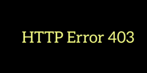

# Introduction 

## *This page contains all the HTTP Status Codes – 400 Series*

<pre>

</pre>   

# **Bad Request**

- ## **The request could not be understood by the server due to malformed syntax. The client SHOULD NOT repeat the request without modifications.**

# **Unauthorized**

- ## **401 Unauthorized is returned when a web server requests credentials for a secured document .The client may repeat the request with a suitable authorization header field. If the request already included Authorization credentials, then the 401 response indicates that authorization has been refused for those credentials.**

# **Payment Required**

- ## **The HTTP 402 Payment Required is a nonstandard response status code that is reserved for future use.** 

- ## **Sometimes, this status code indicates that the request cannot be processed until the client makes a payment. However, no standard use convention exists and different entities use it in different contexts.** 

# **Forbidden**

- ## **403 Forbidden is usually one of four things:**

1. Directory listings are not permitted

2. Currently authenticated user does not have sufficient permissions

3. The web-server process has inadequate permissions

4. Requesting address has been banned

# **Not Found**

- 404 Not Found means the web-server could not find the requested resource. When encountering a 404 error, a few things can be done:

- Check spelling of host, domain, path, and document.

- Check case of file and path. Linux and Unix web-servers (unless configured differently) usually distinquish case, with tradition of using all lowercase for each.

- Use Google to find an alternative URL to the resource

- Try getting a cached page from google.

