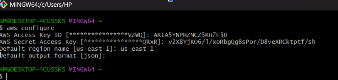
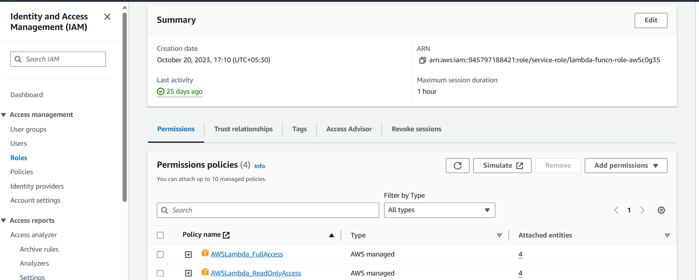
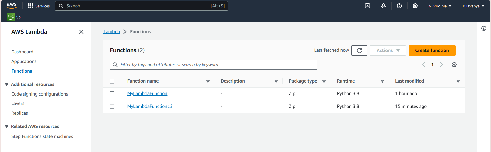
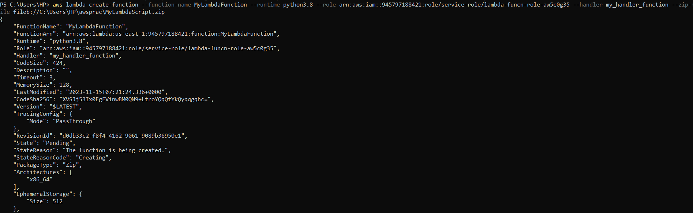

# To create AWS Lambda, using AWS-CLI, follow below steps :

## Pre-Requistes

- ### Make sure to Create a user in your aws console and have Access Key ID and Secret Access Key noted down in notepad.

## Process

- ### Open the command line of your choice and run following command with provided **Access Key ID** and **Secret Access Key** .

      aws configure 

    

- ### Create a role with required policies attached to it 
      aws iam create-role \
      --role-name lambda-funcn-role-aw5c0g35 \
      --assume-role-policy-document '{
      "Version": "2012-10-17",
      "Statement": [
      {
        "Effect": "Allow",
        "Principal": {
          "Service": "lambda.amazonaws.com"
        },
        "Action": "sts:AssumeRole"
       }
      ]
      }'

- ### once this command is runned , go back to the console , open the role and add the below polcies 
1. AWSLambda_FullAccess	

2. AWSLambda_ReadOnlyAccess	



- ### So here i have create a role called ``` lambda-funcn-role-aw5c0g35 ``` and added above policies to it 

      


- ### Now come back to cli and run the following cli command to create lambda function.

      aws lambda create-function --function-name MyLambdaFunctioncli --runtime python3.8 --role arn:aws:iam::945797188421:role/service-role/lambda-funcn-role-aw5c0g35 --handler my_handler_function --zip-file fileb://C:/Users/HP/awsprac/MyLambdaScript.zip

- ### Now go back to the console and see the function page you can see that your lambda function got created successfully.


<br>

<hr>

# POWERSHELL

 ## PowerShell Pre-requisites

-      Install-Module -Name AWSLambdaPSCore -Force -AllowClobber

 ## PowerShell Commands :

- ### Create a role with required policies attached to it . Run the following command to create role

``` 
New-IAMRole -RoleName "lambda-funcn-role-aw5c0g35 " -AssumeRolePolicyDocument '{
    "Version": "2012-10-17",
  " Statement": [
    {
      "Effect": "Allow",
      "Principal": {
        "Service": "lambda.amazonaws.com"
      },
      "Action": "sts:AssumeRole"
    }
  ]
}'

```
- ### Now go back to the portal and add policies to it 

1. AWSLambda_FullAccess	

2. AWSLambda_ReadOnlyAccess	

  

- ### Now run the following command to create the function

      aws lambda create-function --function-name MyLambdaFunction --runtime python3.8 --role arn:aws:iam::945797188421:role/service-role/lambda-funcn-role-aw5c0g35 --handler my_handler_function --zip-file fileb://C:\Users\HP\awsprac\MyLambdaScript.zip



- ### Go back to the portal and you can see funcion got created.


<br>

<hr>