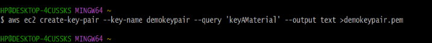
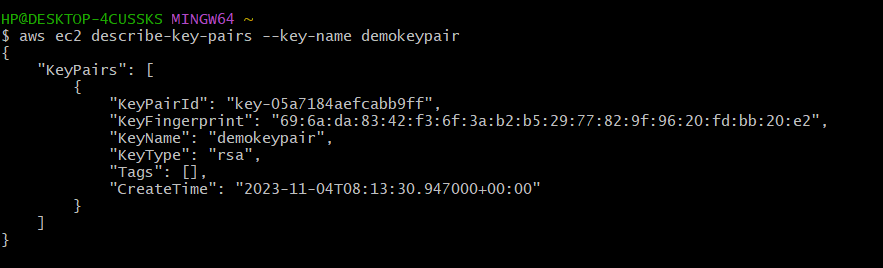
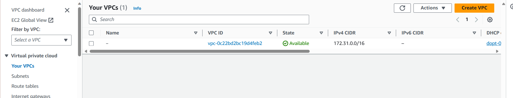
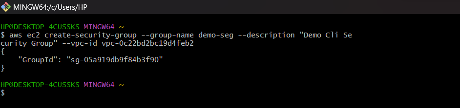
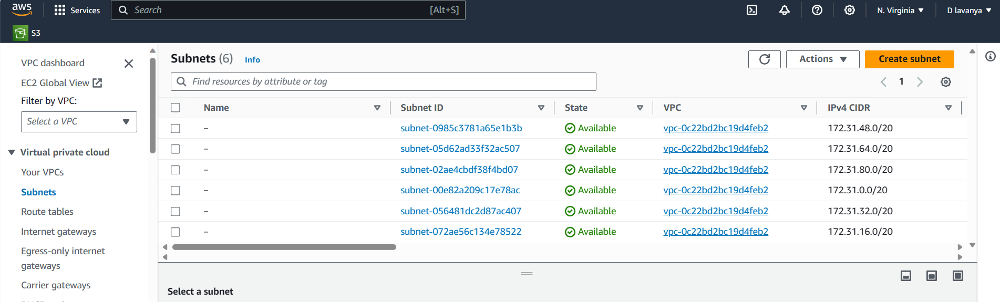
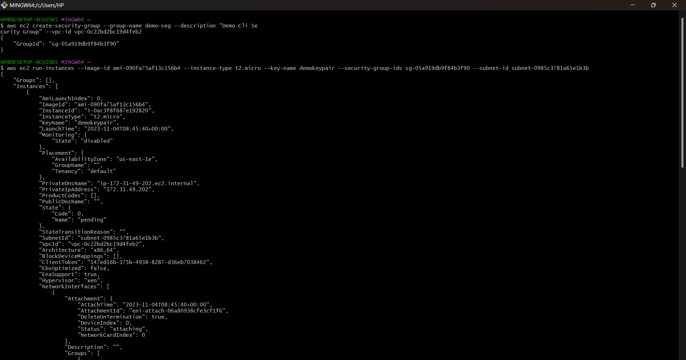
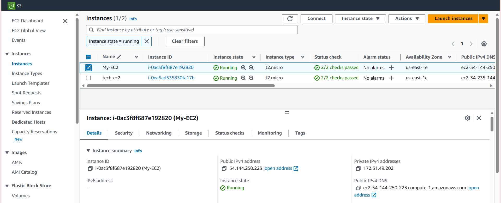

# To create AWS EC2 Instance, using AWS-CLI, follow below steps :

## Pre-Requistes

- ### Make sure to Create a user in your aws console and have Access Key ID and Secret Access Key noted down in notepad.

## Process

- ### Open the command line of your choice and run following command with provided **Access Key ID** and **Secret Access Key** .

      aws configure 

    

- ### Make sure that your user has these 2 policies attached which will enable us to create EC2
1. AmazonEC2FullAccess
2. AmazonEC2ReadOnlyAccess

    

- ### Now to access EC2 instance we need key pair . so, lets create that by running following command : 

       aws ec2 create-key-pair –key-name demokeypair –query ‘keyMaterial’ –output text >demokeypair.pem 

    

- ### You can describe the keypair by running the following command.

      aws ec2 describe-key-pairs –key-name demokeypair

    

- ### Now its time to create Security group , lets run the following  command : 

      aws ec2 create-security-group --group-name demo-sg --description “Demo Cli Security Group” --vpc-id vpc-0c22bd2bc19d4feb2 
    ### You will get vpc-id under your vpc.

    
    

- ### Now even Security Group created successfully and we go sg-id as well i.e., ```"sg-05a919db9f84b3f90" ```.

- ### Now , its time to create instance , lets run the following command to create Ec2 instance .

      aws ec2 run-instances --image-id ami-090fa75af13c156b4 --instance-type t2.micro --key-name demokeypair --security-group-ids sg-05a919db9f84b3f90 --subnet-id subnet-0985c3781a65e1b3b

    ### Subnet-id you can get from your Subnets.

    
    


- ### Ec2 Instance got created successfully.

    


<hr>
<br>

# POWERSHELL

 ## PowerShell Pre-requisites

 -      Install-Module -Name AWSPowerShell -Force -AllowClobber

 -      Import-Module AWSPowerShell

 -      Set-AWSCredentials -AccessKey ***************** -SecretKey *************************


 ## PowerShell Commands :

 ### Create KeyPair

 -      New-EC2KeyPair -KeyName "MyNewKeyPair" | Out-File -FilePath "MyNewKeyPair.pem"

 ### Create SecurityGroup

 -     New-EC2SecurityGroup -GroupName "MySecurityGroup" -Description "My security group description" -VpcId "vpc-0c22bd2bc19d4feb2"

 ### Create EC2 Instance

 -     New-EC2Instance -ImageId "ami-090fa75af13c156b4" -InstanceType "t2.micro" -KeyName "MyNewKeyPair" -SecurityGroups "sg-0aca48df324da9a5f" -SubnetId "subnet-05d62ad33f32ac507"

 <br>

<hr>