#  Introduction

### What is ```AWS``` ?

#### Amazon Web Services (AWS) is a cloud solution provider with an on-demand delivery for cloud computing resources on the internet. AWS offers 100s of integrated services built to optimize power, content delivery, database storage, and other business needs.

## Create AWS Free tier Account .  

### 1. Open any Browser and search for ``aws sign up free tier``. And open the first link .

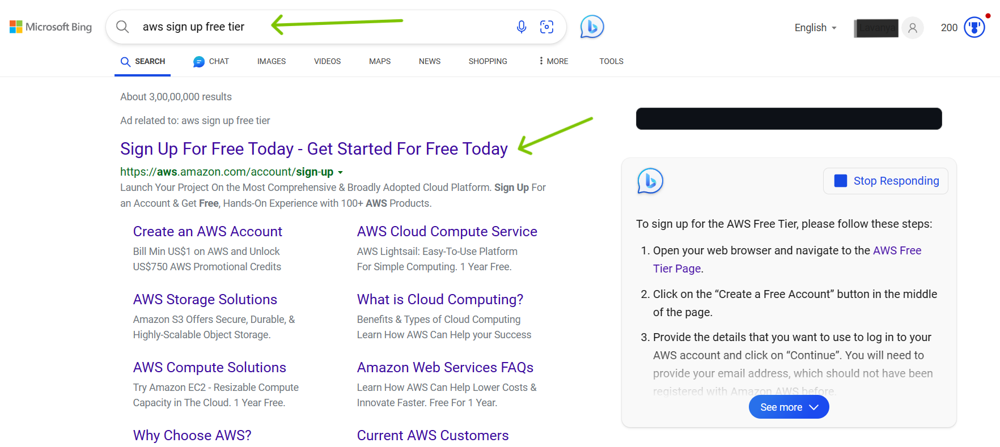

### 2. Click on ```Create a Free Account``` .


### 3. Give your respective ``Email-id`` and ``AWS Account Name`` and Click on ``Verify email address`` .

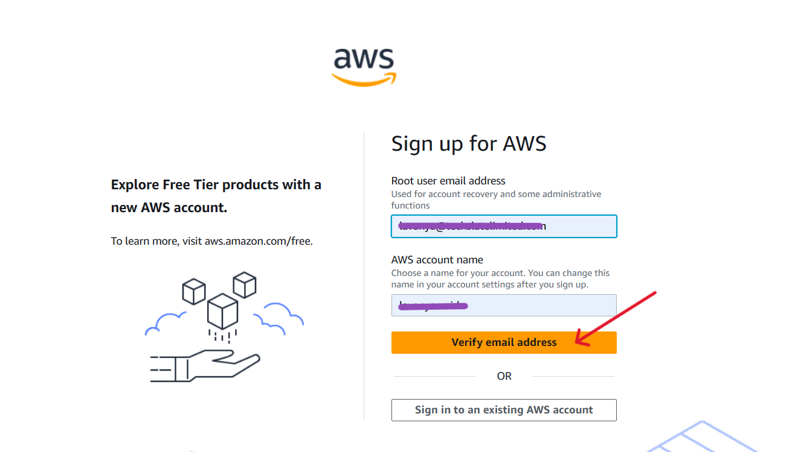

### 4. A Verification code has been sent to the respective ``Email-id``, Put that code into the box . Click on ``Verify``.

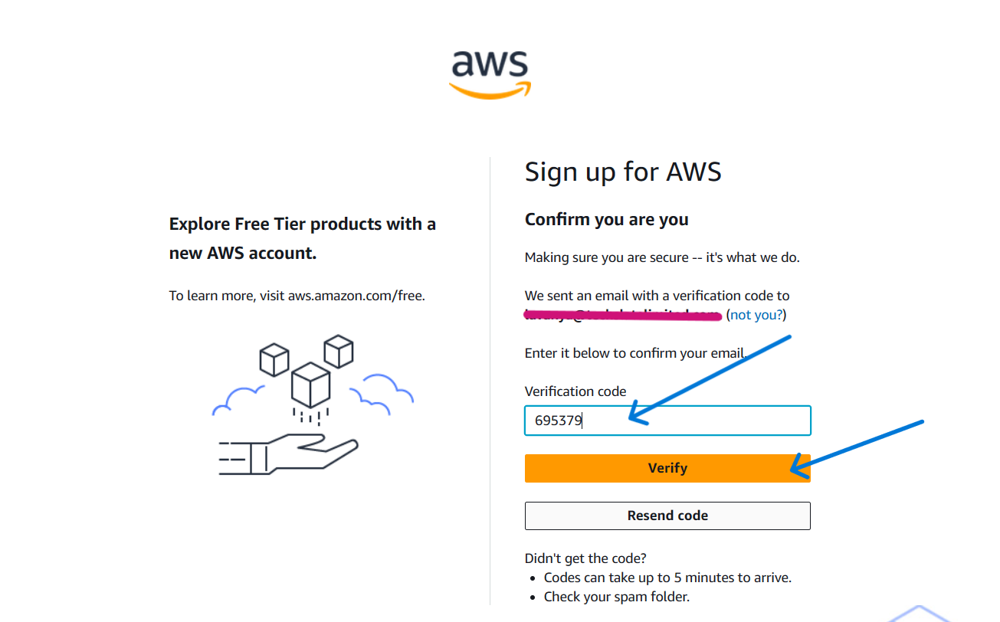

### 5. Give the ``Root User Password`` and ``Confirm the Password``. Click on ``Continue``.

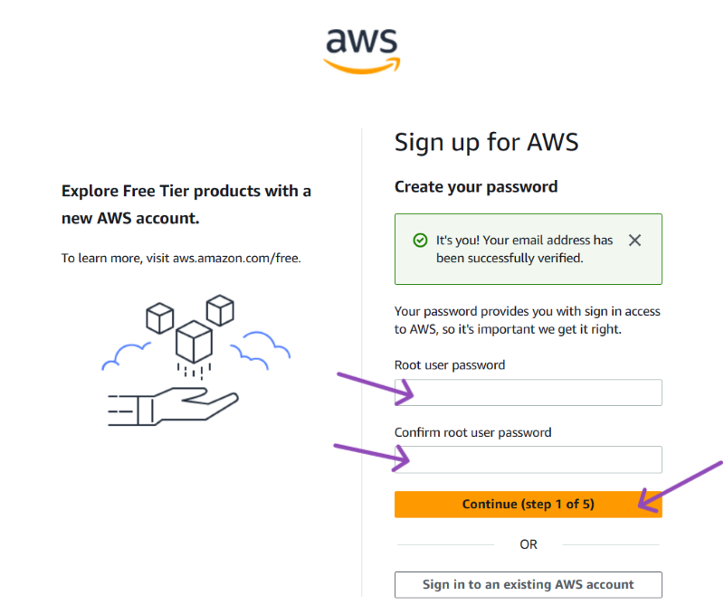

### 6. Proceeding further , fill in the details for ``Sign up``.


### 7. Click on ``Continue``.

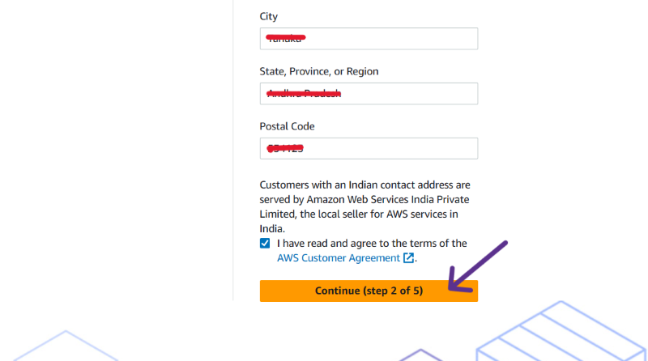

### 8. Moving to the next step , Fill in the account details properly .

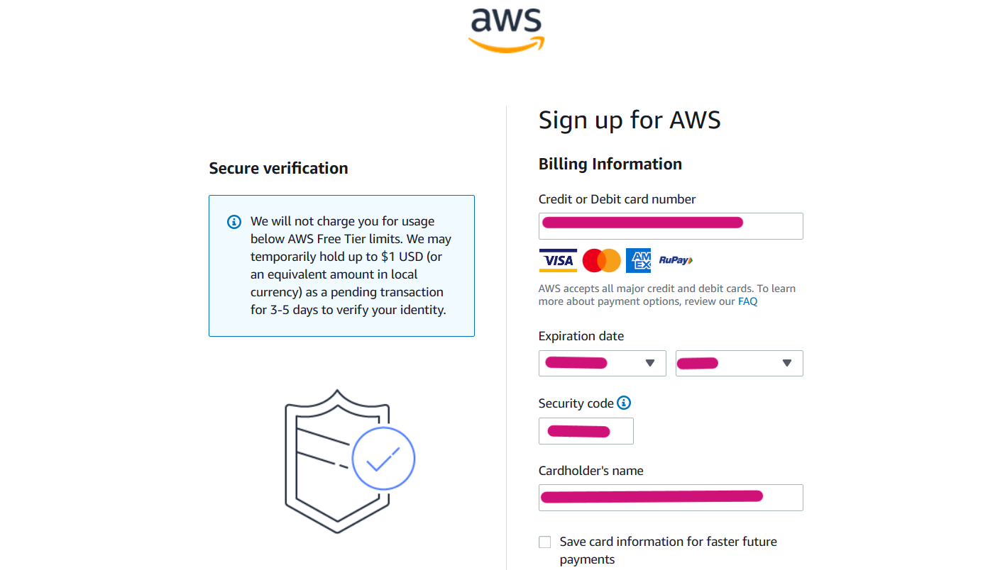

### 9. Once the Billing details are filled successfully , you will recieve the ``OTP`` to your respective mobile number , enter that and Click on ``Submit``.

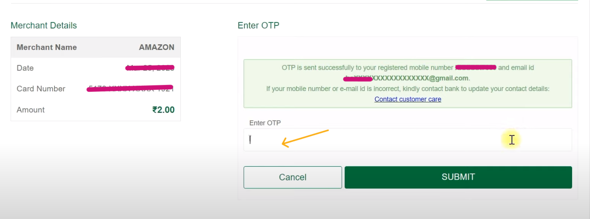

### 10. Moving to next step , just enter the required details to confirm your identity.

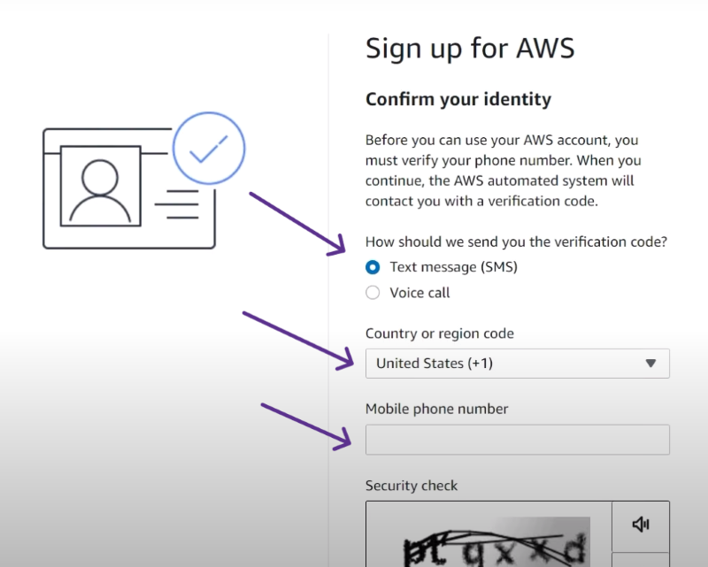

### 11. Click on ``Send SMS``.


### 12. Enter your ``OTP``.And click on ``Continue`` .

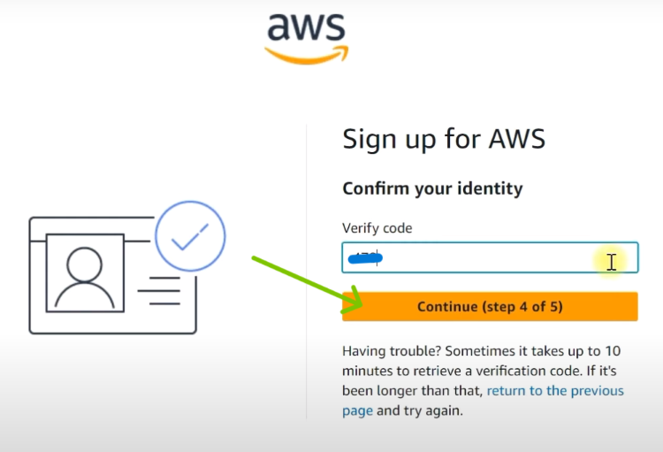

### 13. Select the Support plan as ``Basic Support - Free`` .

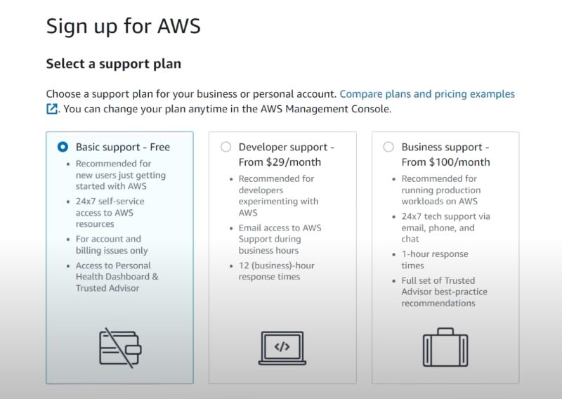

### 14. Click on ``Complete Sign-Up`` .

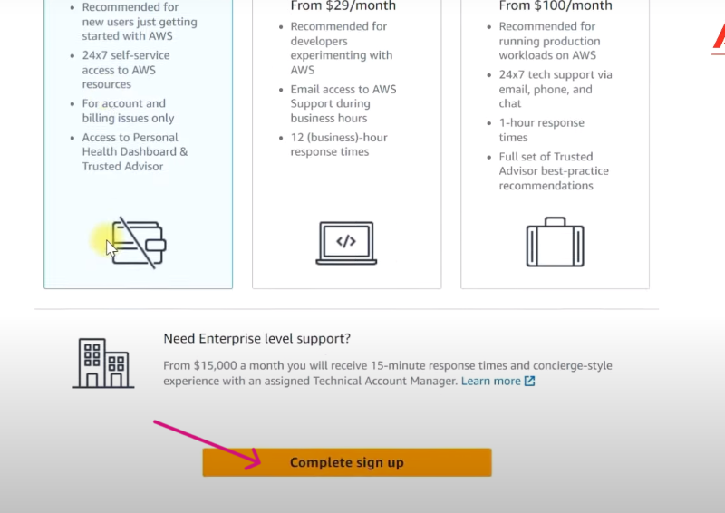

### 14. AWS Account creation is Successfully completed . Click on ``Go to the AWS Console Management``.

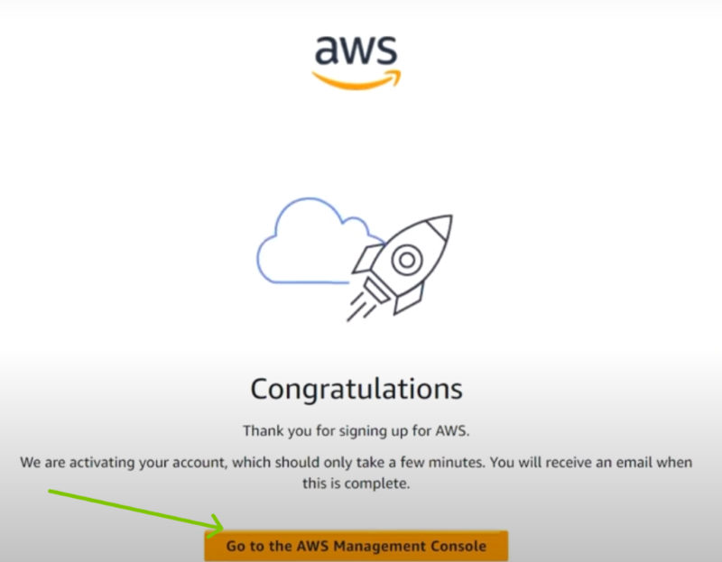

### 14. Login with your credentials , by give respective ``Email-id`` and ``Password``.


### Click on ``Sign in`` .
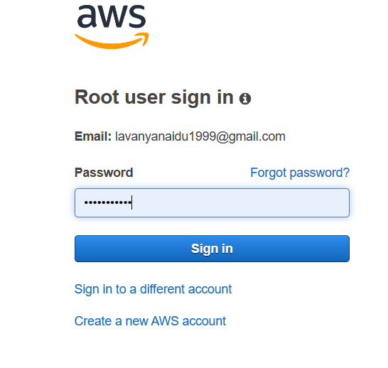

### AWS Console is all Ready .


***