# <span style="color: gold;"> Introduction

- What is ``Amazon Dynamo DB`` ?

    Amazon DynamoDB is a fully managed NoSQL database service that provides fast and predictable performance with seamless scalability. DynamoDB lets you offload the administrative burdens of operating and scaling a distributed database so that you don't have to worry about hardware provisioning, setup and configuration, replication, software patching, or cluster scaling. DynamoDB also offers encryption at rest, which eliminates the operational burden and complexity involved in protecting sensitive data. 

## To create Amazon Dynamo DB, using ```AWS Console``` , ```AWS-CLI``` and  ```Powershell``` follow below steps :

1.[AWS Console](#aws-console)

2.[AWS-CLI](#aws-cli)

3.[Powershell](#powershell)

# <span style="color: gold;">Pre-Requistes

- ### Make sure to Create a user in your aws console and have ```Access Key ID``` and ```Secret Access Key``` noted down in notepad.

# <span style="color: gold;">Process

## <span style="color: pink;">**AWS-Console**

| Step | Description | Screenshot |
|------|-------------|------------|
| 1. | **Open the AWS Console and search for RDS. Click on ``Create Table``.** | 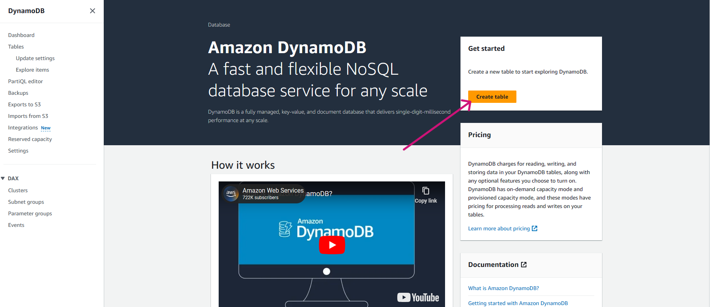 |
| 2. | **Give proper ``Table name``** | 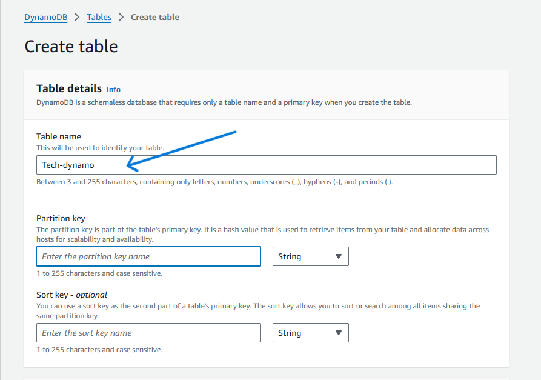 |
| 3. | **Fill in the  ``Partition key`` and  ``Sort key``.** | 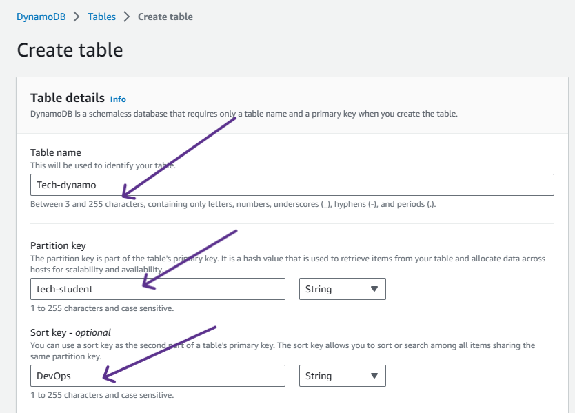 |
| 4. | **Moving to the Table settings select ``Customize settings`` and go for ``Dynamo DB Standard`` as Table class**. | 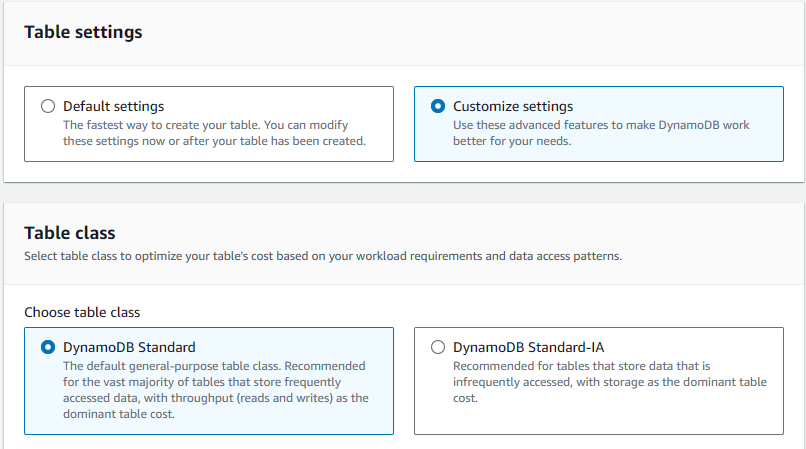 |
| 5. | **Followed by next step ``Read/write capacity settings``, keep ``Read Capacity`` and ``Write Capacity`` as ``Off``.** | 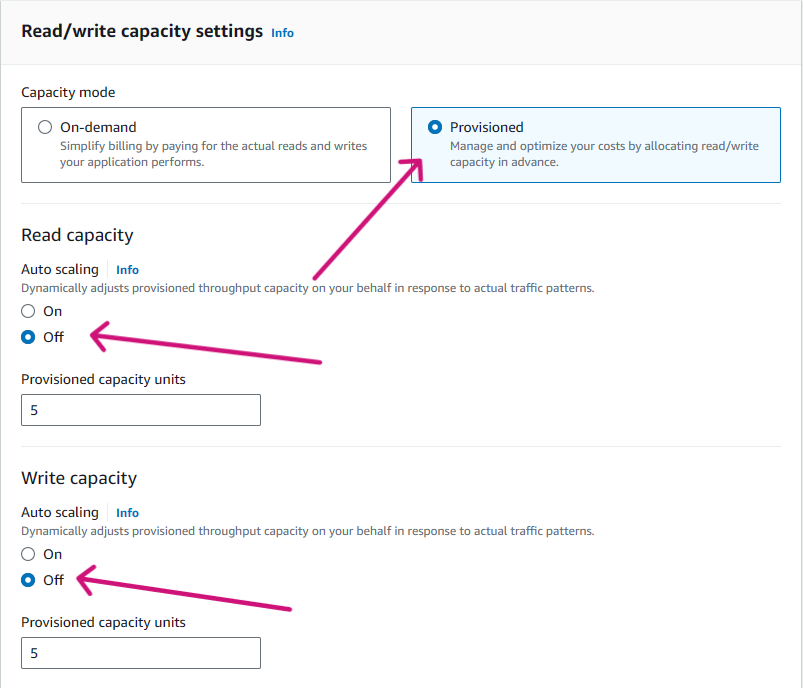 | 
| 6. | **Moving further in ``Secondary indexes`` , Click on ``Create local index``.** | 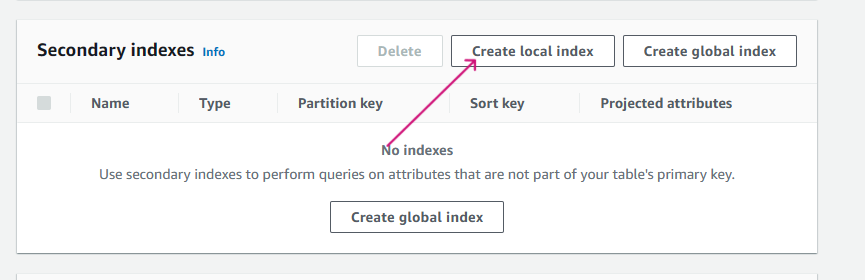 |
| 7. | **Give the ``Sort key name`` and Click on ``Create Index``.**| 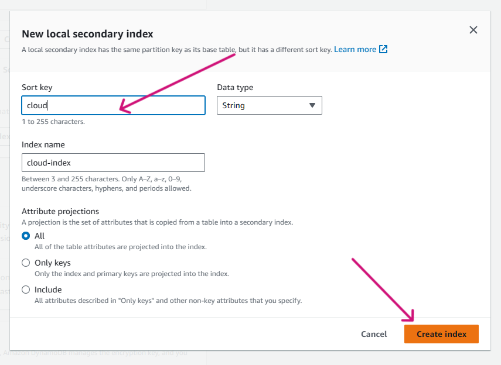 |
| 8. | **Keeping remaining things as default , Click on ``Create Table``** .| 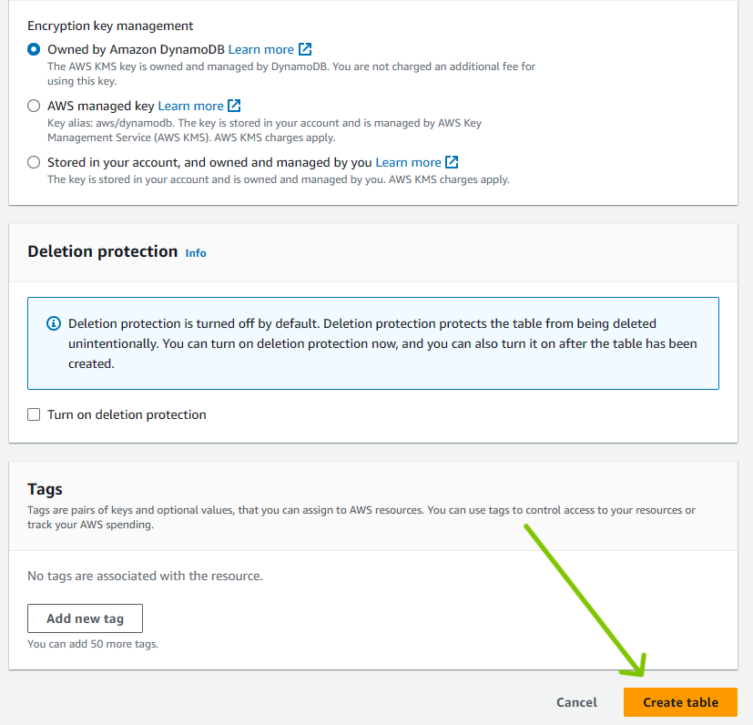 |
| 9. | **The table got created successfully.** | 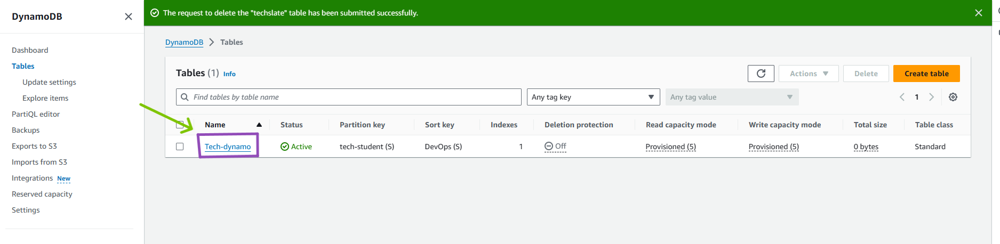 |
| 10.|**Now lets open the Table and try to create items under it .Click on ``Explore table Items``.** | 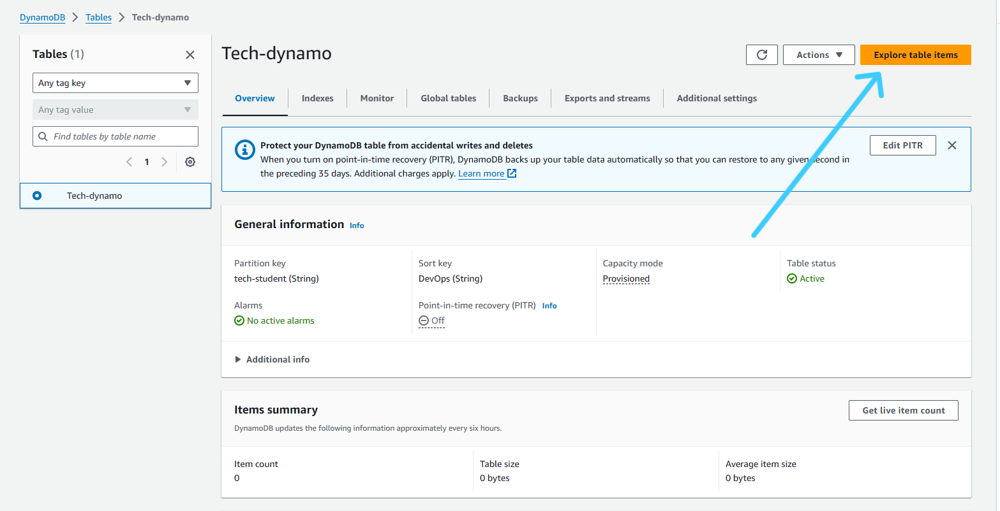 |
| 11.|**Click on ``Create Item``.** | 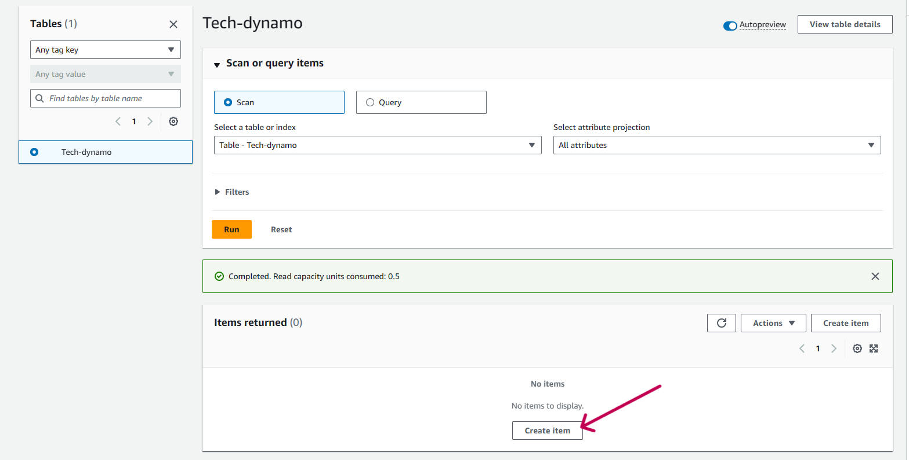 |
| 12.|**Fill in the ``values`` for both the attributes respectively and Click on ``Create Item``.** |  |
| 13.|**If you want to add another item , again Click on ``Create Item``.** | 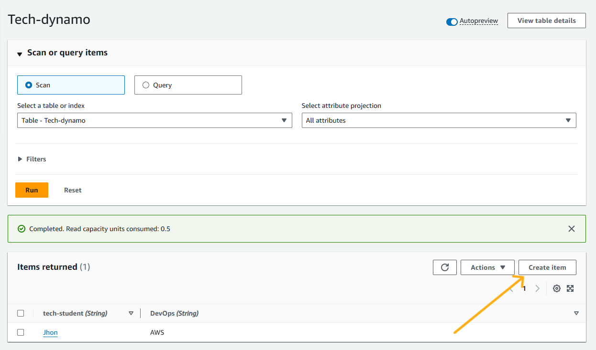 |
| 14.|**Here lets try to add , New attribute with ``Number`` as Datatype.** | 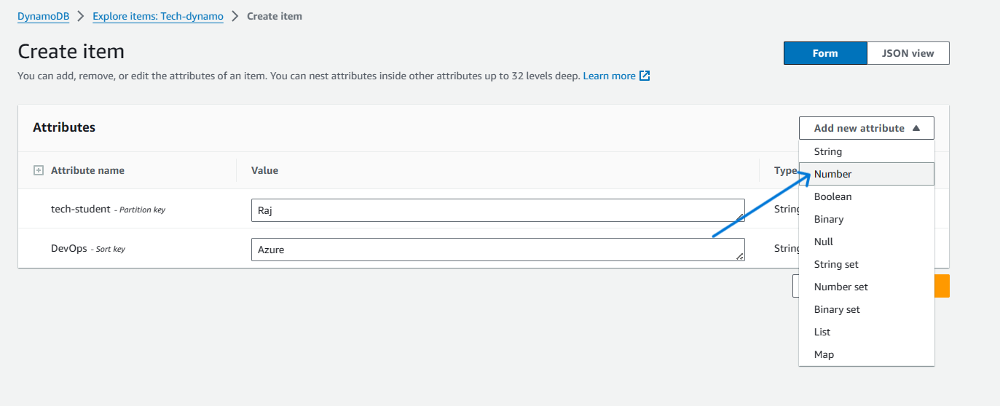 |
| 15.|**So , here we have added ``Batch`` as a new attribute.Click on ``Create Item``.** | 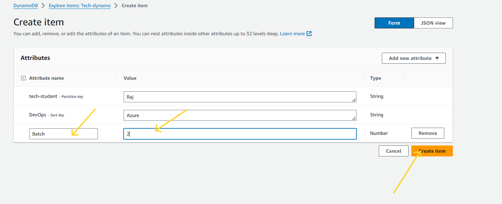 |
| 14.|**Now , lets try to run the ``Query`` , lets give ``partition key`` as ``Raj`` and ``Sort key`` as ``Azure`` and try to run it .And you can see ``Raj`` displaying under ``Items returned``** . | 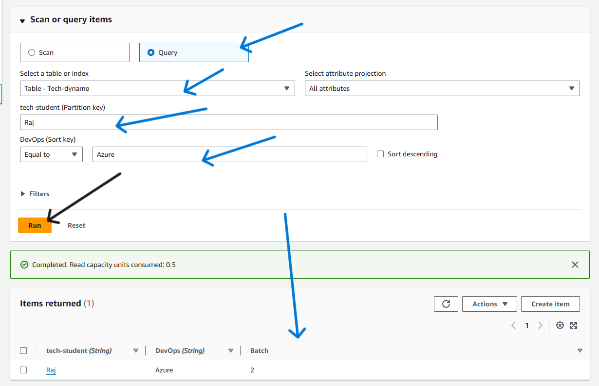 |

***
<br>

## <span style="color: pink;">**AWS-CLI**


| Step | Description | Screenshot |
|------|-------------|------------|
| 1. | **Open the command line of your choice and run following command with provided **Access Key ID** and **Secret Access Key**** <br> ``aws configure`` |  |
| 2. | **Lets run the following command to create DynamoDB Table using AWS-Cli Command.** <br>``aws dynamodb create-table --table-name StudentTable --attribute-definitions AttributeName=Name,AttributeType=S AttributeName=class,AttributeType=S --key-schema AttributeName=class,KeyType=HASH AttributeName=Name,KeyType=RANGE --provisioned-throughput ReadCapacityUnits=5,WriteCapacityUnits=5``| 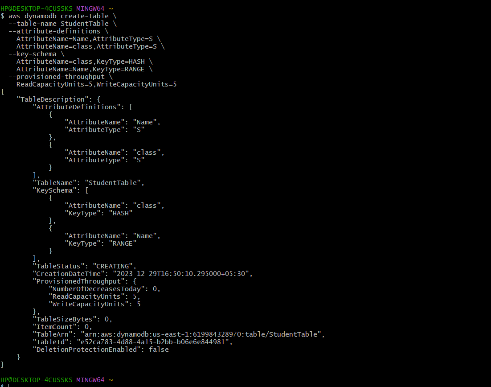 |
| 3. | **Lets go to the ``AWS CONSOLE`` and check if table got created in DynamoDB. And the ``Table`` got created Successfully.** | 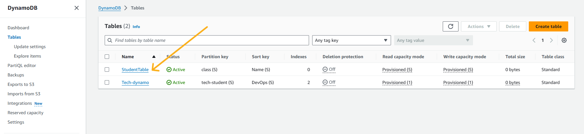 |
| 4. | **Now lets create ``items`` under the Table , by running the following command.** <br> </br>``aws dynamodb put-item --table-name StudentTable --item '{"class": {"S": "Math101"}, "Name": {"S": "John Doe"}, "Age": {"N": "25"}, "Grade": {"S": "A"}}'`` | 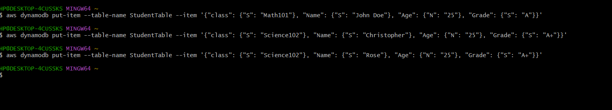 |
| 5. | **Lets head back to ``AWS Console`` and check if ``items`` are reflecting under the ``Table``, And we can see items reflecting**.| 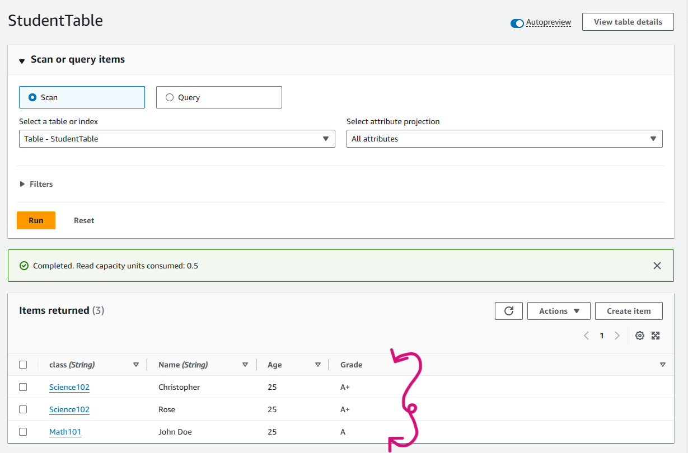 |
| 6. | **Now lets run the Query , by taking class value as`` "Science102"``** <br> </br> ``aws dynamodb query --table-name StudentTable --key-condition-expression "#class = :classValue" --expression-attribute-names '{"#class": "class"}' --expression-attribute-values '{ ":classValue": {"S": "Science102"} }'``| 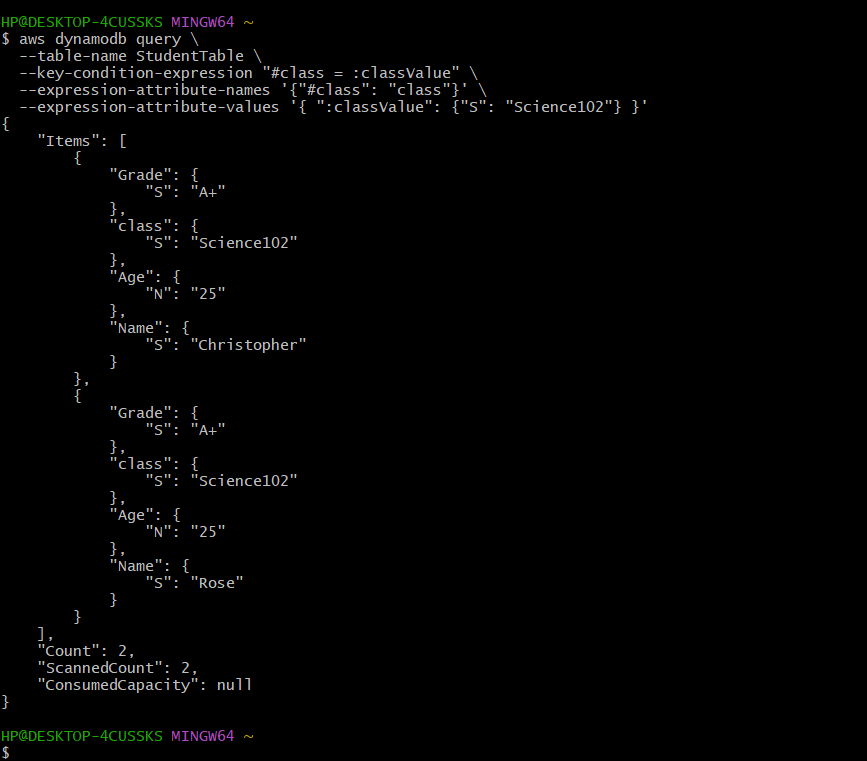 |
| 7. | **We could see the result down , displaying ``Rose`` and ``Christopher`` successfully**| 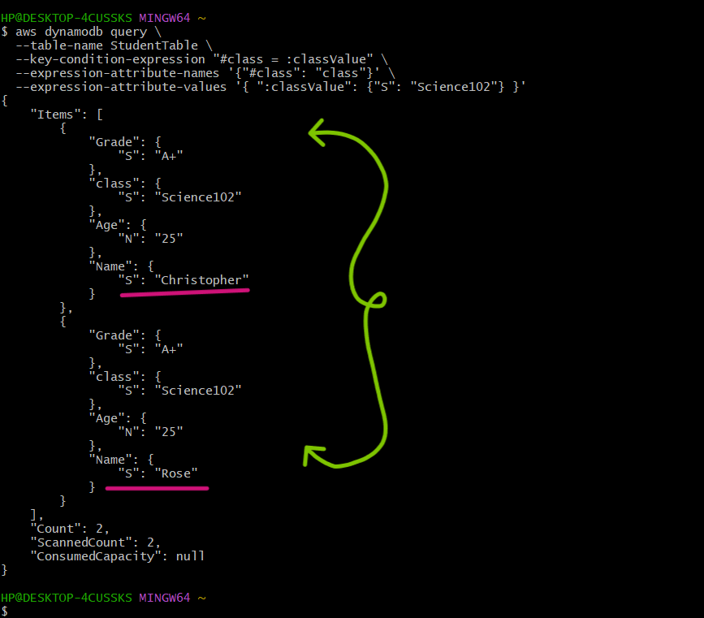|


## <span style="color: pink;"> **POWERSHELL**

 ## PowerShell Pre-requisites

 -      Install-Module -Name AWSPowerShell -Force -AllowClobber

 -      Import-Module AWSPowerShell

| Step | Description | Screenshot |
|------|-------------|------------|
| 1. | **Configure AWS credentials:** <br> ``Initialize-AWSDefaultConfiguration -AccessKey AKIAZAWPSDE***** -SecretKey "your-seceret-key"`` |  |
