#  Introduction

- What is ```Aws Elastic Container Service``` ?

    Amazon Elastic Container Service (Amazon ECS) is a highly scalable and fast container management service that makes it easy to run, stop, and manage containers on a cluster.


## To create ``AWS ECS``, using ```AWS Console``` , ```AWS-CLI``` and  ```Powershell``` follow below steps :

## Pre-Requistes

- ### Make sure to Create a user in your aws console and have ```Access Key ID``` and ```Secret Access Key``` noted down in notepad.

- ### Also , Please make sure to assign some policies to the user with respect to ```AWS ECS```. Assign below polcy to you User .

      1. AmazonEC2ContainerRegistryFullAccess
 
    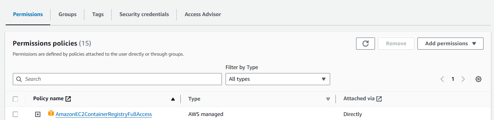


## Process


# **AWS-Console**

- ### **Open the AWS-Console and search for ``Amazon Elastic Container Service`` in the console search box. Click on ```Create Cluster``` .**

    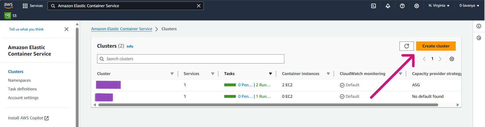

- ### **Give the ```Cluster Name``` and Infrastructure as  ```AWS Fargate (serverless)``` as your choice .**

    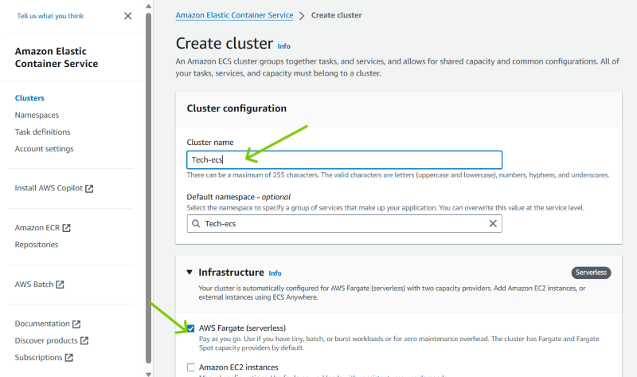

- ### **Click on ```Create```.**

    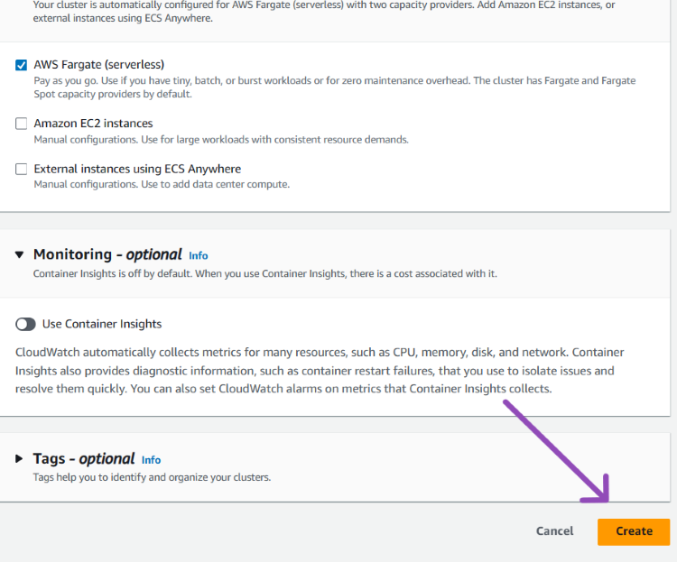

- ### **The Cluster is successfully created. Next step is to create ```Task Definition``` .**

    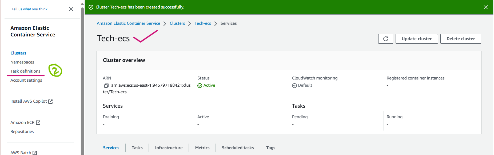

- ### **Give a proper name to ```Task definition``` and Launch Type as ```AWS Fargate``` .**

    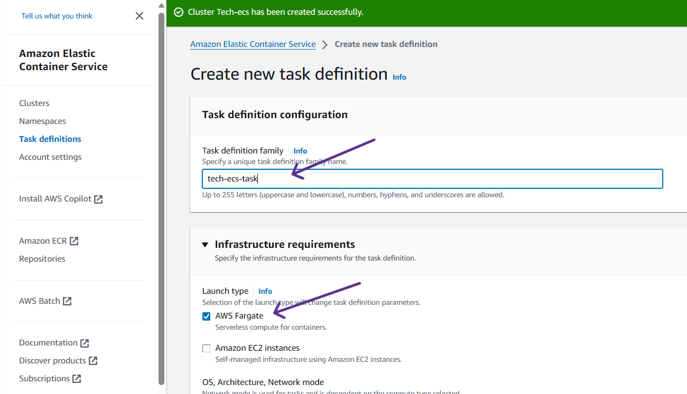

- ### **Moving further , we need to create a container for that we need an Image ``Name`` and ``Image URI``. So, You can the respective image URI from ECR Public Gallery https://gallery.ecr.aws/ .**

    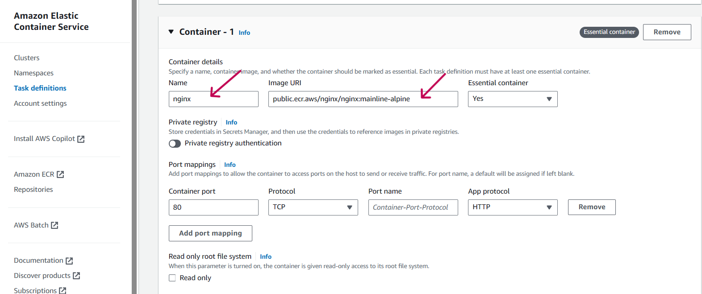

- ### **Just leave remaining thing as default and Click on ``Create``.**

    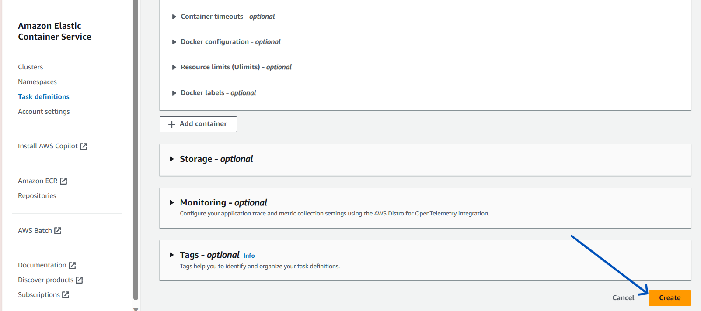

- ### **The Task definition got created Successsfully.**

    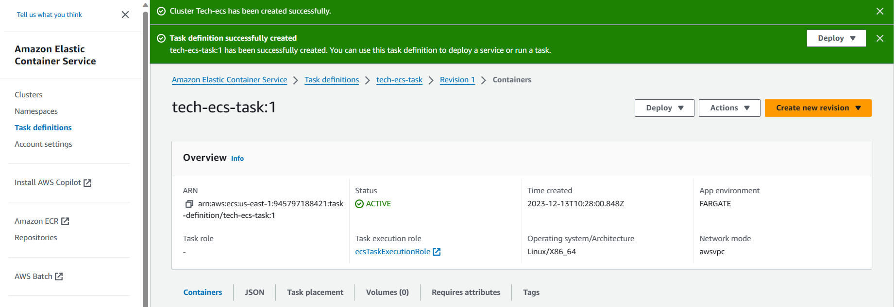

- ### **Now , Click on Deploy and select ``Create Service`` .**

    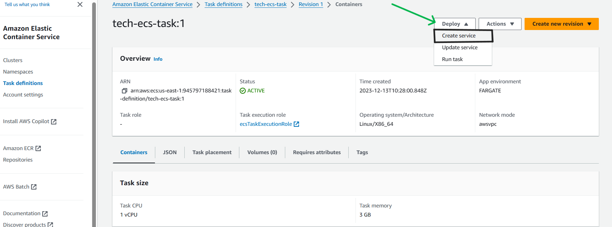

- ### **Now , Proceed further and give the ``cluster name`` that you have created before .**

    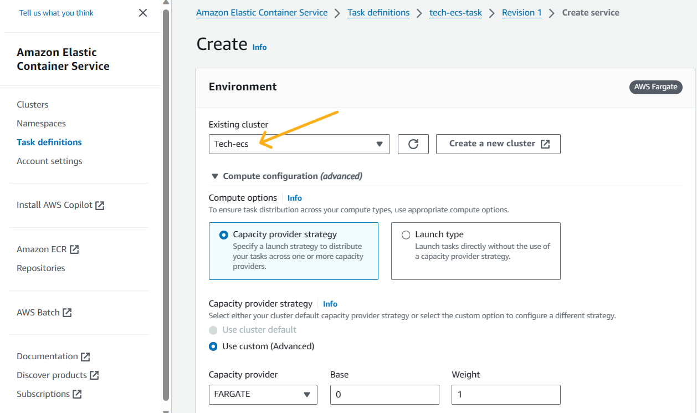

- ### **Keeping everything deafult moving further, Here give the ``Service name``.**

    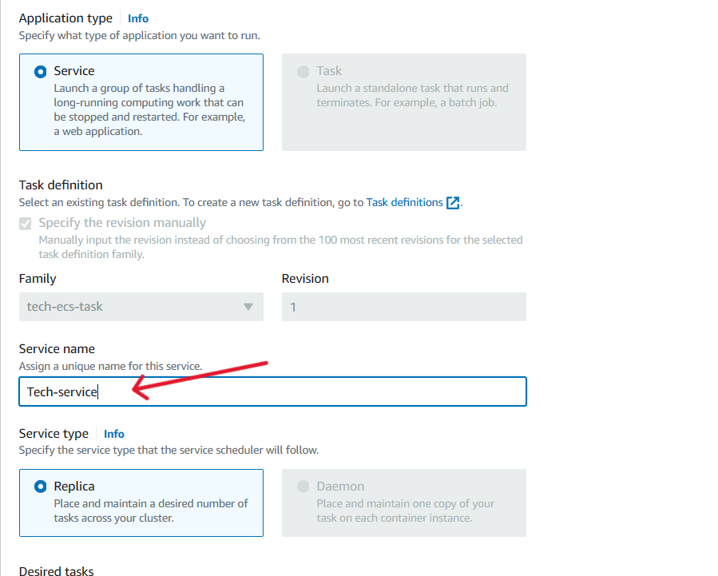   

- ### **Moving further , keep everything default and coming to ``Networking`` section , under ``security group`` choose ``Create a new security group``. Give ``security Group name`` and ``Description`` .**

    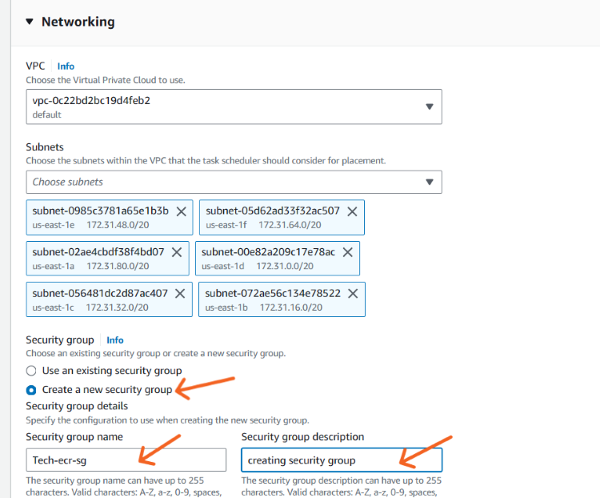  

- ### **Under Inbound rules for security group , Select TYPE as ``HTTP`` & SOURCE as ``Anywhere``. And click on ``Create``**.

    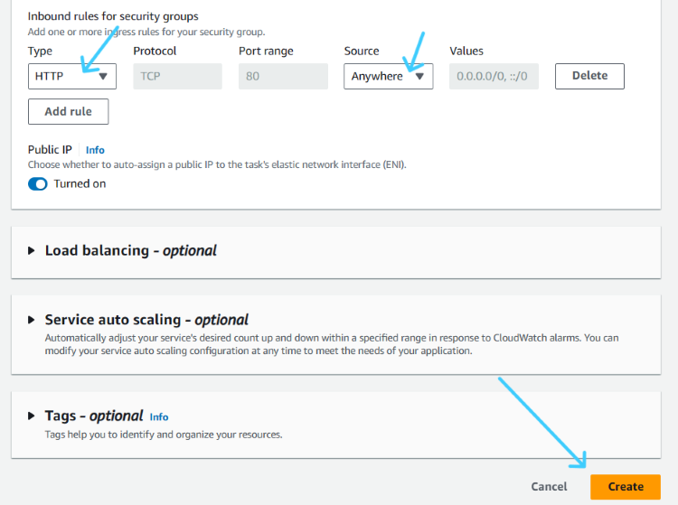   

- ### **So , under Cluster you can see that ``Service`` got created successfully**.

    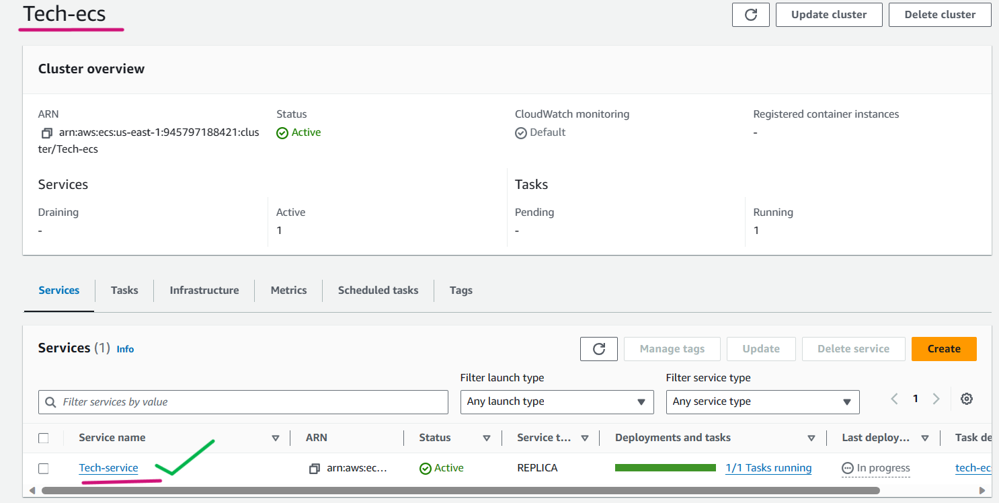  

- ### **So , Now click on the service , you can see your task running and Click on the Public IP > open address**.

    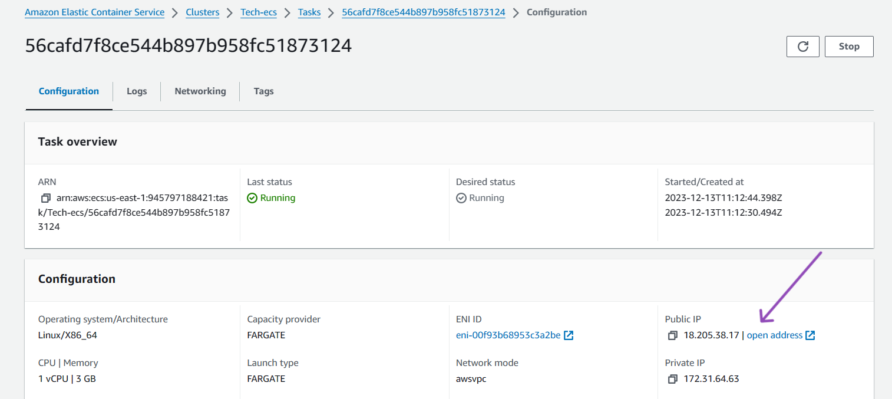  

- ### **Here you go , and you can see Nginx is running successfully**.

    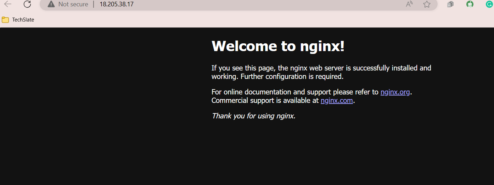 

<br>
<hr>


