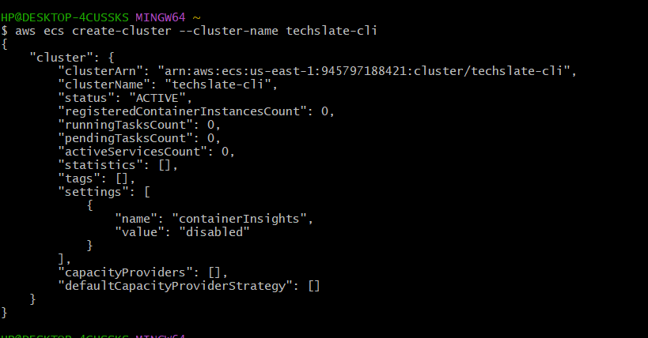
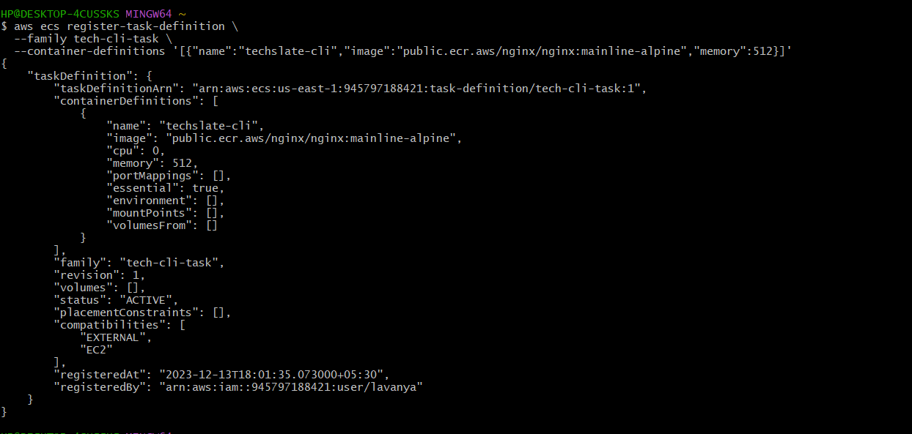
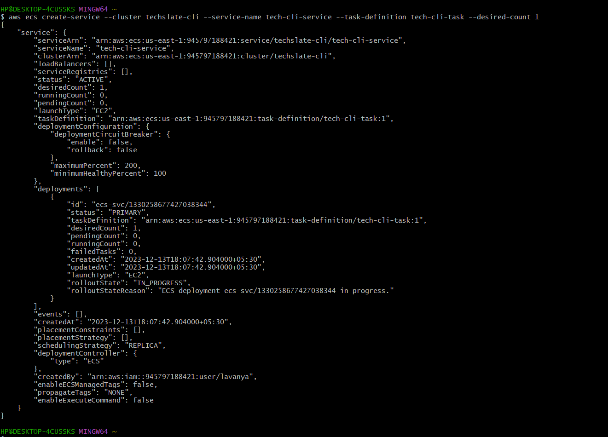

#  Introduction

- What is ```Amazon Elastic Container Service (Amazon ECS) ```?

    Amazon Elastic Container Service (Amazon ECS) is a highly scalable and fast container management service that makes it easy to run, stop, and manage containers on a cluster.

# Amazon ECS vs Amazon EKS Comparison

| Criteria                                  | Amazon ECS                                       | Amazon EKS                                       |
|-------------------------------------------|--------------------------------------------------|--------------------------------------------------|
| **Ease of Use**                           | - Simpler to set up and manage.                  | - More complex due to Kubernetes orchestration.   |
|                                           | - Well-integrated with other AWS services.      | - Provides a more standard Kubernetes interface. |
| **Service Types**                         | - Supports both containers and serverless tasks.| - Primarily designed for container orchestration. |
|                                           |                                                  | - Better suited for microservices architectures. |
| **Scaling**                               | - Supports auto-scaling of container instances. | - Auto-scaling is inherent in Kubernetes.         |
|                                           |                                                  | - More granular control over scaling behavior.   |
| **Orchestration**                         | - Proprietary orchestration engine.              | - Native Kubernetes orchestration.               |
|                                           |                                                  | - Industry-standard, widely adopted orchestration.|
| **Ecosystem Integration**                 | - Tightly integrated with AWS services.         | - Can integrate with non-AWS services as well.   |
|                                           |                                                  | - Broader ecosystem due to Kubernetes adoption.  |
| **Cost**                                  | - May have lower costs for smaller workloads.    | - Potential higher costs due to Kubernetes complexity.|
|                                           | - Pay per task and per vCPU/RAM for EC2 instances.| - Pay for Kubernetes clusters and worker nodes.|
| **Community Support**                    | - ECS has a growing community but smaller than Kubernetes.| - Large and active Kubernetes community.      |
|                                           |                                                  | - Access to a wide range of third-party tools.   |
| **Control and Customization**             | - Less flexibility and customization compared to Kubernetes. | - Highly customizable due to Kubernetes features.|
|                                           | - Limited control over the underlying infrastructure. | - More control over the cluster configuration.   |
| **Security**                              | - Built-in AWS IAM roles for task execution.    | - Fine-grained RBAC controls in Kubernetes.     |
|                                           | - AWS VPC integration for network isolation.   | - Pod security policies for additional control. |
| **Updates and Maintenance**               | - AWS manages the underlying infrastructure.    | - More control but also responsibility for updates.|
|                                           | - Easy to update ECS agents and launch types.  | - Kubernetes updates need to be managed manually.|
| **Use Cases**                            | - Well-suited for simpler, single-container applications. | - Ideal for complex, multi-container and microservices apps.|
|                                           | - Quick deployment of containerized tasks.     | - Best for applications requiring high scalability.|

Keep in mind that the choice between ECS and EKS depends on various factors, including your team's familiarity with Kubernetes, the complexity of your applications, and your specific requirements.


## To create ``AWS ECS``, using ```AWS Console``` , ```AWS-CLI``` and  ```Powershell``` follow below steps :

## Pre-Requistes

- ### Make sure to Create a user in your aws console and have ```Access Key ID``` and ```Secret Access Key``` noted down in notepad.

- ### Also , Please make sure to assign some policies to the user with respect to ```AWS ECS```. Assign below polcy to you User .

      1. AmazonEC2ContainerRegistryFullAccess
 
    


## Process


# **AWS-Console**

- ### **Open the AWS-Console and search for ``Amazon Elastic Container Service`` in the console search box. Click on ```Create Cluster``` .**

    

- ### **Give the ```Cluster Name``` and Infrastructure as  ```AWS Fargate (serverless)``` as your choice .**

    

- ### **Click on ```Create```.**

    

- ### **The Cluster is successfully created. Next step is to create ```Task Definition``` .**

    

- ### **Give a proper name to ```Task definition``` and Launch Type as ```AWS Fargate``` .**

    

- ### **Moving further , we need to create a container for that we need an Image ``Name`` and ``Image URI``. So, You can the respective image URI from ECR Public Gallery https://gallery.ecr.aws/ .**

    

- ### **Just leave remaining thing as default and Click on ``Create``.**

    

- ### **The Task definition got created Successsfully.**

    

- ### **Now , Click on Deploy and select ``Create Service`` .**

    

- ### **Now , Proceed further and give the ``cluster name`` that you have created before .**

    

- ### **Keeping everything deafult moving further, Here give the ``Service name``.**

       

- ### **Moving further , keep everything default and coming to ``Networking`` section , under ``security group`` choose ``Create a new security group``. Give ``security Group name`` and ``Description`` .**

      

- ### **Under Inbound rules for security group , Select TYPE as ``HTTP`` & SOURCE as ``Anywhere``. And click on ``Create``**.

       

- ### **So , under Cluster you can see that ``Service`` got created successfully**.

      

- ### **So , Now click on the service , you can see your task running and Click on the Public IP > open address**.

      

- ### **Here you go , and you can see Nginx is running successfully**.

     

<br>
<hr>

# **AWS-CLI**
- ### Open the command line of your choice and run following command with provided **Access Key ID** and **Secret Access Key** .

      aws configure 

    

- ### Add the necessary ECS permissions as an inline policy. For the ecs:CreateCluster action, you can add the following policy to the User.
         {
            "Effect": "Allow",
            "Action": "ecs:CreateCluster",
            "Resource": "*"
         }

- ### Create an ECS Cluster by running the following command .

      aws ecs create-cluster --cluster-name your-cluster-name

    

- ### Before you can run a service, you need to define a task. A task definition describes how a Docker container should be launched, including the Docker image, CPU and memory requirements, etc.Run the following command :
  
- ### Add the necessary ECS permissions to the policy. For the ecs:RegisterTaskDefinition action, you can add the following statement to the policy:
       {
         "Effect": "Allow",
         "Action": "ecs:RegisterTaskDefinition",
         "Resource": "*"
       }

* ### Run the following command

        aws ecs register-task-definition --family tech-cli-task  --container-definitions '[{"name":"techslate-cli","image":"public.ecr.aws/nginx/nginx:mainline-alpine","memory":512}]'

    

- ### Once you have a cluster and a task definition, you can run a service:

- ### Add the necessary ECS permissions to the policy. For the ecs:CreateService action, you can add the following statement to the policy:

      {
        "Effect": "Allow",
        "Action": "ecs:CreateService",
        "Resource": "arn:aws:ecs:us-east-1:945797188421:service/techslate-cli/tech-cli-service"
      }

- ### Run the following command to create ``Service`` .

      aws ecs create-service --cluster techslate-cli --service-name tech-cli-service --task-definition tech-cli-task --desired-count 1

    


- ### Create a task set in a service that uses an external deployment controller. Before we create Tasks under service , lets add a policy to the user which is mentioned below :

      {
        "Effect": "Allow",
        "Action": "ecs:CreateTaskSet",
        "Resource": "*"
      }

- ### Run the following command to create ``Tasks`` under Service .

