# <span style="color: gold;"> Introduction

- What is ``AWS Key Management Service`` ?

    AWS Key Management Service (KMS) is a managed service that makes it easy for you to create and manage keys and control the use of encryption across a wide range of AWS services. KMS is a secure and resilient service that uses FIPS 140-2 validated hardware security modules to isolate and protect your keys

## To create AWS Key Management Service, using ```AWS Console``` , ```AWS-CLI``` and  ```Powershell``` follow below steps :

1.[AWS Console](#aws-console)

2.[AWS-CLI](#aws-cli)

3.[Powershell](#powershell)

# <span style="color: gold;">Pre-Requistes

- ### Make sure to Create a user in your aws console and have ```Access Key ID``` and ```Secret Access Key``` noted down in notepad.

# <span style="color: gold;">Process

## <span style="color: pink;">**AWS-Console**

| Step | Description | Screenshot |
|------|-------------|------------|
| 1. | **Open the AWS Console and search for KMS. Click on ``Create a key``.** | 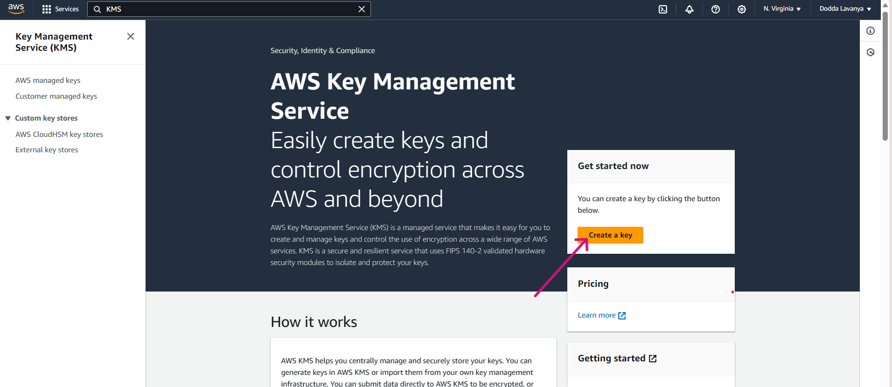 |
| 2. | **Select ``Key Type`` as ``Symmetric`` and ``Key Usage`` as ``Encrypt and Decrypt`` .** | 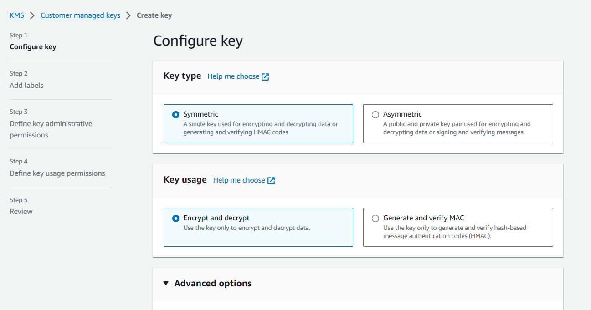 |
| 3. | **Let the ``Regionality`` be ``Single-Region key``, and Click on ``Next``.** | 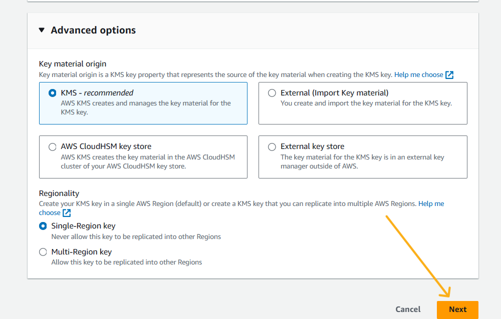 |
| 4. | **You can give any other name for your key here**. | 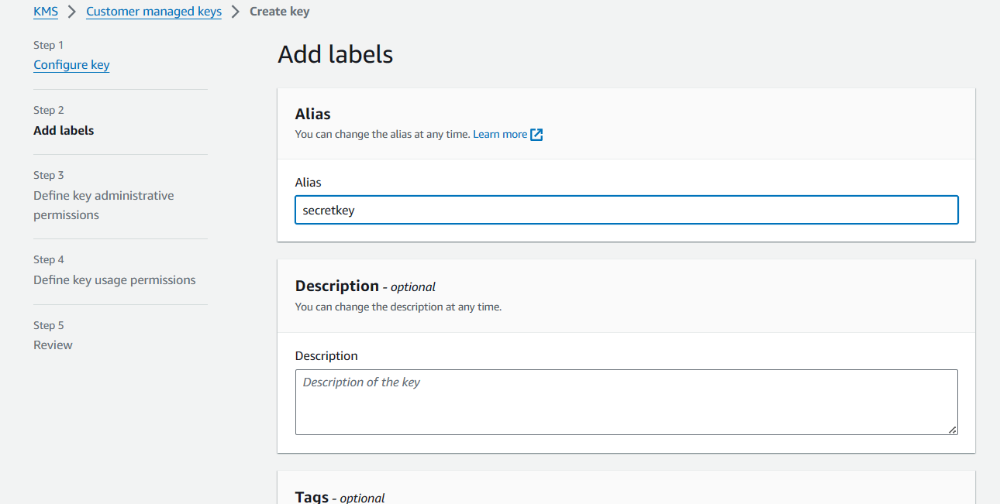 |
| 5. | **Click on ``Next`` .** |  | 
| 6. | **Moving further , Now select the ``Key Administrators`` who can administer this key through the KMS API.** | 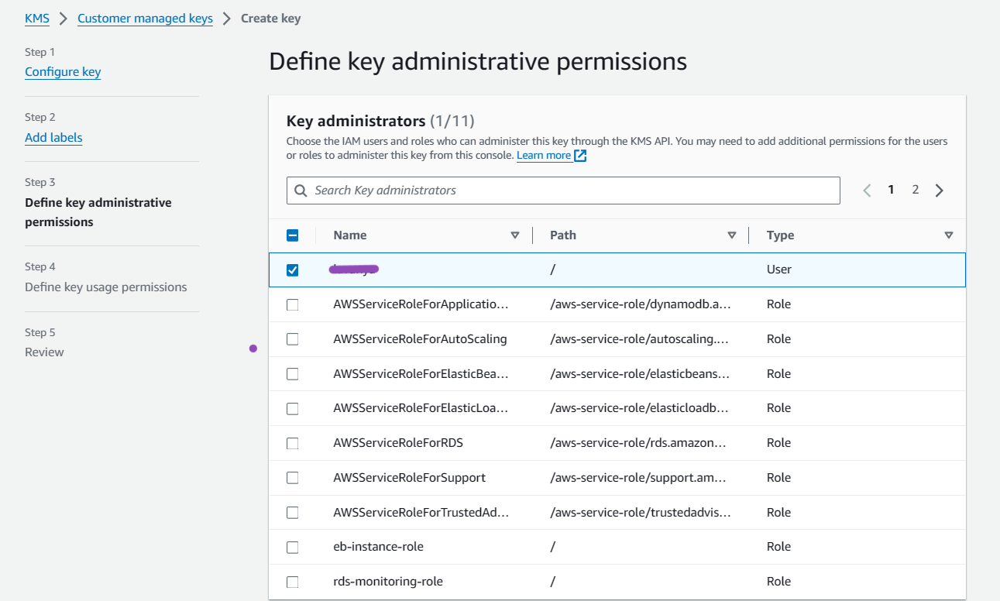 |
| 7. | **Click on ``Next``.**| 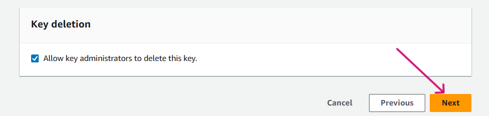 |
| 8. | **Now select the ``Key Users`` that can use the KMS key in cryptographic operations** .| 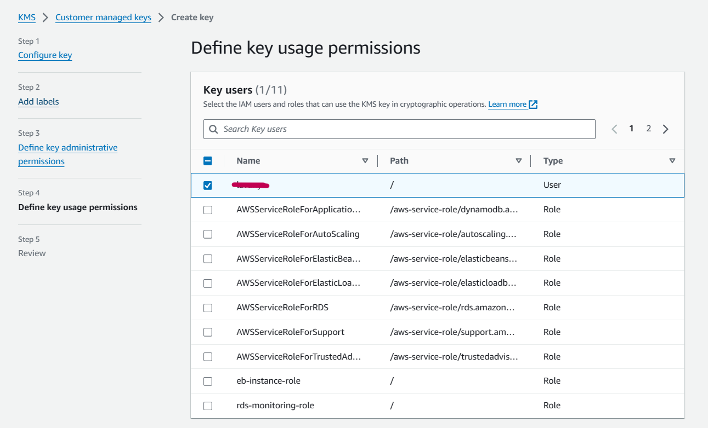 |
| 9. | **Click on ``Next``.** | 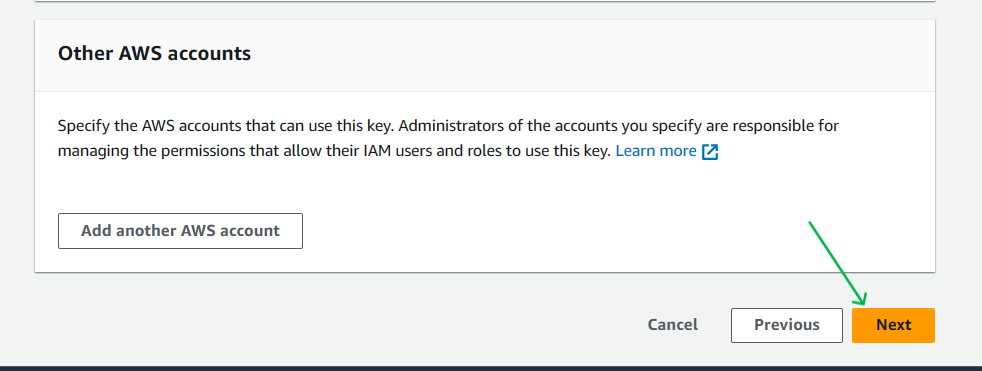 |
| 10.|**Just Review all the steps and make sure you have selected proper options.** | 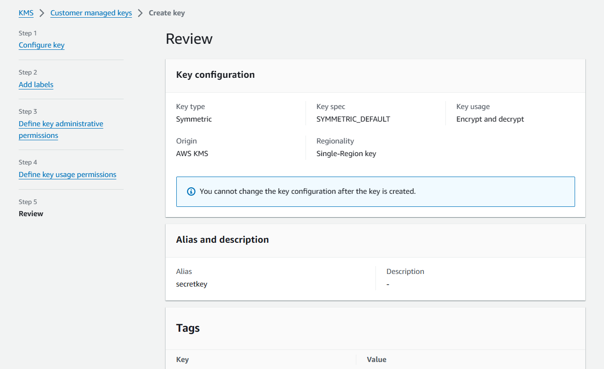 |
| 11.|**Click on ``Finish``.** | 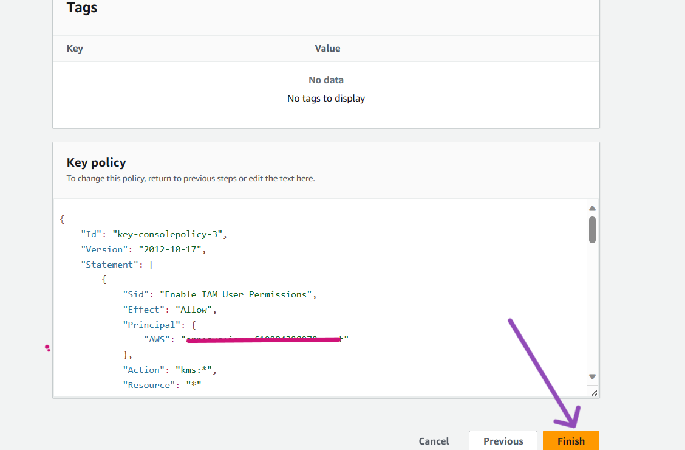 |
| 12.|**You can see that key got created successfully.** | 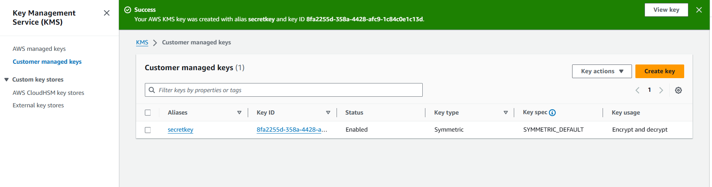 |
| 13.|**You can open the key for more details.** | 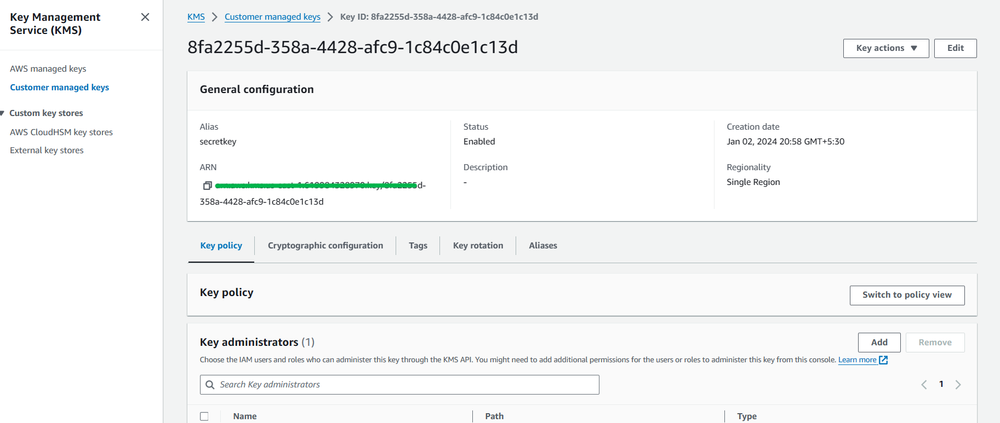 |

***
<br>

## <span style="color: pink;">**AWS-CLI**


| Step | Description | Screenshot |
|------|-------------|------------|
| 1. | **Open the command line of your choice and run following command with provided **Access Key ID** and **Secret Access Key**** <br> ``aws configure`` |  |
| 2. | **Lets run the following command to create Key using AWS-Cli Command.** <br>``aws kms create-key --description "Creating key with AWS-CLI" ``| 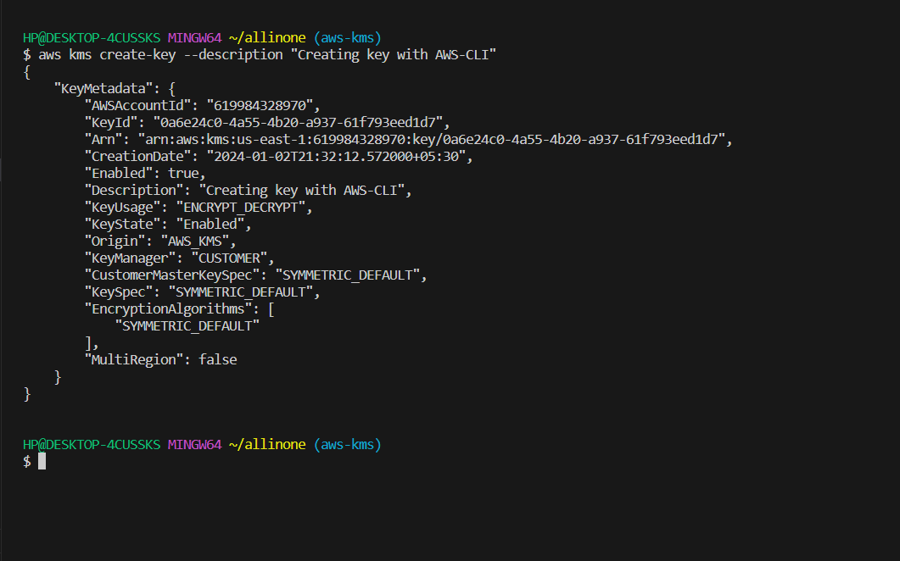 |
| 3. | **Now, as key got created lets give ``Alias`` name to the key , copy the ``Key-id`` from above output and run the following command as shown.** <br>``aws kms create-alias --alias-name "alias/techkey" --target-key-id 0a6e24c0-4a55-4b20-a937-61f793eed1d7" ``| 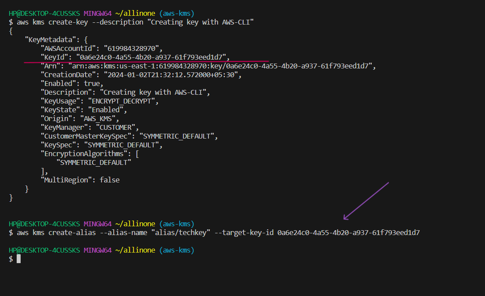 |
| 4. | **Now lets go back to the ``AWS Console`` and see if key got created successfully. And we can see a key with name ``techkey`` got created**.| 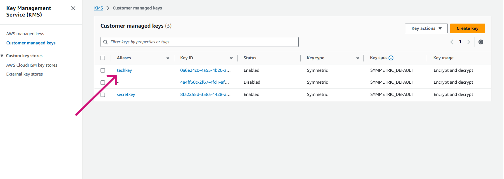 |
| 5. | **You can open the key for more details of it**.| 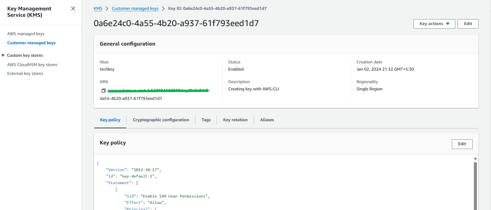 |


## <span style="color: pink;"> **POWERSHELL**

 ## PowerShell Pre-requisites

 -      Install-Module -Name AWSPowerShell -Force -AllowClobber

 -      Import-Module AWSPowerShell

| Step | Description | Screenshot |
|------|-------------|------------|
| 1. | **Configure AWS credentials:** <br> ``Initialize-AWSDefaultConfiguration -AccessKey AKIAZAWPSDE***** -SecretKey "your-seceret-key"`` |  |
| 2. | **Run the following command to Create ``Key`` using Powershell command**. "The command is placed at the end of the page".|  |
| 3. | **Run the following command to add ``Alias`` name to the ``Key``**.**You can take the Key-Id from above output**. <br>  </br>```aws kms create-alias --alias-name "alias/techkeyps" --target-key-id 17ce0048-fff0-46ac-83ab-**************``` |  |
| 4. | **Now lets head back to AWS Console and check if out key got created with Alias name ``techkeyps``.** | 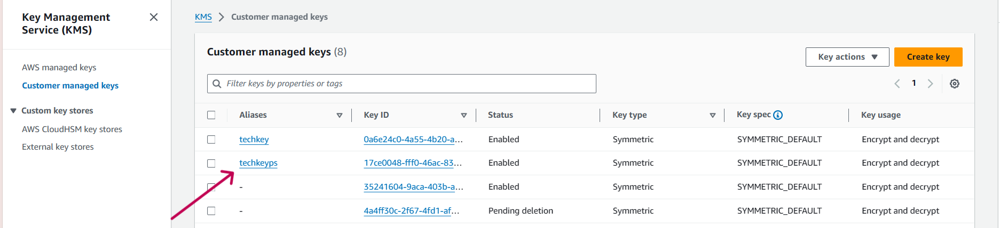 |
| 5. | **You can also open the Key to know more details.** | 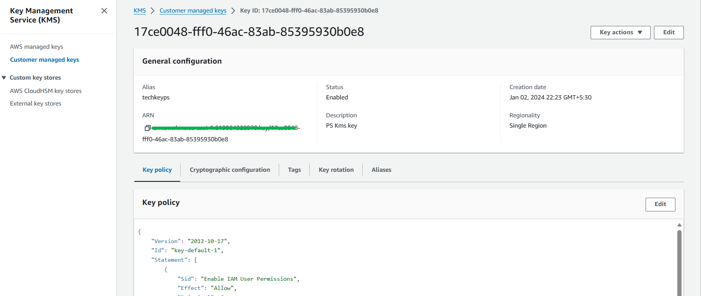 |


***
<br>
   </br>   

- Here is the command for second step in ``PowerShell``

           New-KMSKey -Description "My new KMS key" -Policy "{
          \"Version\": \"2012-10-17\",
          \"Id\": \"key-consolepolicy-1\",
          \"Statement\": [
          {
            \"Sid\": \"Enable IAM User Permissions\",
            \"Effect\": \"Allow\",
            \"Principal\": {
                \"AWS\": \"*\"
            },
            \"Action\": [
                \"kms:*\"
            ],
            \"Resource\": \"*\"
         }
         ]
         }"


