#  Introduction

- What is ``Amazon Lambda`` ?

    AWS Lambda is an event-driven, serverless computing platform provided by Amazon as a part of Amazon Web Services. It is designed to enable developers to run code without provisioning or managing servers. It executes code in response to events and automatically manages the computing resources required by that code. 


## To create ``AWS Lambda``, using ```AWS Console``` , ```AWS-CLI``` and  ```Powershell``` follow below steps :

1.[AWS Console](#aws-console)

2.[AWS-CLI](#aws-cli)

3.[Powershell](#powershell)

## Pre-Requistes

- ### Make sure to Create a user in your aws console and have ```Access Key ID``` and ```Secret Access Key``` noted down in notepad.

- ### Also , Please make sure to assign some policies to the user with respect to ```AWS Lambda```. Assign below both the polcies to you User .
      1. AWSLambda_FullAccess
      2. AWSLambda_ReadOnlyAccess

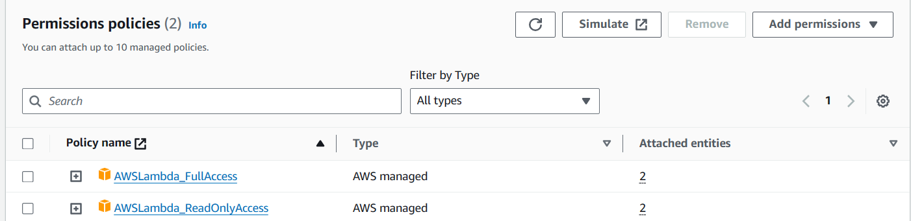

## Process


# **AWS-Console**

- ### **Open the AWS-Console and search for ``AWS Lambda`` in the console search box. Click on ```Create Function``` .**

    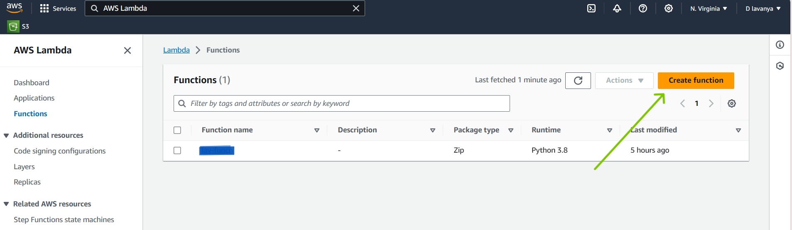

- ### **Give the ```Function Name``` and also ```Runtime``` as your choice .**

    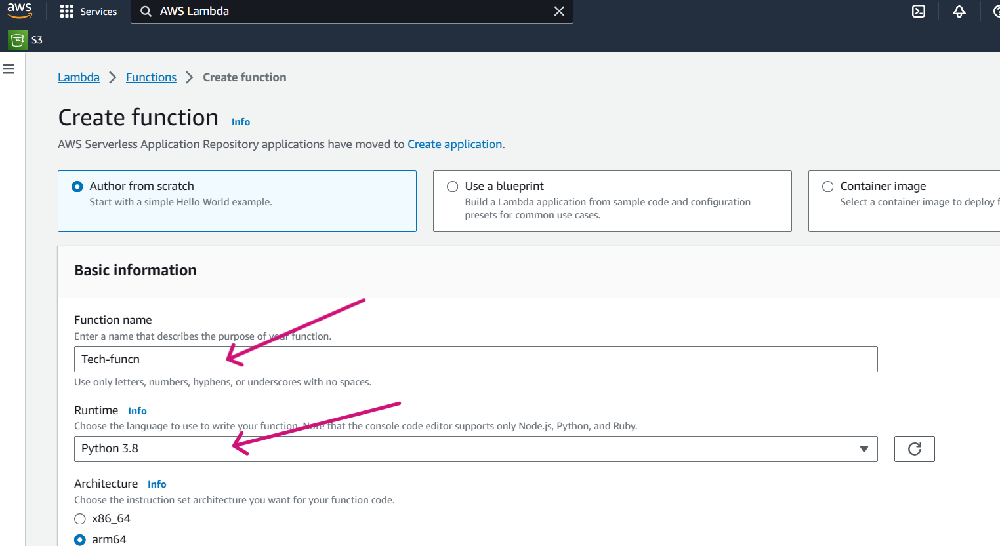

- ### **Click on ```Create Function```.**

    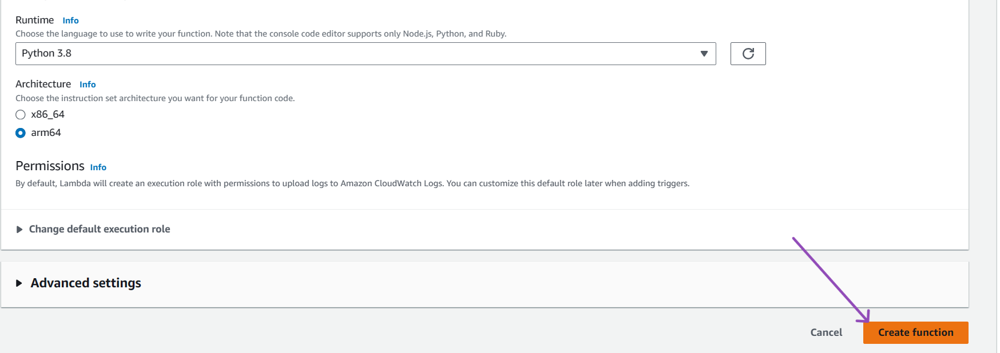

- ### **The Function is successfully created.**

    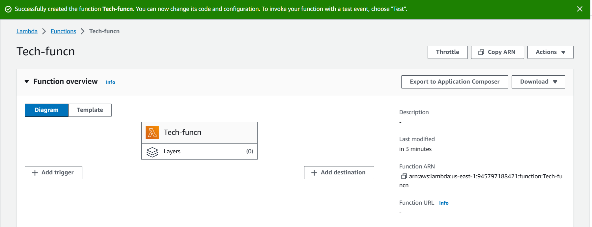

- ### **Now , scroll down , you can see the code which is been taken as a sample Python code , lets alter that python file and test the configuration. Here we have taken an example of Planet lets go with that. Click on ```Test``` .**

    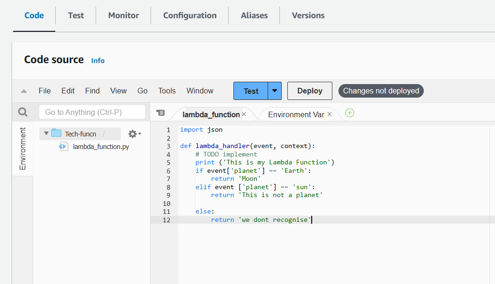

- ### **Give the proper ```Event Name```.**

    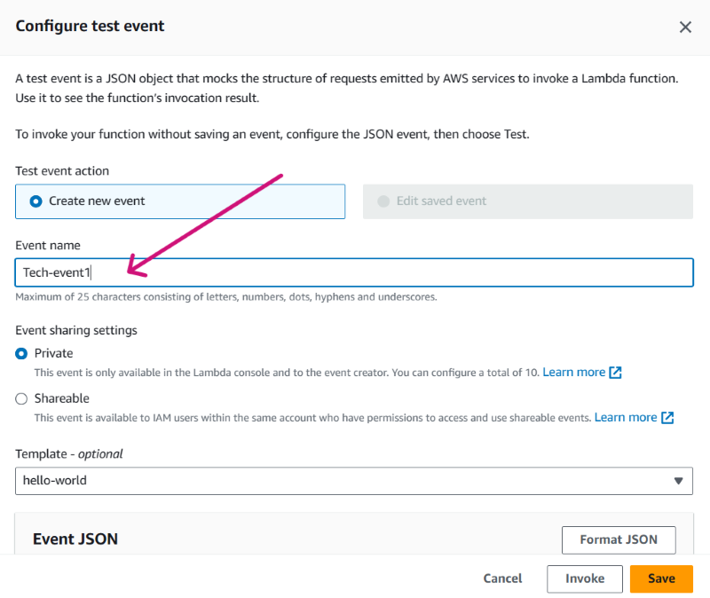

- ### **Here , in ```Key:Value``` , Lets try with Key as ```Planet``` and Value as ```Earth```. Click on ```Save```.**

    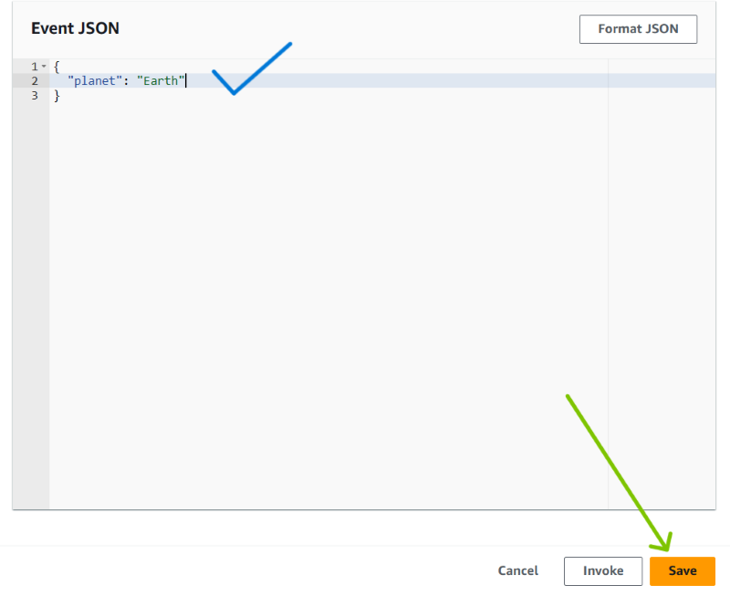

- ### **Click on ```Test``` again ,if you see you code back when we give value as ```Earth``` it should return value as ```moon```, so Lets check here and you can see result as ```moon```. The code successfully deployed.**

    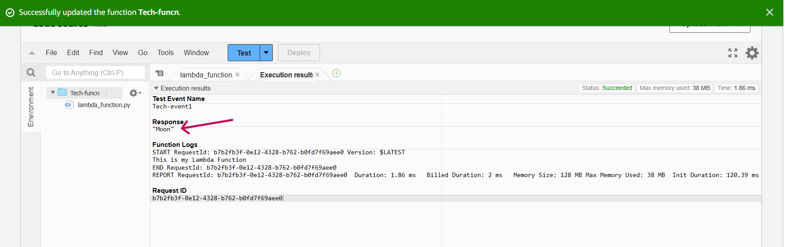


# **AWS-CLI**
- ### Open the command line of your choice and run following command with provided **Access Key ID** and **Secret Access Key** .

      aws configure 

    

- ### Create a role with required policies attached to it 
      aws iam create-role \
      --role-name lambda-funcn-role-aw5c0g35 \
      --assume-role-policy-document '{
      "Version": "2012-10-17",
      "Statement": [
      {
        "Effect": "Allow",
        "Principal": {
          "Service": "lambda.amazonaws.com"
        },
        "Action": "sts:AssumeRole"
       }
      ]
      }'

    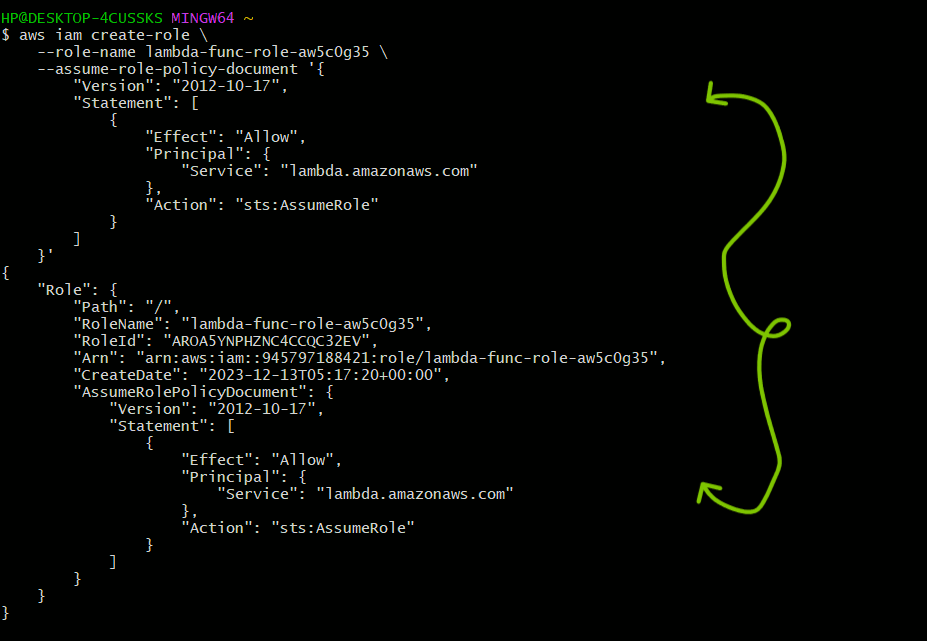

- ### Once this command is runned , go back to the console , open the role ```lambda-funcn-role-aw5c0g35``` and add the below polcies.
      1. AWSLambda_FullAccess	
      2. AWSLambda_ReadOnlyAccess	

    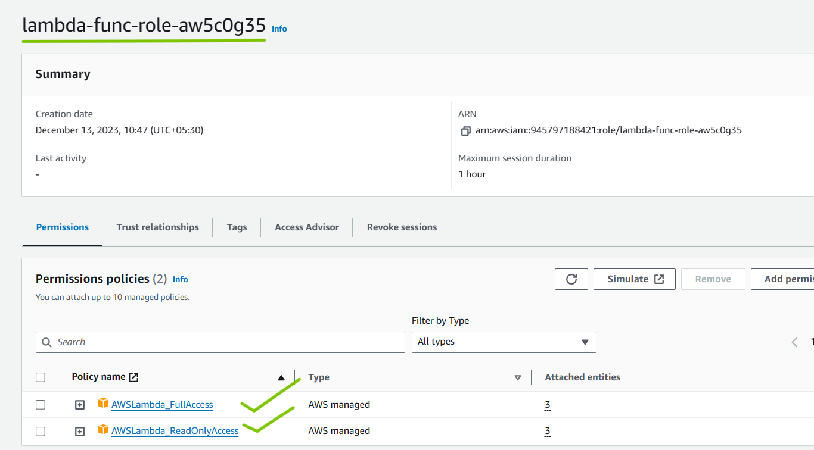

- ### Now come back to cli and run the following cli command to create lambda function.

      aws lambda create-function --function-name MyLambdaFunctioncli --runtime python3.8 --role arn:aws:iam::945797188421:role/lambda-func-role-aw5d0g35 --handler lambda.lambda_handler --zip-file fileb://C:/Users/HP/allinone/aws/aws-lambda/lambda.zip

    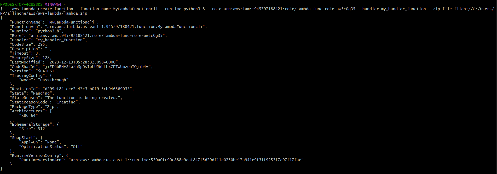  

- ### Now go back to the console and see the function page you can see that your lambda function got created successfully.

    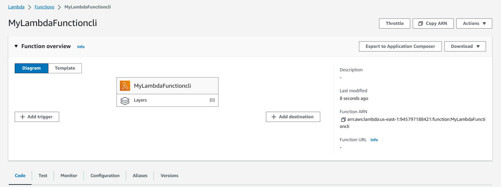

 - ### Now scroll down to code and have made some changes in python code , Lets take fruits as a Concept and Click on ```Test```.

       

 - ### Give the ```Event name``` and , lets give ```key``` as ```Fruit``` and ```value``` as ```Banana``` .It should return ```Banana Pie```.
    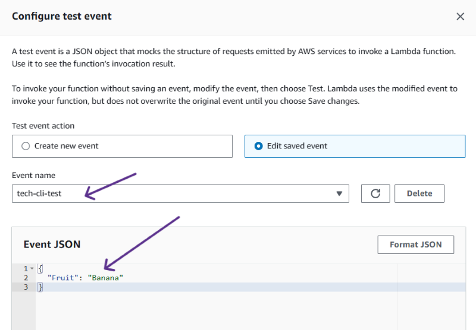   

- ### **Click on ```Test``` again ,if you see you code back when we give value as ```Banana``` it should return value as ```Banana Pie```, so Lets check here and you can see result as ```Banana Pie```. The code successfully deployed.**

     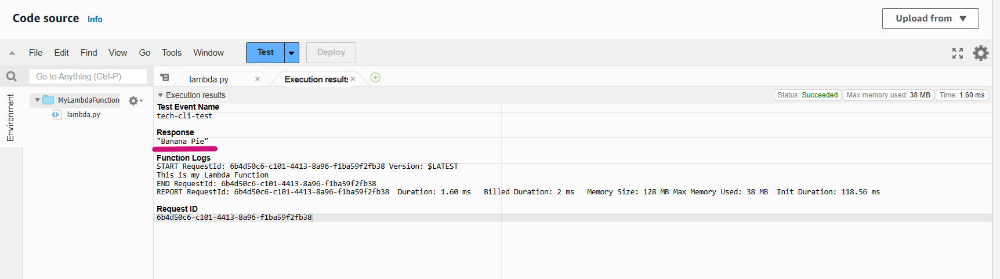  
<br>

<hr>

# POWERSHELL

 ## PowerShell Pre-requisites

 - Run the Following command to install the modules.

        Install-Module -Name AWSLambdaPSCore -Force -AllowClobber

 ## PowerShell Commands :

- ### Now lets go back to the portal and make sure to add policies to our role. if you have already have a role with proper policies, you can skip this step.

      1. AWSLambda_FullAccess	
      2. AWSLambda_ReadOnlyAccess	

  

- ### Now run the following command to create the function .
```
# Variables
$functionName = "YourLambdaFunctionName"
$handler = "your_handler_function"
$runtime = "python3.8"  # Change this to your desired runtime
$roleArn = "arn:aws:iam::your-account-id:role/your-execution-role

# Create Lambda function
aws lambda create-function `
    --function-name $functionName `
    --runtime $runtime `
    --handler $handler `
    --role $roleArn `
    --zip-file fileb://C:\path\to\your\lambda\code.zip
```
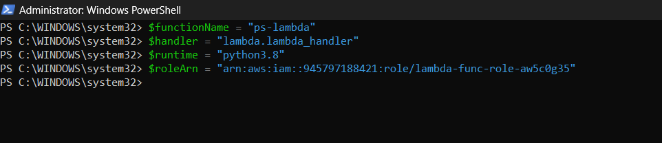
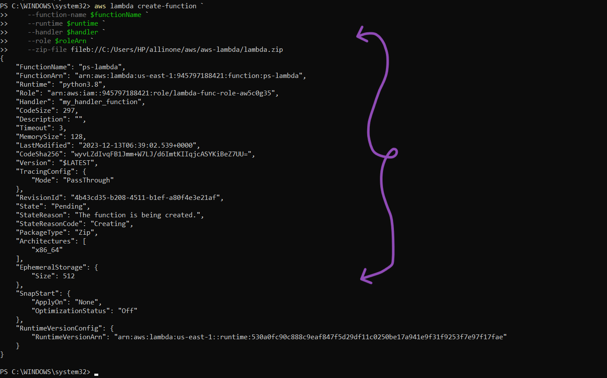

- ### Now go back to the console and see the function page you can see that your lambda function got created successfully.

    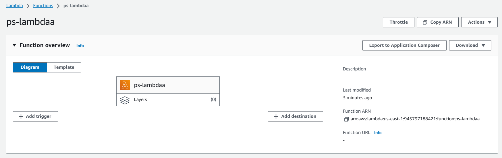

- ### Now scroll down to code, and click on ```Test```, and give a proper event name and Key as ```Fruit``` and value as ```Potato```.

    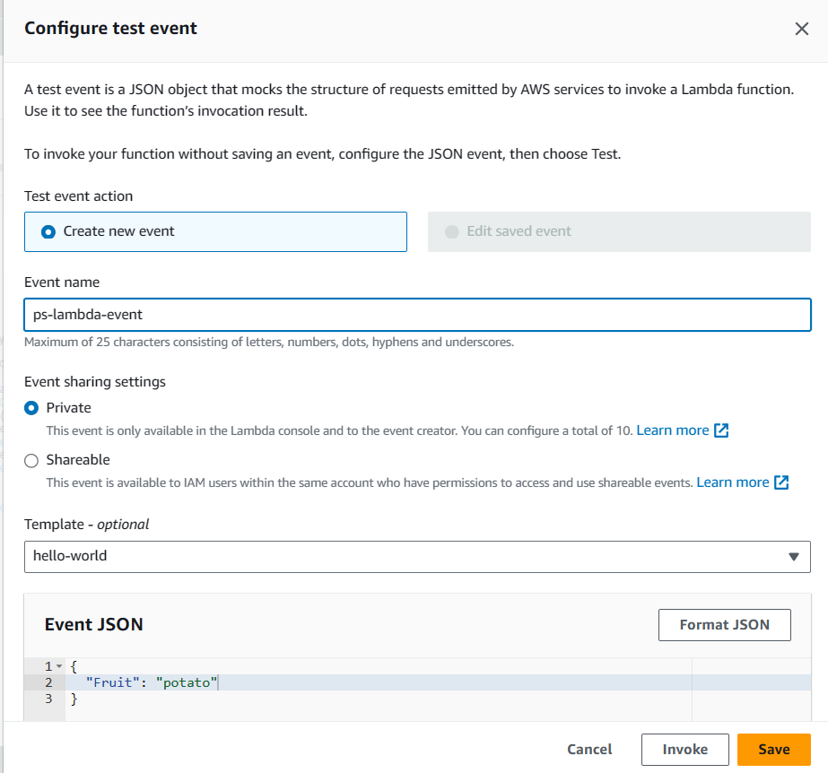

- ### Click on Test again ,you can see the result as expected , ```this is not a Fruit```.

    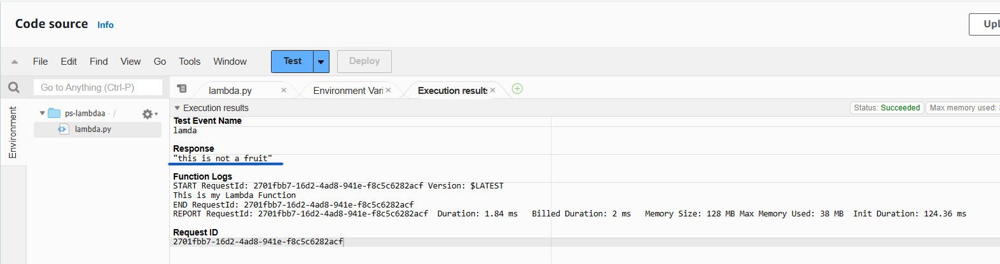   

<br>

<hr>