# <span style="color: gold;"> Introduction

- What is ``Amazon Relational Database Service`` ?

    Amazon Relational Database Service (Amazon RDS) is a web service that makes it easier to set up, operate, and scale a relational database in the AWS Cloud. It provides cost-efficient, resizable capacity for an industry-standard relational database and manages common database administration tasks.

## To create Amazon RDS, using ```AWS Console``` , ```AWS-CLI``` and  ```Powershell``` follow below steps :

1.[AWS Console](#aws-console)

2.[AWS-CLI](#aws-cli)

3.[Powershell](#powershell)

# <span style="color: gold;">Pre-Requistes

- ### Make sure to Create a user in your aws console and have ```Access Key ID``` and ```Secret Access Key``` noted down in notepad.

# <span style="color: gold;">Process

## <span style="color: pink;">**AWS-Console**

### <span style="color: green;">**1 . MySQL Database**

| Step | Description | Screenshot |
|------|-------------|------------|
| 1. | **Open the AWS Console and search for RDS. Click on ``Create Database``.** |  |
| 2. | **Select creation method as ``Standard Create``. And Engine type as ``Mysql``** | 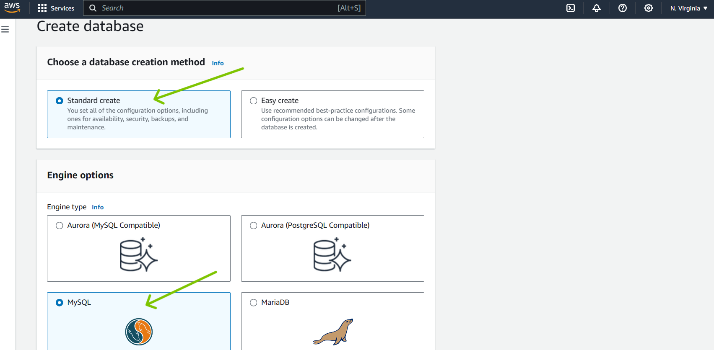 |
| 3. | **Scroll down to Templates and select ``Free Tier``.** | 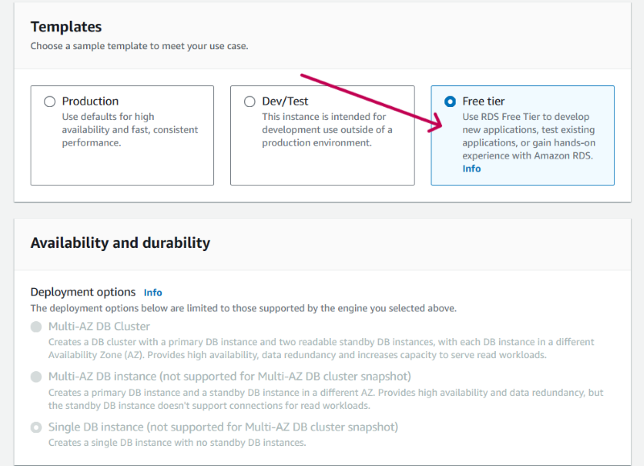 |
| 4. | **Moving to settings section , give proper database name , along with  ``Master Username``, and ``Master Password``**. | 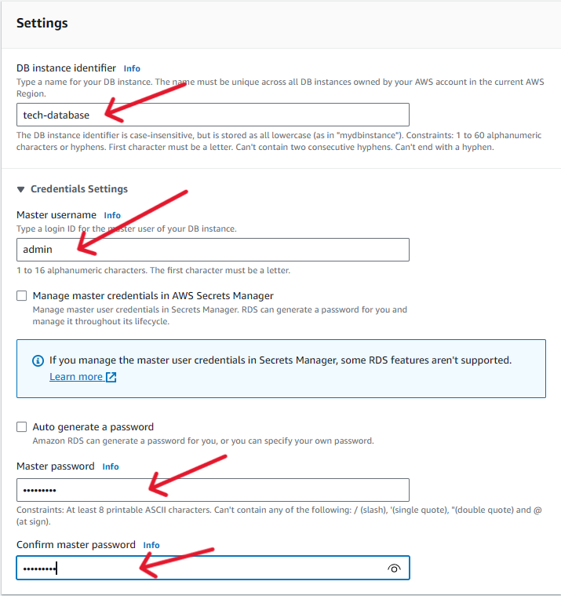 |
| 5. | **Keep the further things as default ,Pause at connectivity section and choose Public Access as ``Yes``.** | 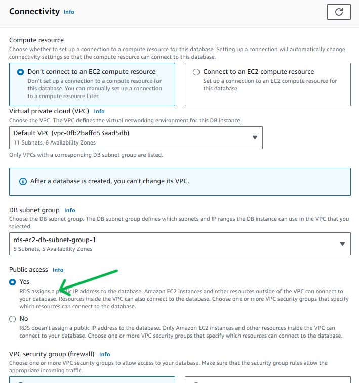 |
| 6. | **Keeping rest of them as default , scroll down to the end of the page and click on ``Create Database``.** | 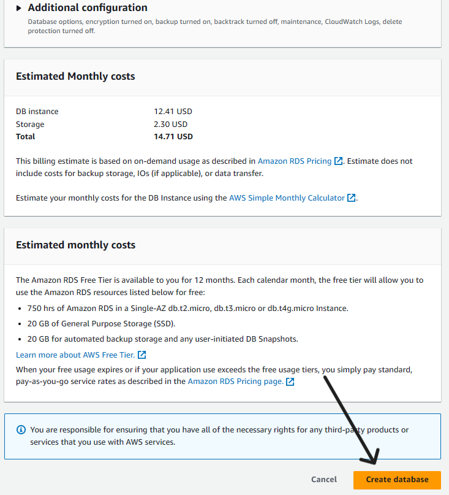 |
| 7. | **It will take some time to create database , Lets Wait.**| 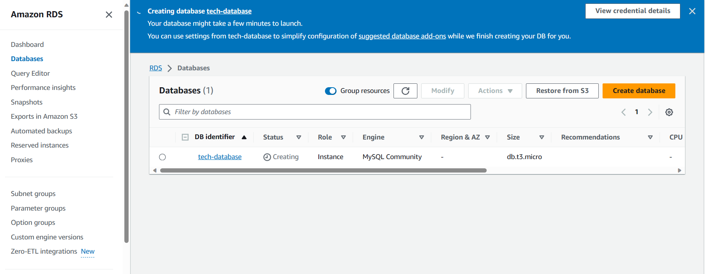 |
| 8. | **The Database got creared successfully.** | 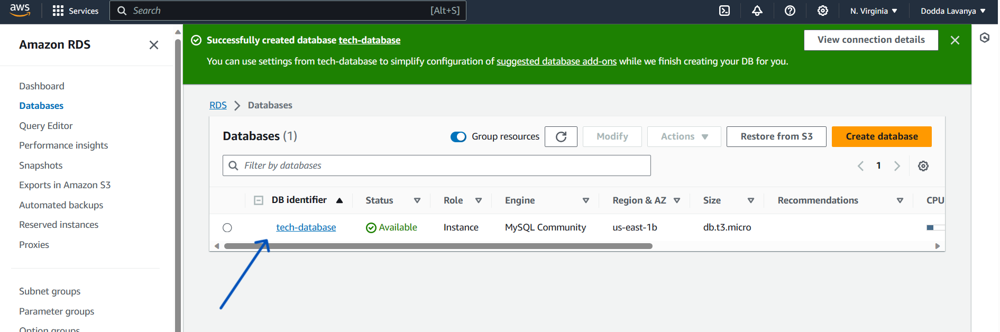 |
| 9. | **Open your database and copy the ``Endpoint``** | 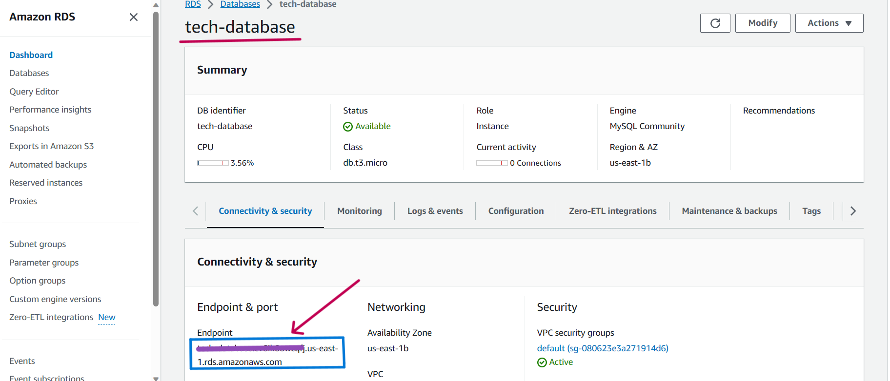 |
| 10. |**Now open the Dbeaver** |  |

***
<br>


### <span style="color: green;">**2 . PostgreSQL Database**

| Step | Description | Screenshot |
|------|-------------|------------|
| 1. | **Click on ``Create Database``.** | 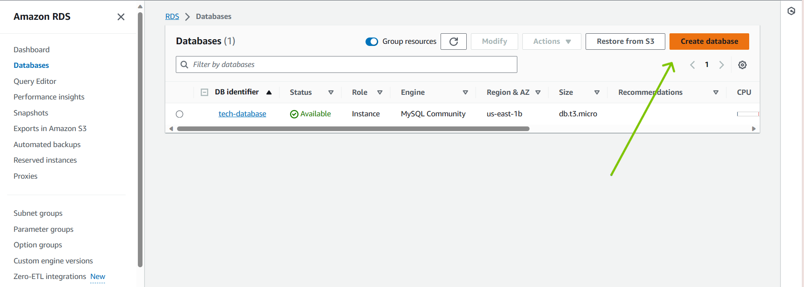 |
| 2. | **Select creation method as ``Standard Create``. And Engine type as ``PostgreSQL``** | 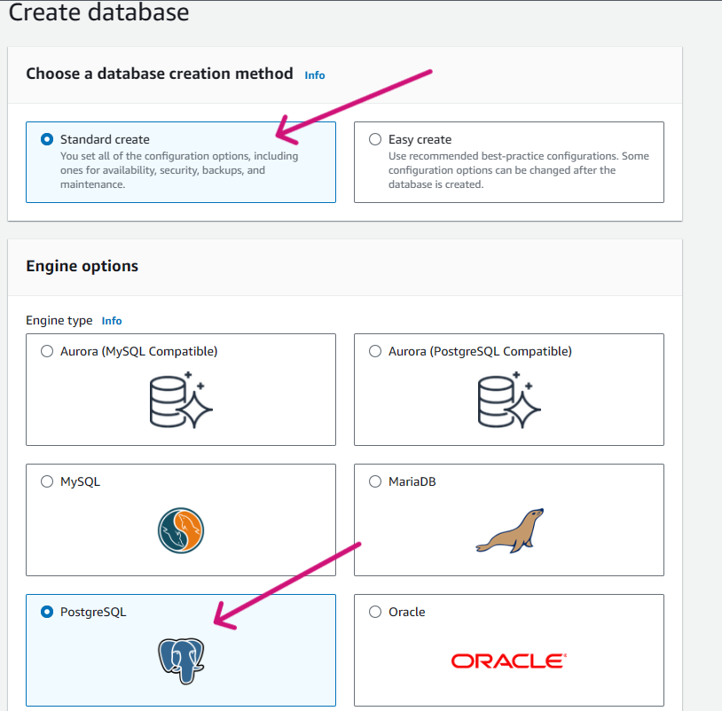 |
| 3. | **Scroll down to Templates and select ``Free Tier``.** | 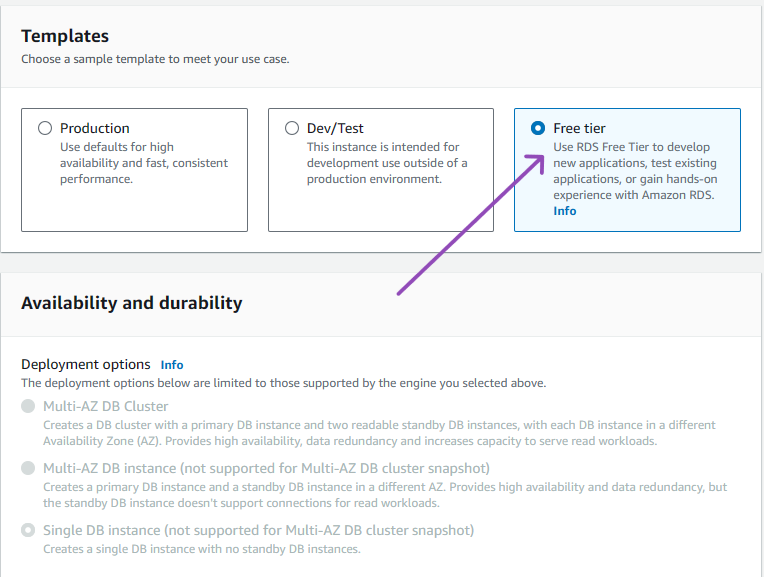 |
| 4. | **Moving to settings section , give proper database name , along with  ``Master Username``, and ``Master Password``**. | 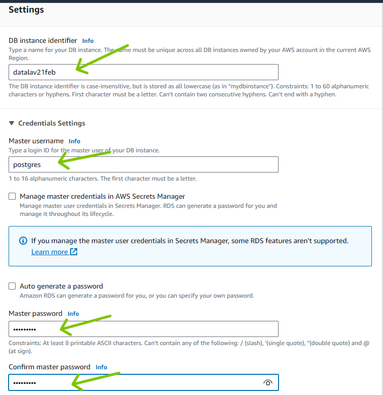 |
| 5. | **Keep the further things as default ,Pause at connectivity section and choose Public Access as ``Yes``.** |  |
| 6. | **Keeping rest of them as default , scroll down to the end of the page and click on ``Create Database``.** |  |
| 7. | **It will take some time to create database , Lets Wait.**|  |
| 8. | **The Database got creared successfully.** |  |
| 9. | **Open your database and copy the ``Endpoint``** |  |
| 10. |**Now open the Dbeaver** |  |

***
<br>


## <span style="color: pink;">**AWS-CLI**

### <span style="color: green;">**1 . MySQL Database**
| Step | Description | Screenshot |
|------|-------------|------------|
| 1. | **Open the command line of your choice and run following command with provided **Access Key ID** and **Secret Access Key**** <br> ``aws configure`` |  |
| 2. | **Lets run the following command to create RDS - MySQL Datbase using AWS-Cli Command.** <br>``aws rds create-db-instance --db-instance-identifier my-test-rds-mysql-instance --db-instance-class db.t3.micro --engine mysql --master-username myusername --master-user-password 'password123' --allocated-storage 5``| 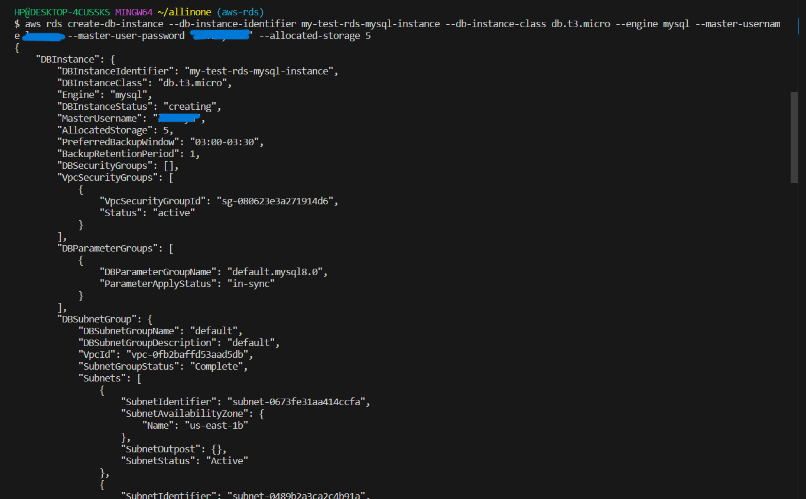 |
| 3. | **Lets go to the ``AWS CONSOLE`` and check if database got created. It got created successfully , lets copy the ``endpoint``.** | 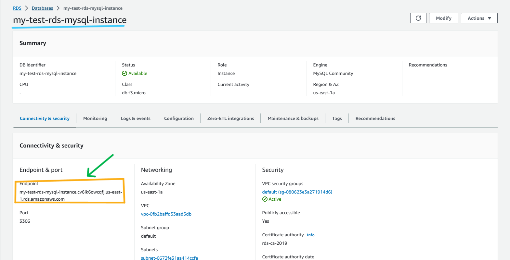 |
| 4. | **Now to connect to the RDS - MySQL Database , lets run the following command.make sure to replace the endpoint with yours.** <br>``mysql -h my-test-rds-mysql-instance.cv6ik6owcqfj.us-east-1.rds.amazonaws.com -P 3306 -u lavanya -p`` | 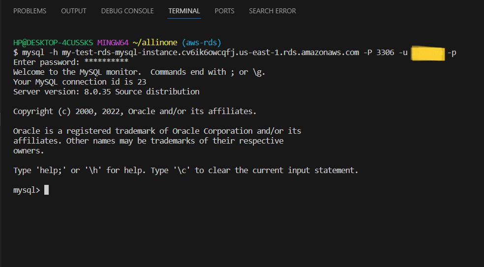 |
| 5. | **Now, you have successfully enetered into MySQL Container ,now lets add some data to it**. **Lets Begin with creating Database**. **Run the following command**<br> ``CREATE DATABASE mydatabase;``| 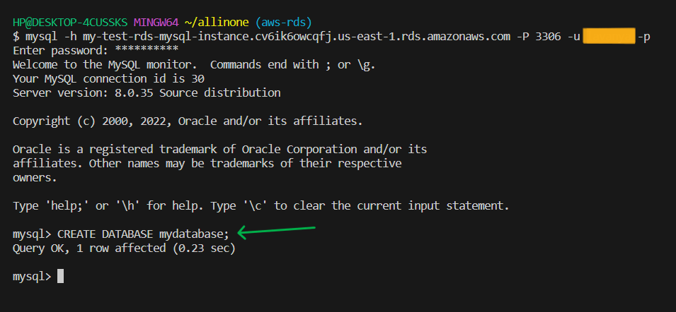 |
| 6. | **The Database got created , to select that Database , Run the following command .** <br> ```USE mydatabase;```| 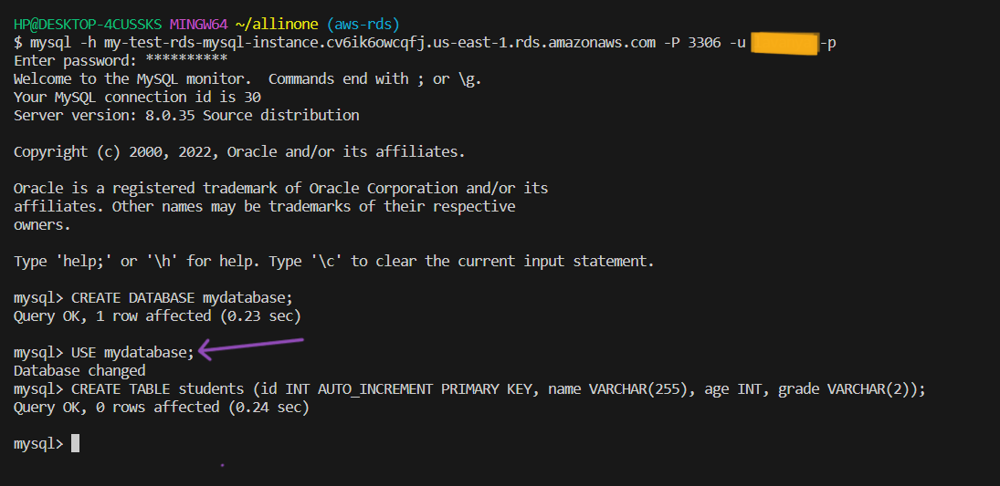 |
| 7. | **Now , lets create a table by running the following command** <br> ``CREATE TABLE students (id INT AUTO_INCREMENT PRIMARY KEY, name VARCHAR(255), age INT, grade VARCHAR(2));``| 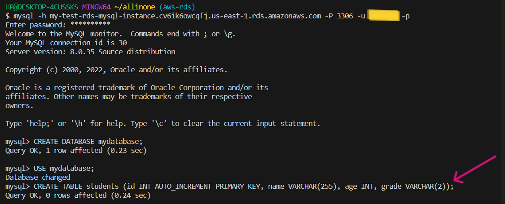|
| 8. | **Table got created successfully , lets Insert the students data into by running following command.**<br> ``INSERT INTO students (name, age, grade) VALUES ('John Doe', 18, 'A');``| 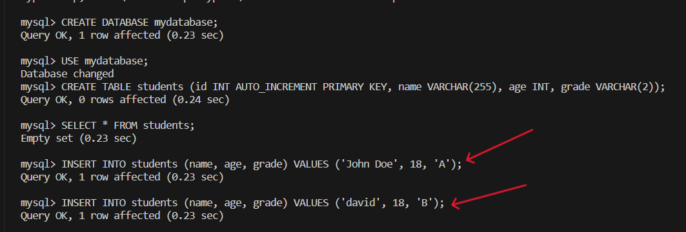 |
| 9. | **Now lets run following command to view the table** <br>```SELECT * FROM students;```| 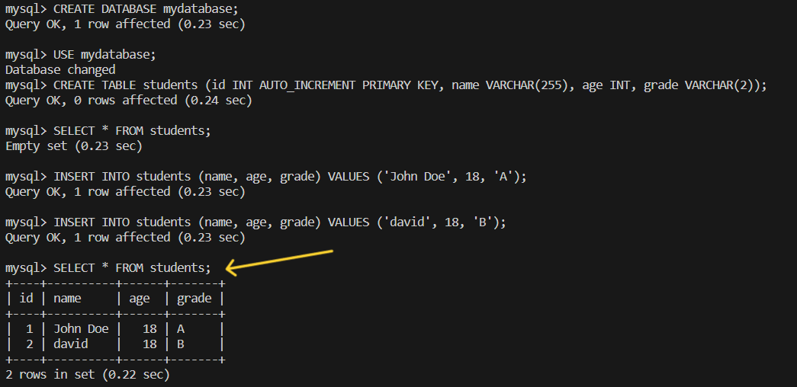 |
| 10. | **Lets also connect to the Dbeaver , to see the data updating. Click on ``connection`` and select ``MySQL``**| 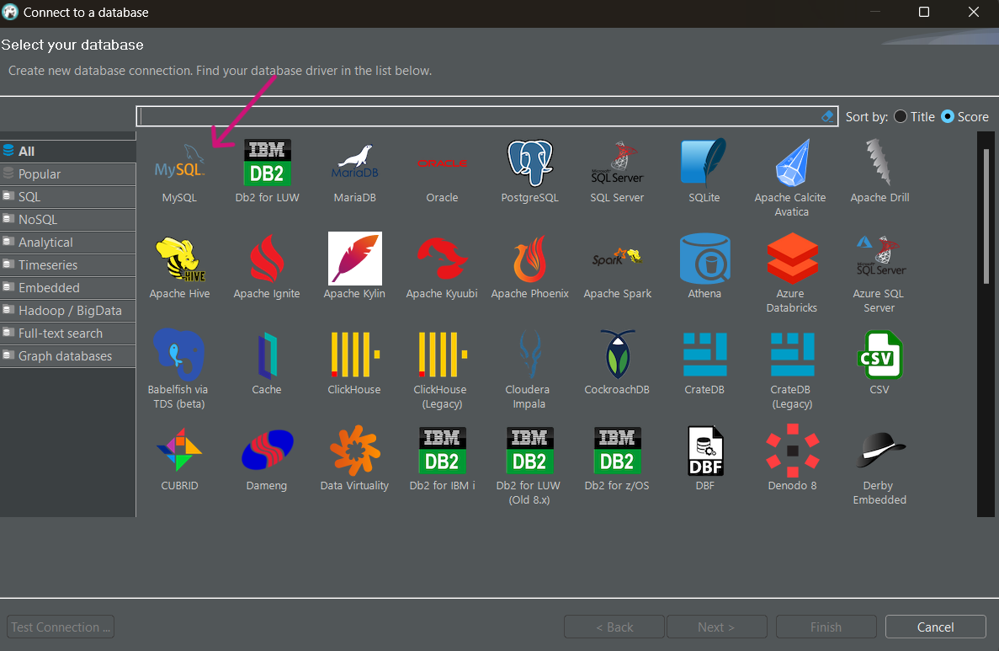 |
| 11. | **Now fill in the boxes as asked , In server host give your ``Endpoint``link, Give the ``Database``name along with your respective ``Username`` and ``Password``. and click on ``Test Connection``.**|  |
| 12. | **It got connected Successfully. Click on ``Finish``,**| 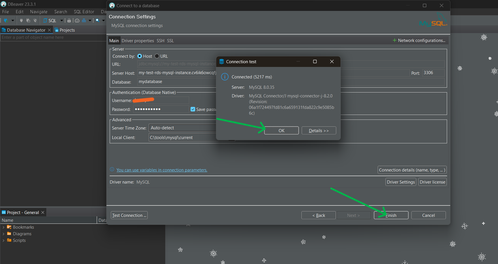 |
| 13. | **You can see database reflecting in the left panel and also can see a database ``students`` , with the inserted data.**| 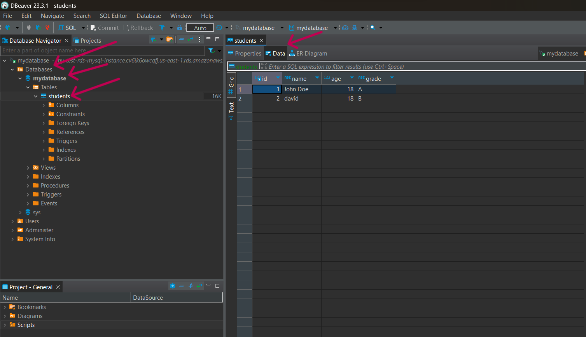 |


## <span style="color: pink;"> **POWERSHELL**

 ## PowerShell Pre-requisites

 -      Install-Module -Name AWSPowerShell -Force -AllowClobber

 -      Import-Module AWSPowerShell

### <span style="color: green;">**1 . MySQL Database**
| Step | Description | Screenshot |
|------|-------------|------------|
| 1. | **Configure AWS credentials:** <br> ``Initialize-AWSDefaultConfiguration -AccessKey AKIAZAWPSDE***** -SecretKey "your-seceret-key"`` |  |
| 2. | **Lets run the following command to create RDS - MySQL Datbase using PowerShell Command.** <br>`` New-RDSDBInstance -DBInstanceIdentifier my-ps-rds-mysql-instance -DBInstanceClass db.t3.micro -Engine mysql -MasterUsername myusername -MasterUserPassword password123 -AllocatedStorage 5``| 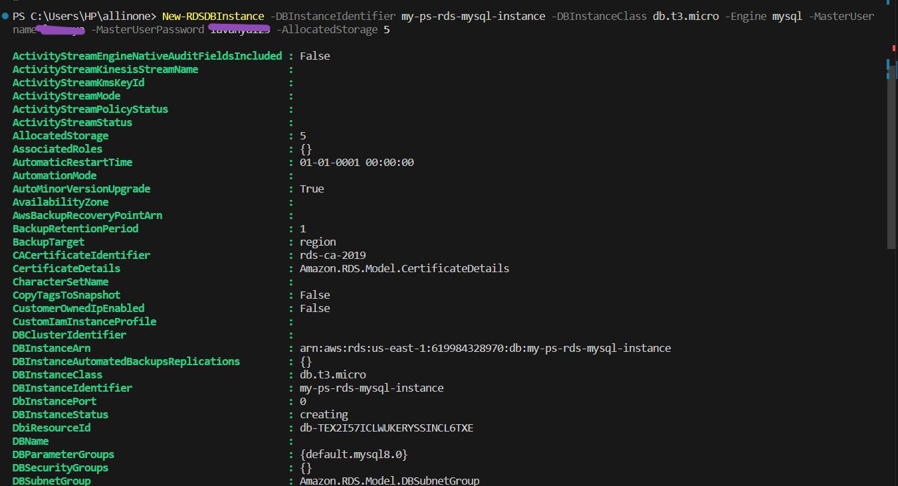 |
| 3. | **Lets go to the ``AWS CONSOLE`` and check if database got created. It got created successfully , lets copy the ``endpoint``. .**| 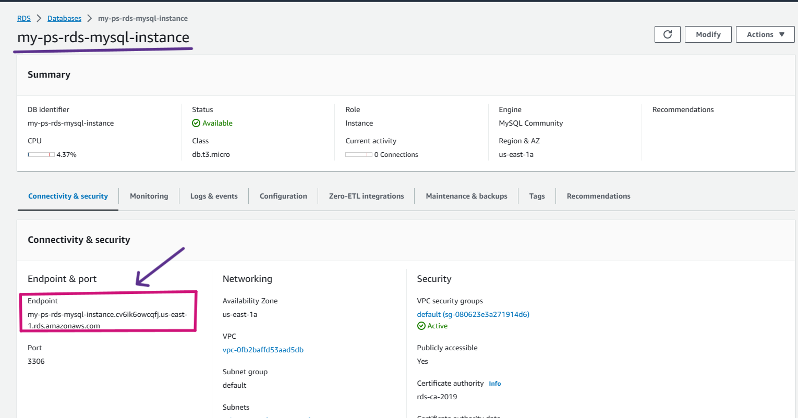 |
| 4. | **Now to connect to the RDS - MySQL Database , lets run the following command.make sure to replace the endpoint with yours.** <br>``mysql -h my-ps-rds-mysql-instance.cv6ik6owcqfj.us-east-1.rds.amazonaws.com -P 3306 -u lavanya -p`` |  |
| 5. | **Lets just Apply the bucket policy:** <br> ``aws s3api put-bucket-policy --bucket s3bucket-ps-demo --policy file://policy.json``|  |
| 6. | **Lets , get back to AWS Console and see whether our bucket and file got uploaded .**| |
| 7. | **Open the file and access the ```Object URL```**|  |
| 8. | **You can see Html Student Application Running .**|  |

 