# <span style="color: gold;"> Introduction

- What is ``Amazon Simple Queue Service (SQS)`` ?

    ``Amazon Simple Queue Service (Amazon SQS)`` is a pay-per-use web service for storing messages in transit between computers. Developers use SQS to build distributed applications with decoupled components without having to deal with the overhead of creating and maintaining message queues.

## To create Amazon Simple Queue Service (SQS), using ```AWS Console``` , ```AWS-CLI``` and  ```Powershell``` follow below steps :

1.[AWS Console](#aws-console)

2.[AWS-CLI](#aws-cli)

3.[Powershell](#powershell)

# <span style="color: gold;">Pre-Requistes

- ### Make sure to Create a user in your aws console and have ```Access Key ID``` and ```Secret Access Key``` noted down in notepad.

# <span style="color: gold;">Process

## <span style="color: pink;">**AWS-Console**

| Step | Description | Screenshot |
|------|-------------|------------|
| 1. | **Open the AWS Console and search for SQS. Click on ``Create a Queue``.** | 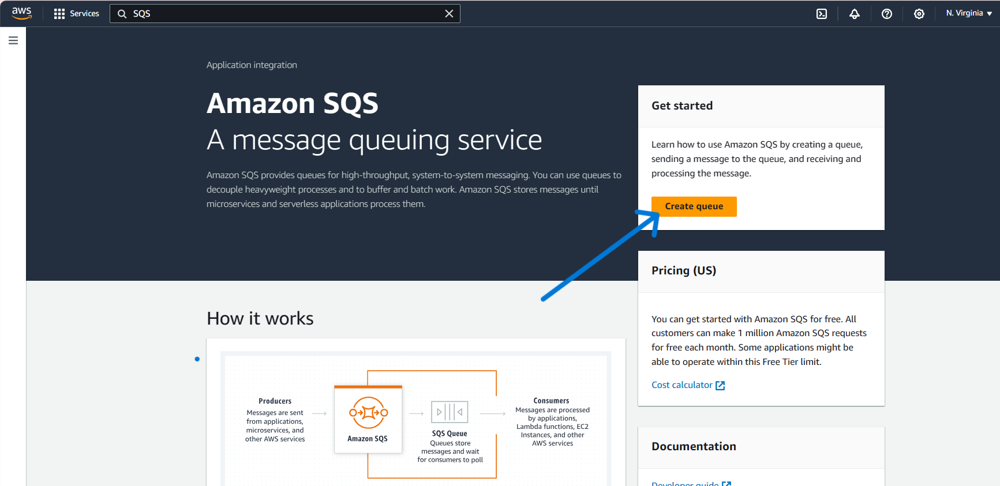 |
| 2. | **Select ``Queue Type`` as ``Standard`` and also give the ``Queue Name`` Respectively.** | 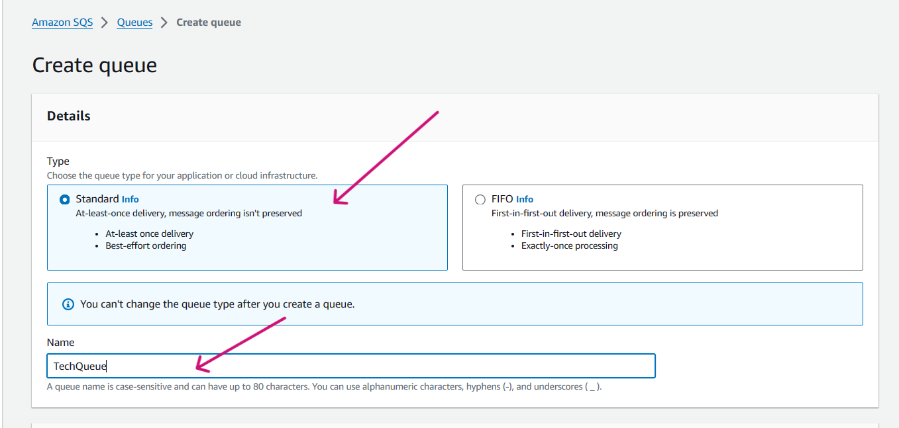 |
| 3. | **Let the ``Configuration`` parameters be default.** | 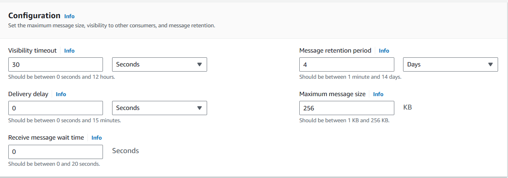 |
| 4. | **Moving to ``Encryption`` keep the values as it is , keep them default**. | 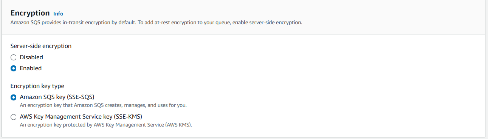 |
| 5. | **Coming to the the ``Access Policy``, keep the method as ``Basic``.** | 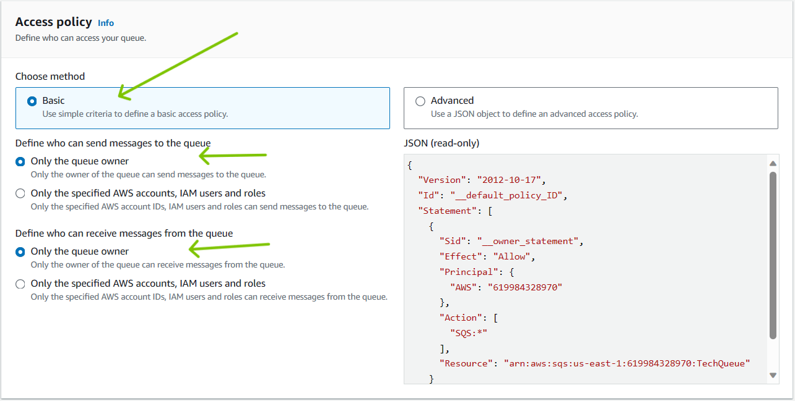 | 
| 6. | **Leaving everything default , Click on ``Create queue`` .** | 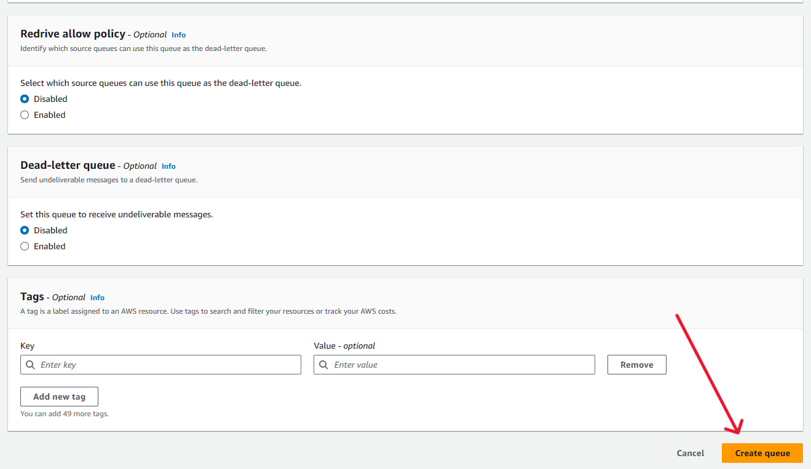 |
| 7. | **You can see that ``Queue`` got created successfully.**| 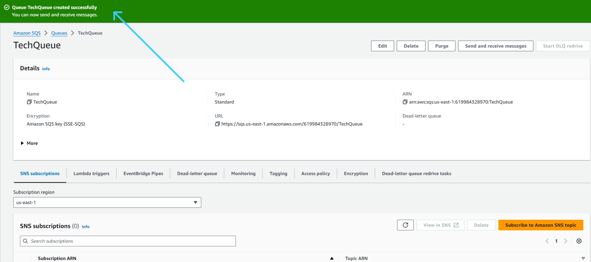 |
| 8. | **Now lets click on ``send and receive message``** .| 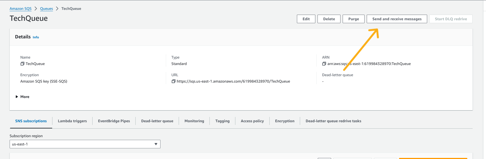 |
| 9. | **Here in the Message body fill in the ``Message``what you want to send and Click on ``Send Message``.** | 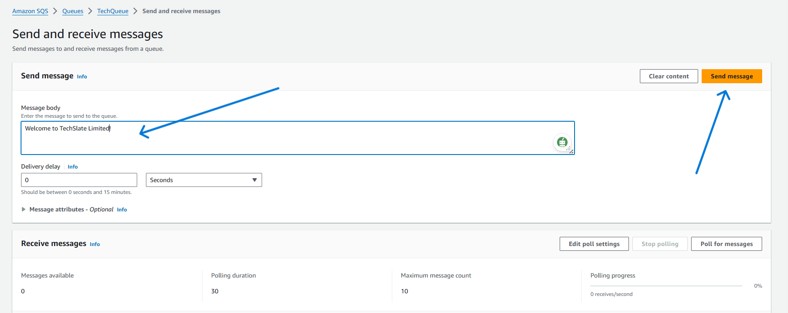 |
| 10.|**You can see that the Message is been sent successfully.** | 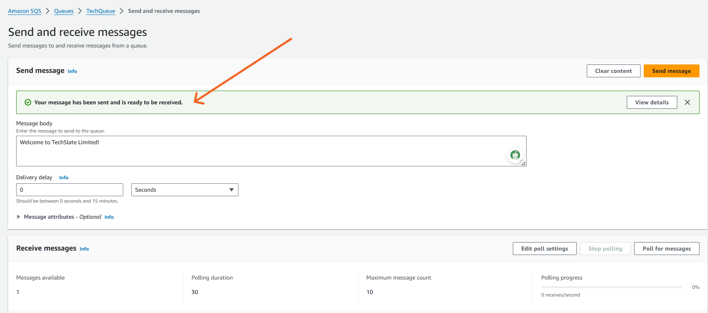 |
| 11.|**Click on ``Poll for Messages``.** | 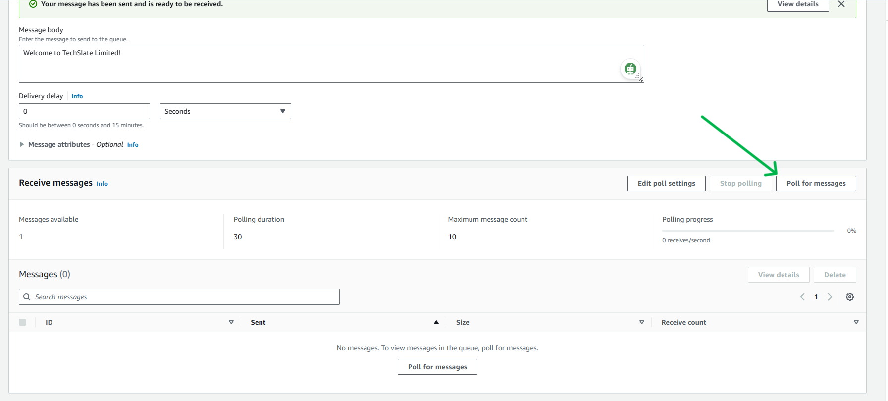 |
| 12.|**And you can see 1 Message appearing with respective ``ID``. Please click on ``ID`` .** | 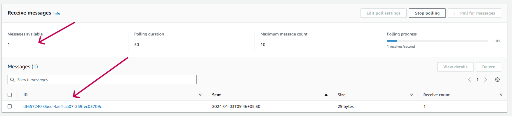 |
| 13.|**Now , you can the message displaying in the body** | 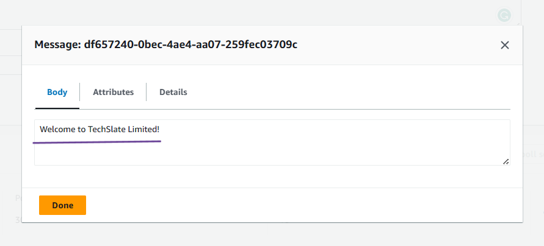 |
| 14.|**You can click on ``Details`` , to see more details of the Message** |  |

***
<br>

## <span style="color: pink;">**AWS-CLI**


| Step | Description | Screenshot |
|------|-------------|------------|
| 1. | **Open the command line of your choice and run following command with provided **Access Key ID** and **Secret Access Key**** <br> ``aws configure`` |  |
| 2. | **Lets run the following command to ``create Queue`` using AWS-Cli Command.** <br> </br>``aws sqs create-queue --queue-name TechQueue-cli``| 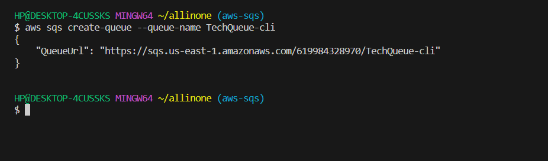 |
| 3. | **Now, Lets try to send the Message by running following command , You can take ``Queue-Url`` from above output.** <br> </br>``aws sqs send-message --queue-url https://sqs.us-east-1.amazonaws.com/619********/TechQueue-cli --message-body "Hello, SQS-AWSCLI!" ``| 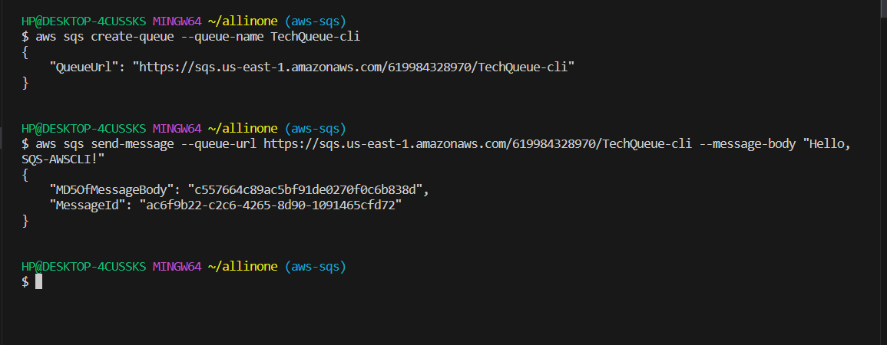 |
| 4. | **Now lets run the following command to receive the message , in aws-console we use to do ``Poll Message`` here we are running ``Receive Message``**. <br> </br> ``aws sqs receive-message --queue-url https://sqs.us-east-1.amazonaws.com/619984328970/TechQueue-cli`` . | 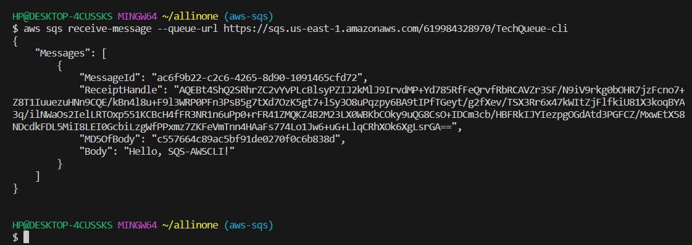 |
| 5. | **You can also head back to AWS-Console , and check if it got created successfully**.| 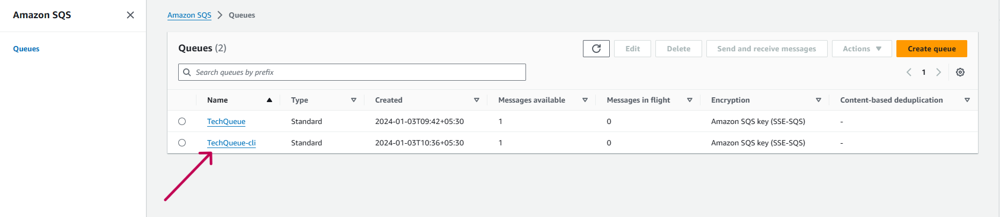 |


## <span style="color: pink;"> **POWERSHELL**

 ## PowerShell Pre-requisites

 -      Install-Module -Name AWSPowerShell -Force -AllowClobber

 -      Import-Module AWSPowerShell

| Step | Description | Screenshot |
|------|-------------|------------|
| 1. | **Configure AWS credentials:** <br> ``Initialize-AWSDefaultConfiguration -AccessKey AKIAZAWPSDE***** -SecretKey "your-seceret-key"`` |  |
| 2. | **Lets run the following command to ``create Queue`` using PowerShell Command.** <br> </br>``New-SQSQueue -QueueName 'my-new-powershell-queue'``.| 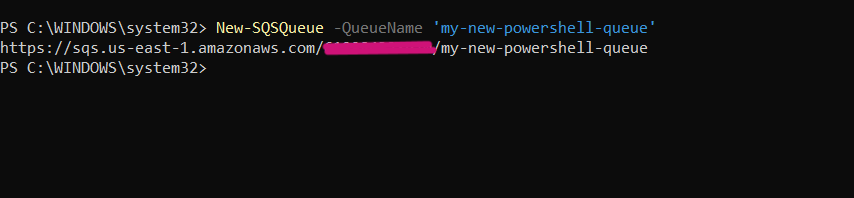 |
| 3. | **Now, Lets try to send the Message by running following command , You can take ``Queue-Url`` from above output.** <br> </br>``Send-SQSMessage -QueueUrl 'https://sqs.us-east-1.amazonaws.com/61***********/my-new-powershell-queue' -MessageBody 'Hello, World!'`` |  |
| 4. | **Now lets run the following command to receive the message , in aws-console we use to do ``Poll Message`` here we are running ``Receive-SQSMessage``**. <br> </br> ``Receive-SQSMessage -QueueUrl 'https://sqs.us-east-1.amazonaws.com/61**********/my-new-powershell-queue' -MessageCount 1 -VisibilityTimeout 30`` .** | 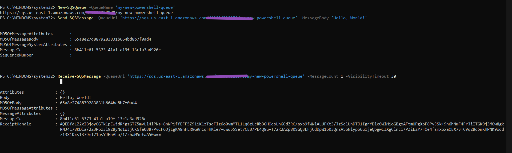 |
| 5. | **You can also head back to AWS-Console , and check if it got created successfully**. | 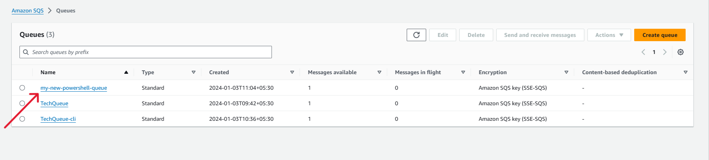 |

