#  Introduction

### What is ``IAM User`` ?

#### An ``AWS Identity and Access Management (IAM)`` user is an entity that you create in AWS. The IAM user represents the human user or workload who uses the IAM user to interact with AWS. A user in AWS consists of a name and credentials.

### ``IAM User`` Best Practices in AWS :

 #### When working with AWS, it is recommended to create IAM (Identity and Access Management) users before initiating resource creation. IAM users play a crucial role in ensuring the security, manageability, and accountability of your AWS environment. Here's why:

- ``Security Principle``: IAM users enable the principle of least privilege, granting minimal necessary permissions to individuals or systems.

- ``Access Control``: IAM provides fine-grained access control, allowing each user to have specific permissions and policies.

- ``Audit Trail``: IAM users provide an audit trail for all actions performed in your AWS account, aiding in compliance and security analysis.

- ``Credential Management``: IAM users have their own access key pairs, facilitating secure programmatic access with easy credential rotation.

- ``Multi-Factor Authentication (MFA)``: IAM users can utilize MFA for an additional layer of security beyond passwords.

- ``Consistent Identity Across Services``: IAM provides a consistent way to manage identities and permissions across various AWS services.

- ``Organizational Control``: IAM users allow for logical organization and control of access, particularly in multi-user or multi-team environments.

## Creation of ``IAM User`` .  

### 1. Open your AWS Console and search for ``IAM`` in search box..Click on ``Users``.

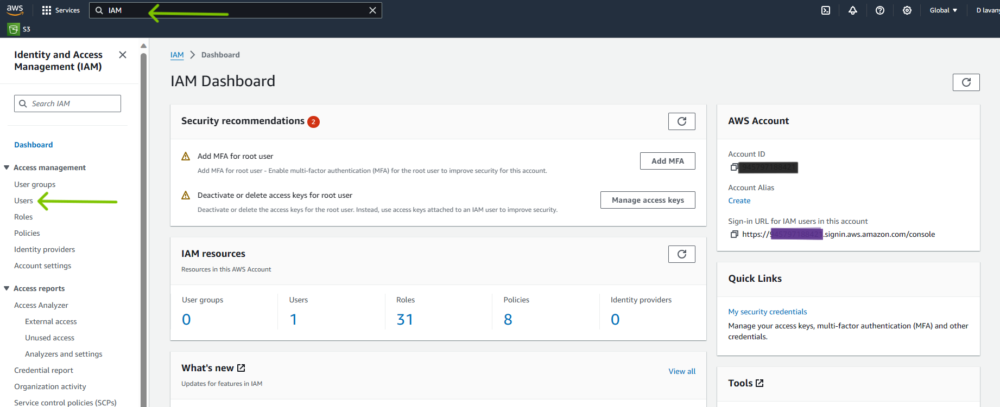

### 2. Click on `` Create User``.

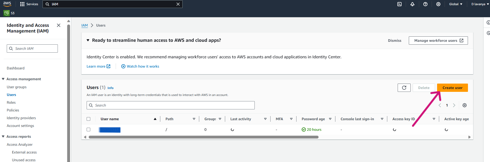

### 3. Give proper ``User name`` and tick the ``check box`` for providing user access to AWS Console.And proceed with Console password of your choice.

### 4. Scroll down and Click on ``Next`` .

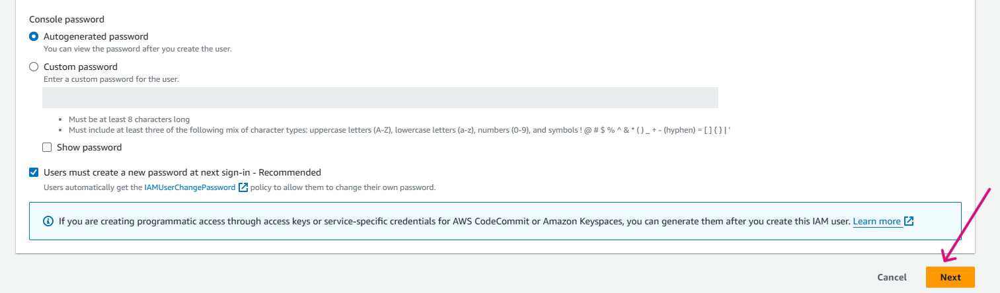

### 5. Moving further , if you want to add or attach any policies you can add it directly from here.So we have attached couple of policies for your refernece here .

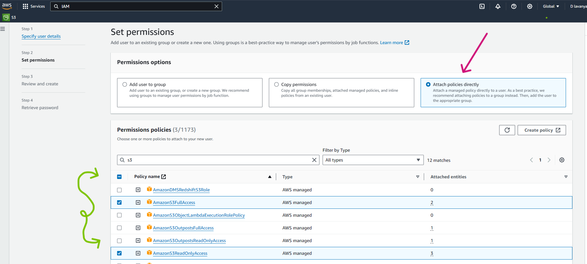

### 6. Click on ``Next`` .

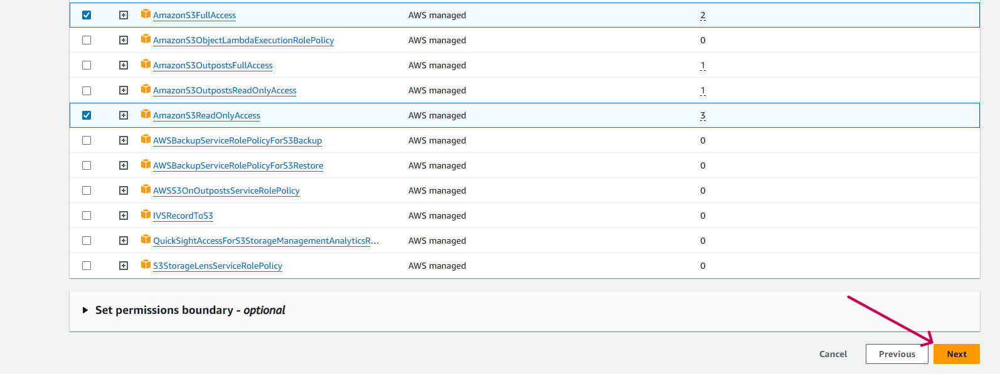

### 7. Checkout the ``Review and Create`` step and Click on ``Create User`` .

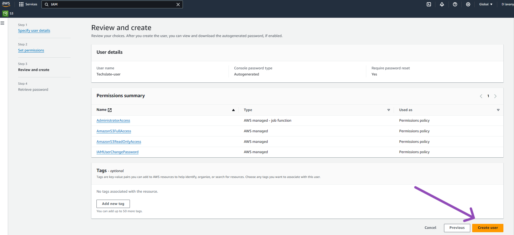

### 8. User got created Successfully. With the User name and Password .

### 9. The main step after creating user is Generating Access Key , which is the main requirement for us to create any resource through AWS-CLI.

### So just Open your user under which you can see a option called ``Security Credentials`` Click on that.

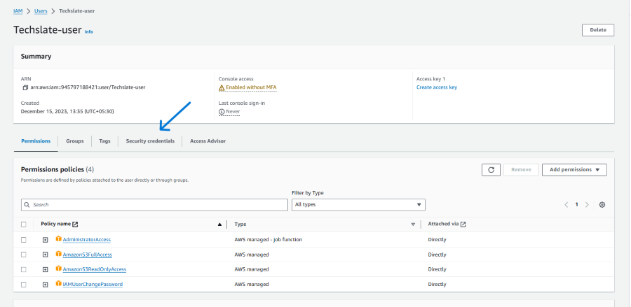

### 10. Scroll down and Click on ``Create access Key`` .

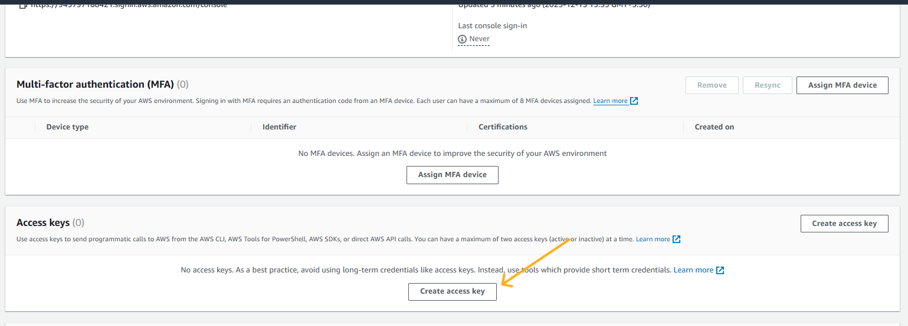

### 11. Select the Use case ``Command Line Interface (CLI)`` and at last tick the ``CheckBox``. Click on ``Next`` .

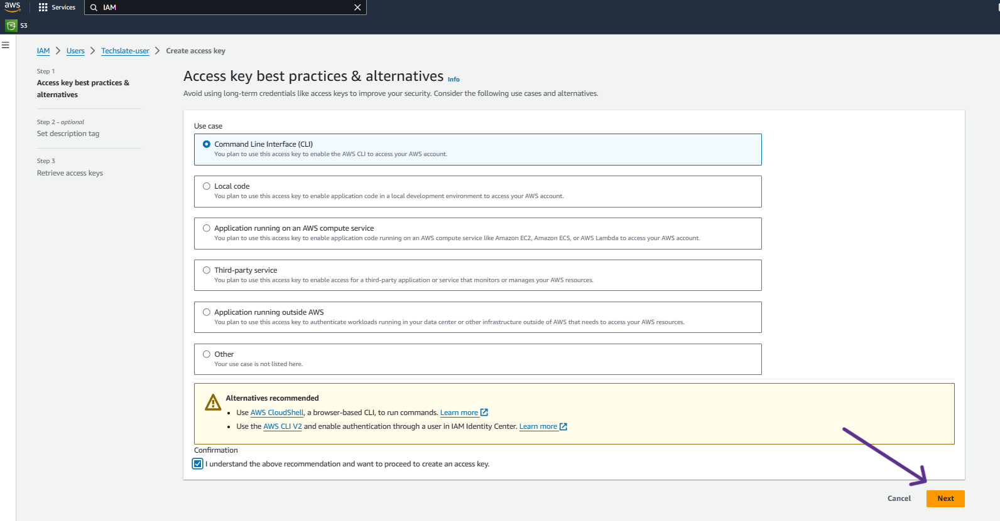

### 12. Click on ``Create access Key`` .

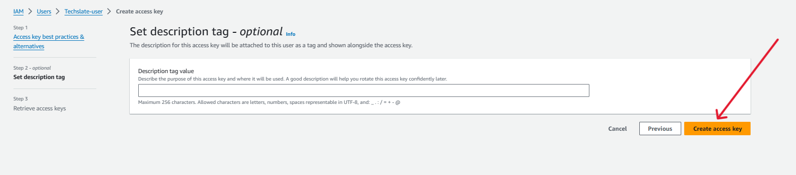

### 12. The access keys got created successfully and Download the ``.csv file``.

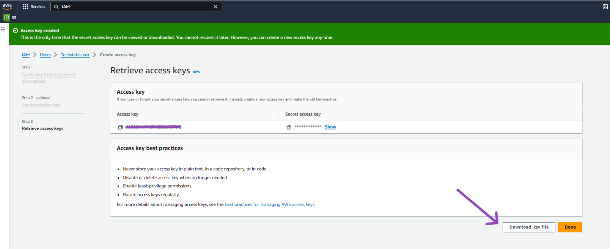

### 13. Save the ``.csv file`` as it containe the ``Access key`` and ``Secret access key``.

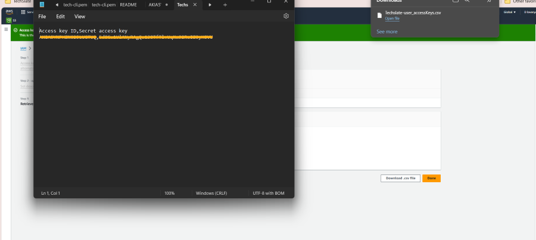

### 14. Open the Terminal and lets run ``aws configure`` It will ask you for ``Access key`` and ``Secret access key``. Now you are all set to create services through aws-cli .

***