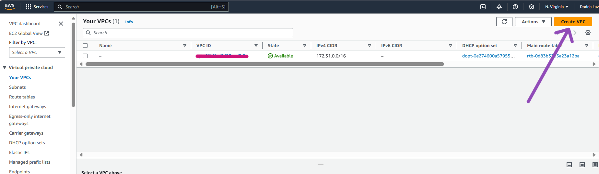
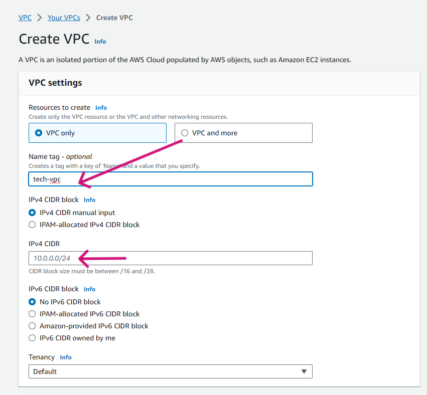
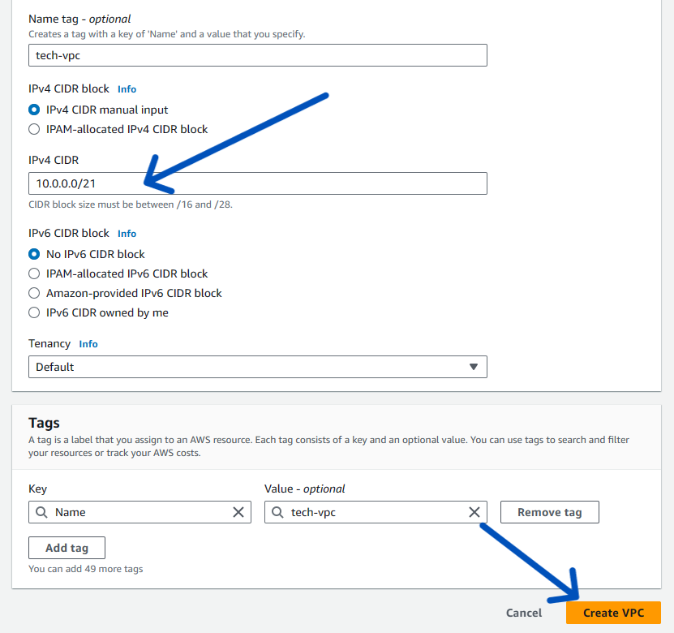
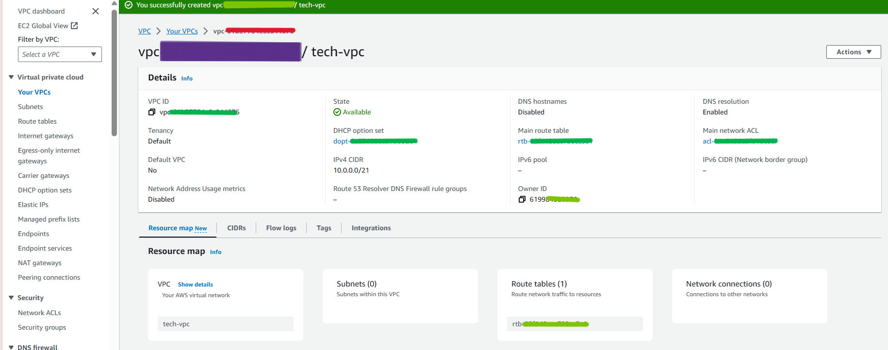
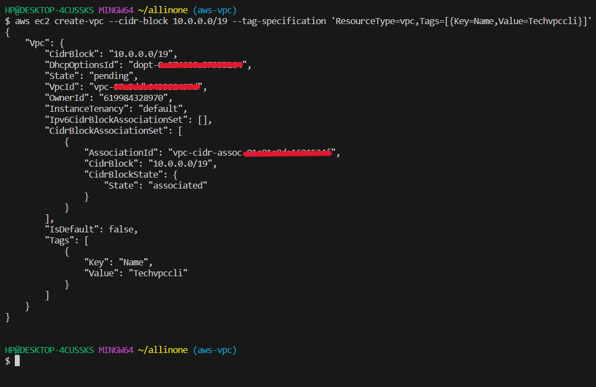
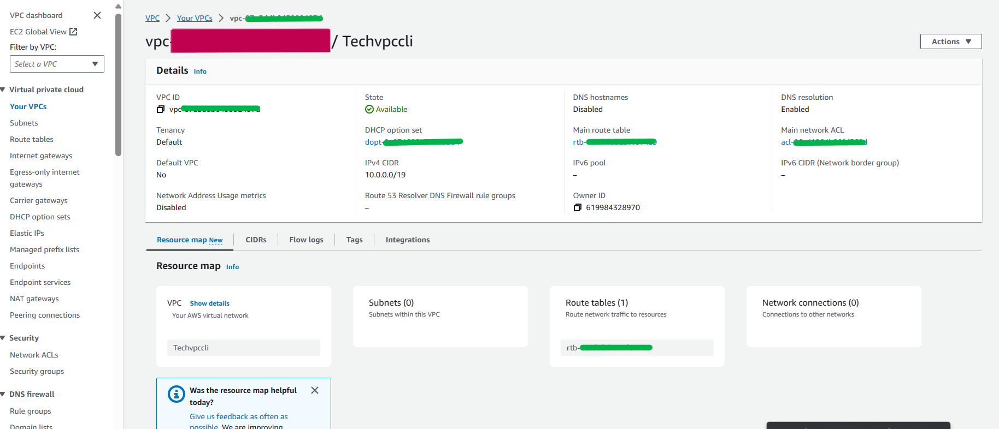
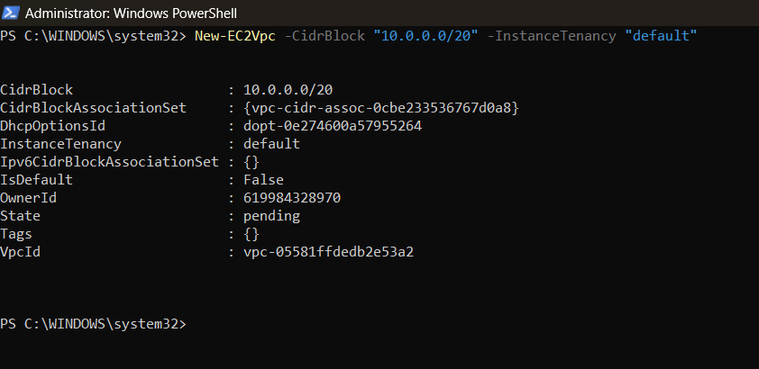
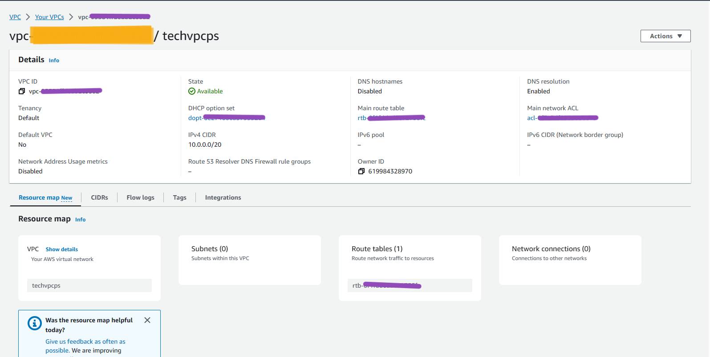

# <span style="color: gold;"> Introduction

- What is ``Amazon Virtual Private Cloud (VPC)`` ?

    ``Amazon Virtual Private Cloud (VPC)`` is a commercial cloud computing service that provides a virtual private cloud, by provisioning a logically isolated section of Amazon Web Services (AWS) Cloud.Enterprise customers can access the Amazon Elastic Compute Cloud (EC2) over an IPsec based virtual private network.Unlike traditional EC2 instances which are allocated internal and external IP numbers by Amazon, the customer can assign IP numbers of their choosing from one or more subnets.

## To create ``Amazon Virtual Private Cloud (VPC)``, using ```AWS Console``` , ```AWS-CLI``` and  ```Powershell``` follow below steps :

1.[AWS Console](#aws-console)

2.[AWS-CLI](#aws-cli)

3.[Powershell](#powershell)

# <span style="color: gold;">Pre-Requistes

- ### Make sure to Create a user in your aws console and have ```Access Key ID``` and ```Secret Access Key``` noted down in notepad.

# <span style="color: gold;">Process

## <span style="color: pink;">**AWS-Console**

| Step | Description | Screenshot |
|------|-------------|------------|
| 1. | **Open the AWS Console and search for ``VPC``. And click on ``Create VPC``.** |  |
| 2. | **Now , give a proper ``Name`` to the VPC. And moving further under IPv4 CIDR, you need to give the respective IP that you want to consider giving.** |  |
| 3. | **So, we have alloted respective IPv4 CIDR to it. And click on ``Create VPC`` .** |  |
| 4. | **The ``VPC`` got created successfully**. |  |
 

***
<br>

## <span style="color: pink;">**AWS-CLI**


| Step | Description | Screenshot |
|------|-------------|------------|
| 1. | **Open the command line of your choice and run following command with provided **Access Key ID** and **Secret Access Key**** <br> ``aws configure`` |  |
| 2. | **Lets run the following command to ``create VPC`` using AWS-Cli Command.** <br> </br>``aws ec2 create-vpc --cidr-block 10.0.0.0/19 --tag-specification 'ResourceType=vpc,Tags=[{Key=Name,Value=Techvpccli}]'``|  ||
| 3. | **Lets head back to AWS Console and see if ``VPC`` got created. And it got created Successfully.**|  |


## <span style="color: pink;"> **POWERSHELL**

 ## PowerShell Pre-requisites

 -      Install-Module -Name AWSPowerShell -Force -AllowClobber

 -      Import-Module AWSPowerShell

 Step | Description | Screenshot |
|------|-------------|------------|
| 1. | **Configure AWS credentials:** <br> ``Initialize-AWSDefaultConfiguration -AccessKey AKIAZAWPSDE***** -SecretKey "your-seceret-key"`` |  |
| 2. | **Lets run the following command to ``Create VPC`` using PowerShell Command.** <br> </br>``New-EC2Vpc -CidrBlock "10.0.0.0/20" -InstanceTenancy "default"``.|  |
| 3. | **Now, Lets head back to AWS Console and confirm if ``VPC`` through powershell got created, And here it is , it got created successfully.** |  |