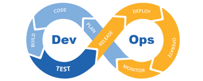

# Introduction 

## *This page contains all the Best-Practices of DevOps.*

# DevOps Compose-Best Practices 

DevOps (Development Operations) is an approach to software development that emphasizes collaboration and communication between development and operations teams. Here are some best practices for DevOps:

## **Practice 1:Automate as much as possible:** 

- Automating repetitive tasks such as testing, deployment, and monitoring can save a lot of time and reduce errors.

## **Practice 2: Continuous integration and delivery** 

- Adopt a continuous integration and delivery (CI/CD) pipeline to ensure that changes to code are quickly and safely integrated into the main codebase.

## **Practice 3: Infrastructure as Code (IaC)** 

- Use IaC tools such as Ansible, Chef, or Puppet to automate the deployment and management of infrastructure.

## **Practice 4: Monitoring and logging** 

- Implement monitoring and logging tools to proactively detect and troubleshoot issues in real-time.

## **Practice 5: Collaboration and communication** 

- Foster a culture of collaboration and communication between development and operations teams to ensure that everyone is working towards the same goals.

## **Practice 6: Security** 

-  Implement security best practices throughout the entire DevOps pipeline, including code reviews, vulnerability scanning, and access controls.

## **Practice 7: Continuous improvement** 

-  Regularly evaluate the DevOps pipeline and processes, and continuously make improvements to optimize efficiency and productivity.

By following these best practices, organizations can accelerate software development, reduce errors, and improve overall product quality.

## **Practice 8: Cloud-native Technologies**

- Use cloud-native technologies like Kubernetes and Docker for containerization and orchestration

## **Practice 9: Disaster Recovery and Business Continuity**

- Implement disaster recovery and business continuity plans

- Test and update plans regularly

## **Practice 10: Release Management**

- Use release management tools like GitLab or Octopus Deploy to manage software releases

- Ensure all changes are thoroughly tested and documented before release

## **Practice 11: Scalability and Flexibility**

- Ensure systems are scalable and flexible to handle changing workloads.

- Use tools like autoscaling to adjust resources based on demand

## **Practice 12: Version Control**

- Use version control tools like Git for code management.

- Ensure all changes are tracked and documented

## **Practice 13: Code Review**

- Conduct code reviews to ensure code quality and adherence to best practices

- Use tools like GitHub or Bitbucket for code review

## **Practice 14: Feedback and Continuous Improvement**

- Use feedback loops to continually improve processes and systems

- Collect feedback from customers and stakeholders to identify areas for improvement.
