# **Setup Sonarqube with Postgres database using docker-compose**

# Table of contents
1.[Introduction](#**<Introduction>**)

2.[Prerequisites](#**<Pre-requisites>**)

3.[Setup SonarQube Server with Docker-compose](#how-to-setup-sonarqube-server-with-docker-compose)


## **Introduction**

### **What is SonarQube?**
SonarQube is a continuous inspection tool which can be used to test the quality of the code. It analyzes the source code and sends the analytical report to us to check on the final quality. 

It is available as an open-source platform and supports multiple programming languages like Java, Python, Javascript, TypeScript, COBOL, HTML, XML, C#, C/C++ Apex, Object-C, Swift, Kotlin, Ruby, Scala, CSS, ABAP etc. However, some languages require a commercial license to work with. 

You do not have to alter your workflow or learn new tools to install SonarQube since it can easily be integrated with common build tools such as Ant, Maven, Make, Gradle, MS Build etc. All you have to do is add appropriate plugins for a smoother analysis in your build process. 

### **What is Docker Compose?** 
Docker compose is a tool developed to define and share multi-container applications. With docker compose, you can create a YAML file for defining services within a single command. This command can either build up or tear down your entire build. 
***

## **Pre-requisites**

**To set up SonarQube with a Postgres database using docker-compose, you will need to have the following prerequisites installed and configured on your machine:**

**Docker:** Docker is a containerization platform that allows you to run applications in lightweight, isolated environments called containers. You will need to have Docker installed on your machine to use docker-compose.

**Docker Compose:** Docker Compose is a tool for defining and running multi-container Docker applications. You will use Docker Compose to set up and run the SonarQube and Postgres containers.

**A text editor:** You will need a text editor to create and edit the docker-compose.yml file that defines the configuration for your SonarQube and Postgres containers. Some popular text editors include Visual Studio Code, Sublime Text, and Atom.

**A Postgres database:** SonarQube requires a Postgres database to store its data. The Postgres database can be run in a separate container using Docker, or it can be installed and run locally on your machine.

**A SonarQube license:** If you are using the SonarQube Community Edition, you do not need a license. However, if you are using the SonarQube Enterprise Edition, you will need to obtain a license from SonarSource.

Once you have these prerequisites installed and configured, you can proceed with setting up SonarQube with a Postgres database using docker-compose.

A prerequisite with respect to Elasticsearch is to keep your max virtual memory areas vm.max_map_count increase to at least [262144]
To do that , if you are a windows user, Please run the following command in terminal. 

**```wsl.exe -d docker-desktop sh -c "sysctl -w vm.max_map_count=262144"```**

if you are a Linux user, Please run the following command in terminal. 

**```sudo sysctl -w vm.max_map_count=262144```**

***
# **How to Setup SonarQube Server with Docker-compose?**
Now, We will create a simple **docker-compose.yml** file and store the code in it.

### **1. Open your Visual Studio Code.**
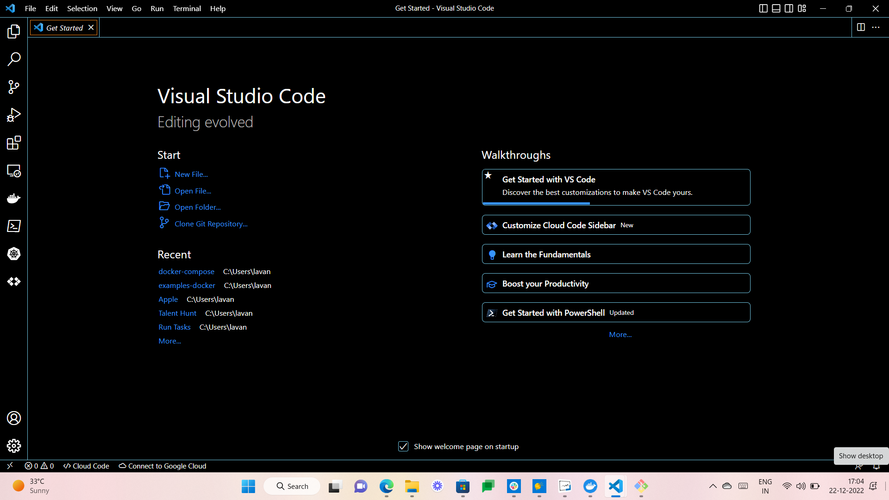
***

### **2. Create a folder , and name it by your choice.**
**To create a Folder run the following command**

```mkdir <folder-name>``` 


***

### **3. Create docker-compose.yml .**

```
version: '3.7'
services:
  sonarqube:
    image: sonarqube:latest
    ports:
      - 9000:9000
    environment:
      - SONARQUBE_JDBC_USERNAME=sonar
<<<<<<< HEAD
<<<<<<< HEAD
      
=======
>>>>>>> cdcbf7dda9c532205917c1e094385c22ae019580
=======
>>>>>>> f43084a3686aa4f19940160f7d4934a2f749fede
      - SONARQUBE_JDBC_PASSWORD=sonar
      - SONARQUBE_JDBC_URL=jdbc:postgresql://db:5432/sonar
    volumes:
      - sonarqube_conf:/opt/sonarqube/conf
      - sonarqube_data:/opt/sonarqube/data
      - sonarqube_extensions:/opt/sonarqube/extensions
      - sonarqube_bundled-plugins:/opt/sonarqube/lib/bundled-plugins
<<<<<<< HEAD
<<<<<<< HEAD
    command: ["./bin/run.sh"]
=======
>>>>>>> cdcbf7dda9c532205917c1e094385c22ae019580
=======
>>>>>>> f43084a3686aa4f19940160f7d4934a2f749fede

  db:
    image: postgres:latest
    environment:
      - POSTGRES_USER=sonar
      - POSTGRES_PASSWORD=sonar
      - POSTGRES_DB=sonar
    volumes:
      - postgres_data:/var/lib/postgresql/data

volumes:
  sonarqube_conf:
  sonarqube_data:
  sonarqube_extensions:
  sonarqube_bundled-plugins:
  postgres_data:
  ```
***
<<<<<<< HEAD
### **4 . Now execute the compose file using Docker compose command:**

**`docker-compose up`**
=======
### **4. Now execute the compose file using Docker compose command:**

**`docker-compose up -d`**
>>>>>>> cdcbf7dda9c532205917c1e094385c22ae019580

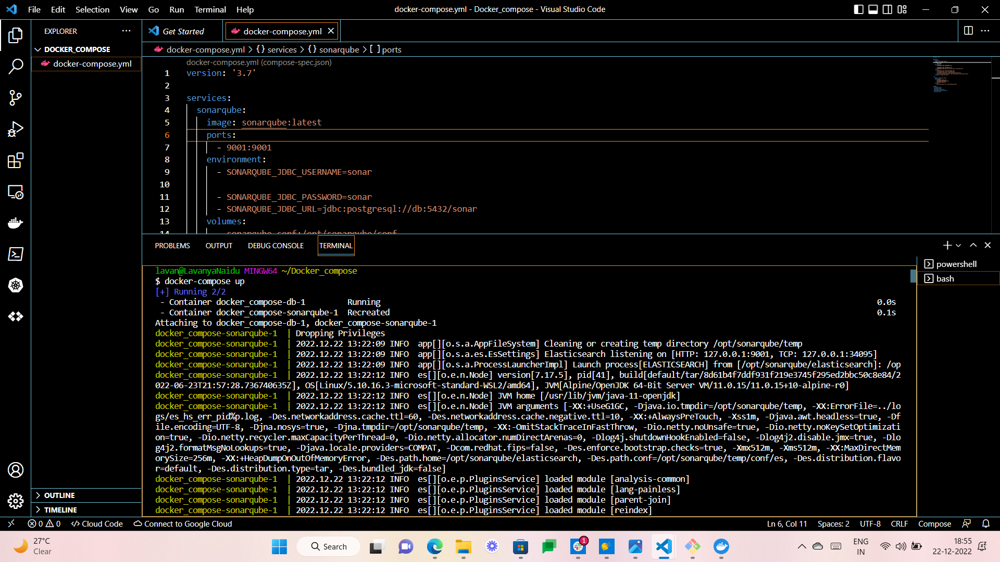
***
### **5. List the running containers.** 

docker ps command to list the running containers, as we can see both SonarQube and postgreSQL containers are running.

**`docker ps`**

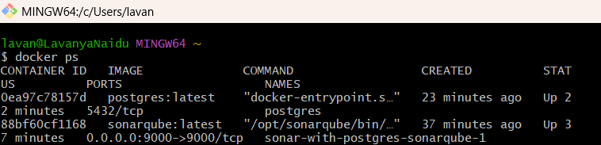
***
### **6. Command to check the docker compose logs .**

**`docker-compose logs`**

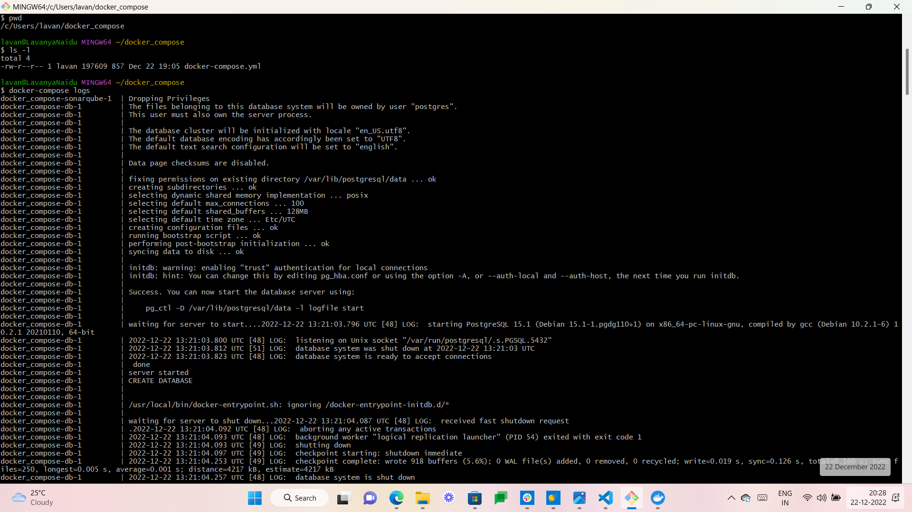

**Now open in your browser http://localhost:9000 and login to our default admin account.**
***
### **7. Use the default credentials admin:admin to login.**

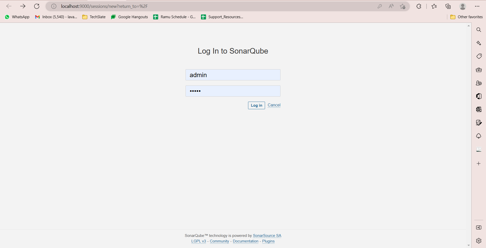


**Successfully built a SonarQube server.**

**Useful Links to guide you better:**

**SonarQube on Docker Hub: https://docs.SonarQube.org/latest/setup/install-server/**

**PostgreSQL on Docker Hub: https://hub.docker.com/r/bitnami/SonarQube/**

***

# **Connecting DBeaver PostgreSQL via JDBC Driver:**

You can easily connect your PostgreSQL data to your DBeaver Database Tool in order to optimize your PostgreSQL management in the Cloud. 
To establish the DBeaver PostgreSQL connection, you’ll need to download the PostgreSQL JDBC Driver. The integration process is pretty much straightforward and doesn’t require any programming experience. For the purposes of this demonstration, the Community Edition of DBeaver is used to retrieve data from PostgreSQL via the PostgreSQL JDBC Driver.

**Follow the below-mentioned steps to establish the DBeaver PostgreSQL connection.**
* [Step 1: Install DBeaver Community Edition](#install-dbeaver-community-edition)
* [Step 2: Download PostgreSQL JDBC Driver](#download-postgresql-jdbc-driver)
* [Step 3: Create a Connection to PostgreSQL Data](#create-a-connection-to-postgresql-data)
* [Step 4: Query Data](#query-data)

## **Install DBeaver Community Edition**


### 
* **You can download the relevant DBeaver Community Edition based on your Operating System from its official website (https://dbeaver.io/download/).**

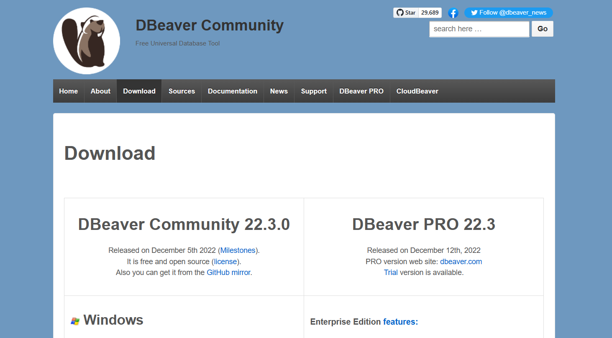

### 
* **Once downloaded, you can open and run the installer. A Setup Wizard will now be displayed on your screen, kind of things that you already know. Just click on _“Next”_.**


### 
* **Select a location for the installation and proceed ahead with the installation. Once the installation finishes, click on the “Finish” button to complete the installation process.**

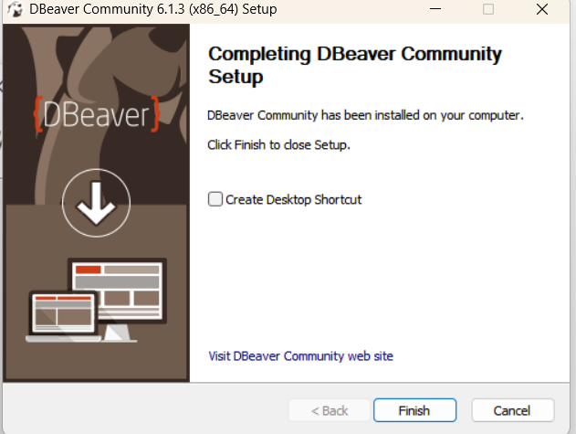


## **Download PostgreSQL JDBC Driver**
###
* **You can download the recent version of PostgreSQL JDBC Driver from PostgreSQL’s official website (https://jdbc.postgresql.org/download/).**

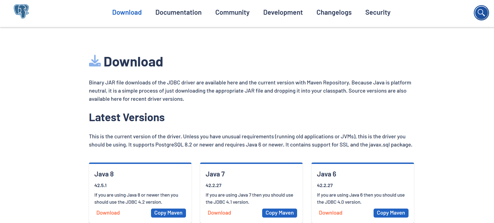
###
* **Just click on the version of the Driver that you want to download, and it will be downloaded automatically on your local system.**

---

## **Create a Connection to PostgreSQL Data**
###
* **This brings us to the main part of the DBeaver PostgreSQL connection. Launch your DBeaver application and click on the “Database” button located above the toolbar. Then, click on “New Database Connection”.**

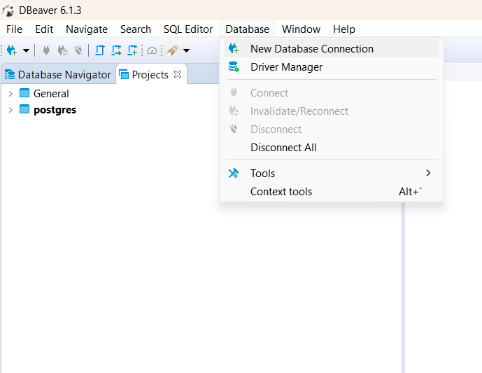

###
* **It will now prompt you to select the Database you want to connect to. Select PostgreSQL and click on “Next”.**

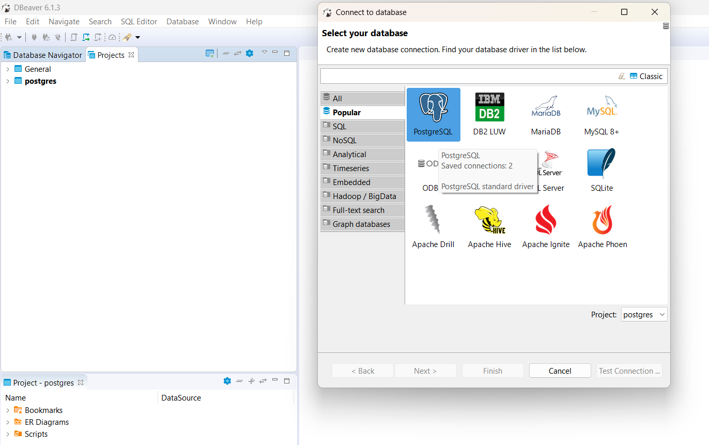

###
* **The “Connection Settings” tab will open up and it will by default pick up the details of your system/host (the default port is 5432). Specify the Database properties, and feed in the correct password of the Postgres Database User.**

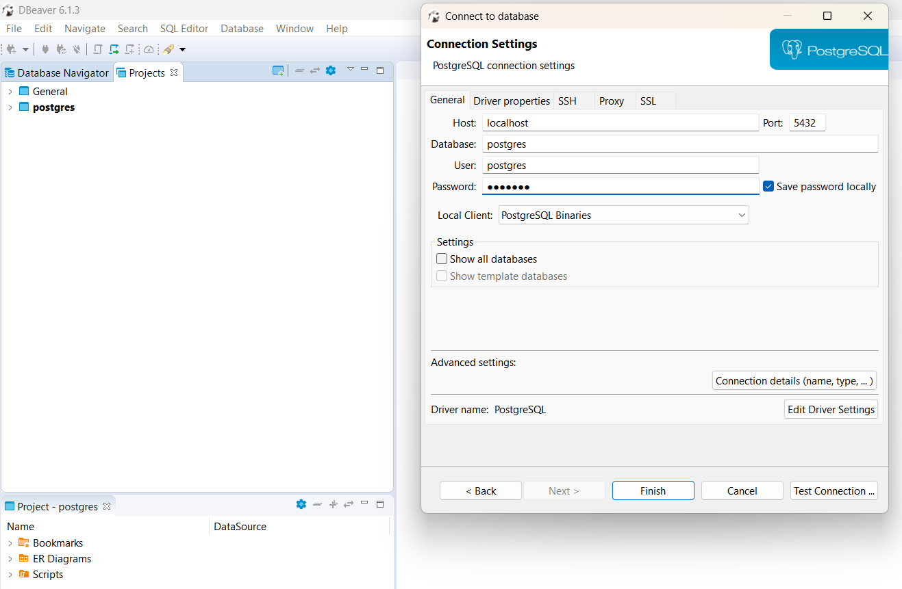
###
* **Now, click on “Edit Driver Settings”.**
###
* **Click on the “Add File” button to add the .jar file of the PostgreSQL JDBC Driver downloaded in the previous step. Locate the postgresql.jar file in the installation directory and click on “OK”.**

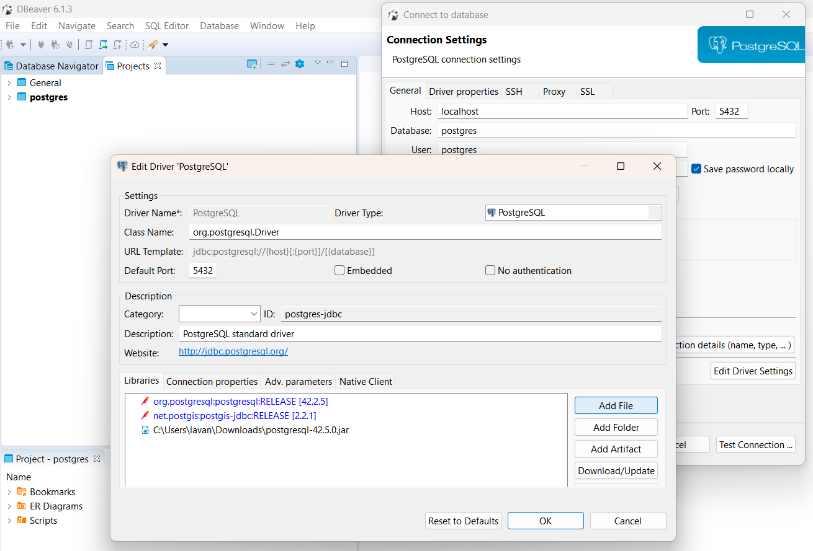

###
* **If you are prompted about the missing Drivers, click on “Download”. You can then verify the connection by clicking on “Test Connection”.**
###
* **If it displays the “Connected” message, click on “Finish”.**

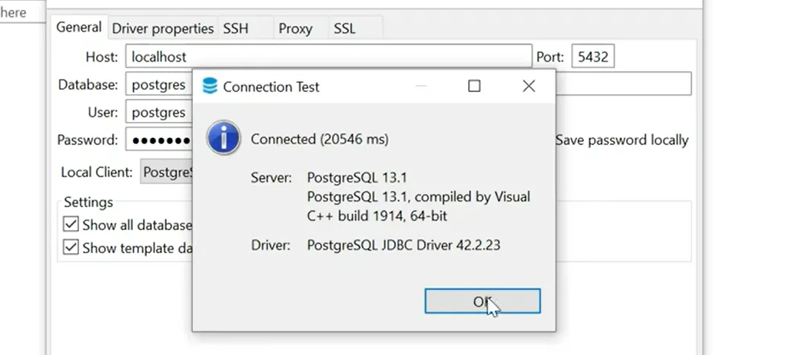

###
* **You can now see your Database added to the list.**

## Query Data
###
* **Now that you’ve successfully connected PostgreSQL DBeaver, you can view and manipulate the Postgres data in a table. Just right-click on the specific table and click on “View Data”. The content of the table will then be displayed in the main workspace.**

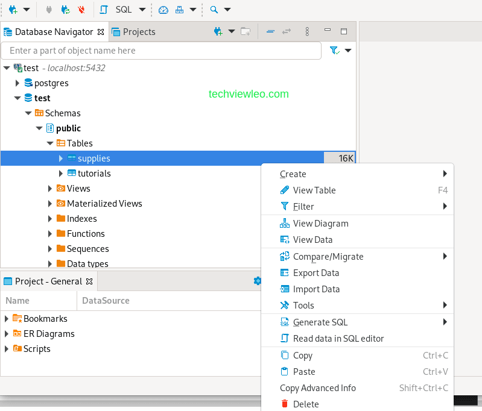

###
<<<<<<< HEAD
<<<<<<< HEAD
* **That’s it, this is how you can get started with a DBeaver PostgreSQL connection, as simple as that.**
=======
* **That’s it, this is how you can get started with a DBeaver PostgreSQL connection, as simple as that.**
>>>>>>> cdcbf7dda9c532205917c1e094385c22ae019580
=======
* **That’s it, this is how you can get started with a DBeaver PostgreSQL connection, as simple as that.**
>>>>>>> f43084a3686aa4f19940160f7d4934a2f749fede
