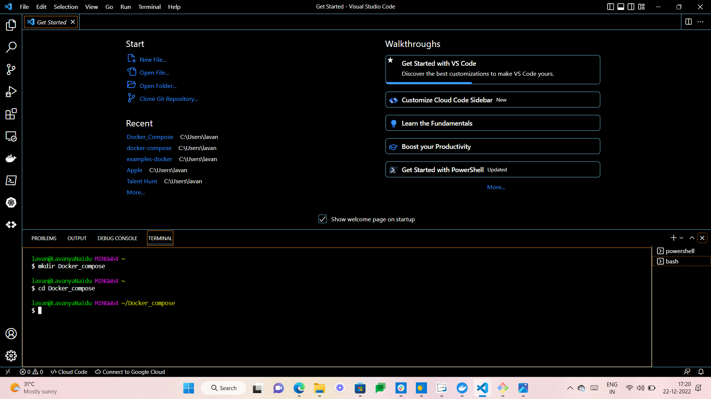
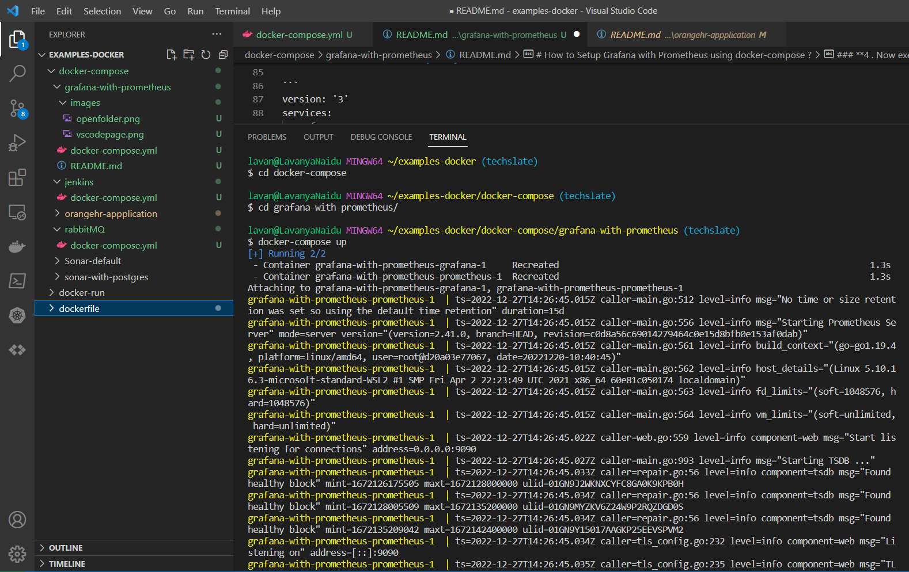
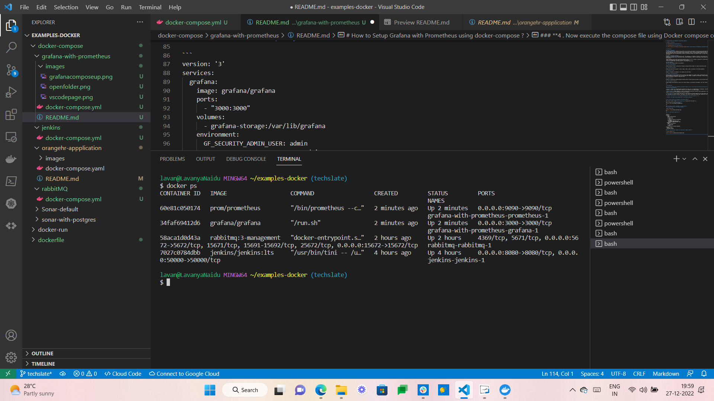
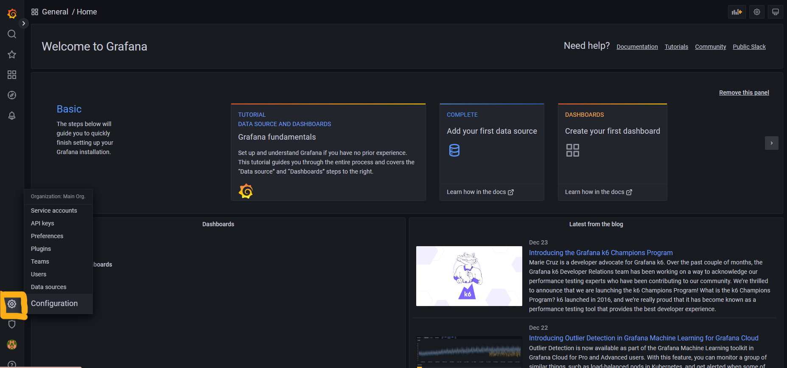
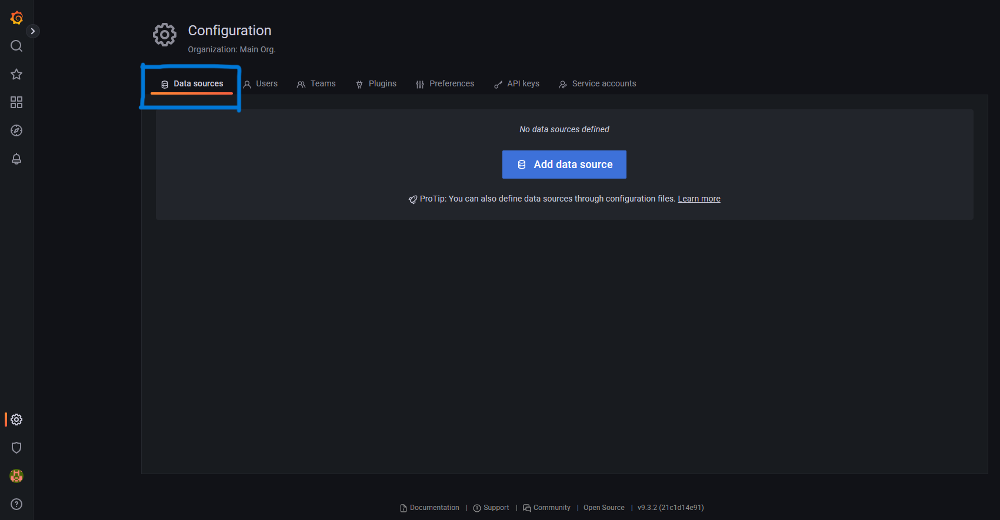
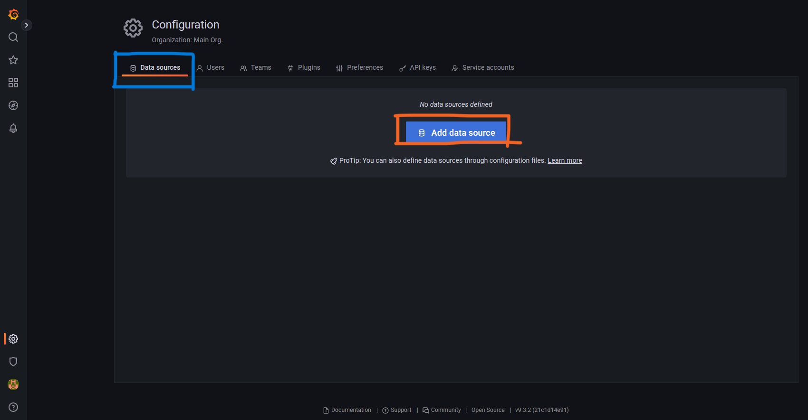
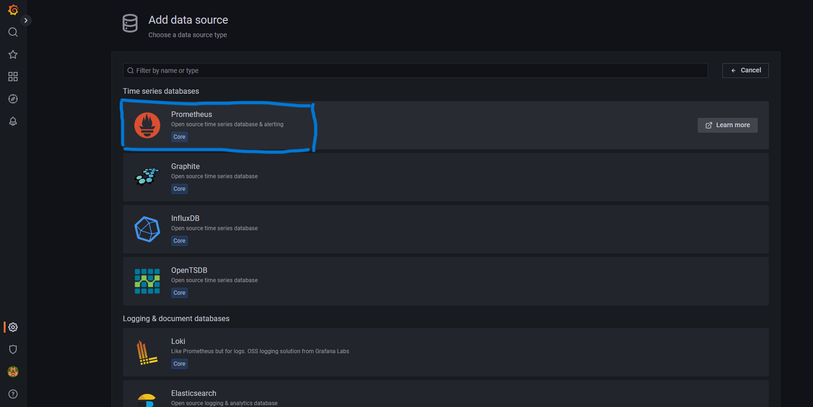
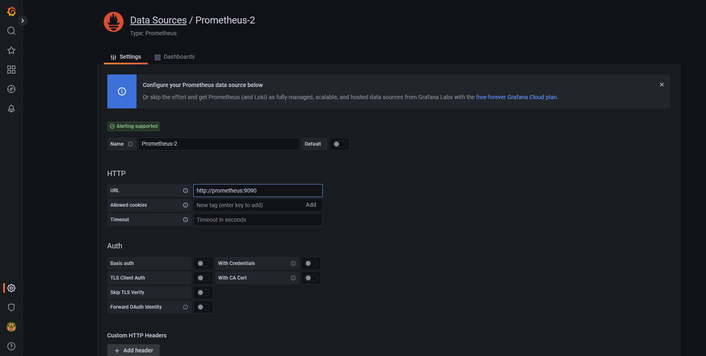
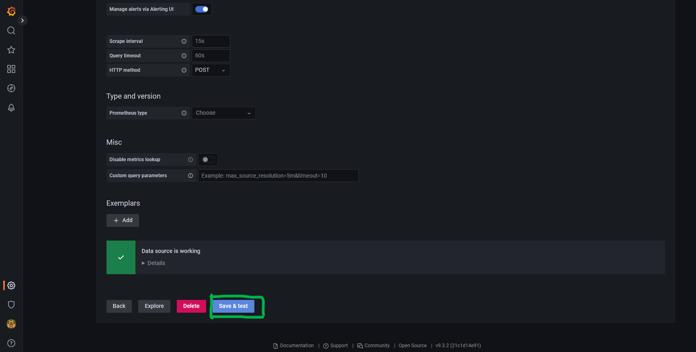
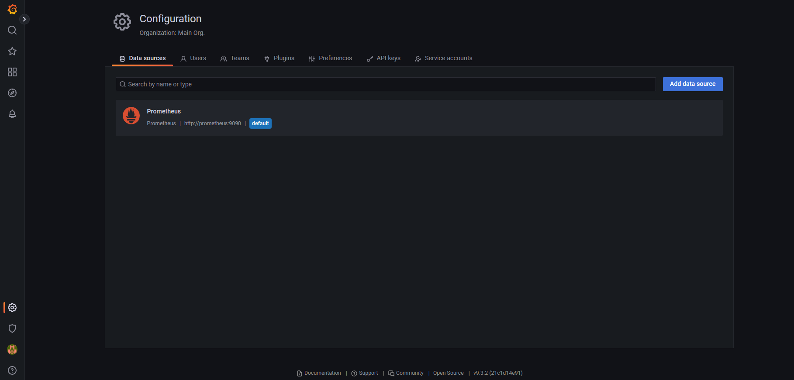

# **Setup Grafana with Prometheus using docker-compose**

# **Table of contents**

**1.[Introduction](#**<Introduction>**)**

**2.[Prerequisites](#**<Pre-requisites>**)**

**3.[Setup Grafana with Prometheus using docker-compose](#how-to-setup-Grafana-with-Peometheus-using-docker-compose)**


# Introduction

## **What is Grafana?**
A visualizing tool with a dashboard that provides a lot of options with graphs to see the data and understand them is called Grafana. It is an open-source tool to view the metrics, do the queries, and get alerts of logs being generated. Charts and graphs are generated from data sources and available through a web browser. Also, it provides plugins so that the tool can be made work in the cloud environment with the storage backup provided. The enterprise support and community support are huge that anyone would love to use Grafana.

## **What Is Prometheus Grafana?**
Prometheus is an open source data monitoring tool. The combination of Prometheus & Grafana is the de-facto tool combination in the industry for deploying a data visualization setup. Grafana dashboard is used for visualizing the data whereas the backend is powered by Prometheus.

Though Prometheus too has data visualization features & stuff. But still, Grafana is preferred for visualizing data. Queries are fired from the dashboard & the data is fetched from Prometheus.
It acts as a perfect open source data model for storing time series data.

## **Why Grafana?**
There are the following reasons to use Grafana –

**1. Easy virtualization**

Grafana provides the best virtualization technique by adding multiple graphs to a single visualization panel.

**2. Drag and drop panels**

Grafana uses drag and drop panels to insert images, videos, tables, and graphs on the Grafana dashboard.

**3. Flexible to use**               

Grafana is flexible to use because it can combine with influx Data.

**4. Support 30+ Data Sources**

Grafana supports more than 30 data sources to bring our data together for a better context. Grafana mainly uses various databases like Azure Monitor, Elasticsearch, Loki, Microsoft SQL Server (MSSQL), OpenTSDB, and PostgreSQL. Grafana provides a customized query editor and specifies a syntax for each data source.

**5. Open-source**

Grafana is an open-source platform because we don’t need any license and pay any charge to use the Grafana platform.

**6. Multi-platform support**

Grafana supports multi-platform so that we can install Grafana in any platform like Windows, Linux, Mac, Docker container, and ARM.

***

# Pre-requisites

### **To setup Grafana with Promethues using Docker-compose, you will need to have the following prerequisites installed and configured on your machine:**

* **Docker:** Docker is a containerization platform that allows you to run applications in lightweight, isolated environments called containers. You will need to have Docker installed on your machine to use docker-compose.

* **Docker Compose:** Docker Compose is a tool for defining and running multi-container Docker applications. You will use Docker Compose to set up and run the grafana and prometheus containers.

* **A text editor:** You will need a text editor to create and edit the docker-compose.yml file that defines the configuration for your grafana and prometheus containers . Some popular text editors include Visual Studio Code, Sublime Text, and Atom.

* **Create a new directory for your Grafana-with-prometheus project and navigate to it.**

* **Create a file named "docker-compose.yml" in the project directory**


# How to Setup Grafana with Prometheus using docker-compose ?

Now, We will create a simple **docker-compose.yml** file and store the code in it.

### **1. Open your Visual Studio Code.**


***

### **2. Create a folder , and name it by your choice.**

**To create a Folder run the following command**

`mkdir <folder-name>`


***

### **3. Create docker-compose.yml .**

```
version: '3'
services:
  grafana:
    image: grafana/grafana
    ports:
      - "3000:3000"
    volumes:
      - grafana-storage:/var/lib/grafana
    environment:
      GF_SECURITY_ADMIN_USER: admin
      GF_SECURITY_ADMIN_PASSWORD: admin
  prometheus:
    image: prom/prometheus
    ports:
      - "9090:9090"
    volumes:
      - prometheus-storage:/prometheus
volumes:
  grafana-storage:
  prometheus-storage:
```
***
### **4 . Now execute the compose file using Docker compose command:**

**`docker-compose up`**


***
### **5. List the running containers.** 

docker ps command to list the running containers, as we can see both grafana and prometheus containers are running.

**`docker ps`**


***

**You can then access the Grafana UI by navigating to http://localhost:3000 in your web browser. The default login credentials are *admin* for the username and *admin* for the password.**

***
### **6. Use the default credentials admin:admin to login.**


## **To add Prometheus as a data source for Grafana, follow these steps:**

*  ### Log in to Grafana and click the gear icon in the left sidebar to go to the Configuration page. ###



* ### Click the "Data Sources" menu item. ###



* ### Click the "Add data source" button. ###




* ### Select "Prometheus" as the type. ###



* ### In the "URL" field, enter the URL of the Prometheus server, which is http://prometheus:9090 if you are using the docker-compose.yml file above. ###



* ### Click the "Save & Test" button to save the data source and test the connection. ###




## You should now be able to use Prometheus as a data source for your Grafana dashboards. ##


