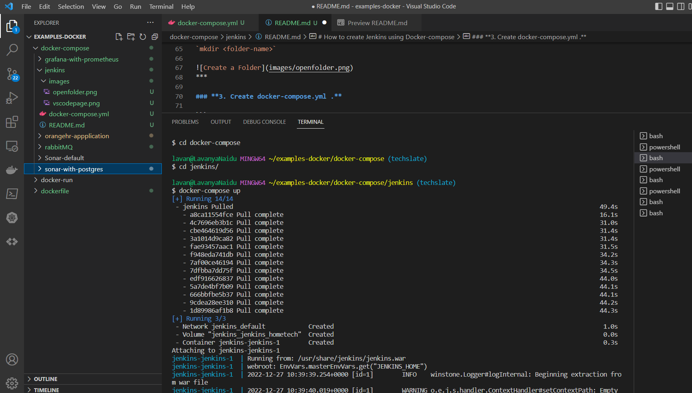
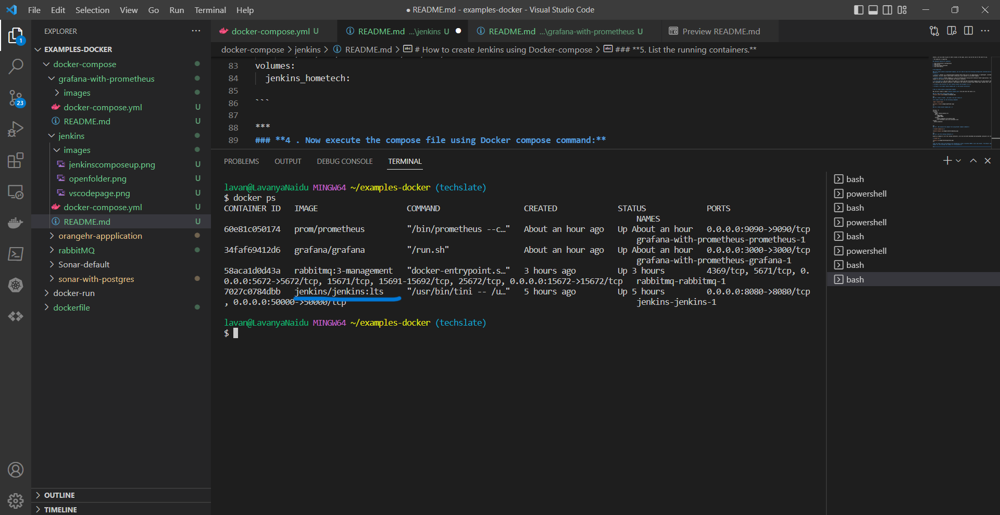
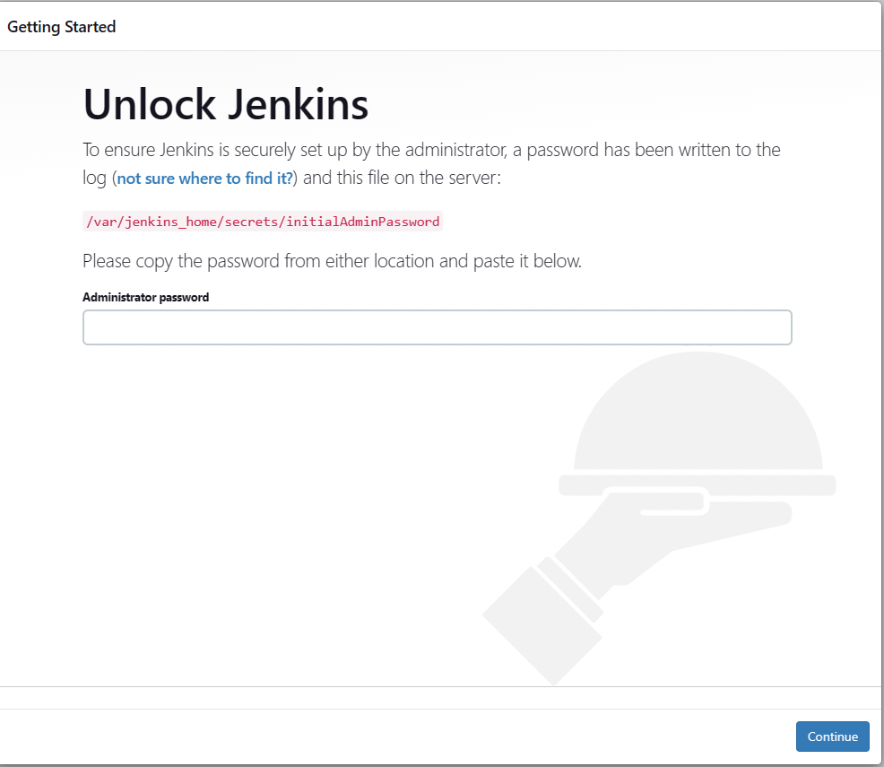
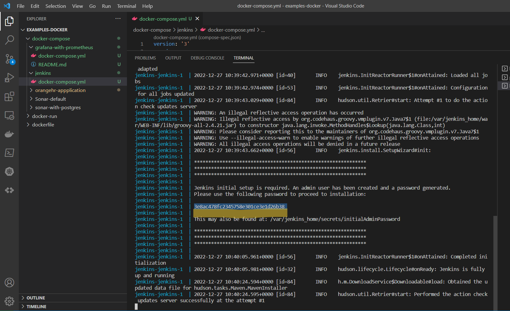
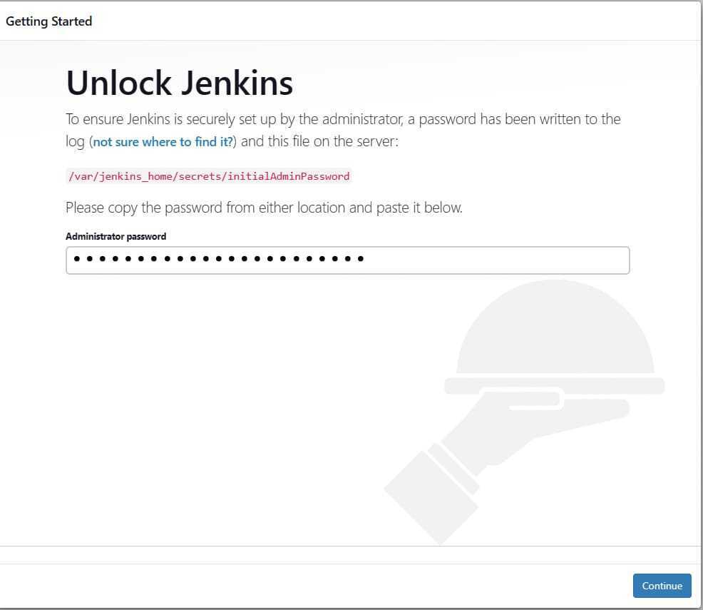
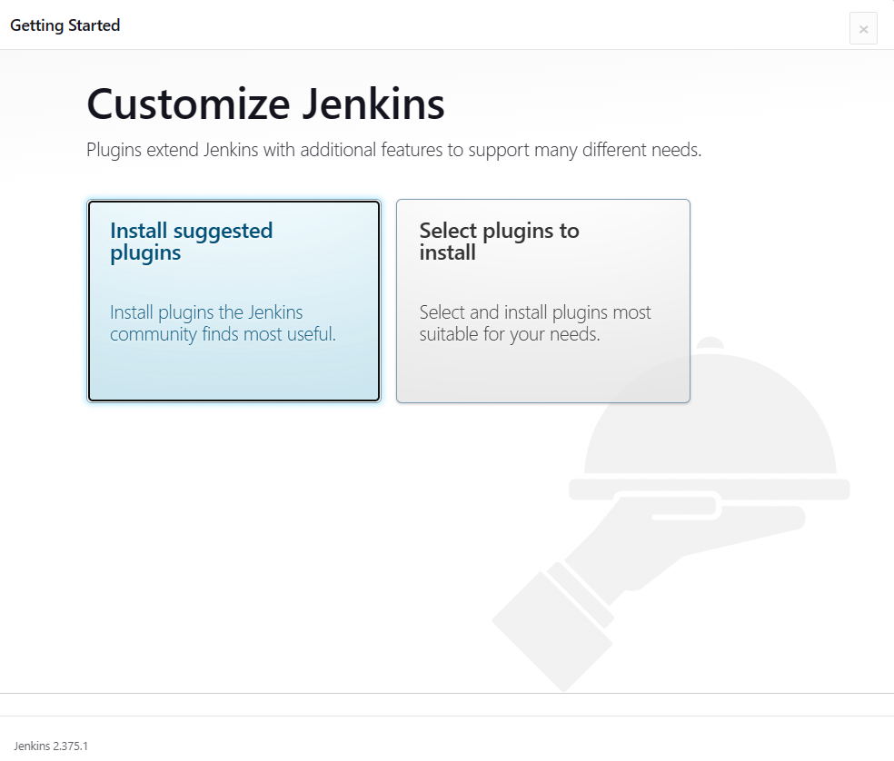
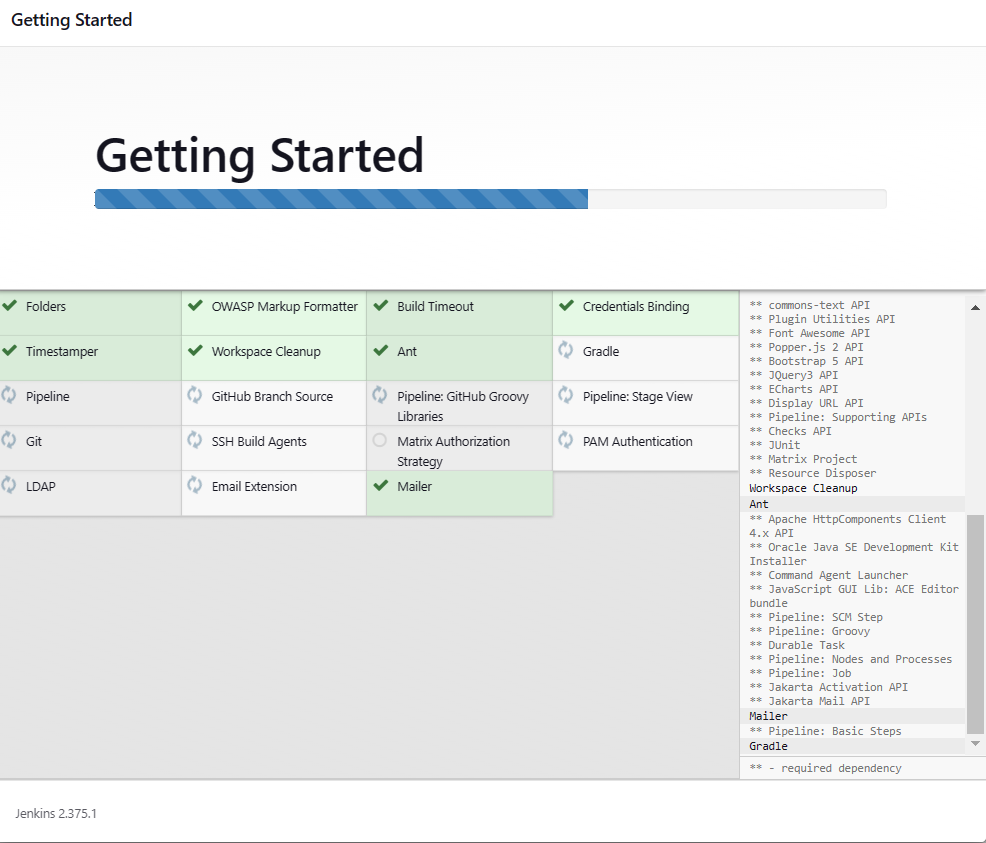
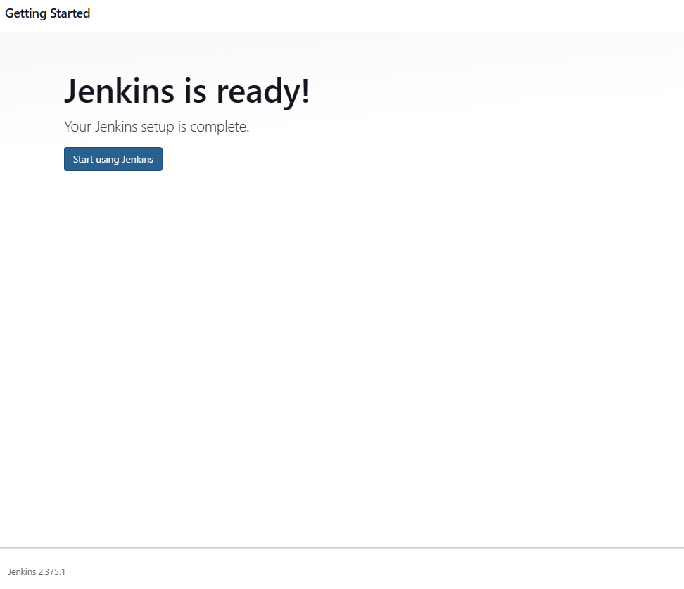
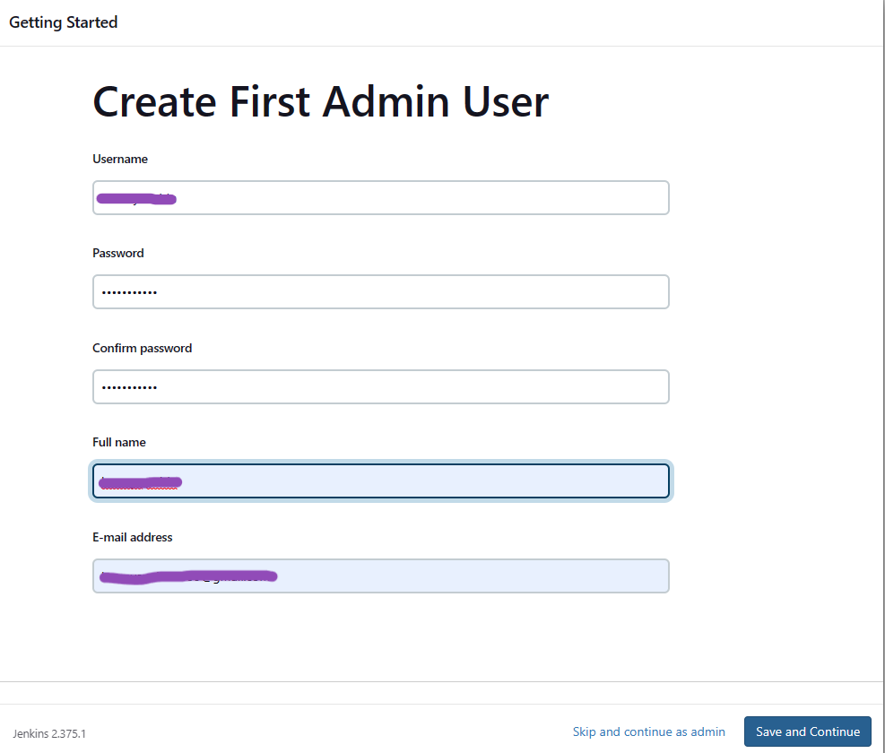
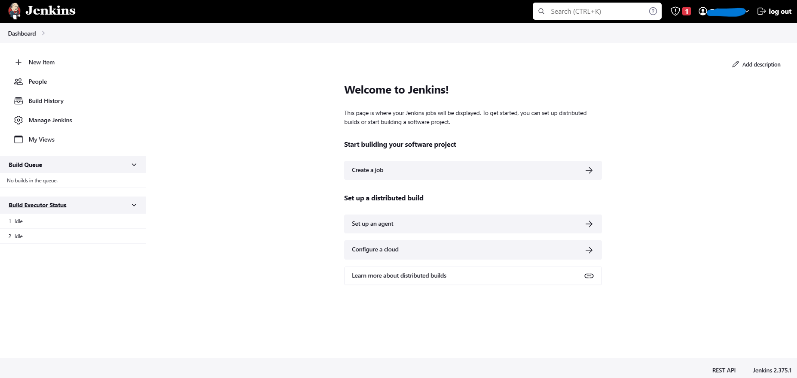

# **Creating Jenkins using Docker Compose file.**

## Table of Contents :

1.[Introduction](#**<Introduction>**)

2.[Prerequisites](#**<Pre-requisites>**)

2.[How to create Jenkins using Docker-compose](#**<how-to-Create-Jenkins-with-Docker-compose>**)


# Introduction #

## **What is Jenkins ?**

Jenkins is a continuous integration automation tool (open source) which is installed on the server where the build takes place. Continuous Integration refers to a process where developers commit their code into a commonly created repository as soon as they complete the development.

In the CI/CD process also results in increased overhead, and hence we have pipelines in Jenkins to maintain the users and permissions tagged to them. The same is applied to increasing projects.

Once the building increase, the corresponding need increases to create test agents along with their maintenance.

## **Why shall we use Jenkins?**

* Compatible to deploy the microservices with Kubernetes and Docker

* The next application era would be of microservices-based development only, as the need for scalability and availability arises for certain services only in maximum application scenarios. So the deployments and services can be pushed in an automated manner with Jenkins, just you need to give it shell scripts in the input, and it can do the rest of the task for you.

* The pipeline is supported.

## **Salient Features Of Jenkins**

1. Easy Installation & Configuration
2. Open-Source
3. Thriving Plugin Ecosystem
4. Easy Distribution


# Pre-requisites

### **To create jenkins using Docker-compose, you will need to have the following prerequisites installed and configured on your machine:**

* **Docker:** Docker is a containerization platform that allows you to run applications in lightweight, isolated environments called containers. You will need to have Docker installed on your machine to use docker-compose.

* **Docker Compose:** Docker Compose is a tool for defining and running multi-container Docker applications. You will use Docker Compose to set up and run the jenkins container.

* **A text editor:** You will need a text editor to create and edit the docker-compose.yml file that defines the configuration for your jenkins container. Some popular text editors include Visual Studio Code, Sublime Text, and Atom.

* **Create a new directory for your jenkins project and navigate to it.**

* **Create a file named "docker-compose.yml" in the project directory**


# How to create Jenkins using Docker-compose

Now, We will create a simple **docker-compose.yml** file and store the code in it.

### **1. Open your Visual Studio Code.**


***
### **2. Create a folder , and name it by your choice.**

**To create a Folder run the following command**

`mkdir <folder-name>`


***

### **3. Create docker-compose.yml .**

```
version: '3'
services:
  jenkins:
    image: jenkins/jenkins:lts
    ports:
      - "8080:8080"
      - "50000:50000"
    volumes:
      - jenkins_hometech:/var/jenkins_home
      - /var/run/docker.sock:/var/run/docker.sock
volumes:
  jenkins_hometech:

```

***
### **4 . Now execute the compose file using Docker compose command:**

**`docker-compose up`**



***
### **5. List the running containers.** 

docker ps command to list the running containers, as we can see jenkins container is running.

**`docker ps`**


***

**You can then access the Jenkins UI by navigating to http://localhost:8080 in your web browser.

***

### **6. Now you will see a page appearing on your screen asking for administrator password**



### **7. You need to go back to your logs , there you can see a administrator password , copy that and paste it in Administrator password.**



### **8. Click on Continue.**




### **9. Click on install suggested plugins.**




### **10.Plugins started downloading.**



### **11. Click on start using jenkins.**



## **12. Create Admin user Account. Next click on Save and Continue**



## **13. You should be now able to see Welcome page on your screen .**




