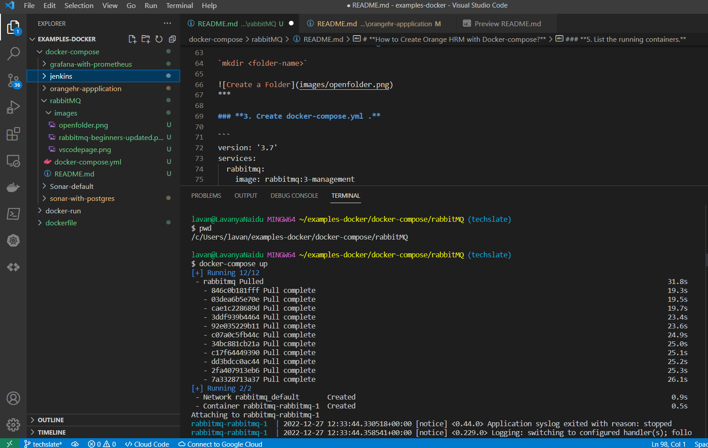
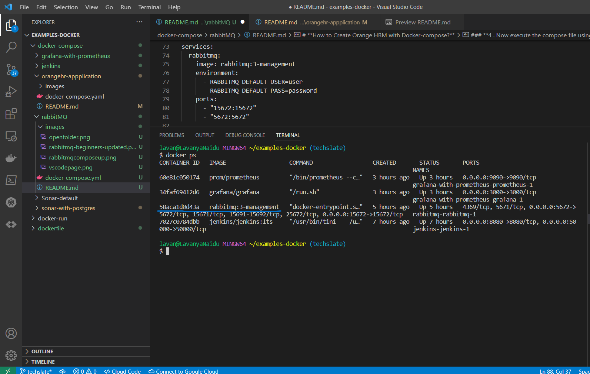
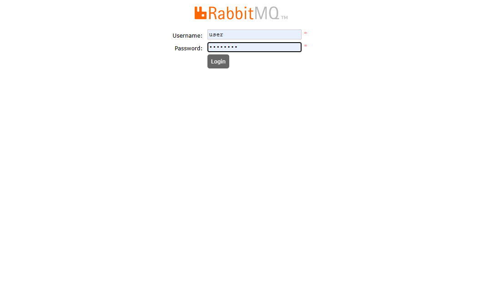
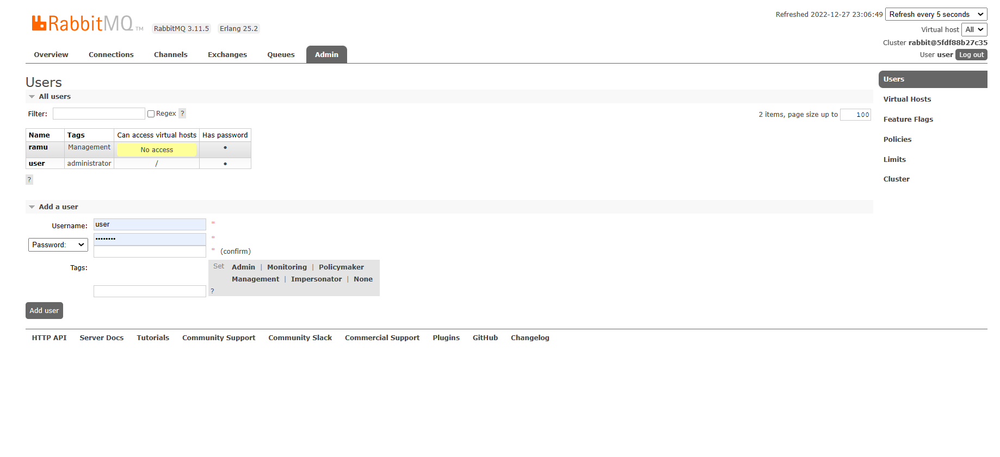
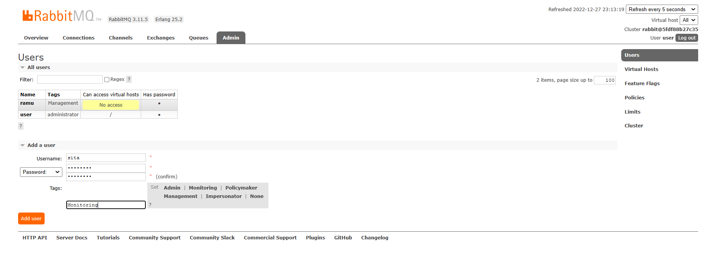
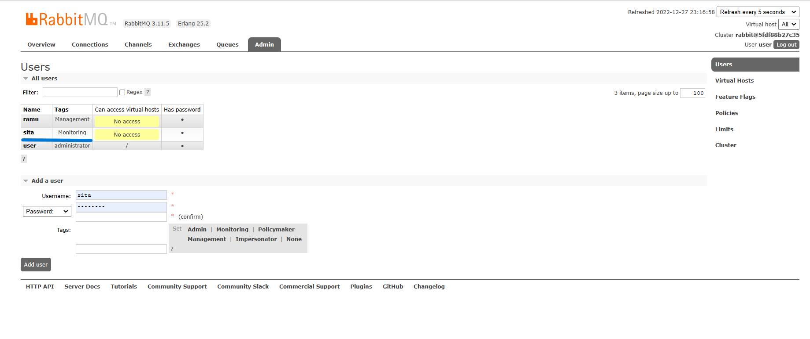

# **Creating RabbitMQ using Docker Compose file.**

## Table of Contents :

1.[Introduction](#**<Introduction>**)

2.[Prerequisites](#**<Pre-requisites>**)

2.[How to create RabbitMQ using Docker-compose](#**<how-to-Create-RabbitMQ-with-Docker-compose>**)


# Introduction

### **What is RabbitMQ ?**

RabbitMQ is one of the most widely used open-source message brokers. It was originally based on the Advanced Message Queuing Protocol (AMQP). Later on, it has been modified to support Message Queuing Telemetry Transport (MQTT), Streaming Text Oriented Messaging Protocol (STOMP), and several other common protocols. RabbitMQ has been designed to be used for a variety of messaging scenarios that have developed over the last 25 years.

It is well-known for Reliability and Interoperability. It has been implemented in many languages; therefore, it is one of the best choices for building reliable, large scale, clustered, resilient messaging infrastructure.


### **When and why should you use RabbitMQ?**

* Message queueing allows web servers to respond to requests quickly instead of being forced to perform resource-heavy procedures on the spot that may delay response time. Message queueing is also good when you want to distribute a message to multiple consumers or to balance loads between workers.

* The consumer takes a message off the queue and starts processing the PDF. At the same time, the producer is queueing up new messages. The consumer can be on a totally different server than the producer or they can be located on the same server. The request can be created in one programming language and handled in another programming language. The point is, the two applications will only communicate through the messages they are sending to each other, which means the sender and receiver have low coupling.


1. The user sends a PDF creation request to the web application.

2. The web application (the producer) sends a message to RabbitMQ that includes data from the request such as name and email.

3. An exchange accepts the messages from the producer and routes them to correct message queues for PDF creation.

4. The PDF processing worker (the consumer) receives the task message and starts processing the PDF.


## **Pre-requisites**
### **To create RabbitMQ using Docker-compose, you will need to have the following prerequisites installed and configured on your machine:**

* **Docker:** Docker is a containerization platform that allows you to run applications in lightweight, isolated environments called containers. You will need to have Docker installed on your machine to use docker-compose.

* **Docker Compose:** Docker Compose is a tool for defining and running multi-container Docker applications. You will use Docker Compose to set up and run the rabbitmq container.

* **A text editor:** You will need a text editor to create and edit the docker-compose.yml file that defines the configuration for your rabbitmq container. Some popular text editors include Visual Studio Code, Sublime Text, and Atom.

* **Create a new directory for your RabbitMQ project and navigate to it.**

* **Create a file named "docker-compose.yml" in the project directory**

***

# **How to Create Orange HRM with Docker-compose?**
Now, We will create a simple **docker-compose.yml** file and store the code in it.

### **1. Open your Visual Studio Code.**


***

### **2. Create a folder , and name it by your choice.**
**To create a Folder run the following command**

`mkdir <folder-name>`


***

### **3. Create docker-compose.yml .**

```
version: '3.7'
services:
  rabbitmq:
    image: rabbitmq:3-management
    environment:
      - RABBITMQ_DEFAULT_USER=user
      - RABBITMQ_DEFAULT_PASS=password
    ports:
      - "15672:15672"
      - "5672:5672"

```
### **4 . Now execute the compose file using Docker compose command:**

**`docker-compose up`**


***
### **5. List the running containers.** 

docker ps command to list the running containers, as we can see both OrangeHRM and Mysql  containers are running.

**`docker ps`**


***

**Now open in your browser http://localhost:15672 .**

**This file will create a RabbitMQ service that is accessible on port 5672 (the default RabbitMQ port) and the management UI on port 15672**
***

### **6.Now you will see a RabbitMQ Login Page appearing on your screen.The default username and password are set as "user" and "password", respectively.**



### **7.Successfully completed Login and you must see that Home page of RabbitMQ**

* **Lets add one user to it and see if its working fine, Click on Admin.**



### **8.Now add the NEW USER Username and Password along with Tags and click on Add user**



### **9.Now you can see that new user is been added**



