# **How to run a Sample Student Application**

# Table of contents
1.[Introduction](#introduction)

2.[Prerequisites](#pre-requisites)

3.[How to run a Sample Student Application ?]()

## **Introduction**

### **What is Docker Compose?** 

Docker compose is a tool developed to define and share multi-container applications. With docker compose, you can create a YAML file for defining services within a single command. This command can either build up or tear down your entire build. 

This is a Docker Compose file that defines three services: studentfrontend, studentbackend, and db.

The studentfrontend service is using the student-frontend:2.0 image and maps port 80 of the container to port 9200 on the host.

The studentbackend service is using the student-backend:2.0 image and maps port 9300 of the container to port 9300 on the host. This service also depends on the db service, meaning it will not start until the db service is up and running.

The db service is using the mongo image and maps port 27017 of the container to port 27017 on the host.

These services together provide a complete setup for a student application with a frontend, a backend, and a database. The studentfrontend communicates with the studentbackend, which communicates with the mongo database to store and retrieve student data.


### **What is Dockerfile?**

A Dockerfile is a script that uses the Docker platform to generate containers automatically. It is essentially a text document that contains all the instructions that a user may use to create an image from the command line.

The Docker platform is a Linux-based platform that allows developers to create and execute containers, self-contained programs, and systems that are independent of the underlying infrastructure. Docker, which is based on the Linux kernel’s resource isolation capabilities, allows developers and system administrators to transfer programs across multiple systems and machines by executing them within containers.


***

## **Pre-requisites**

**To run a Sample Student Application using docker-compose, you will need to have the following prerequisites installed and configured on your machine:**

**Docker:** Docker is a containerization platform that allows you to run applications in lightweight, isolated environments called containers. You will need to have Docker installed on your machine to use docker-compose.

**Docker Compose:** Docker Compose is a tool for defining and running multi-container Docker applications. You will use Docker Compose to set up and run the SonarQube and Postgres containers.

**A text editor:** You will need a text editor to create and edit the docker-compose.yml file that defines the configuration for your SonarQube and Postgres containers. Some popular text editors include Visual Studio Code, Sublime Text, and Atom.

**Studio 3T:** Studio 3T is a MongoDB GUI with visual querying features. It facilitates exporting and importing of collections, views, or queries and provides SQL developers with multiple language translations. Its data masking functionality offers the ability to copy and share data in a more compliant way.

***

# **How to run a Sample Student Application ?**

- ## First create a folder with appropriate title .

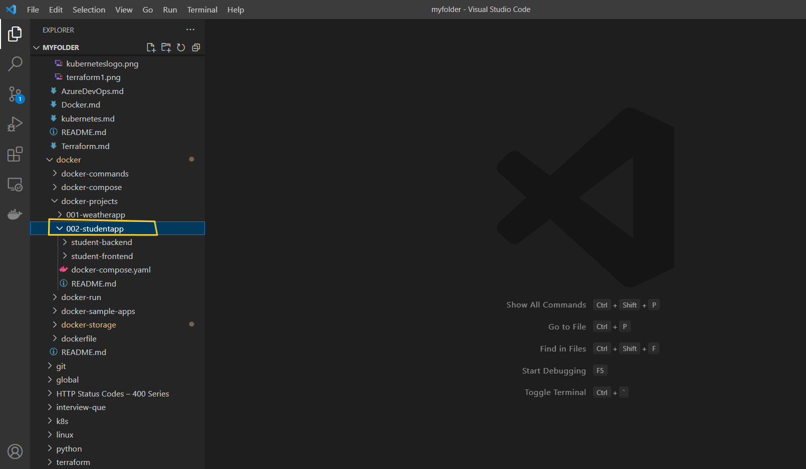

- ## Under `002-studentapp` we shall create two folders i.e. `Student-backend` and `Student-frontend` .

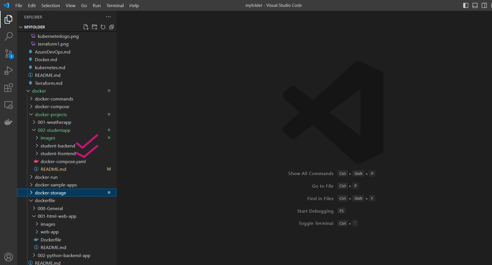

- ## Under `Student-backend` create `app.py` file and `Dockerfile` as shown below.

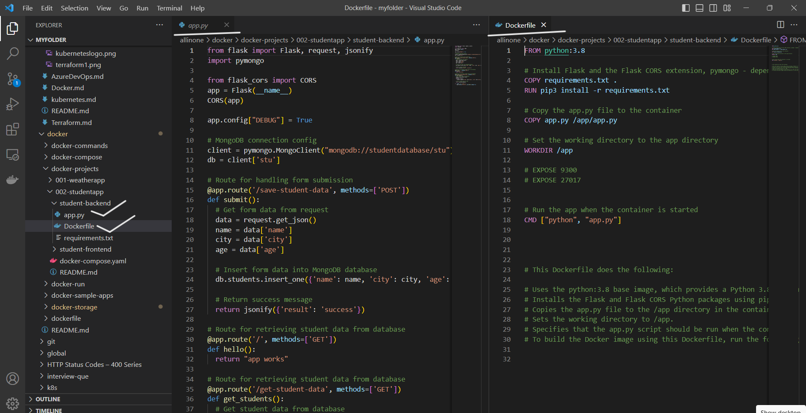

- ## Under `Student-frontend` create `index.html` file and `Dockerfile` as shown below.


- ## Under main folder i.e. `Studentapp` create `docker-compose.yaml` file which combines both frontend and backend. 

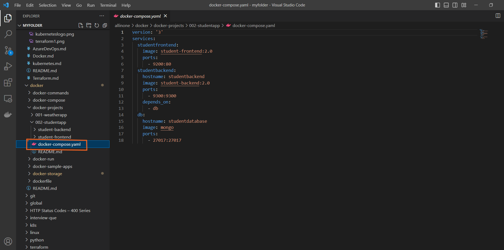

```
version: '3'
services:
  studentfrontend:
    image: student-frontend:2.0
    ports:
      - 9200:80
  studentbackend:
    hostname: studentbackend
    image: student-backend:2.0
    ports:
      - 9300:9300
    depends_on:
      - db
  db:
    hostname: studentdatabase
    image: mongo
    ports:
      - 27017:27017

```


- ## Now , we need to build individual images for both frontend and backend , so lets open termianl for student-frontend (open in integrated terminal)

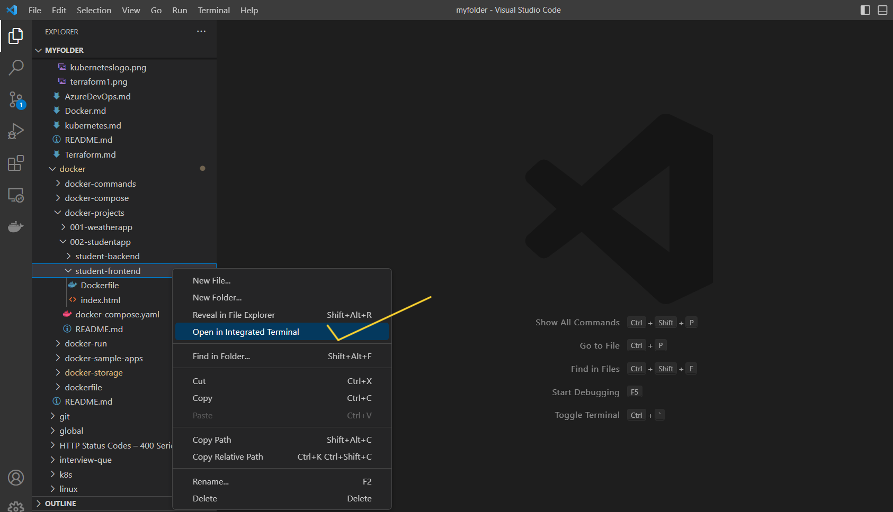

- ## will run following command to build image for frontend

  ```
  docker build . -t student-frontend:2.0
  ```

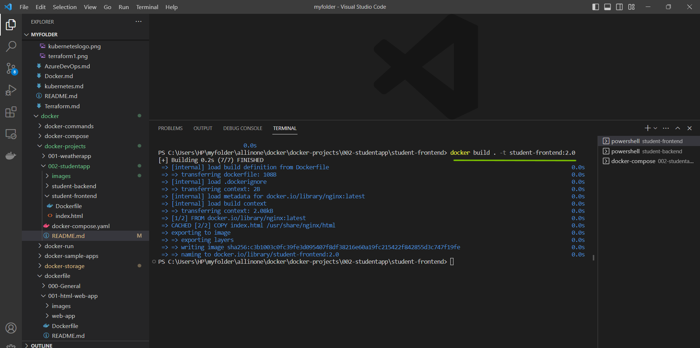

- ## Now lets build image for backend, lets open termianl for student-Backend (open in integrated terminal)

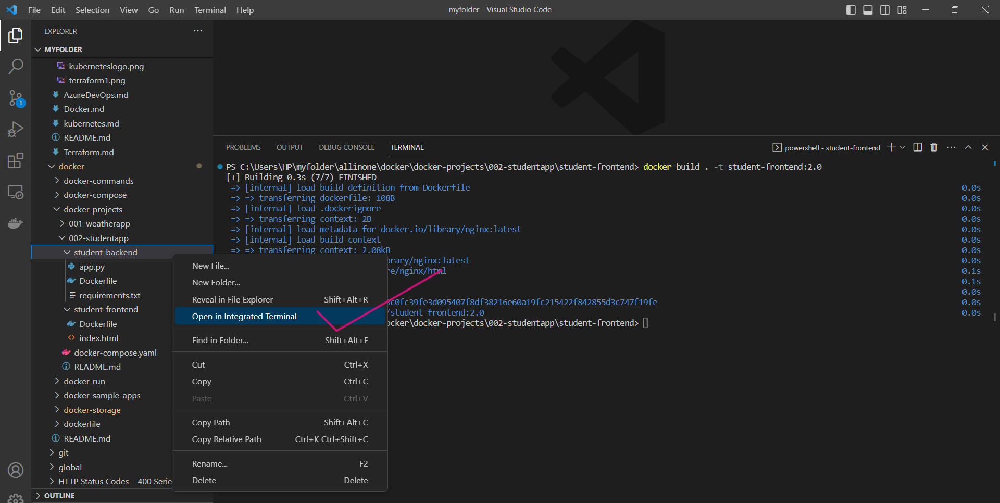

- ## will run following command to build image for frontend

  ```
  docker build . -t student-backend:2.0
  ```

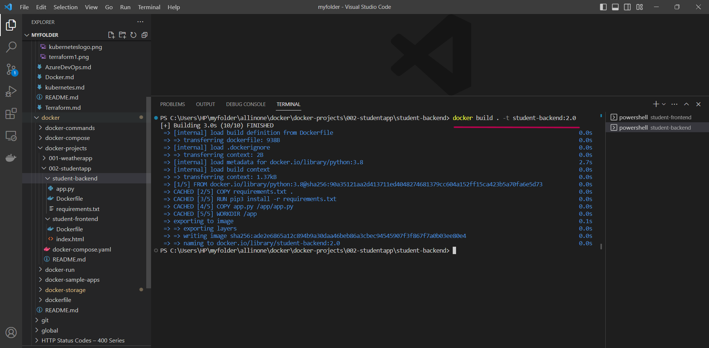


- ## Once we finish building images for both of them , lets do ```docker-compose up``` for that we need to open integrated terminal for ```002-studentapp```folder

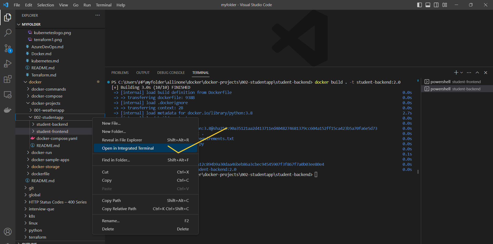

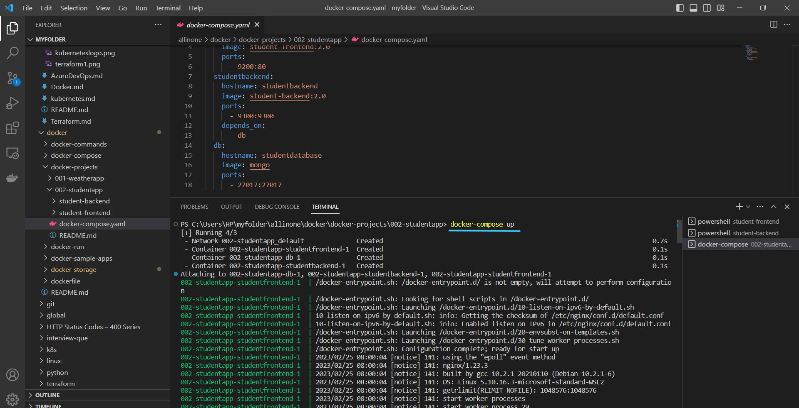

- ## **Now open your browser and type  http://localhost:9200**

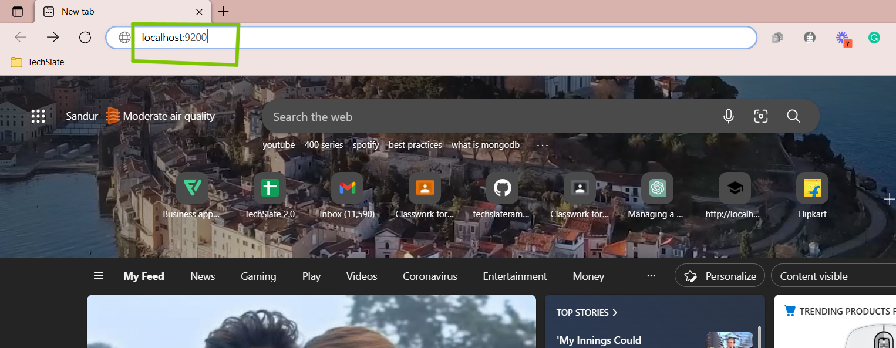


- ## You can see Student application on your screen.

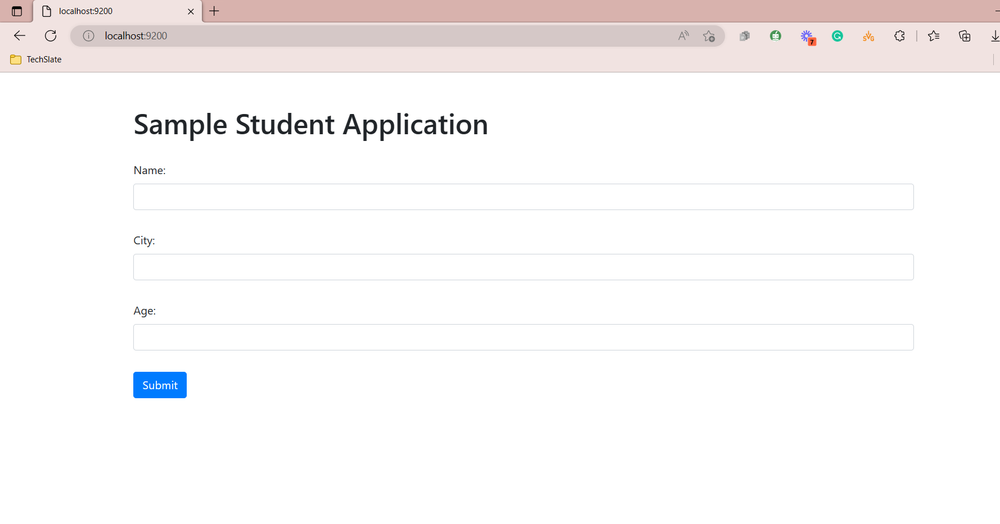

- ## Now lets enter some data and see if its reflecting in backend ,for that you need to right click on screen and select inspect

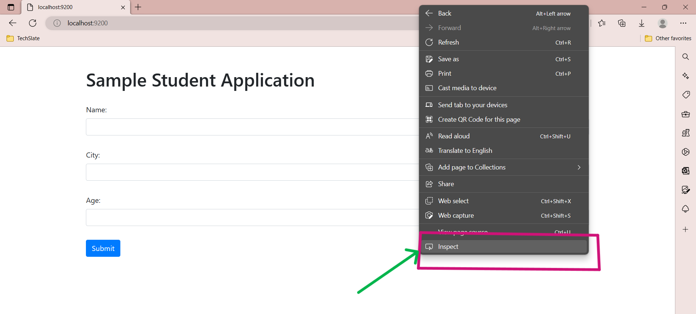

- ## Now lets enter some data. And simultaneously we can see in backend the data is storing.

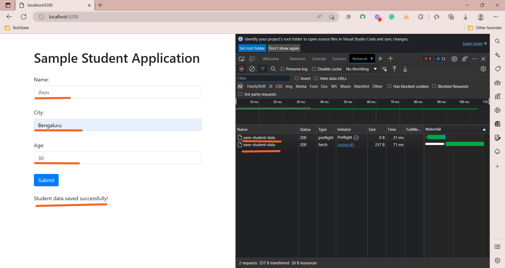

***
- ## As it's ```mongoD```B lets connect to ```Studio 3T``` and connect to database to see whether the data is stored.

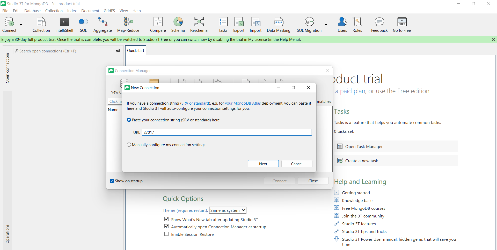

***

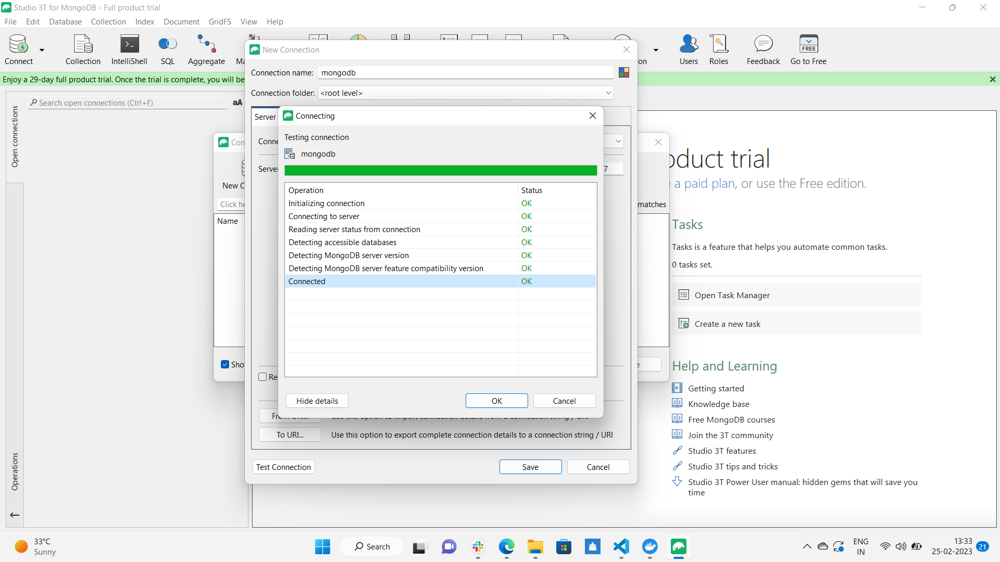

***

- ## We can see that ```Stu``` database is created under ```collections``` we can see the ```student``` data which we entered in frontend.

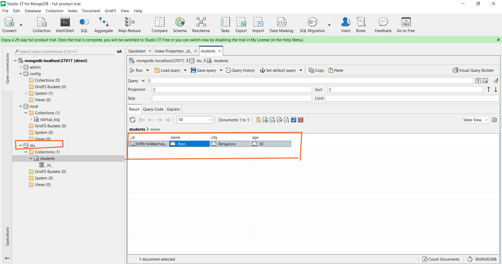

***


