# **How to run mysql image with storage**

# Table of contents
1.[Introduction](#introduction)

2.[Prerequisites](#pre-requisites)

3.[How to run mysql image with storage?](#how-to-run-mysql-image-with-storage-1)

## **Introduction**

### **What is Docker Storage?**

Docker storage enables storage administrators to configure and support application data storage within Docker container deployments.

Docker is one of the most transformative and disruptive technologies to appear in recent years. It impacts multiple facets of IT, including storage. The technology represents a different approach than either traditional bare metal or virtual machine (VM) application delivery, providing organizations with the opportunity to benefit from a more agile and cloud-native approach.


### **What is Docker Compose?** 

Docker compose is a tool developed to define and share multi-container applications. With docker compose, you can create a YAML file for defining services within a single command. This command can either build up or tear down your entire build. 
***

## **Pre-requisites**

**To run mysql image with storage using docker-compose, you will need to have the following prerequisites installed and configured on your machine:**

**Docker:** Docker is a containerization platform that allows you to run applications in lightweight, isolated environments called containers. You will need to have Docker installed on your machine to use docker-compose.

**Docker Compose:** Docker Compose is a tool for defining and running multi-container Docker applications. You will use Docker Compose to set up and run the SonarQube and Postgres containers.

**A text editor:** You will need a text editor to create and edit the docker-compose.yml file that defines the configuration for your SonarQube and Postgres containers. Some popular text editors include Visual Studio Code, Sublime Text, and Atom.

**DBeaver:** DBeaver is a free, open source, graphical database management tool for database developers and administrators.
***

# **How to run mysql image with storage?**

- ## First create a folder with appropriate title .

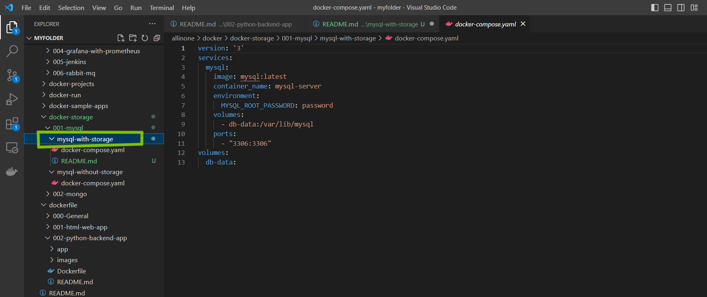

- ## Now, We will create a simple **docker-compose.yml** file and store the code in it.

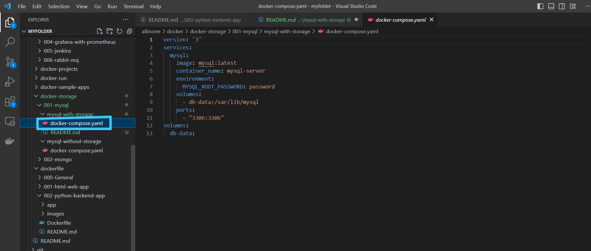

```
version: '3'
services:
  mysql:
    image: mysql:latest
    container_name: mysql-server
    environment:
      MYSQL_ROOT_PASSWORD: password
    volumes:
      - db-data:/var/lib/mysql
    ports:
      - "3306:3306"
volumes:
  db-data:

```

- ## Once our docker-compose file is ready , will open a New Terminal and get into that respective folder

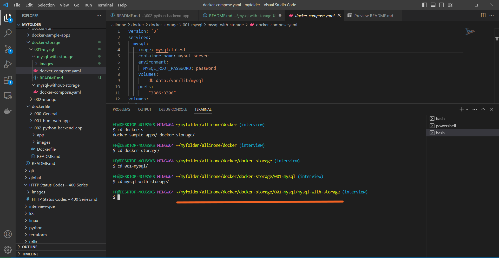

- ## Now lets do ```docker-compose up -d```

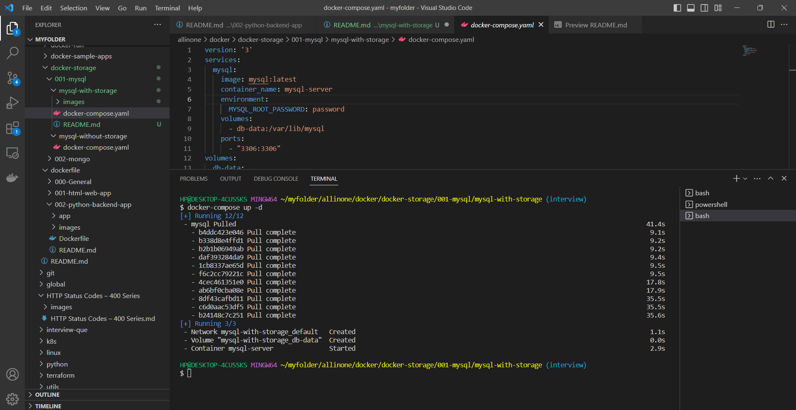


- ## If you see the docker desktop , we can see that Mysql Container is running


- ## Also, we can see that Volume ```mysql-with-stoarge_db-data``` is in use

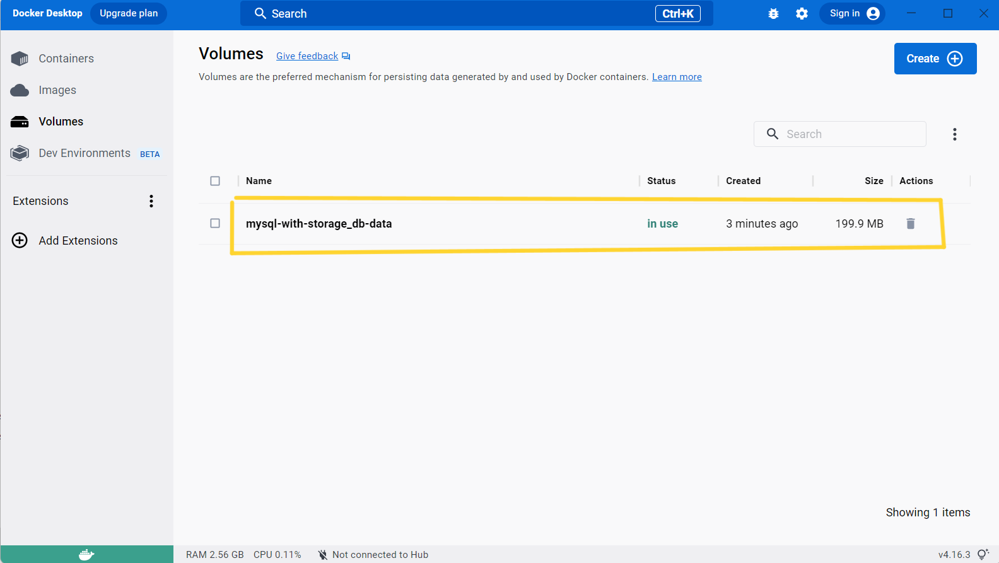

***

- ## Now lets connect to Database , for that we need to open DBeaver.

### **click on the top left connection symbol and then select Mysql**


- ## Type the password which is been mentioned ```docker-compose.yaml``` i.e. ```password``` in this case.

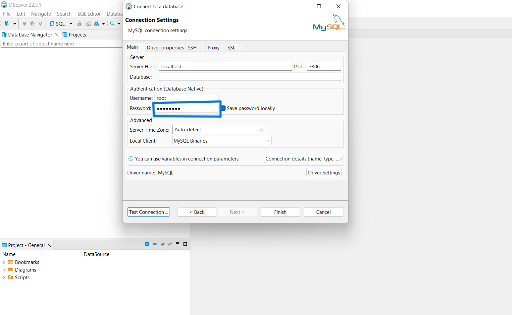


- ## Then , Click on Driver properties and turn ```allowPublicKeyRetrieval``` as ```True``` and Click on ```Test Connection``` .

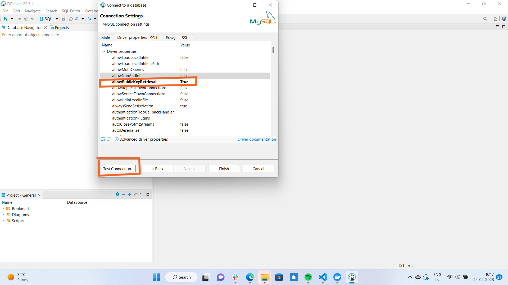

- ## We can see that the Database is Connected.


- ## We can see the Database in the left side , if we want to create more databases we can create it here.

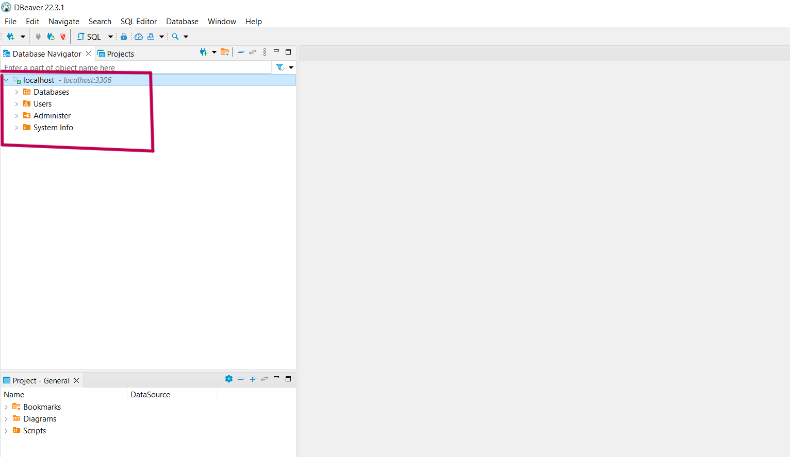

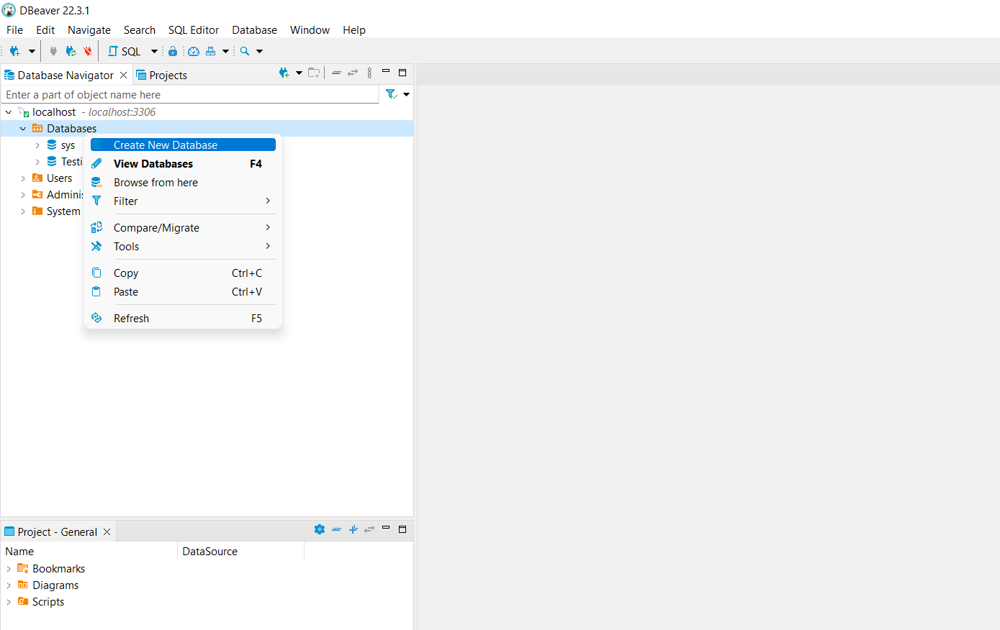

- ## We have create a new database called ```Testing 1``` .

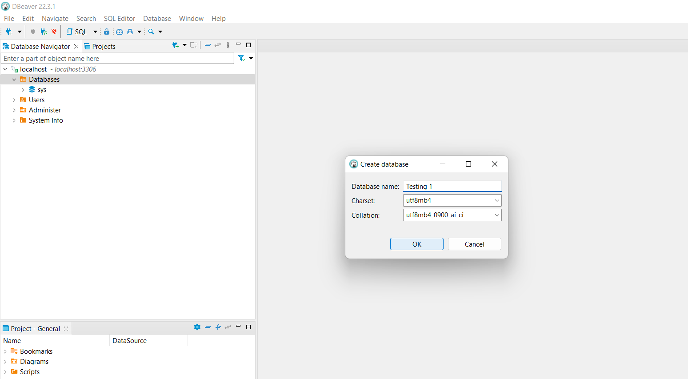

- ## You can add all the data here .

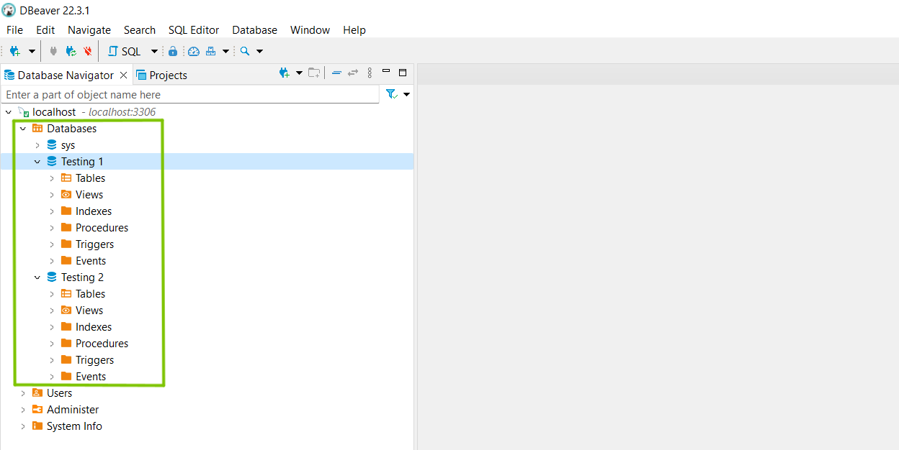


[def]: ../../../global/images/ts.png