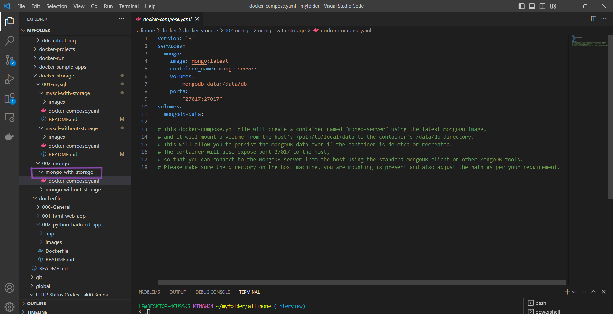
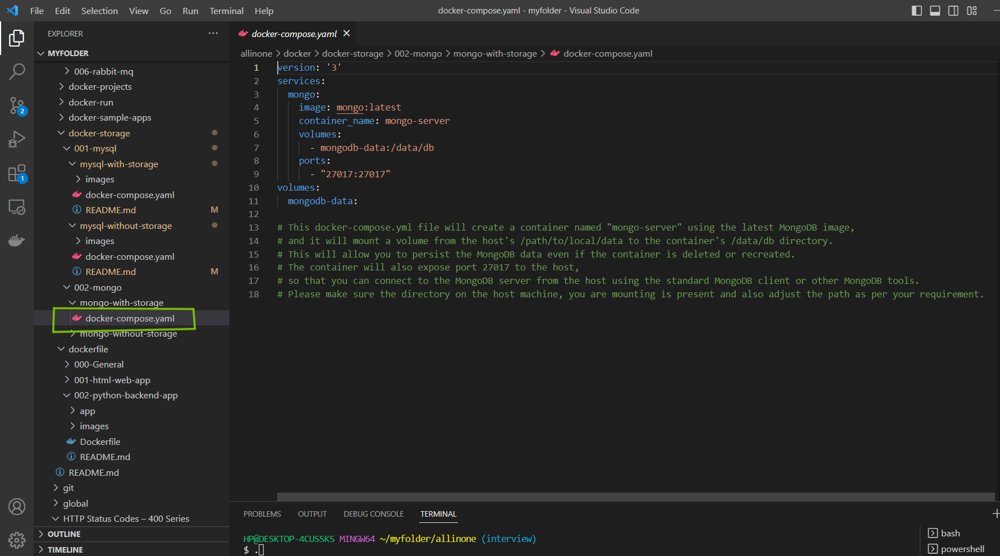
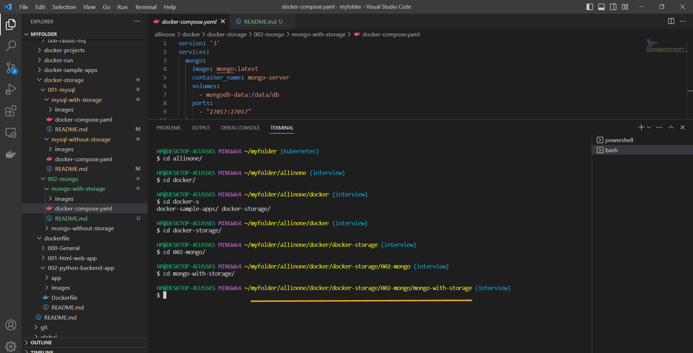
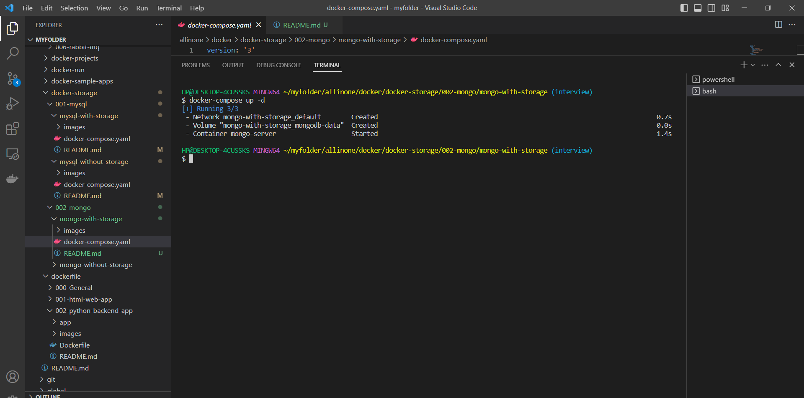
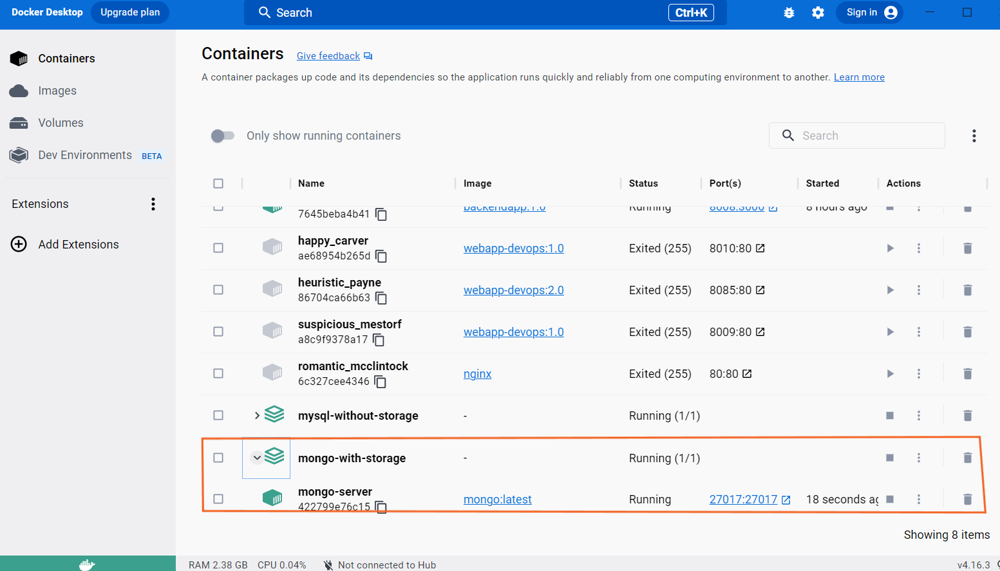
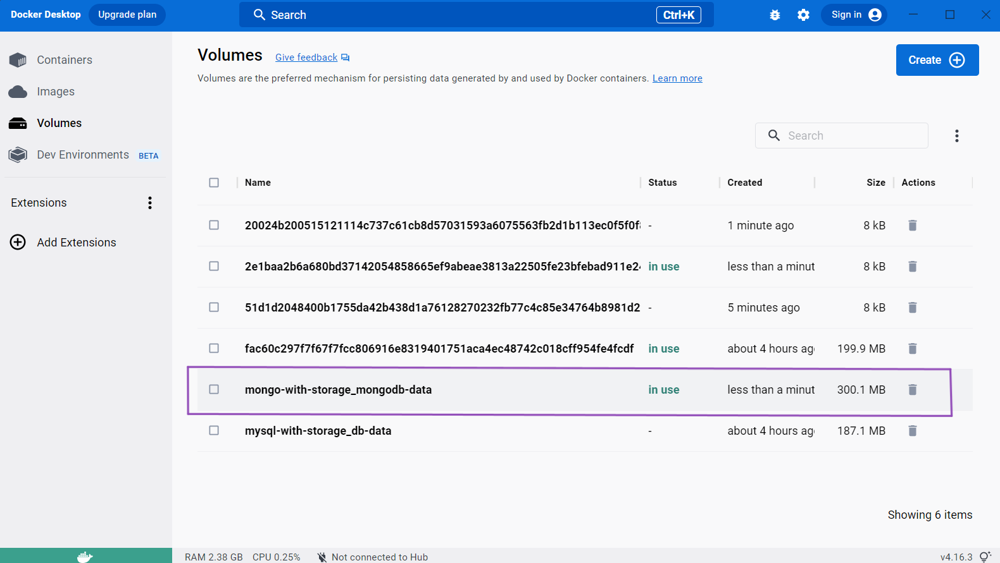
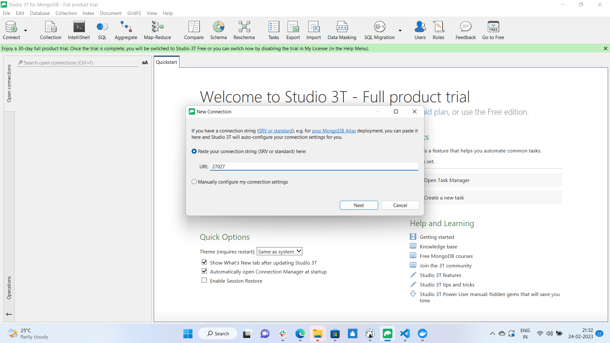
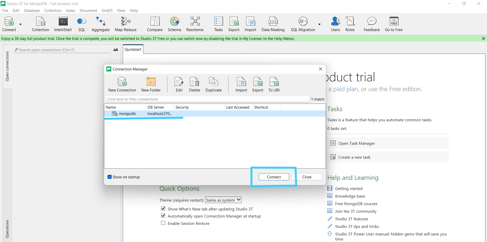
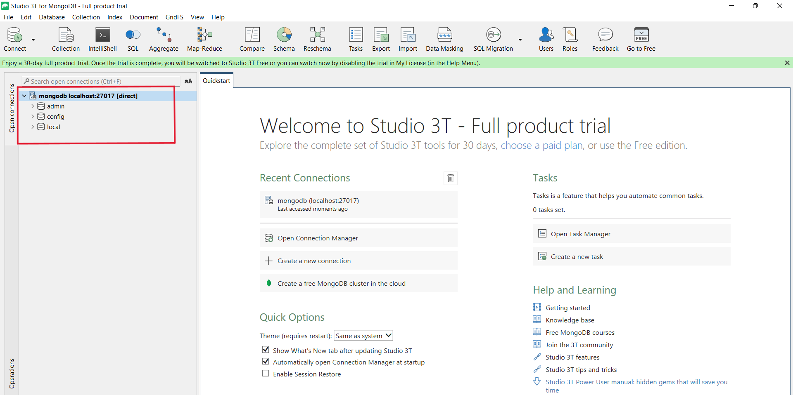
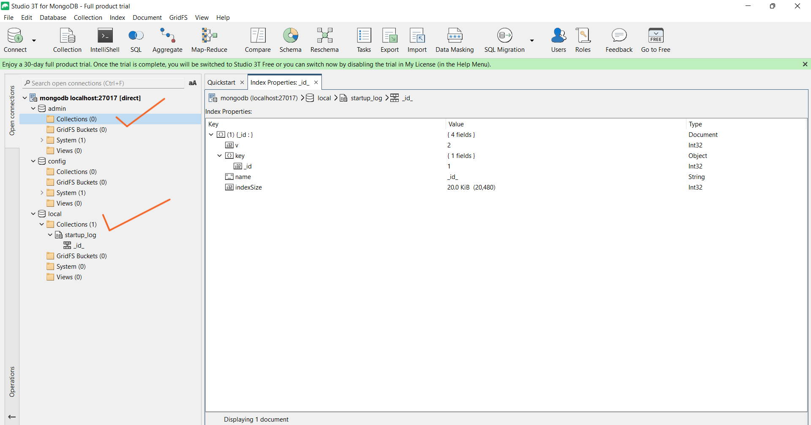

# **How to run mongo image with storage**

# Table of contents
1.[Introduction](#introduction)

2.[Prerequisites](#pre-requisites)

3.[How to run mongo image with storage?](#how-to-run-mongo-image-with-storage-1)

## **Introduction**

### **What is Docker Storage?**

Docker storage enables storage administrators to configure and support application data storage within Docker container deployments.

Docker is one of the most transformative and disruptive technologies to appear in recent years. It impacts multiple facets of IT, including storage. The technology represents a different approach than either traditional bare metal or virtual machine (VM) application delivery, providing organizations with the opportunity to benefit from a more agile and cloud-native approach.


### **What is Docker Compose?** 

Docker compose is a tool developed to define and share multi-container applications. With docker compose, you can create a YAML file for defining services within a single command. This command can either build up or tear down your entire build. 
***

### **What is MongoDB** 

MongoDB is an open-source document-oriented database that is designed to store a large scale of data and also allows you to work with that data very efficiently. It is categorized under the NoSQL (Not only SQL) database because the storage and retrieval of data in the MongoDB are not in the form of tables. 


## **Pre-requisites**

**To run mysql image with storage using docker-compose, you will need to have the following prerequisites installed and configured on your machine:**

**Docker:** Docker is a containerization platform that allows you to run applications in lightweight, isolated environments called containers. You will need to have Docker installed on your machine to use docker-compose.

**Docker Compose:** Docker Compose is a tool for defining and running multi-container Docker applications. You will use Docker Compose to set up and run the SonarQube and Postgres containers.

**A text editor:** You will need a text editor to create and edit the docker-compose.yml file that defines the configuration for your SonarQube and Postgres containers. Some popular text editors include Visual Studio Code, Sublime Text, and Atom.

**Studio 3T:** Studio 3T is a MongoDB GUI with visual querying features. It facilitates exporting and importing of collections, views, or queries and provides SQL developers with multiple language translations. Its data masking functionality offers the ability to copy and share data in a more compliant way.

***

# **How to run mongo image with storage?**

- ## First create a folder with appropriate title .



- ## Now, We will create a simple **docker-compose.yml** file and store the code in it.



```
version: '3'
services:
  mongo:
    image: mongo:latest
    container_name: mongo-server
    volumes:
      - mongodb-data:/data/db
    ports:
      - "27017:27017"
volumes:
  mongodb-data:

```

- ## Once our docker-compose file is ready , will open a New Terminal and get into that respective folder



- ## Now lets do ```docker-compose up -d```



- ## If you see the docker desktop , we can see that Mongo Container is running



- ## Also, we can see that Volume ```mongo-with-storage-mongodb-data``` is in use



***

- ## Now lets connect to Database , for that we need to open Studio 3T.

### **click on the top left ```connect```**


- ## Enter the port number in URL i.e. ```27017``` , Click on Next.




- ## Enter Connection name as ```mongodb``` and  Click on the ```Test connection```


- ## We can see that it got connected , Click on ```OK``` and then Click on ```Save```


- ## Click on ```Connect```



- ## Successfully connected to mongoDB



- ## Here we can create n number of collections


