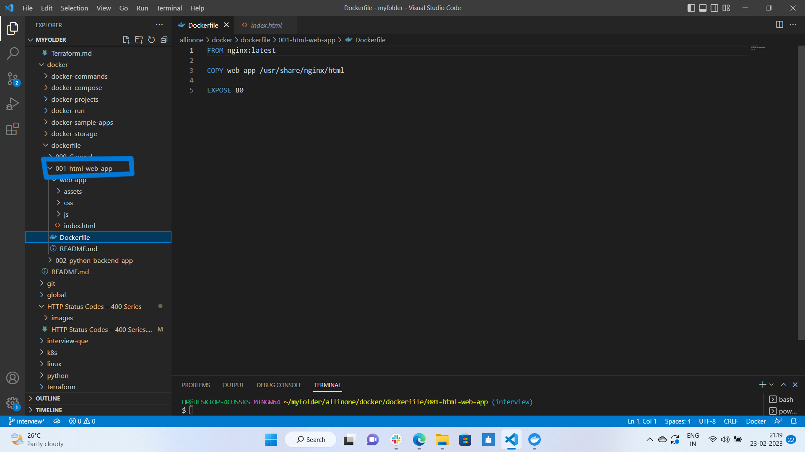
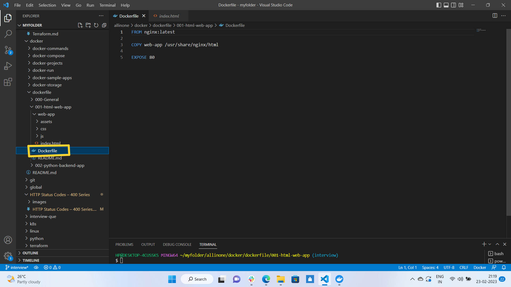
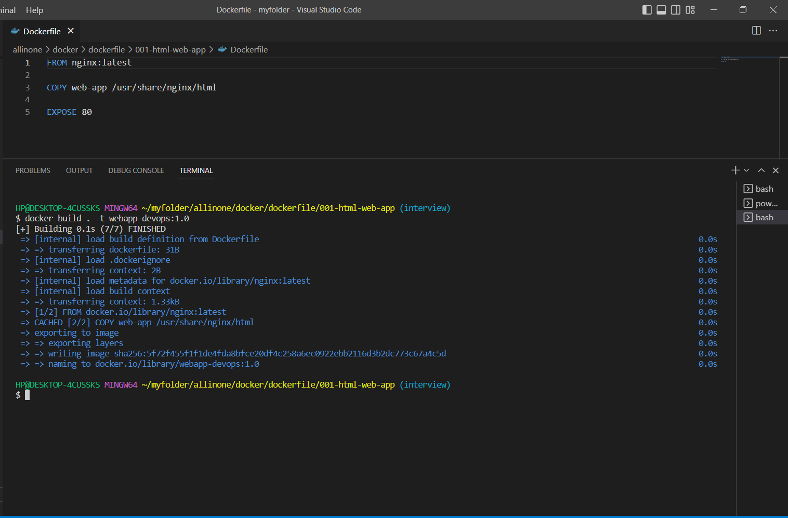
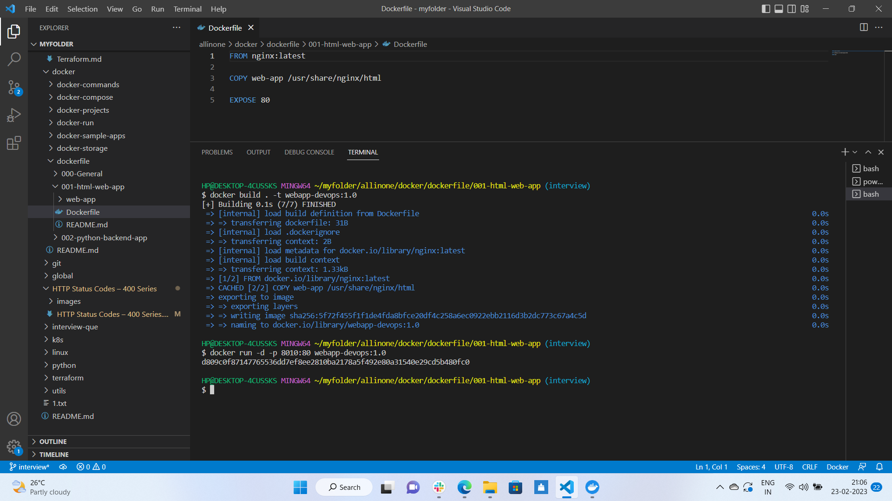
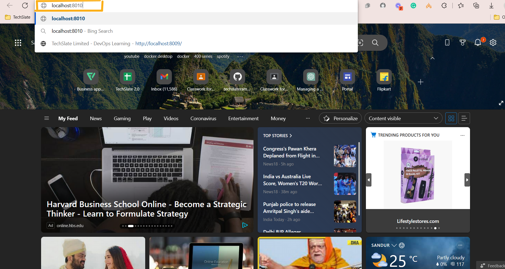

# **How to create an html-web-Application using dockerfile**

# Table of contents
1.[Introduction](#**<Introduction>**)

2.[Prerequisites](#**<Pre-requisites>**)

3.[How to create Dockerfile for HTML Application?](#how-to-create-dockerfile-for-html-application)


## **Introduction**

### **What is Dockerfile?**

A Dockerfile is a script that uses the Docker platform to generate containers automatically. It is essentially a text document that contains all the instructions that a user may use to create an image from the command line.

The Docker platform is a Linux-based platform that allows developers to create and execute containers, self-contained programs, and systems that are independent of the underlying infrastructure. Docker, which is based on the Linux kernel’s resource isolation capabilities, allows developers and system administrators to transfer programs across multiple systems and machines by executing them within containers.


### **The syntax for writing a Dockerfile step by step.**

**1. FROM:**

   A FROM statement defines which image to download and start from. It must be the first command in your Dockerfile. A Dockerfile can have multiple FROM statements which means the Dockerfile produces more than one image.

   Example:

   ```
   FROM java: 8
   ```

**2. MAINTAINER:**

   This statement is a kind of documentation, which defines the author who is creating this Dockerfile or who should you contact if it has bugs.

   Example:

```
MAINTAINER Firstname Lastname <example@geeksforgeeks.com>
```

**3. RUN:**

The RUN statement defines running a command through the shell, waiting for it to finish, and saving the result. It tells what process will be running inside the container at the run time.

Example:

```
RUN unzip install.zip /opt/install
RUN echo hello 

```

**4. ADD:**

If we define to add some files, ADD statement is used. It basically gives instructions to copy new files, directories, or remote file URLs and then adds them to the filesystem of the image.

To sum up it can add local files, contents of tar archives as well as URLs.

Example:
```
1. Local Files: ADD run.sh /run.sh
2. Tar Archives: ADD project.tar.gz /install/
3. URLs: ADD https://project.example-gfg.com/downloads/1.0/testingproject.rpm/test
```

**5. ENV:**

ENV statement sets the environment variables both during the build and when running the result. It can be used in the Dockerfile and any scripts it calls. It can be used in the Dockerfile as well as any scripts that the Dockerfile calls. These are also persistent with the container and can be referred to at any moment.

Example:

```
ENV URL_POST=production.example-gfg.com
```

**6. ENTRYPOINT:**

It specifies the starting of the expression to use when starting your container. Simply ENTRYPOINT specifies the start of the command to run. If your container acts as a command-line program, you can use ENTRYPOINT.

Example:

```
ENTRYPOINT ["/start.sh"]
```

**7. CMD:**

CMD specifies the whole command to run. We can say CMD is the default argument passed into the ENTRYPOINT. The main purpose of the CMD command is to launch the software required in a container.

Example:

```
CMD [“program-foreground”]
CMD [“executable”, “program1”, “program2”]
Note: If you have both ENVIRONMENT and CMD, they are combined together.
```

**8. EXPOSE:**

EXPOSE statement maps a port into the container. The ports can be TCP or UDP but by default, it is TCP.

Example:
```
EXPOSE 3030
```

**9. VOLUME:**

The VOLUME statement defines shared volumes or ephemeral volumes depending upon whether you have one or two arguments.

Example:
```
1. If you have two arguments, it maps a host path into acontainer path.

        VOLUME [“/host/path” “/container/path/”]

2. If you have one arguments, it creates a volume that can be inherited by the later containers.

          VOLUME [“/shared-data”]
```


**10. WORKDIR:**

As the name suggests, WORKDIR sets the directory that the container starts in. Its main purpose is to set the working directory for all future Dockerfile commands.

Example:
```
WORKDIR /directory-name
```

**11. USER:**

It sets which user’s container will run as. This can be useful if you have shared network directories involved that assume a fixed username or a fixed user number.

Example:

```
USER geeksforgeeks
USER 4000
Example:

```

## **Pre-requisites**

**To create a Docker file for creating an sample Application you will need to have the following prerequisites installed and configured on your machine:**

**Docker:** Docker is a containerization platform that allows you to run applications in lightweight, isolated environments called containers. You will need to have Docker installed on your machine to create dockerfile.

**A text editor:** You will need a text editor to create and edit the dockerfile that defines the configuration for your sample application. Some popular text editors include Visual Studio Code, Sublime Text, and Atom.


# **How to create Dockerfile for HTML Application?**

- ## First create a folder with appropriate title which represents your applicaton.



  Here as we are creating docker file for HTML Application we named the folder as 

Example:

```
001-html-web-app
```

***

- ## Now, lets create another folder under that and will name it as  ```web app```.


- ## Under which will create an  ```index.html ``` file which acts as a front-end , which specifies the features which should reflect on application web page.


- ## After which will create a ```Dockerfile``` under ```001-html-web-app``` folder.



- ## In dockerfile we have mentioned required syntax for creating application.

```
FROM nginx:latest

COPY web-app /usr/share/nginx/html

EXPOSE 80
```

> FROM represting the base image that is ```nginx```.

> COPY is copying ```index.html file```to the container.

> EXPOSE representing the port number where our application should run i.e. ```80```


- ## Once our syntax is ready , will open a New Terminal and get into that respective folder


- ## once we finish writing dockerfile we need to build our own image by giving a follwing command :

  ```
  docker build . -t webapp-devops:1.0
  ```



- ## we can give any name to the image, in this scenario we have given it as ;

  ``webapp-devops:1.0 ``

- ## once we build our own image , we need to run , to run it we need to give following command;

 ```
  docker run -d -p 8010:80 webapp-devops:1.0
 ```



- ## Now let's open any of the browser and run ```localhost:8010``` to see if my application is running.



- ## Now we can see that our application is running successfully.


## So this is how we create a dockerfile to create a sample HTML Application