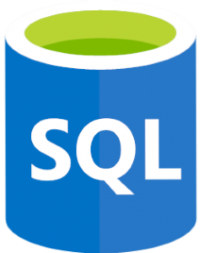

# Introduction 

## *This page contains all the interview questions related to Azure .*

## **Q1. What is Azure and what are its main features?** ##

### Ans:

Azure is a cloud computing platform created by Microsoft that provides a wide range of services for building, deploying, and managing applications and services through Microsoft-managed data centers. Here are some of its main features:

- **Compute**: Azure offers various computing options such as virtual machines, containers, and serverless computing. You can choose the option that best suits your workload and pay only for the resources you use.

- **Storage**: Azure provides scalable storage options for different data types, such as blobs, files, queues, and tables. You can store and retrieve any amount of data, anytime and anywhere.

- **Networking**: Azure offers a variety of networking services, including virtual networks, load balancers, VPN gateways, and application gateways. You can securely connect your resources and services to your on-premises infrastructure or the internet.

- **Databases**: Azure provides various database services such as SQL Database, Cosmos DB, and MySQL. You can choose the database type that best suits your application needs, scale your databases as your application grows, and ensure data availability and durability.

- **AI and Machine Learning**: Azure provides services for building and deploying AI and machine learning models, such as Azure Machine Learning, Cognitive Services, and Bot Services. You can build intelligent applications that can see, hear, speak, and understand natural language.

- **DevOps**: Azure provides a comprehensive set of DevOps services such as Azure DevOps, Azure Pipelines, and Azure Artifacts. You can automate your application development, testing, and deployment processes, and deliver applications faster and with higher quality.

Overall, Azure provides a vast range of services and features for building and managing applications and services in the cloud, and it is one of the leading cloud computing platforms in the market.

## **Q2. How would you explain the difference between Azure App Service and Azure Virtual Machines?** ##

### Ans:

    

- Azure App Service and Azure Virtual Machines are both cloud computing services offered by Microsoft Azure. However, there are significant differences between the two services.

- Azure App Service is a platform-as-a-service (PaaS) offering that allows you to build, deploy, and scale web applications and APIs. With App Service, you can create web apps using a variety of programming languages, frameworks, and tools, including .NET, Java, Node.js, Python, and PHP. App Service takes care of the underlying infrastructure, including server management, patching, and scaling, so you can focus on building your application.

- On the other hand, Azure Virtual Machines is an infrastructure-as-a-service (IaaS) offering that provides you with the ability to create and manage virtual machines in the cloud. With Virtual Machines, you have complete control over the operating system and the software that runs on the virtual machine. You can choose to deploy a variety of operating systems, including Windows Server, Linux, and others, and you can install and configure any software you need on the virtual machine.

- In summary, Azure App Service is a PaaS offering that provides a platform for building and deploying web applications and APIs, while Azure Virtual Machines is an IaaS offering that provides you with the flexibility to create and manage virtual machines in the cloud, including the ability to choose the operating system and install any software you need..

## **Q3. What is an Azure Virtual Network and how does it work?** ##

### Ans:

- An Azure Virtual Network (VNet) is a networking feature provided by Microsoft Azure, a cloud computing platform, that enables users to create isolated networks within the Azure cloud environment.

- A Virtual Network allows you to securely connect Azure resources to each other, to on-premises networks, and to the internet. The virtual network is logically isolated from other virtual networks in Azure and can be configured with its own IP address space, subnets, and network security policies.

- When you create a virtual network in Azure, you can define the IP address range and the subnets for your virtual machines and other resources to use. You can also create network security groups to control traffic to and from your virtual machines, as well as implement other security features like virtual private networks (VPNs) and firewalls.

- Virtual machines within the same virtual network can communicate with each other using their private IP addresses, even if they are located in different subnets or availability zones. Similarly, virtual machines in a virtual network can communicate with on-premises resources over a site-to-site VPN connection or ExpressRoute connection.

- In summary, an Azure Virtual Network provides a secure and isolated network environment for your Azure resources, enabling you to configure network connectivity and security policies to meet your specific requirements.

## **Q4. What is Azure Storage and what are its different types?** ##

### Ans:

Azure Storage is a cloud-based storage solution offered by Microsoft Azure. It provides scalable and secure storage for structured, semi-structured, and unstructured data. With Azure Storage, users can store and retrieve data from anywhere in the world using REST APIs or any of the supported client libraries.

There are four different types of Azure Storage available:

- **Blob Storage**: Blob storage is designed for storing large amounts of unstructured data such as text, images, videos, and audio files. It provides high availability, durability, and scalability for object data.

- **File Storage**: File storage is a fully managed file share solution that is accessible over the industry-standard Server Message Block (SMB) protocol. It is designed for enterprise applications that require shared file access.

- **Queue Storage**: Queue storage is used to store and retrieve messages. It provides reliable messaging between application components and services.

- **Table Storage**: Table storage is a NoSQL key-value store that is ideal for storing semi-structured data. It provides fast and scalable access to structured data using a non-relational schema.

- Each type of Azure Storage is optimized for different use cases and provides unique features and benefits. By leveraging these different types of storage, users can choose the best fit for their specific storage needs..

## **Q5. What is an Azure Availability Set and why is it important??** ##

### Ans:

- Azure Availability Set is a logical grouping of virtual machines (VMs) within an Azure data center that helps ensure that a user's applications remain available during hardware and software maintenance events, network failures, and any other possible disruptions to their application's availability.

- Availability Sets help protect your application by spreading out your VMs across different physical hardware, compute racks, storage units, and network switches. By doing so, your VMs are less likely to experience service interruptions due to hardware or software failures.

- In an Azure Availability Set, the user can configure a minimum of two virtual machines (VMs) in order to ensure high availability of their applications. The availability set ensures that at least one VM will be running even if the other VMs within the same set become unavailable due to planned maintenance or an unexpected outage. Azure automatically distributes the VMs across different hardware update domains and fault domains to provide better resiliency to your application.

- In summary, Azure Availability Set is essential for maintaining high availability of your application by distributing your VMs across different hardware, storage, and network devices, thereby reducing the likelihood of downtime.

## **Q6. What is the Azure Resource Manager and how does it differ from classic deployment?** ##

### Ans:

- Azure Resource Manager (ARM) is a management layer in Microsoft Azure that provides a way to organize and manage resources in a more holistic manner. It allows you to deploy, manage, and monitor all the resources for your application as a group, rather than managing them individually. ARM provides a way to define, provision, and manage Azure resources using declarative templates.

- With ARM, you can create templates that describe the infrastructure and configuration of your application as a set of resources. This includes virtual machines, storage accounts, networks, and more. You can then use these templates to deploy and manage your resources in a consistent and repeatable way.

- The classic deployment model, also known as Azure Service Management (ASM), was the original method for deploying resources in Azure. In this model, each resource is managed individually, and there is no way to group them together into a single unit. This makes it harder to manage and scale complex applications.

- The key difference between ARM and classic deployment is that ARM provides a more structured and organized way of managing resources in Azure. With ARM, you can group resources together and manage them as a single unit. This makes it easier to manage and deploy complex applications, and it also provides better visibility into resource dependencies and relationships.

- Overall, ARM is the preferred deployment model for Azure, and Microsoft recommends that new deployments use ARM instead of the classic model.

## **Q7. What is Azure Active Directory and how is it used in Azure?** ##

### Ans:

- Azure Active Directory (Azure AD) is a cloud-based identity and access management service provided by Microsoft. It is used to manage user identities, control access to resources, and enforce security policies in Azure and other Microsoft cloud services.

- In Azure, Azure AD is used as the primary identity provider for user authentication and authorization. This means that users can use their Azure AD credentials to sign in to Azure services such as Azure Virtual Machines, Azure App Service, and Azure SQL Database.

- Azure AD also provides single sign-on (SSO) capabilities, allowing users to access multiple cloud services with a single set of credentials. This simplifies the user experience and reduces the risk of weak or compromised passwords.

- Azure AD can also be used to manage access to resources outside of Azure, such as Microsoft 365 and other third-party applications. It supports a range of authentication protocols, including OAuth 2.0, OpenID Connect, and SAML, allowing it to integrate with a wide range of cloud and on-premises applications.

- In summary, Azure Active Directory is a key component of the Azure cloud platform, providing secure and seamless access to Azure services and other cloud applications.

## **Q8. How can you monitor and manage your Azure resources?** ##

### Ans:

Azure provides a variety of tools and services for monitoring and managing your Azure resources. Here are some of the ways to monitor and manage your Azure resources:

1. **Azure Portal**: Azure portal is a web-based console that provides a unified view of all Azure resources. It allows you to create, manage, and monitor resources.

2. **Azure PowerShell**: PowerShell is a command-line interface that allows you to manage and automate Azure resources. You can use PowerShell to create, configure, and manage Azure resources.

3. **Azure CLI**: Azure CLI is a command-line interface that allows you to manage Azure resources from any command prompt. It provides cross-platform support and allows you to automate Azure resource management.

4. **Azure Monitor**: Azure Monitor provides a centralized platform for monitoring Azure resources. It allows you to monitor resource health, performance, and usage. You can also configure alerts and notifications for resource health and performance.

5. **Azure Advisor**: Azure Advisor provides recommendations for optimizing your Azure resources. It provides best practices for resource configuration, security, and cost optimization.

6. **Azure Resource Manager**: Azure Resource Manager provides a framework for managing Azure resources. It allows you to deploy, manage, and monitor resources as a group. You can also define dependencies between resources and apply policies for resource management.

7. **Azure Policy**: Azure Policy allows you to apply policies for resource management. You can use it to enforce compliance with organizational standards and regulations.

By using these tools and services, you can effectively monitor and manage your Azure resources.

## **Q9. What is Azure Load Balancer and what are its benefits?** ##

### Ans:

Azure Load Balancer is a service provided by Microsoft Azure that distributes incoming network traffic across multiple backend resources such as virtual machines, virtual machine scale sets, and availability sets. Load balancing helps optimize resource utilization, improves application availability, and increases scalability.

Here are some of the benefits of using Azure Load Balancer:

1. **High availability**: Azure Load Balancer helps ensure high availability of your applications by distributing traffic across multiple backend resources. If any one of the resources becomes unavailable, traffic is automatically redirected to the other available resources.

2. **Scalability**: Azure Load Balancer can scale with your application as your traffic grows. You can add or remove backend resources easily, and the load balancer will automatically distribute traffic across them.

3. **Performance**: Azure Load Balancer provides high-performance load balancing with low latency and high throughput, ensuring that your applications are responsive and fast.

4. **Security**: Azure Load Balancer provides security features such as SSL offloading, source IP affinity, and access control lists to protect your applications from malicious attacks.

5. **Cost-effective**: Azure Load Balancer is a cost-effective solution for load balancing, as it allows you to use existing virtual machines and virtual machine scale sets without requiring additional hardware.

Overall, Azure Load Balancer is a reliable, scalable, and cost-effective way to improve the availability, performance, and security of your applications.

## **Q10. How can you ensure security in Azure and what are some best practices?** ##

### Ans:

There are several ways to ensure security in Azure, including the following best practices:

- Use strong authentication: Implement multi-factor authentication (MFA) for all users who access Azure resources. This helps to prevent unauthorized access to your Azure environment.

- Use secure passwords: Use strong passwords that are difficult to guess, and ensure that they are changed regularly.

- Use network security groups: Network security groups (NSGs) allow you to filter network traffic to and from Azure resources. Use NSGs to control access to your resources and limit exposure to potential security threats.

- Use Azure Security Center: Azure Security Center is a built-in security management solution that provides unified security management and advanced threat protection across hybrid cloud workloads. It can help you to identify and remediate security vulnerabilities.

- Monitor your environment: Use Azure Monitor to monitor your environment for potential security threats. This includes monitoring for unusual activity and unauthorized access attempts.

- Implement encryption: Use encryption to protect sensitive data both in transit and at rest. Azure provides several encryption options, including Azure Storage Service Encryption and Azure Disk Encryption.

- Keep your software up-to-date: Keep your Azure environment up-to-date with the latest security patches and updates. This helps to ensure that any known security vulnerabilities are patched.

- Use role-based access control (RBAC): Use RBAC to control who has access to your Azure resources. RBAC allows you to grant permissions to users based on their role in the organization.

- By following these best practices, you can help to ensure the security of your Azure environment.

## **Q11. What are some different ways to deploy an application in Azure?** ##

### Ans:

Azure provides several ways to deploy an application, depending on your application's architecture, requirements, and complexity. Here are some common ways to deploy an application in Azure:

1. **Azure App Service**: Azure App Service is a fully managed platform-as-a-service (PaaS) offering that enables developers to deploy and scale web applications and APIs easily. With App Service, you can deploy applications built using .NET, Node.js, Python, Java, or any other language that runs on Windows or Linux. You can also deploy containerized applications to App Service using Docker.

2. **Azure Kubernetes Service (AKS)**: Azure Kubernetes Service (AKS) is a fully managed Kubernetes container orchestration service that simplifies the deployment and management of containerized applications. AKS provides a highly scalable and available platform for deploying microservices-based applications.

3. **Azure Functions**: Azure Functions is a serverless computing service that allows you to deploy and run event-driven functions without worrying about infrastructure management. You can deploy functions written in various programming languages, including C#, Java, JavaScript, and Python.

4. **Virtual Machines**: Azure Virtual Machines (VMs) enable you to deploy applications that require full control of the underlying operating system and runtime environment. You can choose from a wide range of VM sizes and types to fit your workload requirements.

5. **Azure Container Instances**: Azure Container Instances (ACI) provide a way to run containerized applications without deploying and managing a full container orchestration platform. ACI is ideal for running short-lived tasks, batch jobs, or applications that need to scale quickly.

6. **Azure Service Fabric**: Azure Service Fabric is a distributed systems platform that enables you to deploy and manage microservices-based applications at scale. Service Fabric provides tools for deploying, managing, and monitoring microservices-based applications across a cluster of machines.

These are just a few of the deployment options available in Azure. Choosing the right deployment method depends on your application's architecture, requirements, and complexity.

## **Q12. What is Azure SQL Database and how does it differ from SQL Server?** ##

### Ans:

Azure SQL Database is a fully-managed relational database service offered by Microsoft as part of the Azure cloud computing platform. It is a cloud-based version of Microsoft SQL Server that provides a scalable and highly available database solution for applications running in the cloud.

Azure SQL Database is built on the same core SQL Server database engine technology that powers the on-premises version of SQL Server. However, there are several differences between Azure SQL Database and SQL Server, including:

- **Deployment Model**: SQL Server is typically deployed on-premises or in a private cloud, while Azure SQL Database is a fully managed cloud service that is deployed in the Azure cloud.

- **Scalability****: Azure SQL Database is designed to scale dynamically based on the needs of the application. It can automatically adjust the resources allocated to the database to meet changing demands, while SQL Server requires manual configuration to scale up or out.

- **Management**: Azure SQL Database is a fully managed service, which means that Microsoft handles the management of the underlying infrastructure, including patching, backups, and monitoring. SQL Server, on the other hand, requires IT staff to manage and maintain the database infrastructure.

- **Features**: While both Azure SQL Database and SQL Server share a common core database engine, Azure SQL Database offers some features that are not available in SQL Server, such as automatic tuning and geo-replication.

Overall, Azure SQL Database is a cloud-based database solution that offers many benefits, including scalability, high availability, and reduced management overhead, while still retaining the core functionality of SQL Server.

## **Q13. What is Azure Functions and how can they be used in application development?** ##

### Ans:

Azure Functions is a serverless compute service provided by Microsoft Azure that allows developers to build and run event-driven applications and microservices without managing the underlying infrastructure. With Azure Functions, developers can write code that responds to various events, such as HTTP requests, changes in data, or scheduled tasks, and have it executed automatically in the cloud.

Azure Functions can be used in a variety of ways in application development, including:

- Building serverless APIs: Developers can use Azure Functions to build APIs that respond to HTTP requests and integrate with other Azure services, such as Azure Cosmos DB or Azure Blob Storage.

- Event processing: Azure Functions can be used to process events generated by various Azure services, such as Azure Event Hubs or Azure Service Bus, and perform tasks based on the incoming data.

- Scheduled tasks: Developers can use Azure Functions to run tasks on a schedule, such as data backups, report generation, or database maintenance.

- Integration: Azure Functions can be used to integrate with other services and systems, such as sending emails, posting to social media, or triggering workflows in Microsoft Power Automate.

- IoT applications: Azure Functions can be used to process and analyze data generated by IoT devices and take actions based on the incoming data, such as sending alerts or triggering other services.

- Overall, Azure Functions provide developers with a powerful and flexible platform for building event-driven applications and microservices, with the ability to scale automatically to handle spikes in traffic or processing demands, while reducing infrastructure costs and management overhead.

## **Q14. What is the difference between Azure Backup and Azure Site Recovery?** ##

### Ans:

- Azure Backup and Azure Site Recovery are both cloud-based services provided by Microsoft Azure to help protect and recover data and applications, but they have different purposes and functions.

- Azure Backup is a cloud-based backup solution that allows you to back up your data to the Azure cloud. It provides an off-site backup solution for on-premises and cloud-based workloads such as virtual machines, files, and folders, applications, and databases. With Azure Backup, you can schedule backups, retain backups for a specific duration, and recover your data when needed. Azure Backup is primarily designed for data protection and disaster recovery scenarios.

- Azure Site Recovery, on the other hand, is a cloud-based disaster recovery solution that provides replication and recovery services for your applications and workloads. It helps you protect your critical applications and services by replicating them to another Azure region or to your own on-premises data center. In the event of a disaster, you can use Azure Site Recovery to failover to the replicated site, ensuring that your business operations continue with minimal disruption.

- In summary, while Azure Backup is a backup solution that protects your data by creating copies in the cloud, Azure Site Recovery is a disaster recovery solution that provides replication and recovery services for your entire environment.

## **Q15. What is Azure DevOps and how can it be used for continuous integration and continuous deployment (CI/CD)?** ##

### Ans:

Azure DevOps is a suite of tools designed to help software development teams plan, build, test, and deploy software applications. It provides a centralized platform for managing software development projects, including version control, work item tracking, build and release pipelines, and testing.

Azure DevOps can be used to implement a continuous integration and continuous deployment (CI/CD) pipeline for software development projects. Continuous integration involves automatically building and testing code changes whenever they are committed to the source code repository, while continuous deployment involves automatically deploying those changes to a production environment after they have been tested and approved.

To set up a CI/CD pipeline in Azure DevOps, you would typically use the following components:

- Version control: Azure DevOps supports Git, TFVC, and other version control systems. Developers can use version control to collaborate on code changes, manage code versions, and track changes over time.

- Build pipelines: Azure DevOps provides tools for creating and managing build pipelines, which are used to compile, package, and test code changes. Developers can use build pipelines to automatically build and test code changes whenever they are committed to the version control repository.

- Release pipelines: Azure DevOps provides tools for creating and managing release pipelines, which are used to deploy code changes to a production environment. Developers can use release pipelines to automatically deploy code changes that have passed testing and quality assurance checks.

- Testing: Azure DevOps provides tools for automating testing, including unit tests, functional tests, and load tests. Developers can use testing tools to automatically test code changes as part of the CI/CD pipeline.

- Monitoring and feedback: Azure DevOps provides tools for monitoring the performance of deployed applications, including user feedback and telemetry data. Developers can use these tools to identify and fix issues in deployed applications.

- Overall, Azure DevOps is a powerful tool for implementing a CI/CD pipeline, helping development teams deliver high-quality software faster and more efficiently.

## **Q16. How can you automate deployment and management of your Azure resources?** ##

### Ans:

Azure provides several tools and services to automate the deployment and management of your resources. Here are some ways you can do it:

- **Azure Resource Manager (ARM)**: ARM is a management framework that allows you to deploy, manage, and organize your Azure resources. You can define your infrastructure as code in JSON or YAML templates, and use ARM to deploy, update, or delete your resources in a consistent and repeatable way.

- **Azure DevOps**: Azure DevOps is a set of services for building, testing, and deploying applications. You can use Azure DevOps to automate the deployment of your Azure resources, including infrastructure and application code.

- **Azure CLI**: Azure CLI is a command-line interface that allows you to manage your Azure resources from your terminal or script. You can use Azure CLI to create, update, and delete your resources, as well as automate your deployment using scripts.

- **Azure PowerShell**: Azure PowerShell is a command-line interface for managing your Azure resources using PowerShell. You can use Azure PowerShell to automate the deployment and management of your resources, as well as automate common tasks and create custom scripts.

- **Azure Automation**: Azure Automation is a service that allows you to automate common, repetitive tasks in your Azure environment. You can use Azure Automation to create runbooks that automate the deployment and management of your resources, as well as schedule and monitor the execution of your runbooks.

- By leveraging these tools and services, you can automate the deployment and management of your Azure resources, save time, reduce errors, and increase consistency in your deployments.

## **Q17. What is Azure Kubernetes Service (AKS) and how is it used in container orchestration?** ##

### Ans:

- Azure Kubernetes Service (AKS) is a fully-managed container orchestration service that is offered by Microsoft Azure. It is based on Kubernetes, an open-source container orchestration platform that automates many of the processes involved in deploying, scaling, and managing containerized applications.

- AKS enables developers to quickly and easily deploy and manage containerized applications at scale on the Azure cloud platform. It provides a range of features and tools that simplify the management of Kubernetes clusters, including automated upgrades, scaling, monitoring, and backup and recovery.

- Using AKS, developers can deploy their containerized applications as pods, which are groups of one or more containers that share the same network and storage resources. These pods can be scaled up or down as needed to accommodate changes in application demand, and AKS provides built-in load balancing to distribute traffic across the pods.

- AKS also includes features that make it easier to manage containerized applications in a production environment, such as integration with Azure Active Directory for user authentication and access control, integration with Azure Monitor for monitoring and logging, and integration with Azure Container Registry for managing container images.

- Overall, AKS provides a robust and scalable platform for managing containerized applications in the cloud, and it is widely used by developers and enterprises to deploy and manage their containerized workloads on Azure.

## **Q18. What is Azure Event Grid and how can it be used for event-driven architectures?** ##

### Ans:

- Azure Event Grid is a cloud-based event routing service provided by Microsoft Azure. It enables developers to build event-driven architectures by providing a scalable and efficient way to react to events that occur in Azure services, as well as custom events from other sources.

- Event-driven architectures rely on the concept of events, which are messages that communicate a change or action that has occurred in the system. With Event Grid, you can create event publishers that emit events, event handlers that receive and process those events, and event subscriptions that connect publishers to handlers.

- Azure Event Grid supports a wide variety of event publishers, including Azure services like Blob Storage, Azure Functions, and Azure IoT Hub, as well as third-party services like GitHub and Twilio. Once an event is published, Event Grid uses a publish-subscribe model to deliver the event to all relevant subscribers in near real-time.

- This makes Event Grid a powerful tool for building event-driven architectures, as it allows developers to build loosely-coupled, reactive systems that can quickly and easily respond to changes and events in the system.

- Some common use cases for Azure Event Grid include:

1. Building serverless applications that respond to events from Azure services or third-party services

2. Building event-driven workflows that automate business processes

3. Building real-time streaming applications that process high volumes of data in real-time.

Overall, Azure Event Grid is a flexible and powerful tool that can help developers build robust and responsive event-driven architectures in Azure.

## **Q19. What is Azure Cosmos DB and how is it used for NoSQL database management?** ##

### Ans:

Azure Cosmos DB is a globally distributed, multi-model NoSQL database service provided by Microsoft Azure. It is designed to be highly available, scalable, and globally distributed, making it well-suited for modern, cloud-native applications that require fast and flexible data access.

Azure Cosmos DB supports multiple NoSQL data models, including document, key-value, graph, and column-family, and provides APIs for each of these models, such as MongoDB API, Cassandra API, and Azure Table API. This makes it easy to work with Azure Cosmos DB using the programming languages and tools that you already know.

Azure Cosmos DB is used for NoSQL database management by providing a fully managed and scalable database service that can be used to store and query large amounts of data across different regions and availability zones. It provides a number of features that make it well-suited for NoSQL database management, including:

Multi-model data access: Azure Cosmos DB supports multiple data models, which allows developers to use the best data model for their application.

Globally distributed: Azure Cosmos DB is designed to be globally distributed, allowing you to store and access data from any region around the world with low latency.

Highly available: Azure Cosmos DB provides multiple replicas of your data, ensuring high availability and durability.

Scalable: Azure Cosmos DB is designed to scale elastically, so you can easily increase or decrease your throughput and storage capacity based on your application's needs.

Security: Azure Cosmos DB provides multiple security features, including encryption at rest and in transit, role-based access control, and network security.

Overall, Azure Cosmos DB is a powerful NoSQL database management solution that provides developers with the flexibility, scalability, and availability they need to build modern, cloud-native applications.

## **Q20. What are some common challenges you may encounter when working with Azure and how can you address them?** ##

### Ans:

As an AI language model, I don't work with Azure myself, but I can give you some insights into common challenges that users may encounter when working with Azure and suggest some possible solutions:

- **Security concerns**: One of the primary concerns for organizations when working with cloud services is security. Azure provides several security features and tools to help secure your resources, such as Azure Security Center, Azure Active Directory, and Azure Firewall.

- **Managing Costs**: Another challenge is managing costs. Azure provides several tools to help you manage your costs, such as Azure Cost Management and Billing, which allows you to track and optimize your Azure spending.

- **Resource management**: Managing resources can be challenging, especially as you scale up. Azure provides several tools to help you manage your resources, such as Azure Resource Manager, which allows you to manage resources as a group rather than individually.

- **Integration with existing systems**: Integrating Azure with existing systems can also be a challenge. Azure provides several integration tools and services, such as Azure Logic Apps and Azure Service Bus, which allow you to integrate your applications and systems with Azure services.

- **Troubleshooting issues**: When issues arise, it can be challenging to troubleshoot them. Azure provides several monitoring and troubleshooting tools, such as Azure Monitor and Azure Application Insights, which allow you to monitor and troubleshoot issues with your applications and services.

- Overall, to address these challenges, it's important to leverage the tools and services that Azure provides, as well as staying up-to-date with best practices and recommendations for working with Azure. Additionally, it's helpful to engage with the Azure community and seek support from Microsoft or other Azure experts when needed.

