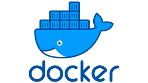
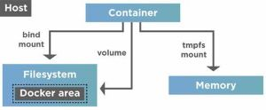

# Introduction

## *This page contains all the interview questions related to Git.*




## **Q1.What is Docker and How is it different from Kubernetes ?** ##

    
### Ans: 

- Docker and Kubernetes are both tools used in the development, deployment, and management of software applications, but they serve different purposes.

- Docker is a containerization platform that allows developers to package an application along with its dependencies into a container that can be run consistently across different environments. With Docker, developers can create lightweight, portable, and self-contained containers that can be run on any machine that has Docker installed, regardless of the underlying operating system or infrastructure.

- On the other hand, Kubernetes is a container orchestration platform that automates the deployment, scaling, and management of containerized applications. Kubernetes provides a framework for managing multiple containers that make up an application, handling tasks such as load balancing, self-healing, and scaling.

- In summary, Docker is a tool for creating containers, while Kubernetes is a tool for managing those containers at scale. Docker provides the ability to package and distribute applications in a portable and efficient manner, while Kubernetes provides the infrastructure to manage and orchestrate those containers in a resilient, scalable, and automated way.


## **Q2. What is the difference between Git and GitHub?** ##

 
### Ans: 

When creating a Docker image, there are a number of best practices that can help ensure that the image is efficient, secure, and easy to use. Here are some key practices to keep in mind:

- **Use a small and efficient base image:** Choose a base image that is lightweight and contains only the necessary components for your application. This can help reduce the size of the image and make it more efficient.

- **Minimize the number of layers:** Docker images are built using a series of layers. Each layer adds to the size of the image, so it's best to minimize the number of layers in the image. You can use multi-stage builds to reduce the number of layers.

- **Keep the image up-to-date:** Use the latest version of your application, operating system, and other dependencies to ensure that your image is up-to-date and secure.

- **Use a secure registry:** Use a secure registry to store your Docker images. This can help prevent unauthorized access and ensure that your images are not tampered with.

- **Avoid hardcoding sensitive information:** Avoid hardcoding sensitive information, such as passwords and API keys, in the Dockerfile or image. Instead, use environment variables or other mechanisms to pass this information to the container at runtime.

- **Clean up after yourself:** Remove any unnecessary files or packages from the image to keep it as small as possible. This can help reduce the attack surface and make the image more secure.

- **Use a consistent naming convention:** Use a consistent naming convention for your Docker images and tags to make it easy to identify and manage them.

- **Test your image:** Test your Docker image thoroughly to ensure that it works as expected and meets all the requirements of your application.

By following these best practices, you can create Docker images that are efficient, secure, and easy to use.


## **Q3. How do you make sure your Docker Image is secured ?** ##


### Ans: 

Securing a Docker image involves multiple layers of defense, and it's important to follow best practices to ensure that your image is protected against potential vulnerabilities. Here are some tips to help you secure your Docker image:

- **Keep your software up to date:** Keep your base image and any software installed within your Docker image up to date. This helps to prevent any known security vulnerabilities from being exploited.

- **Use trusted base images:** Use official base images that are maintained and regularly updated by the Docker community or the software vendor. This ensures that the base image is secure and free from known vulnerabilities.

- **Avoid using the root user:** Avoid running processes within the container as the root user. Instead, create a user with the least possible privileges required for the container to run.

- **Limit access to resources:** Limit the container's access to resources on the host system, such as file systems and network ports. Use Docker's security features such as SELinux, AppArmor, or seccomp to restrict the container's access to system resources.

- **Use multi-stage builds:** Use multi-stage builds to reduce the attack surface of the Docker image. This approach allows you to build the application in one container and then copy the built artifacts to a smaller and more secure container.

- **Scan for vulnerabilities:** Use tools such as Docker Security Scanning or Anchore to scan your Docker image for vulnerabilities. This helps you identify and fix any known security issues in your image.

- **Use a firewall:** Use a firewall to restrict access to the exposed ports and services running inside your container. This ensures that only authorized users can access the container's services.

By following these best practices, you can create a secure Docker image that is less vulnerable to attacks and exploits.


## **Q4. Can we use Docker instead of Kuberenetes ?** 

 
### Ans:

Yes, Docker and Kubernetes are both container technologies, but they serve different purposes.

- **Docker** is a containerization platform that allows you to create, package, and distribute containerized applications. Docker allows you to build an image of your application and its dependencies, and then run that image as a container on any machine that has Docker installed. Docker provides a simple and efficient way to run and manage containers on a single machine.

- **Kubernetes**, on the other hand, is a container orchestration platform that allows you to deploy, scale, and manage containerized applications across multiple machines. Kubernetes provides a way to automate the deployment, scaling, and management of containerized applications, making it easy to run and manage applications in a distributed environment.

In summary, Docker is a tool for creating and running containers on a single machine, while Kubernetes is a tool for managing containers across multiple machines. While it is possible to use Docker without Kubernetes, using Kubernetes allows you to leverage the full power of container orchestration to run and manage your applications at scale.


## **Q5.How do you manage Docker containers in a production environment?** ##

### Ans:

Managing Docker containers in a production environment requires careful planning and consideration to ensure that the containers are stable, secure, and performing optimally. Here are some general best practices:

- **Use container orchestration tools:** Container orchestration tools such as Kubernetes, Docker Swarm, or Amazon ECS provide a higher level of abstraction for managing Docker containers. They handle tasks such as scheduling, scaling, and monitoring containers, which makes managing containerized applications easier and more efficient.

- **Use container images:** Build container images that include all the necessary dependencies and configurations for the application. This makes it easier to deploy and run the container in any environment without requiring additional setup or configuration.

- **Use a registry:** Use a container registry to store and manage container images. This ensures that the containers are stored in a centralized location and can be easily accessed by anyone who needs them.

- **Monitor container performance:** Use monitoring tools to track the performance of the containers and the underlying infrastructure. This helps identify any issues that may be affecting the application and allows for proactive remediation.

- **Set up security measures:** Ensure that the containers are secure by implementing access control measures, applying patches and updates regularly, and restricting network access to only necessary services and ports.

- **Automate deployments:** Use automation tools to manage container deployments, updates, and rollbacks. This reduces the risk of human error and makes it easier to scale the application quickly.

- **Backup and disaster recovery:** Have a plan in place for backing up container data and applications. Ensure that the backup strategy is tested and can be used for disaster recovery in case of any unexpected issues.


## **Q6. How do you create a Docker image?** ##

### Ans:

To create a Docker image, you typically follow these steps:

Write a Dockerfile: A Dockerfile is a plain text file that contains a set of instructions that Docker can use to build an image. It typically starts with a base image, followed by a series of commands that configure the environment and install dependencies.

Build the image: Once you have a Dockerfile, you can build an image by running the "docker build" command. This will read the Dockerfile, execute the instructions, and create a new image.

Tag the image: After you build an image, you'll typically want to tag it with a specific name and version so that it's easier to manage and deploy. You can use the "docker tag" command to do this.

Push the image: If you want to share the image with others or deploy it to a remote server, you'll need to push it to a registry. Docker Hub is a popular public registry, but you can also use private registries if you prefer. To push an image, you can use the "docker push" command.

Here's an example Dockerfile that sets up a simple Flask application:

```
FROM python:3.8-alpine

WORKDIR /app

COPY requirements.txt .

RUN pip install --no-cache-dir -r requirements.txt

COPY . .

EXPOSE 5000

CMD ["python", "app.py"]

```

Assuming this file is saved as "Dockerfile" in a directory that contains your Flask application code and a requirements.txt file, you can build the image by running:


```
docker build -t my-flask-app .

```
This will build the image and tag it with the name "my-flask-app". You can then run the image locally with:

```
docker run -p 5000:5000 my-flask-app

```
This will start the container and map port 5000 on the host to port 5000 in the container, allowing you to access the application at <http://localhost:5000.>


## **Q7. What is the difference between Docker Image and Docker Container ?** ##

### Ans:
 

Docker images and Docker containers are both important components of the Docker platform, but they serve different purposes.

- A Docker image is a lightweight, stand-alone, executable package that contains everything needed to run a piece of software, including the code, libraries, and dependencies. An image is essentially a snapshot of a Docker container at a specific point in time. Images can be created from scratch, or they can be based on an existing image. Docker images are typically created using a Dockerfile, which is a text file that contains a set of instructions for building an image.

- A Docker container, on the other hand, is a runtime instance of a Docker image. It is a lightweight and portable executable package that encapsulates the software and all its dependencies. A container runs natively on the host machine's operating system and shares the kernel with other containers. Containers can be started, stopped, and restarted, and they can be connected to different networks and storage volumes.

In summary, a Docker image is a static snapshot of a container, while a Docker container is a running instance of an image. Images are used to create containers, which can be started, stopped, and managed as needed.


## **Q8. What is Docker and how does it work?** ##


### Ans:

- Docker is an open-source platform that allows developers to build, ship, and run applications in a containerized environment. Docker is based on the concept of containerization, which involves bundling an application and its dependencies into a single package known as a container. This container can then be deployed to any environment that supports Docker, including local machines, data centers, and cloud platforms.

- Docker works by using a client-server architecture, where the Docker client communicates with the Docker server to build and manage containers. The Docker client can be run on a developer's local machine or remotely, and it provides a command-line interface (CLI) for interacting with the Docker server.

- The Docker server, also known as the Docker daemon, runs on the host machine and manages the Docker images and containers. Docker images are the blueprints for creating containers, and they are created using a Dockerfile, which specifies the application and its dependencies. Docker images can be stored in a Docker registry, such as Docker Hub, and can be downloaded and used by others.

- When a Docker image is run, it creates a container, which is an isolated environment that contains the application and its dependencies. Each container has its own file system, network interface, and process namespace, which provides a secure and isolated environment for running the application. Multiple containers can be run on the same machine, and they can communicate with each other using Docker networking.

- Docker also provides a way to manage containers, including starting, stopping, and deleting containers. Docker containers are lightweight and portable, which makes them ideal for deploying applications to different environments without the need to modify the application code or dependencies. This can save time and reduce errors when deploying applications to production.


## **Q9. Can you explain the difference between Docker and a virtual machine?** ##

### Ans:
 

Docker and virtual machines are two different ways of running software in isolated environments, but they differ in their approaches and the level of isolation they provide.

- A virtual machine (VM) is an emulation of a computer system that runs on top of a physical host machine. A VM provides a complete operating system (OS) environment that is completely isolated from the host system, which means it can run different OSes, software versions, and configurations. Each VM has its own set of virtualized hardware resources (such as CPU, memory, and storage), and software runs inside the VM, which can be accessed via a remote desktop connection or other network protocols. Virtual machines are often used for running legacy software, different operating systems, or for testing and development purposes.

- On the other hand, Docker is a containerization platform that runs applications in lightweight, portable containers. Containers provide a way to package and run applications with all their dependencies in a standardized way, and can be run on any host that has the Docker runtime installed. Docker containers share the host machine's OS kernel, but each container is isolated from the host and other containers. This means that containers provide a level of isolation, but not the complete separation provided by VMs.

- The main difference between the two is the level of isolation and the resources required. Virtual machines require a full operating system and use hardware virtualization to provide complete isolation, whereas containers share the host OS and use software-level isolation to provide partial isolation. This means that containers are generally smaller, faster to start up, and more efficient in terms of resource usage than VMs.

In summary, virtual machines provide complete isolation with a full operating system, whereas containers provide partial isolation with a shared host OS, making them faster, lighter and more efficient.


## **Q10. What are Docker containers?** ##

### Ans:

Docker containers are a type of lightweight, virtualized environment that allows software applications to run in isolation from the underlying system.

- A container is a standalone executable package that includes all the dependencies and libraries necessary to run a particular application, as well as the application itself. Docker containers are created from images, which are essentially snapshots of a container at a specific point in time.

- Containers provide several benefits over traditional virtual machines, including faster startup times, smaller storage requirements, and greater flexibility. Because they are isolated from the underlying system, containers can be moved between different environments (such as development, testing, and production) without changes to the application code.

- Docker is a popular open-source platform for building, shipping, and running containers. It provides a set of tools for managing containers, including the Docker Engine, which is responsible for creating and running containers, and the Docker Hub, which is a registry for storing and sharing container images.


## **Q11.Can you describe the process of creating a Docker image?** ##


### Ans:

The process of creating a Docker image. Here is a high-level overview of the process:

- **Choose a base image:** The first step in creating a Docker image is to choose a base image. The base image is the starting point for your image, and it typically contains an operating system and some pre-installed software.

- **Create a Dockerfile:** A Dockerfile is a text file that contains instructions on how to build the image. The Dockerfile is used by the Docker engine to build the image layer by layer. In the Dockerfile, you specify the base image, any additional software you want to install, configuration files, and other settings.

- **Build the image:** Once you have created the Dockerfile, you can use the Docker build command to build the image. The build process will download the base image and any other software specified in the Dockerfile, and it will create a new image layer by layer.

- **Tag the image:** After the build process is complete, you can tag the image with a name and version number. This will make it easier to reference the image later.

- **Push the image:** Finally, you can push the image to a Docker registry. A Docker registry is a central repository where Docker images can be stored and shared. You can either use a public registry like Docker Hub, or you can set up your own private registry.

That's a high-level overview of the process of creating a Docker image. There are many more details and options that you can specify in the Dockerfile, but this should give you a good idea of the basic steps involved.


## **Q12.How do you run a Docker container?** ##

### Ans:

To run a Docker container, you can follow these steps:

- **Pull the image**: First, you need to pull the Docker image from a registry like Docker Hub using the `docker pull` command. For example, if you want to run an Ubuntu container, you can use the following command:

`docker pull ubuntu`

- **Create a container**: After pulling the image, you can create a container using the docker run command. For example, to create a new container based on the Ubuntu image, you can use the following command:

`docker run -it --name my-container ubuntu`

In this command, `-it` runs the container in interactive mode and attaches a terminal to it,`--name` assigns a name to the container, and `ubuntu` is the name of the Docker image.

Run commands in the container: Once the container is created, you can run commands inside it using the same terminal window. For example, to run the `ls` command to list the contents of the root directory, you can simply type:

`ls`

Exit the container: To exit the container, you can type `exit` in the terminal window

Note that when you exit the container, it is not stopped or removed. You can start it again using the `docker start` command and connect to it using `docker attach`. To stop and remove a container, you can use the `docker stop` and `docker rm` commands respectively.


## **Q13.Can you describe the process of pushing a Docker image to a registry?** ##

### Ans:

Here's a general overview of the process of pushing a Docker image to a registry:

- **Build the Docker image**: First, you'll need to create a Docker image of your application or service. You can use a Dockerfile to specify the build steps and dependencies needed to create the image.

- **Tag the image**: Once you've built the image, you'll need to tag it with a name that includes the registry URL and the image name. For example, if you're using Docker Hub, you might tag your image as username/my-image:latest.

- **Log in to the registry**: Before you can push your image to a registry, you'll need to log in using your registry credentials. You can do this using the docker login command, providing your username and password.

- **Push the image**: With the image built, tagged, and authenticated with the registry, you can push it to the registry using the docker push command. This will upload the image to the registry and make it available for others to download and run.

- **Verify the push**: Finally, you can verify that the image was successfully pushed to the registry by checking the registry's web interface or using the docker images command to list the images in the registry.

Overall, pushing a Docker image to a registry involves building and tagging the image, logging in to the registry, pushing the image to the registry, and verifying that the push was successful.


## **Q14.Can you explain the concept of a Dockerfile?** ##

### Ans:

A Dockerfile is a text file that contains a set of instructions used to build a Docker image. A Docker image is a lightweight, standalone, executable package that contains all the dependencies and configuration required to run a software application.

The Dockerfile contains a series of instructions that are executed in order to build the image. These instructions typically include things like:

- **Choosing a base image:** The base image provides the foundation for the new image you're creating. It contains the operating system and any required libraries or dependencies.
- **Copying files:** You can copy files and directories from your local file system into the image.
- **Running commands:** You can execute commands within the image to install packages, configure the environment, and set up your application.
- **Setting environment variables:** You can set environment variables that will be used by your application when it runs in the container.
- **Exposing ports:** You can specify which ports should be exposed from the container to the host machine.
Once you have created a Dockerfile, you can use the "docker build" command to build an image from the instructions in the file. The resulting image can then be used to create Docker containers that can run your application.

Overall, a Dockerfile is a powerful tool for creating portable and repeatable builds of your application. It allows you to define the exact environment your application requires and package it into a lightweight, portable container that can be easily deployed to any Docker-enabled environment.


## **Q15.How do you manage Docker volumes?** ##


### Ans:

Docker volumes are a way to store and manage persistent data in Docker containers. Here are some ways to manage Docker volumes:

- **Creating a volume:** You can create a volume using the docker volume create command. For example, to create a volume named my_volume, run the command docker volume create my_volume.

Mounting a volume: You can mount a volume when you run a container using the -v flag. For example, to mount the my_volume volume in a container, run the command docker run -v my_volume:/path/to/mount container_image.

Inspecting volumes: You can inspect the details of a volume using the docker volume inspect command. For example, to inspect the my_volume volume, run the command docker volume inspect my_volume.

Removing a volume: You can remove a volume using the docker volume rm command. For example, to remove the my_volume volume, run the command docker volume rm my_volume.

Backing up and restoring volumes: You can back up and restore volumes by copying the data in the volume to a file, and then copying the file to another machine. To restore the data, you can create a new volume and copy the data from the file to the new volume.

Using named volumes: Named volumes are a way to give a name to a volume when you create it. This makes it easier to reference the volume in commands and scripts. For example, to create a named volume named my_named_volume, run the command docker volume create my_named_volume. You can then use this volume by specifying the name in the docker run command. For example, docker run -v my_named_volume:/path/to/mount container_image.

Overall, managing Docker volumes involves creating, mounting, inspecting, and removing volumes as well as backing up and restoring data. Named volumes can make it easier to manage volumes in commands and scripts.


## *This page contains all the interview questions related to Git.*


## **Q1.What is Docker and How is it different from Kubernetes ?** ##

    
### Ans: 

- Docker and Kubernetes are both tools used in the development, deployment, and management of software applications, but they serve different purposes.

- Docker is a containerization platform that allows developers to package an application along with its dependencies into a container that can be run consistently across different environments. With Docker, developers can create lightweight, portable, and self-contained containers that can be run on any machine that has Docker installed, regardless of the underlying operating system or infrastructure.

- On the other hand, Kubernetes is a container orchestration platform that automates the deployment, scaling, and management of containerized applications. Kubernetes provides a framework for managing multiple containers that make up an application, handling tasks such as load balancing, self-healing, and scaling.

- In summary, Docker is a tool for creating containers, while Kubernetes is a tool for managing those containers at scale. Docker provides the ability to package and distribute applications in a portable and efficient manner, while Kubernetes provides the infrastructure to manage and orchestrate those containers in a resilient, scalable, and automated way.


## **Q2. What is the difference between Git and GitHub?** ##

 
### Ans: 

When creating a Docker image, there are a number of best practices that can help ensure that the image is efficient, secure, and easy to use. Here are some key practices to keep in mind:

- **Use a small and efficient base image:** Choose a base image that is lightweight and contains only the necessary components for your application. This can help reduce the size of the image and make it more efficient.

- **Minimize the number of layers:** Docker images are built using a series of layers. Each layer adds to the size of the image, so it's best to minimize the number of layers in the image. You can use multi-stage builds to reduce the number of layers.

- **Keep the image up-to-date:** Use the latest version of your application, operating system, and other dependencies to ensure that your image is up-to-date and secure.

- **Use a secure registry:** Use a secure registry to store your Docker images. This can help prevent unauthorized access and ensure that your images are not tampered with.

- **Avoid hardcoding sensitive information:** Avoid hardcoding sensitive information, such as passwords and API keys, in the Dockerfile or image. Instead, use environment variables or other mechanisms to pass this information to the container at runtime.

- **Clean up after yourself:** Remove any unnecessary files or packages from the image to keep it as small as possible. This can help reduce the attack surface and make the image more secure.

- **Use a consistent naming convention:** Use a consistent naming convention for your Docker images and tags to make it easy to identify and manage them.

- **Test your image:** Test your Docker image thoroughly to ensure that it works as expected and meets all the requirements of your application.

By following these best practices, you can create Docker images that are efficient, secure, and easy to use.


## **Q3. How do you make sure your Docker Image is secured ?** ##


### Ans: 

Securing a Docker image involves multiple layers of defense, and it's important to follow best practices to ensure that your image is protected against potential vulnerabilities. Here are some tips to help you secure your Docker image:

- **Keep your software up to date:** Keep your base image and any software installed within your Docker image up to date. This helps to prevent any known security vulnerabilities from being exploited.

- **Use trusted base images:** Use official base images that are maintained and regularly updated by the Docker community or the software vendor. This ensures that the base image is secure and free from known vulnerabilities.

- **Avoid using the root user:** Avoid running processes within the container as the root user. Instead, create a user with the least possible privileges required for the container to run.

- **Limit access to resources:** Limit the container's access to resources on the host system, such as file systems and network ports. Use Docker's security features such as SELinux, AppArmor, or seccomp to restrict the container's access to system resources.

- **Use multi-stage builds:** Use multi-stage builds to reduce the attack surface of the Docker image. This approach allows you to build the application in one container and then copy the built artifacts to a smaller and more secure container.

- **Scan for vulnerabilities:** Use tools such as Docker Security Scanning or Anchore to scan your Docker image for vulnerabilities. This helps you identify and fix any known security issues in your image.

- **Use a firewall:** Use a firewall to restrict access to the exposed ports and services running inside your container. This ensures that only authorized users can access the container's services.

By following these best practices, you can create a secure Docker image that is less vulnerable to attacks and exploits.


## **Q4. Can we use Docker instead of Kuberenetes ?** 

 
### Ans:

Yes, Docker and Kubernetes are both container technologies, but they serve different purposes.

- **Docker** is a containerization platform that allows you to create, package, and distribute containerized applications. Docker allows you to build an image of your application and its dependencies, and then run that image as a container on any machine that has Docker installed. Docker provides a simple and efficient way to run and manage containers on a single machine.

- **Kubernetes**, on the other hand, is a container orchestration platform that allows you to deploy, scale, and manage containerized applications across multiple machines. Kubernetes provides a way to automate the deployment, scaling, and management of containerized applications, making it easy to run and manage applications in a distributed environment.

In summary, Docker is a tool for creating and running containers on a single machine, while Kubernetes is a tool for managing containers across multiple machines. While it is possible to use Docker without Kubernetes, using Kubernetes allows you to leverage the full power of container orchestration to run and manage your applications at scale.


## **Q5.How do you manage Docker containers in a production environment?** ##

### Ans:

Managing Docker containers in a production environment requires careful planning and consideration to ensure that the containers are stable, secure, and performing optimally. Here are some general best practices:

- **Use container orchestration tools:** Container orchestration tools such as Kubernetes, Docker Swarm, or Amazon ECS provide a higher level of abstraction for managing Docker containers. They handle tasks such as scheduling, scaling, and monitoring containers, which makes managing containerized applications easier and more efficient.

- **Use container images:** Build container images that include all the necessary dependencies and configurations for the application. This makes it easier to deploy and run the container in any environment without requiring additional setup or configuration.

- **Use a registry:** Use a container registry to store and manage container images. This ensures that the containers are stored in a centralized location and can be easily accessed by anyone who needs them.

- **Monitor container performance:** Use monitoring tools to track the performance of the containers and the underlying infrastructure. This helps identify any issues that may be affecting the application and allows for proactive remediation.

- **Set up security measures:** Ensure that the containers are secure by implementing access control measures, applying patches and updates regularly, and restricting network access to only necessary services and ports.

- **Automate deployments:** Use automation tools to manage container deployments, updates, and rollbacks. This reduces the risk of human error and makes it easier to scale the application quickly.

- **Backup and disaster recovery:** Have a plan in place for backing up container data and applications. Ensure that the backup strategy is tested and can be used for disaster recovery in case of any unexpected issues.


## **Q6. How do you create a Docker image?** ##

### Ans:

To create a Docker image, you typically follow these steps:

Write a Dockerfile: A Dockerfile is a plain text file that contains a set of instructions that Docker can use to build an image. It typically starts with a base image, followed by a series of commands that configure the environment and install dependencies.

Build the image: Once you have a Dockerfile, you can build an image by running the "docker build" command. This will read the Dockerfile, execute the instructions, and create a new image.

Tag the image: After you build an image, you'll typically want to tag it with a specific name and version so that it's easier to manage and deploy. You can use the "docker tag" command to do this.

Push the image: If you want to share the image with others or deploy it to a remote server, you'll need to push it to a registry. Docker Hub is a popular public registry, but you can also use private registries if you prefer. To push an image, you can use the "docker push" command.

Here's an example Dockerfile that sets up a simple Flask application:

```
FROM python:3.8-alpine

WORKDIR /app

COPY requirements.txt .

RUN pip install --no-cache-dir -r requirements.txt

COPY . .

EXPOSE 5000

CMD ["python", "app.py"]

```

Assuming this file is saved as "Dockerfile" in a directory that contains your Flask application code and a requirements.txt file, you can build the image by running:


```
docker build -t my-flask-app .

```
This will build the image and tag it with the name "my-flask-app". You can then run the image locally with:

```
docker run -p 5000:5000 my-flask-app

```
This will start the container and map port 5000 on the host to port 5000 in the container, allowing you to access the application at <http://localhost:5000.>


## **Q7. What is the difference between Docker Image and Docker Container ?** ##

### Ans:
 

Docker images and Docker containers are both important components of the Docker platform, but they serve different purposes.

- A Docker image is a lightweight, stand-alone, executable package that contains everything needed to run a piece of software, including the code, libraries, and dependencies. An image is essentially a snapshot of a Docker container at a specific point in time. Images can be created from scratch, or they can be based on an existing image. Docker images are typically created using a Dockerfile, which is a text file that contains a set of instructions for building an image.

- A Docker container, on the other hand, is a runtime instance of a Docker image. It is a lightweight and portable executable package that encapsulates the software and all its dependencies. A container runs natively on the host machine's operating system and shares the kernel with other containers. Containers can be started, stopped, and restarted, and they can be connected to different networks and storage volumes.

In summary, a Docker image is a static snapshot of a container, while a Docker container is a running instance of an image. Images are used to create containers, which can be started, stopped, and managed as needed.


## **Q8. What is Docker and how does it work?** ##


### Ans:

- Docker is an open-source platform that allows developers to build, ship, and run applications in a containerized environment. Docker is based on the concept of containerization, which involves bundling an application and its dependencies into a single package known as a container. This container can then be deployed to any environment that supports Docker, including local machines, data centers, and cloud platforms.

- Docker works by using a client-server architecture, where the Docker client communicates with the Docker server to build and manage containers. The Docker client can be run on a developer's local machine or remotely, and it provides a command-line interface (CLI) for interacting with the Docker server.

- The Docker server, also known as the Docker daemon, runs on the host machine and manages the Docker images and containers. Docker images are the blueprints for creating containers, and they are created using a Dockerfile, which specifies the application and its dependencies. Docker images can be stored in a Docker registry, such as Docker Hub, and can be downloaded and used by others.

- When a Docker image is run, it creates a container, which is an isolated environment that contains the application and its dependencies. Each container has its own file system, network interface, and process namespace, which provides a secure and isolated environment for running the application. Multiple containers can be run on the same machine, and they can communicate with each other using Docker networking.

- Docker also provides a way to manage containers, including starting, stopping, and deleting containers. Docker containers are lightweight and portable, which makes them ideal for deploying applications to different environments without the need to modify the application code or dependencies. This can save time and reduce errors when deploying applications to production.


## **Q9. Can you explain the difference between Docker and a virtual machine?** ##

### Ans:
 

Docker and virtual machines are two different ways of running software in isolated environments, but they differ in their approaches and the level of isolation they provide.

- A virtual machine (VM) is an emulation of a computer system that runs on top of a physical host machine. A VM provides a complete operating system (OS) environment that is completely isolated from the host system, which means it can run different OSes, software versions, and configurations. Each VM has its own set of virtualized hardware resources (such as CPU, memory, and storage), and software runs inside the VM, which can be accessed via a remote desktop connection or other network protocols. Virtual machines are often used for running legacy software, different operating systems, or for testing and development purposes.

- On the other hand, Docker is a containerization platform that runs applications in lightweight, portable containers. Containers provide a way to package and run applications with all their dependencies in a standardized way, and can be run on any host that has the Docker runtime installed. Docker containers share the host machine's OS kernel, but each container is isolated from the host and other containers. This means that containers provide a level of isolation, but not the complete separation provided by VMs.

- The main difference between the two is the level of isolation and the resources required. Virtual machines require a full operating system and use hardware virtualization to provide complete isolation, whereas containers share the host OS and use software-level isolation to provide partial isolation. This means that containers are generally smaller, faster to start up, and more efficient in terms of resource usage than VMs.

In summary, virtual machines provide complete isolation with a full operating system, whereas containers provide partial isolation with a shared host OS, making them faster, lighter and more efficient.


## **Q10. What are Docker containers?** ##

### Ans:

Docker containers are a type of lightweight, virtualized environment that allows software applications to run in isolation from the underlying system.

- A container is a standalone executable package that includes all the dependencies and libraries necessary to run a particular application, as well as the application itself. Docker containers are created from images, which are essentially snapshots of a container at a specific point in time.

- Containers provide several benefits over traditional virtual machines, including faster startup times, smaller storage requirements, and greater flexibility. Because they are isolated from the underlying system, containers can be moved between different environments (such as development, testing, and production) without changes to the application code.

- Docker is a popular open-source platform for building, shipping, and running containers. It provides a set of tools for managing containers, including the Docker Engine, which is responsible for creating and running containers, and the Docker Hub, which is a registry for storing and sharing container images.


## **Q11.Can you describe the process of creating a Docker image?** ##


### Ans:

The process of creating a Docker image. Here is a high-level overview of the process:

- **Choose a base image:** The first step in creating a Docker image is to choose a base image. The base image is the starting point for your image, and it typically contains an operating system and some pre-installed software.

- **Create a Dockerfile:** A Dockerfile is a text file that contains instructions on how to build the image. The Dockerfile is used by the Docker engine to build the image layer by layer. In the Dockerfile, you specify the base image, any additional software you want to install, configuration files, and other settings.

- **Build the image:** Once you have created the Dockerfile, you can use the Docker build command to build the image. The build process will download the base image and any other software specified in the Dockerfile, and it will create a new image layer by layer.

- **Tag the image:** After the build process is complete, you can tag the image with a name and version number. This will make it easier to reference the image later.

- **Push the image:** Finally, you can push the image to a Docker registry. A Docker registry is a central repository where Docker images can be stored and shared. You can either use a public registry like Docker Hub, or you can set up your own private registry.

That's a high-level overview of the process of creating a Docker image. There are many more details and options that you can specify in the Dockerfile, but this should give you a good idea of the basic steps involved.


## **Q12.How do you run a Docker container?** ##

### Ans:

To run a Docker container, you can follow these steps:

- **Pull the image**: First, you need to pull the Docker image from a registry like Docker Hub using the `docker pull` command. For example, if you want to run an Ubuntu container, you can use the following command:

`docker pull ubuntu`

- **Create a container**: After pulling the image, you can create a container using the docker run command. For example, to create a new container based on the Ubuntu image, you can use the following command:

`docker run -it --name my-container ubuntu`

In this command, `-it` runs the container in interactive mode and attaches a terminal to it,`--name` assigns a name to the container, and `ubuntu` is the name of the Docker image.

Run commands in the container: Once the container is created, you can run commands inside it using the same terminal window. For example, to run the `ls` command to list the contents of the root directory, you can simply type:

`ls`

Exit the container: To exit the container, you can type `exit` in the terminal window

Note that when you exit the container, it is not stopped or removed. You can start it again using the `docker start` command and connect to it using `docker attach`. To stop and remove a container, you can use the `docker stop` and `docker rm` commands respectively.


## **Q13.Can you describe the process of pushing a Docker image to a registry?** ##

### Ans:

Here's a general overview of the process of pushing a Docker image to a registry:

- **Build the Docker image**: First, you'll need to create a Docker image of your application or service. You can use a Dockerfile to specify the build steps and dependencies needed to create the image.

- **Tag the image**: Once you've built the image, you'll need to tag it with a name that includes the registry URL and the image name. For example, if you're using Docker Hub, you might tag your image as username/my-image:latest.

- **Log in to the registry**: Before you can push your image to a registry, you'll need to log in using your registry credentials. You can do this using the docker login command, providing your username and password.

- **Push the image**: With the image built, tagged, and authenticated with the registry, you can push it to the registry using the docker push command. This will upload the image to the registry and make it available for others to download and run.

- **Verify the push**: Finally, you can verify that the image was successfully pushed to the registry by checking the registry's web interface or using the docker images command to list the images in the registry.

Overall, pushing a Docker image to a registry involves building and tagging the image, logging in to the registry, pushing the image to the registry, and verifying that the push was successful.


## **Q14.Can you explain the concept of a Dockerfile?** ##

### Ans:

A Dockerfile is a text file that contains a set of instructions used to build a Docker image. A Docker image is a lightweight, standalone, executable package that contains all the dependencies and configuration required to run a software application.

The Dockerfile contains a series of instructions that are executed in order to build the image. These instructions typically include things like:

- **Choosing a base image:** The base image provides the foundation for the new image you're creating. It contains the operating system and any required libraries or dependencies.
- **Copying files:** You can copy files and directories from your local file system into the image.
- **Running commands:** You can execute commands within the image to install packages, configure the environment, and set up your application.
- **Setting environment variables:** You can set environment variables that will be used by your application when it runs in the container.
- **Exposing ports:** You can specify which ports should be exposed from the container to the host machine.
Once you have created a Dockerfile, you can use the "docker build" command to build an image from the instructions in the file. The resulting image can then be used to create Docker containers that can run your application.

Overall, a Dockerfile is a powerful tool for creating portable and repeatable builds of your application. It allows you to define the exact environment your application requires and package it into a lightweight, portable container that can be easily deployed to any Docker-enabled environment.


## **Q15.How do you manage Docker volumes?** ##


### Ans:

Docker volumes are a way to store and manage persistent data in Docker containers. Here are some ways to manage Docker volumes:

- **Creating a volume:** You can create a volume using the docker volume create command. For example, to create a volume named my_volume, run the command docker volume create my_volume.

- **Mounting a volume:** You can mount a volume when you run a container using the -v flag. For example, to mount the my_volume volume in a container, run the command docker run -v my_volume:/path/to/mount container_image.

- **Inspecting volumes:** You can inspect the details of a volume using the docker volume inspect command. For example, to inspect the my_volume volume, run the command docker volume inspect my_volume.

- **Removing a volume:** You can remove a volume using the docker volume rm command. For example, to remove the my_volume volume, run the command docker volume rm my_volume.

- **Backing up and restoring volumes:** You can back up and restore volumes by copying the data in the volume to a file, and then copying the file to another machine. To restore the data, you can create a new volume and copy the data from the file to the new volume.

- **Using named volumes:** Named volumes are a way to give a name to a volume when you create it. This makes it easier to reference the volume in commands and scripts. For example, to create a named volume named my_named_volume, run the command docker volume create my_named_volume. You can then use this volume by specifying the name in the docker run command. For example, docker run -v my_named_volume:/path/to/mount container_image.

Overall, managing Docker volumes involves creating, mounting, inspecting, and removing volumes as well as backing up and restoring data. Named volumes can make it easier to manage volumes in commands and scripts.


## **Q16.Can you describe the process of building a Docker network?** ##

### Ans:

 Here's a brief overview of the process of building a Docker network:

- **Create a Docker network**: You can create a Docker network using the docker network create command, specifying the name of the network and any other options you need (e.g., the driver to use).

- **Connect containers to the network**: Once you've created a network, you can connect containers to it using the --network option when running the docker run command. This option allows you to specify the name of the network to connect to.

- **Communicate between containers**: Once containers are connected to the same network, they can communicate with each other using their container names as hostnames. Docker also assigns a DNS server to the network, so you can use DNS to resolve container names to IP addresses.

- **Expose ports**: If you need to expose a port from a container to the host or to other containers, you can use the --publish or --expose options when running the docker run command.

- **Manage the network**: You can use the docker network ls, docker network inspect, and docker network rm commands to manage your Docker networks.

That's a basic overview of the process of building a Docker network. Keep in mind that there are many more options and features available for configuring and managing Docker networks, so you may need to consult the Docker documentation for more detailed information.


## **Q17.Can you explain the difference between a Docker bridge network and a Docker overlay network?** ##

### Ans:

- Docker is a popular containerization technology that allows developers to package applications and their dependencies into portable and isolated containers. Docker provides different types of networks that can be used to connect Docker containers together.

- A Docker bridge network is a default network that is created automatically when Docker is installed. It is used to connect multiple Docker containers running on the same Docker host. Containers on a bridge network can communicate with each other using IP addresses. The bridge network isolates containers from external networks, which provides some level of security. However, communication with external networks must be explicitly enabled through port mappings or by attaching the container to a host network.

- A Docker overlay network, on the other hand, allows multiple Docker hosts to communicate with each other. This means that containers running on different Docker hosts can be connected and can communicate with each other as if they were on the same network. An overlay network is created using the Docker Swarm mode, which is used to manage a cluster of Docker hosts. The overlay network uses the VXLAN protocol to encapsulate and route network traffic between the Docker hosts. This allows containers to communicate with each other across different hosts, even if the hosts are located in different geographic locations.

- In summary, a Docker bridge network is used to connect containers running on the same Docker host, while a Docker overlay network is used to connect containers running on different Docker hosts.


## **Q18.How do you use Docker Compose to define and run multi-container applications?** ##


### Ans:

Docker Compose is a tool for defining and running multi-container Docker applications. It uses a YAML file to define the services that make up your application, their configuration options, and how they communicate with each other. Here are the steps to use Docker Compose to define and run a multi-container application:

- **Install Docker Compose:** Docker Compose is a separate package from the Docker engine, so you need to install it separately. You can download the latest version of Docker Compose from the official website: <https://docs.docker.com/compose/install/>

- **Create a Docker Compose YAML file:** The YAML file defines the services that make up your application. Here's an example of a simple YAML file:

```
version: '3'
services:
  web:
    build: .
    ports:
      - "5000:5000"
  redis:
    image: "redis:alpine"
```

In this example, we have two services: a web service and a Redis service. The web service is built from the current directory and exposes port 5000. The Redis service is based on the official Redis image and doesn't expose any ports.

- **Run the application:** To start the application, navigate to the directory that contains the YAML file and run the following command:

```docker-compose up```

This command will start all the services defined in the YAML file. If you want to run the services in the background, use the -d flag:

```docker-compose up -d ```

- **Stop the application:** To stop the application, use the following command:

```docker-compose down```

This command will stop and remove all the containers associated with the services defined in the YAML file.

That's it! With Docker Compose, you can define and run complex multi-container applications with ease.


## **Q19.Can you explain the process of scaling a Docker application?** ##

### Ans:

Scaling a Docker application involves creating multiple instances of the application to distribute the workload across multiple nodes, improving performance, and increasing redundancy. Here are the general steps involved in scaling a Docker application:

- **Design the application architecture:** Before scaling an application, you need to design its architecture. Determine which parts of the application should be scaled, and how the application instances will communicate with each other.

- **Create a Docker Compose file:** Create a Docker Compose file that defines the application's services and their configurations. This file should include the details of the containers you want to scale, including the number of replicas you want to create.

- **Launch the application:** Once you have a Docker Compose file, you can launch the application using the docker-compose up command. This will start the application as defined in the Compose file.

- **Scale the application:** You can scale the application by adjusting the number of replicas of the container you want to scale. You can use the docker-compose scale command to increase or decrease the number of replicas of a particular container.

- **Monitor the application:** Once you have scaled the application, you should monitor its performance to ensure that it is running smoothly. You can use monitoring tools such as Prometheus or Grafana to monitor your Docker application and its performance metrics.

- **Load balancing:** With multiple instances of the application, you need to ensure that incoming requests are distributed evenly across all the replicas. You can use load balancing tools such as NGINX or HAProxy to distribute the workload across the instances.

By following these steps, you can effectively scale a Docker application to improve its performance and increase redundancy.


## **Q20.How do you secure a Docker container?** ##

### Ans:

Securing a Docker container involves a range of measures that need to be taken to minimize potential vulnerabilities and reduce the risks of an attack. Here are some tips for securing a Docker container:

- **Use a minimal base image:** Start with a minimal base image and only install the required dependencies. This can help reduce the attack surface of the container.

- **Keep images up to date:** Regularly update your images to include security patches and bug fixes. This can help prevent vulnerabilities from being exploited.

- **Limit container privileges:** Use the principle of least privilege when running containers. Limit the container's capabilities to only what is necessary to run the application.

- **Use Docker's built-in security features:** Use features like Docker's built-in firewall, apparmor, and seccomp profiles to restrict the container's access to the host system.

- **Isolate containers:** Use Docker's network and storage isolation features to ensure that containers are isolated from each other and from the host system.

- **Scan images for vulnerabilities:** Use a container scanning tool to scan images for known vulnerabilities before deploying them in production.

- **Use secrets management:** Keep sensitive information like passwords and API keys out of your Docker images by using secrets management tools like Docker's secret management or third-party tools like HashiCorp Vault.

- **Enable Docker Content Trust:** Enable Docker Content Trust to ensure that only trusted images are pulled and deployed.

- **Monitor container activity:** Monitor the activity of containers to identify potential security risks or suspicious behavior.

- **Follow best practices:** Follow Docker best practices for security, such as not running containers as root, avoiding mounting the host file system into the container, and using Docker's health check feature to monitor the container's health.


## **Q21.Can you explain the process of monitoring Docker containers?** ##

### Ans:

Monitoring Docker containers involves tracking their resource usage, performance metrics, and health status to ensure that they are functioning properly and efficiently. Here are some steps to monitor Docker containers:

- **Use Docker commands:** Docker provides several built-in commands to monitor containers, such as docker stats, which displays real-time resource usage statistics, and docker inspect, which provides detailed information about a container's configuration and current state.

- **Use a monitoring tool:** There are many third-party monitoring tools available that can be used to monitor Docker containers, such as Prometheus, Datadog, and Nagios. These tools can provide detailed metrics and alert you when there are issues with your containers.

- **Monitor the host machine:** Since Docker containers run on a host machine, monitoring the host machine is also important. This includes monitoring the CPU, memory, disk usage, and network traffic of the host machine to ensure that it can support the running containers.

- **Monitor container logs:** Container logs can provide valuable information about the container's performance and any errors or issues that may be occurring. You can use Docker's built-in logging functionality to collect container logs and analyze them.

- **Set up alerts:** Setting up alerts can help you proactively address issues with your containers. For example, you can set up alerts to notify you when a container's resource usage exceeds a certain threshold or when a container is not responding.

By following these steps, you can effectively monitor your Docker containers and ensure that they are running smoothly and efficiently.


