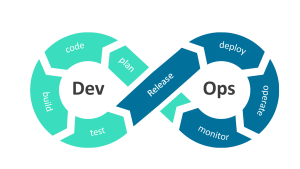
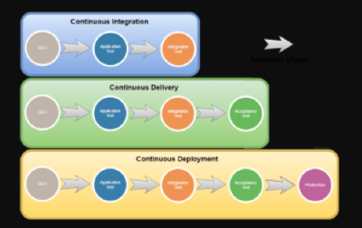
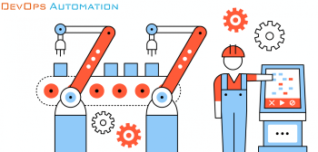
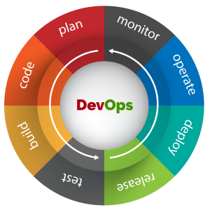
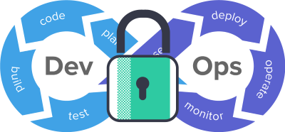
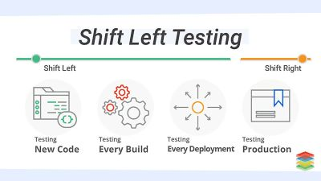
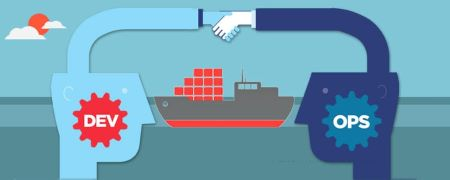
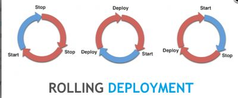
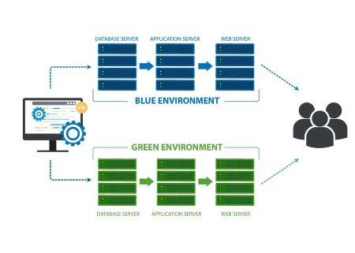

# Introduction 

## *This page contains all the interview questions related to DevOps.*

## **Q1. Can you explain what DevOps is and how it works?** ##

### Ans:

- DevOps is a software development approach that emphasizes collaboration, communication, and integration between software development and IT operations teams. It involves using automation and monitoring tools to streamline the software delivery process, as well as promoting a culture of continuous improvement and rapid feedback.

- In DevOps, developers and operations teams work together to build, test, and deploy software more efficiently and with fewer errors. This involves using techniques such as continuous integration, continuous delivery, and continuous deployment, which enable teams to rapidly and reliably release software updates and new features to users. DevOps also emphasizes the use of infrastructure as code and other automation tools to reduce manual processes and increase efficiency.

- The goal of DevOps is to improve the speed, quality, and reliability of software delivery, while also increasing collaboration and communication between development and operations teams. By doing so, organizations can deliver software more quickly and with fewer errors, enabling them to better meet the needs of their customers and stay competitive in an increasingly fast-paced and dynamic business environment.

## **Q2.What are the main principles of DevOps?** ##

### Ans:

DevOps is a software development approach that combines the development and operations teams to streamline software delivery and improve collaboration and communication between the two teams. The main principles of DevOps are:

- **Collaboration:** DevOps emphasizes collaboration and communication between developers and operations teams to ensure that software is developed, deployed, and maintained efficiently and effectively.

- **Continuous Integration and Deployment:** DevOps emphasizes the importance of continuous integration and deployment to increase the speed and frequency of software delivery.

- **Infrastructure as Code:** DevOps emphasizes the use of infrastructure as code to automate the deployment and configuration of infrastructure, making it easier to manage and maintain.

- **Continuous Testing:** DevOps emphasizes continuous testing to ensure that code is functional and meets the necessary quality standards before it is deployed.

- **Monitoring and Logging:** DevOps emphasizes the importance of monitoring and logging to provide visibility into the performance and health of the software and infrastructure.

- **Agile and Lean Practices:** DevOps incorporates Agile and Lean practices, such as iterative development, small batch sizes, and continuous improvement, to increase the speed and flexibility of software development and delivery.

- **Security:** DevOps emphasizes the importance of security and incorporates security practices throughout the software development lifecycle to ensure that the software is secure and compliant.

## **Q3.Can you describe the benefits of using a DevOps approach?** ##

### Ans:

DevOps is an approach to software development that emphasizes collaboration, communication, and integration between development teams and operations teams. Here are some of the benefits of using a DevOps approach:

- **Faster time to market:** By adopting DevOps practices, teams can release software more frequently and quickly, reducing the time it takes to deliver new features and functionality to end-users.

- **Improved collaboration:** DevOps encourages collaboration between developers, testers, and operations teams, enabling them to work together more effectively and efficiently.

- **Increased quality:** Continuous integration and testing allow for early detection of defects and issues, resulting in higher quality software releases.

- **Better customer satisfaction:** By releasing software faster and with higher quality, DevOps teams can provide better customer experiences and increase customer satisfaction.

- **More efficient use of resources:** DevOps enables teams to automate repetitive tasks, such as testing and deployment, freeing up team members to focus on higher-value activities.

- **Greater agility and flexibility:** DevOps practices enable teams to respond quickly to changing market conditions and customer needs, enabling them to stay ahead of the competition.

- **Improved security:** DevOps emphasizes security as a fundamental part of the development process, with security testing and other security-related activities integrated into the development cycle.

Overall, the benefits of using a DevOps approach are significant, helping teams to deliver high-quality software faster and more efficiently, while providing better customer experiences and maintaining a competitive advantage.

## **Q4.Can you explain the difference between continuous integration, continuous delivery, and continuous deployment?** ##

### Ans:

Continuous Integration (CI), Continuous Delivery (CD), and Continuous Deployment (CD) are related but distinct concepts in software development. Here's a brief explanation of each:

- **Continuous Integration (CI):**
CI is the practice of regularly merging code changes from multiple developers into a single shared repository, where automated tests are run to detect integration issues as early as possible. The main goal of CI is to catch problems early in the development process, so that they can be fixed quickly and easily.

- **Continuous Delivery (CD):**
CD is an extension of CI that focuses on automating the delivery of software to users or customers. The idea is to have a fully automated release process, where every change that passes the automated tests in the CI pipeline is automatically pushed to a staging environment, where it is further tested, and then to production if it passes all the necessary quality checks. The main goal of CD is to ensure that software changes can be reliably and safely released to users at any time, with minimal manual intervention.

- **Continuous Deployment (CD):**
CD is the practice of automatically deploying every change that passes the automated tests in the CI pipeline directly to production, without any manual intervention. This means that code changes are released to users immediately, as soon as they pass all the necessary quality checks. The main goal of CD is to achieve the highest level of automation in the software release process, with the least amount of human intervention possible.

To summarize, CI is about automating the process of integrating code changes, CD is about automating the process of delivering those changes to users, and CD is about automating the process of deploying those changes directly to production.

## **Q5.Can you describe the role of automation in DevOps?** ##

### Ans:

Automation is a key aspect of DevOps, which is an approach to software development that emphasizes collaboration, communication, and integration between software developers and IT operations teams. Automation plays a critical role in enabling teams to work more efficiently, reduce errors, and accelerate the delivery of software.

In DevOps, automation can be used to streamline the entire software development lifecycle, from code development and testing to deployment and monitoring. This can include automating tasks such as code testing, build and release management, infrastructure provisioning, configuration management, and application monitoring.

**By automating these tasks, DevOps teams can achieve several benefits, including:**

- **Faster delivery:** Automation can help teams to speed up the software development process by reducing the time and effort required to complete repetitive tasks.

- **Improved quality:** By automating testing and other quality control measures, teams can ensure that software is thoroughly tested and validated, reducing the risk of bugs and errors.

- **Greater efficiency:** Automation can reduce the need for manual intervention, allowing teams to focus on higher-level tasks that require their expertise and creativity.

- **Greater scalability:** Automated processes can be scaled up or down as needed, making it easier to accommodate changes in demand or to support the growth of the business.

Overall, automation is an essential component of a successful DevOps approach, allowing teams to work more efficiently, deliver higher-quality software, and respond more quickly to changing business needs.

## **Q6.Can you explain the concept of infrastructure as code (IAC)?** ##

### Ans:

- Infrastructure as code (IAC) is the practice of managing and provisioning computing infrastructure through machine-readable definition files, rather than through manual configuration or physical hardware. The idea is to treat infrastructure as if it were code, using the same development, testing, and deployment practices that software engineers use for application code.

- The core concept behind IAC is that infrastructure is defined using a declarative language or script that can be version-controlled, tested, and automated. This allows developers and operations teams to define, manage, and provision infrastructure using the same tools and processes they use for application code.

- In IAC, infrastructure can be defined using a variety of domain-specific languages, such as YAML, JSON, or HCL, which describe the desired state of the infrastructure. Tools such as Terraform, Ansible, Chef, and Puppet are commonly used to define and manage IAC.

- The benefits of IAC include increased automation and consistency, reduced errors and downtime, faster deployments, and better collaboration between development and operations teams. It also provides the ability to roll back changes and to test and validate infrastructure changes in a controlled environment.

Overall, IAC enables organizations to manage infrastructure more efficiently and effectively, which is critical in today's fast-paced, cloud-based computing environments.

## **Q7.Can you describe the process of releasing a new feature using a DevOps approach?** ##

### Ans:

Here is a high-level description of the process of releasing a new feature using a DevOps approach:

- **Planning:** The development team and the product owner collaborate to determine the scope and requirements of the new feature. The team breaks down the work into smaller, manageable tasks.

- **Development:** The development team creates the code for the new feature, following best practices such as test-driven development (TDD) and continuous integration (CI). The code is pushed to a version control system, which triggers the CI/CD pipeline.

- **Testing:** Automated tests are run as part of the CI/CD pipeline to ensure the code meets the acceptance criteria and does not break any existing functionality. Manual testing is also performed, if necessary.

- **Staging:** Once the code has passed all tests, it is deployed to a staging environment that is identical to the production environment. The new feature is tested again in this environment to ensure it behaves as expected.

- **Deployment:** If the feature passes all tests in the staging environment, it is deployed to the production environment using an automated deployment tool. This tool ensures the new code is rolled out gradually, minimizing the risk of downtime or errors.

- **Monitoring:** Once the new feature is live, the operations team monitors the system to ensure it is performing as expected. They also monitor the logs and user feedback to identify and resolve any issues that may arise.

- **Feedback and iteration:** The development team receives feedback from users and the operations team and uses it to improve the feature in future iterations.

Overall, this approach emphasizes collaboration between development and operations teams, continuous integration and deployment, and feedback and iteration to ensure a smooth and efficient release process.

## **Q8.Can you explain the role of testing in a DevOps workflow?** ##

### Ans:

Testing is a critical part of the DevOps workflow. It ensures that the software being developed is of high quality and meets the needs of end-users. Here are a few ways testing fits into a DevOps workflow:

- **Automated Testing:** DevOps teams use automated testing to detect issues early in the development cycle. Automated tests can be run quickly and frequently, and they provide feedback on the code's functionality and performance. This approach saves time, helps to identify issues early, and allows for rapid feedback.

- **Continuous Integration (CI):** CI is an essential part of the DevOps workflow. With CI, code is continually integrated into a shared repository, and automated testing is run on each build. CI helps detect issues quickly and provides immediate feedback to the developers, allowing them to address issues before they become bigger problems.

- **Continuous Delivery (CD):** CD ensures that code can be delivered to production at any time. Automated testing is a crucial part of CD, as it ensures that code can be released into the production environment with confidence. Automated testing can be run on different environments to ensure that the code works as expected.

- **Quality Assurance (QA):** QA is an integral part of the DevOps workflow. QA teams can use automated testing to detect issues early, and manual testing can be used to ensure that the software meets the needs of end-users. QA teams can also work with developers to ensure that the software is tested thoroughly, and any issues are resolved quickly.

In summary, testing is an essential part of the DevOps workflow. Automated testing helps to detect issues early, and continuous testing provides rapid feedback to the developers. This approach saves time and ensures that code can be released into production with confidence.

## **Q9.Can you describe the process of monitoring a production environment in a DevOps setup?** ##

### Ans:

Monitoring a production environment is an essential part of any DevOps setup. Here's a high-level overview of the process:

- **Define metrics:** Start by defining the metrics that are important to track. These metrics should be aligned with the business goals and should help identify issues before they turn into problems.

- **Choose monitoring tools:** Once you have identified the metrics to track, choose the right monitoring tools that can collect data from various sources and provide insights in real-time. Some of the popular monitoring tools used in DevOps include Nagios, Prometheus, and Grafana.

- **Set up monitoring:** The next step is to set up the monitoring tools to collect data and create dashboards for visualization. Make sure to set up alerts for critical metrics so that the team can be notified in case of any issues.

- **Analyze and optimize:** After collecting data for some time, analyze the trends and patterns to identify areas for optimization. For example, you may notice that certain servers are experiencing high CPU usage during peak hours, which could indicate a need for scaling.

- **Continuous improvement:** Monitoring is not a one-time task, and the process should be continuously improved based on feedback and changing business needs. Regularly review the monitoring setup and adjust it as needed.

In addition to the above steps, it's essential to establish a culture of accountability and ownership when it comes to monitoring. The team should be empowered to take action based on the insights provided by the monitoring tools, and there should be a clear escalation path in case of critical issues.

## **Q10.How do you handle security in a DevOps environment?** ##

### Ans:

Security is a critical consideration in any software development process, and DevOps is no exception. Here are some key considerations for handling security in a DevOps environment:

Implement Security as Code: In a DevOps environment, security should be integrated into the development process as early as possible, preferably as code. This means that security should be considered and implemented at every stage of the development pipeline, from code development to deployment and beyond. This can be done by incorporating security tools and testing into the continuous integration and delivery (CI/CD) pipeline.

- **Automate Security Testing:** Automating security testing ensures that security issues are identified and addressed as soon as possible. Security testing tools should be integrated into the pipeline, and testing should be performed regularly, preferably on every commit.

- **Use Infrastructure as Code:** The use of infrastructure as code allows for better control and visibility over the infrastructure, making it easier to identify potential security vulnerabilities. Infrastructure as code also enables security policies to be implemented consistently across environments, reducing the risk of misconfigurations.

- **Monitor and Respond to Threats:** DevOps teams should have a robust monitoring system in place that provides visibility into the environment, detects security threats and anomalies, and responds to security incidents quickly. This can be achieved through the use of security monitoring tools, automated incident response, and defined incident response processes.

- **Implement Access Control and Least Privilege:** Access control and least privilege are important principles for managing security in a DevOps environment. Access to systems, applications, and data should be limited to only those who require it, and the principle of least privilege should be applied to ensure that users have only the necessary access to perform their job functions.

- **Train Your Team:** Finally, it is important to provide training to your DevOps team to ensure they are aware of the latest security threats, vulnerabilities, and best practices. This can include training on secure coding practices, security testing, incident response, and more.

In summary, security should be integrated into every aspect of the DevOps pipeline, from code development to deployment and beyond. Automated testing, infrastructure as code, and access control are important principles to consider, and it is essential to monitor and respond to threats quickly while providing ongoing training and education to your team.

## **Q11.Can you explain the concept of "shift left" in terms of testing and quality assurance?** ##

### Ans:

- In the context of testing and quality assurance, "shift left" refers to the practice of moving testing activities earlier in the software development process. This means testing is performed earlier in the development cycle, ideally starting from the requirements gathering phase and continuing throughout the development process. The goal of this approach is to catch defects early, before they become more difficult and expensive to fix.

- Traditionally, testing was performed at the end of the development cycle, often referred to as "shift right." In a shift-right approach, testing occurs after the development has been completed, and the software is in its final stages before release. This approach may result in identifying defects and errors, which are then passed back to the developers to fix, leading to delays in the release and increased costs.

- On the other hand, a shift-left approach emphasizes testing as an integral part of the development process. This approach includes techniques like unit testing, integration testing, and continuous testing, all of which ensure that the software is being tested as it is being developed.

- By shifting left, software development teams can ensure that defects are caught earlier in the development process, making them easier and less expensive to fix. This approach also encourages collaboration between developers and testers, leading to better communication and understanding of the software's requirements and intended functionality.

- Overall, the shift-left approach is a key part of a quality assurance strategy and ensures that software is thoroughly tested before it reaches the end-user, resulting in higher quality and more reliable software products.

## **Q12.Can you describe the role of containers in DevOps?** ##

### Ans:

Containers play an important role in DevOps by providing a lightweight and portable way to package and deploy applications. Here are a few key ways containers are used in DevOps:

- **Consistent environments:** Containers ensure that the application environment is consistent across different stages of the development pipeline and in different deployment environments. This means that what worked in development will work in production, and there are fewer surprises and issues caused by differences in the environment.

- **Faster development cycles:** Containers allow for a faster development cycle, since developers can test their code in an environment that closely resembles the production environment. This makes it easier to catch and fix issues early on in the development process.

- **Easy deployment:** Containers make it easy to deploy applications to different environments, whether it's to a local development environment, a test environment, or to production. Containers can be deployed in a matter of seconds, which makes it much easier to roll out changes quickly and efficiently.

- **Scalability:** Containers can be easily scaled up or down to meet the demands of the application. This makes it possible to quickly respond to changes in traffic or usage patterns.

- **Isolation:** Containers provide an isolated environment for applications, which means that different applications can run on the same infrastructure without interfering with each other. This can improve security and make it easier to manage multiple applications on the same infrastructure.

Overall, containers are a key tool in the DevOps toolbox, helping to streamline the development and deployment process and make it more efficient and reliable.

## **Q13.Can you explain the concept of a rolling deployment?** ##

### Ans:

A rolling deployment is a software deployment strategy that involves gradually updating software components or services, without causing downtime or disruption to users. This is typically achieved by updating a subset of the overall software components or services at a time, while the rest of the system continues to operate normally.

The process of a rolling deployment typically involves the following steps:

**1.** A new version of the software is deployed to a small subset of the servers, usually referred to as a "canary" group.

**2.** The canary group is monitored closely to ensure that the new version of the software is performing as expected and not causing any issues.

**3.** If the canary group is performing well, the new version is gradually rolled out to more servers until it has been deployed to all servers.

**4.** If issues are discovered during the deployment process, the deployment can be halted and rolled back to the previous version, minimizing the impact on users.

Rolling deployments are often used in production environments to update software without causing downtime or disruptions. This strategy is especially useful for systems that require continuous uptime and cannot afford to have long periods of downtime. By updating components gradually, rolling deployments can help ensure that the overall system remains stable and available to users throughout the deployment process.

## **Q13.Can you describe the process of rolling back a release in a DevOps environment?** ##

### Ans:

Rolling back a release means reverting to a previous version of an application or software, typically in response to a production issue or bug that was introduced in the latest release. The rollback process in a DevOps environment is typically automated, which means that it can be triggered by a set of predetermined conditions, or manually initiated by a team member.

Here are the general steps involved in rolling back a release in a DevOps environment:

- **Identify the need for a rollback:** A release may need to be rolled back if a critical issue or bug is discovered after the release. This may be identified through automated monitoring tools, user feedback, or internal testing.

- **Notify the team:** Once the need for a rollback is identified, the team responsible for the application should be notified. This may include the development team, operations team, and other relevant stakeholders.

- **Stop the current release:** The current release should be stopped to prevent any further damage. This can be done by stopping the deployment process or disabling the feature that is causing the issue.

- **Rollback to the previous version:** The application should be rolled back to the previous version, which was known to be stable. This may involve deploying an earlier version of the software or restoring a backup.

- **Validate the rollback:** Once the rollback is complete, the team should validate that the previous version of the application is working correctly. This may involve running automated tests or manual checks.

- **Investigate the cause:** After the rollback is complete, the team should investigate the cause of the issue and take steps to prevent it from happening again in the future.

- **Resume normal operations:** Once the previous version of the application is confirmed to be working correctly, normal operations can be resumed.

These are the general steps involved in rolling back a release in a DevOps environment. The specifics may vary depending on the tools and processes used by each team.

## **Q14.Can you explain the concept of blue-green deployment?** ##

### Ans:

- Blue-green deployment is a software deployment strategy that involves creating two identical environments for your application, one called "blue" and the other called "green". At any given time, one of these environments is actively serving user traffic while the other is idle.

- The blue environment represents the currently live version of your application, while the green environment is a clone of it with the new version of the application that you want to deploy. Once the green environment is ready, you can switch user traffic to the green environment, which becomes the new "live" environment. This allows you to test your new version of the application in a production-like environment before making it live.

- The benefit of this deployment strategy is that it allows you to minimize downtime and reduce the risk of errors and bugs during deployment. If there are any issues with the new version of the application, you can quickly switch back to the blue environment with minimal disruption to users.

- In addition, blue-green deployment enables you to perform A/B testing, as you can direct a portion of the user traffic to the green environment to see how the new version performs in real-world conditions before making it live for all users.

Overall, blue-green deployment is a powerful tool for minimizing downtime and reducing risk when deploying new versions of your application.

