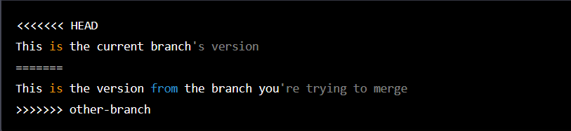

# Introduction 

## *This page contains all the interview questions related to Git.*


## **Q1. What is Git and how does it work?** ##

### Ans: 
- Git is a version control system for software development and other version-controlled projects. It helps keep track of changes made to the source code, and it makes it easier to collaborate on a project with other people.
- Git works by keeping track of changes made to a project in a repository, which is a centralized location where all the project files and the history of their changes are stored. Whenever a change is made, Git takes a snapshot of the project at that moment and stores it as a commit, along with a message that describes the change. These commits form a chain of changes, called a branch, which represents the entire history of the project.
- Each person who works on the project has a local copy of the repository on their own computer, and they can make changes and create new commits. When they want to share their changes with others, they push their branch to the centralized repository, where other people can pull it down to their own local copy and merge it with their own work.
- This way, Git helps to manage the complexity of multiple people working on the same project, by allowing them to work independently and only merging their changes when necessary. 


## **Q2. What is the difference between Git and GitHub?** ##
 


### Ans:
 Git and GitHub are related, but they are not the same thing.
- Git is a version control system that helps you manage the code for your projects. It lets you keep track of different versions of your code, collaborate with other people on the same codebase, and manage the changes you make over time. With Git, you can easily switch between different versions of your code, revert to earlier versions if you need to, and view a history of changes made to your code.
- GitHub, on the other hand, is a web-based platform that provides hosting for Git repositories. It's a place where you can store your Git projects online, share them with others, and collaborate with other people on the same projects. GitHub provides a user-friendly interface for managing Git repositories, making it easier to view and collaborate on code. It also provides additional features like bug tracking, project management, and wikis.
- ### In summary, Git is a version control system for managing code, and GitHub is a platform for storing and sharing Git repositories.


## **Q3. Can you explain the Git workflow?** ##


### Ans:
 Yes, of course! Git is a popular version control system that is widely used for software development and other collaborative projects. Here's a general overview of the Git workflow:

- **Initialize a Git repository:** To start using Git for version control, you need to initialize a Git repository in your project directory. This can be done using the command "git init".
- **Add files to the staging area:** Before you can commit changes to the repository, you need to add the files you want to track to the Git staging area. This can be done using the command "git add <file>".
- **Commit changes:** After you have added the files to the staging area, you can commit the changes to the repository. Committing creates a new snapshot of the project that includes all the changes you have made. This can be done using the command "git commit -m <message>".
- **Clone a repository:** If you want to work on a project that is hosted on a remote Git repository, you need to clone the repository to your local machine. This can be done using the command "git clone <repository>".
- **Create a branch:** In Git, it's a common practice to create a separate branch for each new feature or bug fix you want to work on. This way, you can make changes to the code without affecting the main branch. Branches can be created using the command "git branch <branch-name>".
- **Switch to a branch:** To start working on a particular branch, you need to switch to that branch. This can be done using the command "git checkout <branch-name>".
- **Push changes:** Once you have committed changes to your local branch, you can push the changes to the remote repository. This makes the changes available to other collaborators. This can be done using the command "git push origin <branch-name>".
- **Merge branches:** When you are ready to integrate changes from one branch into another, you need to merge the two branches. This can be done using the command "git merge <branch-name>".
- **Resolve conflicts:** If there are conflicts between the two branches, Git will ask you to resolve the conflicts manually. This involves editing the conflicting files to merge the changes from both branches.

This is a basic overview of the Git workflow. Of course, there are many more commands and options available in Git, but these are the most commonly used ones in a typical workflow.


## **Q4. What is a Git repository?** 


### Ans:

- A Git repository is a place where you can store your files and track changes to those files over time. It is a type of version control system that helps you manage and keep track of different versions of your software or files, making it easier to collaborate with others and maintain a complete history of your work. 
- A Git repository can reside locally on your computer or it can be stored remotely on a server and accessed over a network. With Git, you can track changes to your files, revert to earlier versions if necessary, and work on multiple branches to develop new features without affecting the main codebase.


## **Q5. Can you explain the difference between a Git repository and a working directory?** ##
### Ans:

Yes, I can explain the difference between a Git repository and a working directory.

- A Git repository is a virtual storage area where Git stores all the files, directories, and metadata for a project. It is the place where all the changes to the project are recorded, and it is used to track the project's history. The repository is stored on a Git server, and you can use Git commands to interact with it.

- A working directory, on the other hand, is a local copy of a Git repository on your computer's file system. It is the place where you work on the files and make changes. The changes you make in the working directory are not automatically recorded in the repository; you have to explicitly tell Git to stage and commit the changes. The working directory is a reflection of a specific state of the repository, and you can use Git commands to update the working directory to match the repository's latest state.

- In summary, a Git repository is the centralized place where all the changes to a project are recorded and stored, while a working directory is a local copy of the repository where you work on the project and make changes.


## **Q6. Can you explain the difference between a Git commit and a Git push?** ##
### Ans:

- A commit in Git is like a snapshot of your project's files and directories at a certain point in time. It records changes made to the repository and stores a reference to that snapshot. Committing changes allows you to track the history of your project and revert to a previous version if necessary. When you make a commit, the changes are stored locally on your machine.

- A push, on the other hand, is the action of sending your local commits to a remote repository, such as on Github or Gitlab. Pushing allows you to share your changes with others and collaborate on a project. When you push, your changes are transferred to the remote repository, where they can be accessed and reviewed by other members of your team.

- In summary, a commit records changes to the repository, while a push sends those changes to a remote repository for collaboration.


## **Q7. Can you describe the three-tree architecture of Git?** ##
### Ans:
Yes, I can! Git uses a unique three-tree architecture that helps it maintain the entire history of a project in a very efficient manner. The three trees in Git are:

- **The Working Tree:** This is the current version of the project on your local machine. It's the source code or files that you are actively working on.

- **The Index::** The Index is a staging area that holds a snapshot of the changes you have made to the Working Tree. The Index acts as a buffer between the Working Tree and the Repository. You can use Git commands to add changes to the Index and also remove changes from it before they get committed.

- **The Repository:** The Repository is a collection of all the committed changes in the project history. It is stored in a hidden .git folder in the root directory of the project. The Repository keeps track of all the changes made to the project, including when they were made, who made them, and why.

When you make changes to the Working Tree and want to save them, you use Git commands to add those changes to the Index. When you are ready to commit those changes, you use Git commands to save the changes in the Index to the Repository.

This three-tree architecture allows Git to keep track of every change made to the project and enables it to provide features such as version control, revert changes, and maintain multiple branches.


## **Q8. Can you describe the three-tree architecture of Git?** ##
### Ans:
A Git merge conflict occurs when two or more branches have made changes to the same line(s) of a file, and Git is unable to automatically resolve the differences. In such a scenario, you need to manually resolve the conflict before you can continue with the merge. Here's the process of resolving a Git merge conflict:

- **Identifying the conflict:** When you try to merge two branches and a conflict occurs, Git will mark the conflicting lines in the file, and the file will look something like this:



- **Resolving the conflict:** You need to manually edit the file and choose which version of the conflicting lines you want to keep. You can also choose to write completely new content in place of the conflicting lines. After making the changes, save the file.

- **Committing the resolution:** Once you have resolved the conflict, you need to commit the changes to complete the merge. You can use the command git add <file> to stage the file and then use git commit to finalize the merge and save the resolved conflict in the Git history.

- **Pushing the changes:** Finally, you need to push the changes to the remote repository if you are working in a collaborative environment.

In summary, resolving a Git merge conflict requires manual intervention, editing the conflicting lines of the file, committing the resolved conflict, and pushing the changes to the remote repository.


## **Q9. How do you handle a Git merge conflict?** ##
### Ans:

To handle a Git merge conflict, follow these steps:

- **Identify the conflicting files:** Git will mark the conflicting files in the working tree with conflict markers, such as <<<<<<<.

- **pen the conflicting file(s) in a text editor:** This will allow you to manually edit the file to resolve the conflict.

- **Review the changes:** Look for the conflict markers in the file and examine the different versions of the code that caused the conflict.

- **Decide on the correct version:** Choose the version of the code that you want to keep, or manually combine the changes from both versions into a new version.

- **Remove the conflict markers:** Once you have resolved the conflict, remove all of the conflict markers from the file.

- **Commit the changes:** After resolving all of the conflicts, stage the file and commit the changes to your local repository.

- **Push the changes:** Finally, push the changes to the remote repository to complete the merge.

It's important to note that resolving merge conflicts can be a challenging and time-consuming process, especially if you're working with complex code changes. However, taking the time to carefully review and resolve merge conflicts will help ensure that your Git repository remains in a consistent and stable state.


## **Q10. Can you explain the difference between a Git merge and a Git rebase?** ##
### Ans:

- Git merge is a command used to combine multiple branches into a single branch. When you perform a merge, Git automatically creates a new merge commit that ties together the histories of the different branches. This results in a linear history where all the changes from the merged branch are inserted into the main branch.

- On the other hand, Git rebase is a command used to integrate changes from one branch into another by reapplying the changes one by one on top of the destination branch. Unlike merge, rebase modifies the existing commit history and makes it appear as if the changes happened at once. This results in a linear and clean history, but can make it more difficult to understand the project's evolution, especially if you have multiple branches that were rebased on top of each other.

In conclusion, both Git merge and Git rebase serve the purpose of combining changes from different branches, but they do so in different ways. Merge is a simple way to preserve the branch history, while rebase is a more powerful tool that can help you maintain a linear history, but can also be more complex to use.


## **Q11.Can you describe the process of creating a Git branch?** ##

### Ans:

Yes, creating a branch in Git is a simple process. The following are the steps to create a branch in Git:

- Open the terminal and navigate to your Git repository.

- Run the following command to list all existing branches in your repository:

```
                              git branch
```
- To create a new branch, run the following command:
```
                              git branch [branch_name]
```
Replace [branch_name] with the name you want to give to your new branch.


- To switch to your newly created branch, run the following command:

```
                              git checkout [branch_name]
```

Now, you can start making changes to the code and committing them to this branch.

That's it! You have successfully created a Git branch and switched to it. To switch back to the master branch, simply run git checkout master.


## **Q12.How do you delete a Git branch?** ##

### Ans:

To delete a Git branch, you can use the following command:

```
                             $ git branch -d <branch_name>
```
This will delete the local branch. If you want to delete a remote branch, you can use the following command:

```
                             $ git push origin --delete <branch_name>
```
This will delete the remote branch. Note that you can only delete a branch if it has been fully merged into your current branch. If you have unmerged changes, you will need to resolve them before deleting the branch.


## **Q13. Can you explain the process of merging a Git branch?** ##

### Ans:

Yes, I can explain the process of merging a Git branch.

Here are the steps to merge a branch in Git:

- 
**Checkout the branch you want to merge into:** Before you merge, you need to make sure you're on the branch that you want to merge into. For example, if you want to merge branch feature into the main branch, you'll need to checkout the main branch.

```
                             $ git checkout main
```
- **Fetch the latest changes from the remote repository:** Before you start the merge, you should make sure you have the latest changes from the remote repository. You can do this using the git fetch command.

```
                             $ git fetch
```

- **Merge the branch:** Use the git merge command to merge the branch you want to merge. For example, if you want to merge the feature branch into the main branch, you'll run the following command:

```
                             $ git merge feature
```

- **Resolve conflicts (if any):** If there are conflicts between the two branches, Git will notify you, and you'll need to resolve those conflicts before you can complete the merge. You can do this by opening the conflicting files, and manually editing the code to resolve the conflicts.

- **Commit the merge:** After you've resolved any conflicts, you need to commit the merge. This will finalize the merge, and the changes from the feature branch will be merged into the main branch.

```
                             $ git commit -m "Merged feature branch into main"
```

- **Push the changes to the remote repository:** Finally, you need to push the changes to the remote repository. This will make the merge visible to others who are working on the project.

```
                             $ git push origin main
```
And that's it! These are the basic steps to merge a branch in Git.


## **Q14.Can you explain the process of reverting a Git commit?** 

### Ans:

To revert a Git commit, you can use the git revert command followed by the commit hash of the commit you want to revert. This will create a new commit that undoes the changes made in the original commit.

Here are the steps to revert a Git commit:

- Find the commit hash of the commit you want to revert by running git log.
- Run git revert <commit-hash> to create a new commit that reverts the changes made in the original commit.
- Review the changes in the new commit by running git diff or opening the file in an editor.
- Commit the changes by running git commit -m "Revert <commit-hash>"
- Push the changes to the remote repository by running git push.

It's important to note that git revert does not delete the original commit. Instead, it creates a new commit that undoes the changes made in the original commit. This means that you can revert a revert commit to bring back the original changes.


## **Q15.Can you explain the difference between a Git stash and a Git stash pop?** 

### Ans:

Yes, a Git stash is a command that allows you to temporarily save changes that are not ready to be committed, while Git stash pop is a command that applies the changes saved in the most recent stash and removes it from the stash list.

When you run `git stash`, Git saves the changes to a "stash" and reverts your working directory to the last committed state. This is useful when you need to temporarily switch to a different branch or work on a different task.

Later, when you want to retrieve the changes you stashed, you can use `git stash pop`. This command applies the changes from the most recent stash to your working directory and removes it from the stash list. If you want to apply the changes from a specific stash other than the most recent one, you can use `git stash apply` followed by the stash reference, such as `git stash apply stash@{2}`.


