# Introduction 

## *This page contains all the interview questions related to kubernetes.*

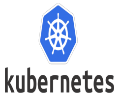


## **Q1. What is Kubernetes and why is it important in today's technology landscape?** ##

### Ans:


- Kubernetes is an open-source container orchestration platform that automates the deployment, scaling, and management of containerized applications. It was originally developed by Google and is now maintained by the Cloud Native Computing Foundation (CNCF).

- In today's technology landscape, Kubernetes has become an essential tool for deploying and managing containerized applications. Containers allow applications to run reliably and consistently across different computing environments, such as on-premise data centers, public clouds, and hybrid clouds. However, as the number of containers grows, managing them manually becomes increasingly complex and time-consuming.

- This is where Kubernetes comes in - it provides a unified platform for managing containers across different environments, automating tasks such as deployment, scaling, and load balancing. It also provides features such as self-healing, automatic rollbacks, and storage orchestration.

- Kubernetes is important because it enables organizations to deploy and manage applications more efficiently, with greater scalability and reliability. It also provides a standardized platform for developers and operations teams, reducing complexity and improving collaboration. Kubernetes has become the de facto standard for container orchestration and is widely used by organizations of all sizes, from small startups to large enterprises.


## **Q2.How does Kubernetes handle container orchestration, and what benefits does this provide?** ##

### Ans:

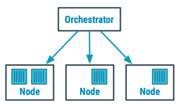

Kubernetes is an open-source container orchestration platform that automates the deployment, scaling, and management of containerized applications. It provides a way to manage and orchestrate containerized applications across a cluster of machines.

**Kubernetes achieves container orchestration through a variety of features and components, including:**

- **Containers**: Kubernetes uses containers, such as Docker, to package application code and dependencies. Containers provide a lightweight and portable way to package and deploy applications.

- **Nodes**: Kubernetes runs containers on a group of machines called nodes. Nodes can be physical machines, virtual machines, or cloud instances.

- **Pods**: Kubernetes groups one or more containers into a logical unit called a pod. Each pod runs on a single node and shares the same network namespace.

- **Services**: Kubernetes provides a way to expose a set of pods as a network service. This allows clients to access the pods using a stable, DNS name.

- **Controllers**: Kubernetes provides controllers that manage the desired state of pods and services. Controllers automatically scale up or down the number of replicas based on the desired state.

- **ConfigMaps and Secrets**: Kubernetes provides ConfigMaps and Secrets to store configuration data and sensitive information such as passwords and API keys. These can be used by containers at runtime.

**Kubernetes provides several benefits for container orchestration, including:**

- **Scalability**: Kubernetes allows you to scale your application up or down by adding or removing pods. This helps to ensure that your application can handle increased traffic or demand.

- **High availability**: Kubernetes can detect when a pod is unhealthy and automatically replace it with a healthy pod. This helps to ensure that your application is always available.

- **Self-healing**: Kubernetes can automatically restart failed containers, or even reschedule them to another node. This helps to ensure that your application is resilient to failure.

- **Portability**: Kubernetes provides a standardized way to deploy and manage containers, which makes it easier to move your applications between different environments and cloud providers.

- **Resource efficiency**: Kubernetes can pack multiple containers onto a single node, which helps to maximize resource utilization and reduce costs.

Overall, Kubernetes provides a powerful set of tools and features for container orchestration, which can help to streamline application deployment and management in modern cloud-native environments.


## **Q3.What are the core components of Kubernetes, and how do they work together?** ##

### Ans:

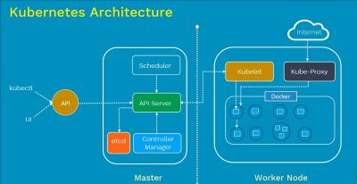

Kubernetes is a container orchestration platform that automates the deployment, scaling, and management of containerized applications. It provides a set of core components that work together to achieve these goals. The main components of Kubernetes are:

- **Master Node**: The Master Node is the control plane of the Kubernetes cluster, responsible for managing the overall state of the cluster. It includes several components:

  **a. API Server:** The API Server is the front-end for the Kubernetes control plane. It exposes the Kubernetes API, which enables users to interact with the cluster.

  **b. etcd:** etcd is a distributed key-value store used by Kubernetes to store configuration data, state data, and metadata about the objects in the cluster.

  **c. Controller Manager:** The Controller Manager runs a set of controllers that handle different aspects of the cluster's state. Examples include the ReplicaSet Controller, which manages the desired number of replicas of a given pod, and the Service Account Controller, which creates default accounts for pods.

  **d. Scheduler:** The Scheduler is responsible for assigning pods to nodes based on resource availability and other constraints.

- **Node**: Nodes are the worker machines that run containerized applications. They are responsible for running the containers and providing the necessary resources, such as CPU, memory, and storage. Each node runs several components:

  **a. Kubelet:** The Kubelet is the primary node agent that communicates with the API server and manages the state of the pods running on the node.

  **b. kube-proxy:** kube-proxy is responsible for network proxying and load balancing on each node.

  **c. Container Runtime:** The Container Runtime is the software that runs containers. Kubernetes supports several container runtimes, including Docker, CRI-O, and containerd.

- **Object**: In Kubernetes, an object is an abstraction representing a desired state of the cluster. Examples of objects include pods, services, and deployments. Each object has a YAML or JSON file that defines its desired state.

- **Controller**: Controllers are the components responsible for ensuring that the current state of the cluster matches the desired state. They do this by watching the API server for changes to objects and taking appropriate action to bring the cluster into the desired state.

The core components of Kubernetes work together to provide a powerful and flexible platform for managing containerized applications. By automating many aspects of the deployment, scaling, and management of applications, Kubernetes enables developers to focus on building and improving their applications without worrying about the underlying infrastructure.


## **Q4.What is a Kubernetes cluster, and how is it set up?** ##

### Ans:

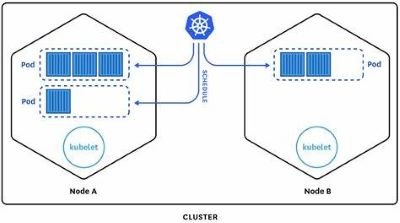

Kubernetes is an open-source container orchestration platform that automates the deployment, scaling, and management of containerized applications. A Kubernetes cluster is a group of nodes that work together to run containerized applications.

Each node in the Kubernetes cluster can host multiple containers, and they communicate with each other through a shared network. Kubernetes takes care of load balancing, networking, and scaling of the containers running in the cluster.

To set up a Kubernetes cluster, you need to perform the following steps:

- **Choose a container runtime:** Kubernetes supports different container runtimes, such as Docker, containerd, and CRI-O. Choose one that suits your needs.

- **Set up the master node:** The master node is responsible for managing the cluster's overall state and orchestrating the deployment of containers across the worker nodes. You can set up the master node on a dedicated machine or in the cloud.

- **Set up the worker nodes:** Worker nodes are where the containers are run. You can set up one or more worker nodes, depending on your needs. Each worker node requires a container runtime and a Kubernetes agent.

- **Configure networking:** Kubernetes uses a virtual network to allow the containers running on different nodes to communicate with each other. You need to set up a networking solution that allows the nodes to communicate.

- **Deploy and manage applications:** Once your Kubernetes cluster is set up, you can deploy your applications using Kubernetes objects like Pods, Services, Deployments, and others. You can manage the applications running in the cluster through the Kubernetes API or through the Kubernetes dashboard.

There are various tools available to help you set up a Kubernetes cluster, such as kubeadm, kops, and Rancher. These tools simplify the process of setting up a Kubernetes cluster by automating many of the steps mentioned above.


## **Q5.How does Kubernetes manage containers in a cluster, and what tools does it provide for monitoring and managing them?** ##

### Ans:

Kubernetes is an open-source container orchestration platform that automates the deployment, scaling, and management of containerized applications in a cluster. It provides a rich set of tools for managing and monitoring containers in a cluster, which are described below.

- **Pod management:** A pod is the smallest deployable unit in Kubernetes, and it consists of one or more containers. Kubernetes manages pods by scheduling them to run on available nodes in the cluster. It ensures that the desired number of replicas of a pod is running at any given time, and it can automatically restart failed pods.

- **Deployment management:** Kubernetes provides deployment objects, which are used to manage the rollout and scaling of application updates. Deployments manage replica sets, which ensure that a specified number of pod replicas are running at any given time. Kubernetes can perform rolling updates, which allow you to update your application without downtime, by gradually replacing old pods with new ones.

- **Service discovery and load balancing:** Kubernetes provides a service object, which is used to abstract the networking details of pods and expose them to other parts of the cluster or to the internet. Services can be load-balanced across multiple pods, and Kubernetes can automatically create DNS entries for services.

- **Resource allocation:** Kubernetes allows you to specify resource limits and requests for containers, which helps ensure that containers have the necessary resources to run. Kubernetes can also scale up or down the number of replicas of a pod based on CPU or memory usage.

- **Monitoring and logging:** Kubernetes provides a variety of tools for monitoring and logging containers, including the ability to view container logs and metrics. Kubernetes also integrates with many popular monitoring and logging tools, such as Prometheus and Elasticsearch.

- **Self-healing:** Kubernetes provides automatic self-healing capabilities, such as automatic restarts of failed containers or pods, and automatic rescheduling of containers or pods that have been evicted from a node.

Overall, Kubernetes provides a robust set of tools for managing and monitoring containers in a cluster, making it a popular choice for container orchestration.

## **Q6.What are the differences between a deployment, a replica set, and a pod in Kubernetes?** ##

### Ans:

In Kubernetes, a deployment, a replica set, and a pod are all abstractions that help manage the deployment and scaling of containers. Here are the differences between them:

- **Pod:**
A Pod is the smallest and simplest unit in Kubernetes. It represents a single instance of a running process in a cluster. A Pod can contain one or more containers that share the same network namespace, and they can communicate with each other using the localhost interface. Pods are usually not deployed directly, but as part of a higher-level abstraction like a Deployment or a ReplicaSet.

- **ReplicaSet:**
A ReplicaSet is a higher-level abstraction that ensures that a specified number of identical pods are running at all times. It monitors the state of the pods and creates or deletes them as necessary to maintain the desired number. ReplicaSets are used to ensure high availability and scalability of an application.

- **Deployment:**
A Deployment is a higher-level abstraction that manages the deployment of ReplicaSets. It provides declarative updates for Pods and ReplicaSets, allowing you to update your application without downtime. A Deployment can be thought of as a blueprint for creating and updating ReplicaSets. It manages the ReplicaSets to ensure that the desired number of replicas is always available, and it can roll out updates to the ReplicaSets in a controlled manner.

In summary, a Pod is the smallest unit in Kubernetes, a ReplicaSet ensures a specified number of identical pods are running, and a Deployment manages the deployment and updates of ReplicaSets.

## **Q7.How does Kubernetes handle scaling and load balancing, and what options are available for these tasks?** ##

### Ans:

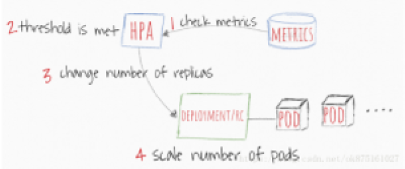   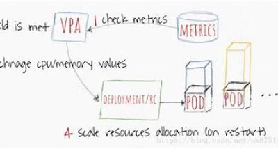 


Here is a high-level description of the process of releasing a new feature using a DevOps approach:

Kubernetes is designed to handle scaling and load balancing in a flexible and efficient manner. It provides several options for scaling and load balancing, which can be configured based on the specific needs of an application.

Here are some of the options available in Kubernetes for scaling and load balancing:

- **Horizontal Pod Autoscaler (HPA)**: The HPA automatically scales the number of pods running in a Kubernetes deployment based on CPU utilization or custom metrics. When the CPU or custom metrics reach a certain threshold, the HPA creates new pods to handle the increased load.

- **Vertical Pod Autoscaler (VPA)**: The VPA automatically adjusts the CPU and memory resources allocated to each pod based on the actual usage. This helps to ensure that the pods have the resources they need to handle the workload.

- **Cluster Autoscaler**: The Cluster Autoscaler automatically adjusts the number of nodes in a Kubernetes cluster based on the workload. When the workload increases, the Cluster Autoscaler creates new nodes to handle the load, and when the workload decreases, it removes the nodes to save resources.

- **Service Load Balancer**: Kubernetes provides a built-in service load balancer that distributes traffic across multiple pods based on a set of rules. This helps to ensure that no single pod becomes overloaded with traffic.

- **Ingress**: Kubernetes also provides an Ingress controller that allows traffic to be routed to different services within a cluster based on specific rules. This is particularly useful when dealing with external traffic that needs to be distributed across multiple services.

- **External Load Balancer**: Kubernetes can also integrate with external load balancers provided by cloud providers or third-party vendors.

Overall, Kubernetes offers a variety of options for scaling and load balancing that can be tailored to the specific needs of an application.


## **Q8.What is a Kubernetes namespace, and how is it used?** ##

### Ans:
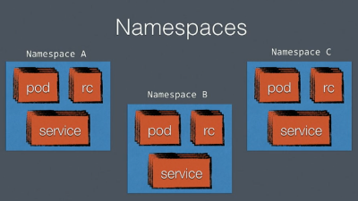

In Kubernetes, a namespace is a way to group and organize resources, such as pods, services, and deployments, within a cluster. Namespaces provide a way to create virtual clusters within a physical cluster, allowing teams to share a cluster without interfering with each other's work.

Each namespace has its own set of resources, and resources in one namespace are isolated from those in another namespace. This allows teams to work independently, with their own resources and policies, even if they are sharing the same physical cluster.

Namespaces can be used to:

- **Separate workloads**: Teams can use namespaces to create virtual clusters and isolate their workloads from each other, reducing the risk of conflicts and making it easier to manage resources.

- **Set resource quotas**: Namespaces can be used to enforce resource quotas, limiting the amount of CPU, memory, and storage that can be used by resources in a namespace.

- **Apply policies**: Namespaces can be used to apply policies, such as network policies, that control access between resources in a namespace or between namespaces.

- **Simplify management**: By grouping resources within namespaces, it becomes easier to manage and troubleshoot resources.

- **Share a cluster**: When multiple teams need to use the same physical cluster, namespaces provide a way to share the cluster while still maintaining isolation and control.

In summary, Kubernetes namespaces provide a way to organize and isolate resources within a cluster, enabling teams to work independently and share a cluster with others.


## **Q9.What are Kubernetes labels and selectors, and how do they work together to group and manage resources?** ##

### Ans:

- In Kubernetes, labels are key/value pairs that can be attached to resources such as pods, services, deployments, and replica sets. Labels are used to identify and organize resources based on their attributes, properties, or functionalities.

- Selectors, on the other hand, are queries that use label expressions to select resources that have specific labels. Selectors are used to group resources based on their labels, and to apply actions or configurations to the selected resources.

- Kubernetes labels and selectors work together to allow you to manage resources more effectively. You can attach labels to resources when you create them, or you can add or modify labels later using the Kubernetes API or command-line tools. Once you have labeled your resources, you can use selectors to group them based on specific label values. You can then apply configurations, policies, or other actions to the entire group of resources, rather than managing each resource individually.

- For example, you could label your pods with the key "environment" and values "dev", "test", or "prod" depending on which environment they are running in. Then you could use a selector to group all pods running in the "prod" environment, and apply a specific configuration to them, such as increasing the number of replicas or applying a new image.

- Kubernetes labels and selectors provide a powerful way to manage and organize resources in a Kubernetes cluster, and they are widely used in production deployments to simplify management and reduce errors.

## **Q10. How does Kubernetes handle storage, and what options are available for persistent storage?.How do you handle security in a DevOps environment?** ##

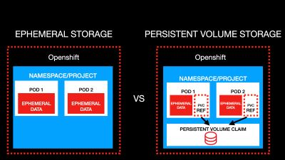  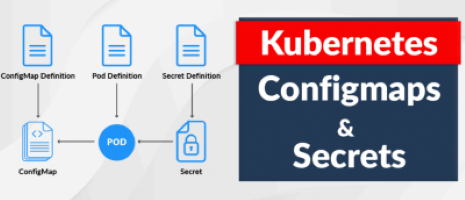
### Ans:
Kubernetes provides several options for handling storage, including both ephemeral (temporary) storage and persistent storage. Here are the most common ways Kubernetes handles storage:

- **Ephemeral storage**: Ephemeral storage refers to temporary storage that is attached to a pod during its lifetime. Ephemeral storage is typically used for storing data that is not critical to the application's state, such as logs or temporary files. Ephemeral storage is handled by Kubernetes' built-in storage drivers, which include emptyDir and hostPath.

- **Persistent Volumes**: Persistent volumes are used to store data that needs to survive the lifetime of a pod. Persistent volumes are backed by a physical storage device, such as a network-attached storage (NAS) system, and can be dynamically provisioned by Kubernetes or manually created by an administrator. The storage device is accessed through a storage class, which defines the type of storage to be used (such as block or file) and any additional parameters that may be required.

- **StatefulSets**: StatefulSets are a Kubernetes resource that enables the deployment of stateful applications, such as databases or other data services. StatefulSets provide unique identities and persistent storage for each pod, ensuring that data is not lost when a pod is destroyed or rescheduled. StatefulSets use persistent volumes for storage.

- **ConfigMaps**: ConfigMaps are used to store configuration data for applications. ConfigMaps can be used to store data such as environment variables, command-line arguments, and configuration files. ConfigMaps can be mounted as volumes in a pod, allowing the application to read the configuration data as if it were a file.

- **Secrets**: Secrets are used to store sensitive data, such as passwords or API keys. Secrets can be mounted as volumes in a pod, allowing the application to access the sensitive data as if it were a file. Secrets are encrypted at rest in etcd, Kubernetes' distributed key-value store.

Overall, Kubernetes provides a robust set of tools for handling storage in a variety of use cases. By using the appropriate storage options, you can ensure that your applications have access to the data they need and that the data is stored in a secure and reliable manner.


## **Q11.What is a Kubernetes service, and how does it provide network connectivity between containers in a cluster?** ##

### Ans:

- In Kubernetes, a service is an abstraction that provides network connectivity to a set of pods (a group of one or more containers). A service acts as a stable endpoint for clients to connect to, even as the underlying pods may come and go. Services provide a way to expose a set of pods to the network, and they can be used to load balance traffic between the pods.

- When you create a service in Kubernetes, you specify a selector that identifies a set of pods that the service should target. Kubernetes then creates an internal load balancer that forwards traffic to one of the selected pods. The service has a stable IP address that clients can use to connect to it, and the load balancer ensures that traffic is distributed across the available pods.

- Services can be accessed from within the cluster or from outside the cluster, depending on how they are configured. Kubernetes supports several types of services, including ClusterIP, NodePort, LoadBalancer, and ExternalName.

- The ClusterIP type provides a virtual IP address that is only reachable from within the cluster. The NodePort type exposes the service on a port on each node in the cluster, and is accessible from outside the cluster. The LoadBalancer type creates an external load balancer that routes traffic to the service. The ExternalName type provides a DNS name that points to an external service.

- In summary, a Kubernetes service is a way to provide network connectivity between a set of pods, and it provides a stable endpoint for clients to connect to, even as the underlying pods may come and go. Services are a key feature of Kubernetes that enable you to build scalable and resilient applications.


## **Q12.How does Kubernetes handle updates and rollbacks, and what strategies are available for these tasks?** ##

### Ans:

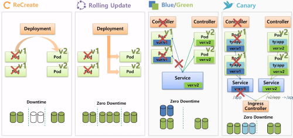

Kubernetes provides several strategies for updating and rolling back applications running in a cluster. These strategies help ensure that updates can be applied without disrupting the availability of your applications. Here are some of the main strategies:

- **Rolling updates**: This is the default update strategy in Kubernetes. In a rolling update, a new version of the application is deployed to a small number of nodes at a time. Once the new version is running and stable, the next set of nodes is updated, and so on, until all nodes have been updated. This approach minimizes downtime and ensures that the application remains available throughout the update process.

- **Blue/green deployments**: In a blue/green deployment, two identical environments are set up, one running the current version of the application (the "blue" environment) and the other running the new version (the "green" environment). Once the green environment is stable, traffic is switched over to it, and the blue environment is decommissioned. This approach provides a fast rollback option since the previous version of the application is still running.

- **Canary deployments**: In a canary deployment, a new version of the application is deployed to a small percentage of nodes, and a small percentage of traffic is routed to the new version. The rest of the traffic is still directed to the previous version. If the new version performs well, the percentage of traffic routed to it can be gradually increased until all traffic is directed to the new version. This approach provides a way to test the new version with minimal risk.

- **Rollbacks**: Kubernetes provides an easy way to roll back to a previous version of an application if an update goes wrong. You can simply use the kubectl rollout undo command to roll back to the previous version.

Kubernetes also provides a feature called "readiness probes" that allows you to specify a command or HTTP endpoint that Kubernetes should check before considering a new version of the application ready. This helps ensure that the new version is stable before it is rolled out to all nodes.

Overall, Kubernetes provides a variety of strategies for updating and rolling back applications, and choosing the right strategy depends on the specific needs of your application and the level of risk you're willing to take.


## **Q13.What is a Kubernetes stateful set, and how is it used?** ##

### Ans:

- Kubernetes StatefulSets are a type of workload API object used to manage stateful applications, such as databases or other distributed systems, in a Kubernetes cluster.

- StatefulSets provide guarantees about the identity and ordering of Pods when creating, scaling, or deleting a set of replicas. Each Pod in a StatefulSet is assigned a unique, stable hostname and stable storage, which is maintained across Pod rescheduling or scaling events. This allows for stateful applications to be deployed on Kubernetes with requirements for persistent storage and ordering of operations, such as sequential startup or shutdown procedures.

- StatefulSets are useful for applications that require unique identities or stable network addresses, such as database replicas or distributed systems with strict consistency and coordination requirements. Some examples of stateful applications that can be managed with StatefulSets include Elasticsearch, Kafka, and Cassandra.

- To use a StatefulSet, you define a specification that includes the desired number of replicas, the template for creating each Pod, and any other configuration required for the application. When the StatefulSet is created, it will automatically create and manage the required number of Pods, ensuring that each has a unique identity and stable storage.

- Scaling a StatefulSet involves updating the number of replicas, which triggers the creation or deletion of Pods as necessary, while maintaining the identity and storage guarantees of the application. Updating the specification of a StatefulSet allows for changes to the configuration of the application, such as updating the image used in the Pod template.

- Overall, StatefulSets provide a powerful tool for deploying and managing stateful applications on Kubernetes, with guarantees around identity and ordering that make it easier to build and maintain complex, distributed systems.


## **Q14. What is a Kubernetes config map, and how is it used?** ##

### Ans:
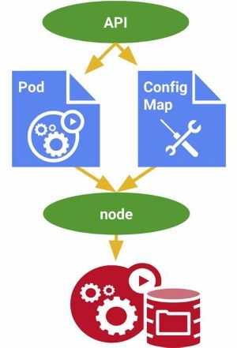

- In Kubernetes, a ConfigMap is an object used to store configuration data in key-value pairs that can be used by containers and pods running in a cluster. It is a way to decouple configuration details from application code, allowing you to manage configuration separately from the application.

- A ConfigMap can be created using the Kubernetes API or CLI tools. The data stored in a ConfigMap can include environment variables, command-line arguments, configuration files, or any other type of data that is needed to configure a container. Once a ConfigMap is created, it can be mounted as a volume in a pod, or its values can be injected as environment variables.

- ConfigMaps are useful for managing configuration data across multiple pods or containers. When the configuration data changes, you can update the ConfigMap and the changes will be automatically propagated to all the pods and containers that use it.

- To use a ConfigMap in a pod, you can define a volume mount for the ConfigMap in the pod's manifest file. For example, the following YAML code shows how to define a ConfigMap named "my-config" and mount it as a volume in a pod:

``` 
apiVersion: v1
kind: Pod
metadata:
  name: my-pod
spec:
  containers:
  - name: my-container
    image: my-image
    volumeMounts:
    - name: config-volume
      mountPath: /etc/config
  volumes:
  - name: config-volume
    configMap:
      name: my-config

``` 

In this example, the "my-config" ConfigMap is mounted as a volume in the pod at the path "/etc/config", and the values of the ConfigMap are available to the container as files in the volume.

In summary, ConfigMaps are used in Kubernetes to store and manage configuration data that can be used by containers and pods in a cluster. They provide a way to separate configuration details from application code, making it easier to manage configuration data across multiple pods and containers.

## **Q15.How does Kubernetes handle security, and what options are available for securing a cluster?** ##

### Ans:

Kubernetes provides a number of security features that can be used to secure a cluster. Here are some options available for securing a Kubernetes cluster:

- **Authentication and Authorization**: Kubernetes provides various authentication and authorization mechanisms to control access to the cluster. Users can authenticate using certificates, tokens, or external authentication providers like LDAP, OAuth, or OpenID Connect. Kubernetes also provides Role-Based Access Control (RBAC), which enables administrators to define policies that specify which users or groups have access to which resources.

- **Network security**: Kubernetes provides network policies that allow administrators to define rules for how pods can communicate with each other and with external services. This enables administrators to segment the network and restrict access to sensitive resources.

- **Secrets management**: Kubernetes provides a secure way to store and manage sensitive information, such as API keys and database passwords. Secrets can be encrypted at rest and in transit, and are only accessible to authorized users and applications.

- **Container security**: Kubernetes provides several features to secure containers, including read-only file systems, container isolation, and security contexts. Kubernetes also provides pod security policies that enable administrators to define security policies for pods running on the cluster.

- **Audit logging**: Kubernetes provides audit logging, which enables administrators to track all activity in the cluster. This can be used for compliance purposes and to detect and investigate security incidents.

- **Image security**: Kubernetes provides image verification and policy enforcement capabilities, ensuring that only trusted images are deployed on the cluster.

- **Third-party security solutions**: There are also a number of third-party security solutions that can be integrated with Kubernetes, including intrusion detection systems, firewalls, and vulnerability scanners.

Overall, Kubernetes provides a range of built-in security features that can be used to secure a cluster, and additional third-party solutions can be used to augment these features. It's important for administrators to configure and use these security features appropriately to ensure that their cluster is properly secured.


## **Q16.What is a Kubernetes operator, and how is it used?** ##

### Ans:

- Kubernetes operator is a piece of software that extends the Kubernetes API to manage complex, stateful applications in a more automated and declarative way. It's essentially an abstraction layer on top of Kubernetes that provides a higher-level of automation for managing applications that require custom logic and domain-specific knowledge.

- An operator is designed to automate the deployment, scaling, and management of applications by leveraging the Kubernetes API to perform these tasks. It can monitor the state of the application and perform actions in response to changes in the environment or user-defined events. This enables operators to manage complex applications that require multiple components to be deployed and coordinated, and can help to reduce the complexity and human intervention required to operate these applications.

- Operators are typically built using the Kubernetes Operator Framework, which provides a set of tools and guidelines for developing and managing operators. The framework includes tools for generating the necessary Kubernetes API resources, as well as libraries for writing controllers and operators that can automate the management of complex applications.

- Operators can be used to manage a wide range of applications, including databases, message brokers, and other stateful applications that require custom logic to operate effectively. They can also be used to automate the management of applications that require custom configurations or other specialized knowledge to operate, making it easier to deploy and manage these applications on Kubernetes.


## **Q17.What is a Kubernetes admission controller, and how is it used?** ##

### Ans:

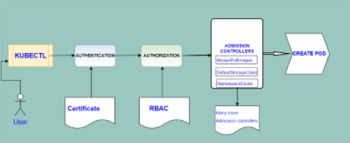

- Kubernetes admission controllers are a feature of the Kubernetes API server that enable fine-grained control over the creation and modification of objects in a Kubernetes cluster. Admission controllers intercept requests to the Kubernetes API server and can be used to modify or reject those requests based on policies or rules.

- Admission controllers are used to enforce security policies, ensure compliance with organizational or regulatory standards, and to automate administrative tasks. Examples of admission controllers include the ValidatingAdmissionWebhook, which can be used to validate incoming requests against custom rules, and the MutatingAdmissionWebhook, which can be used to modify requests before they are processed.

- When a request is made to create or modify an object in Kubernetes, the admission controller intercepts the request and performs any necessary actions before allowing the request to be processed. For example, if a request is made to create a new Pod, a validating admission controller might check that the Pod has a valid label or that it meets certain resource requirements before allowing the request to be processed.

- Admission controllers can be used to customize the behavior of the Kubernetes API server to meet specific requirements, and they can be implemented using a variety of programming languages and tools, including shell scripts, Python, Go, and more. Additionally, Kubernetes provides a set of built-in admission controllers that can be enabled or disabled as needed.

## **Q18.How does Kubernetes handle networking, and what options are available for configuring network policies?** ##

### Ans:
Kubernetes handles networking through a combination of its networking model and the networking capabilities provided by the underlying infrastructure. The Kubernetes networking model defines how Pods communicate with each other and with the outside world.

In Kubernetes, every Pod has its own IP address, which is unique within the cluster. Pods can communicate with each other using this IP address, regardless of the host they are running on. Kubernetes also provides a Service abstraction, which groups together a set of Pods and provides a stable, virtual IP address and DNS name for the Service. Clients can use this virtual IP address and DNS name to connect to the Service, which will then route the traffic to one of the Pods behind the Service.

To control traffic flow between Pods and Services, Kubernetes provides network policies. Network policies define rules for how traffic is allowed to flow between Pods and Services, based on labels and selectors. Some of the options available for configuring network policies in Kubernetes include:

- **` allow`  and ` deny`  rules**: Network policies can include ` allow`  and ` deny`  rules to control traffic flow. These rules can be based on IP addresses, port numbers, and protocol types.

- **Pod selectors**: Network policies can use Pod selectors to define which Pods the policy applies to. For example, a network policy might allow traffic only between Pods with a certain label.

- **Service selectors**: Network policies can use Service selectors to define which Services the policy applies to. For example, a network policy might allow traffic only to a specific Service.

- **Ingress and egress policies**: Network policies can define rules for inbound (ingress) and outbound (egress) traffic. For example, a network policy might allow inbound traffic to a specific Service, but deny outbound traffic from that Service.

- **Namespace isolation**: Network policies can be applied at the namespace level to isolate network traffic between different parts of the cluster.

Overall, Kubernetes provides a flexible and powerful set of networking capabilities, and network policies provide a granular way to control traffic flow within the cluster.


## **Q19.How does Kubernetes handle logging and monitoring, and what tools are available for this task?** ##

### Ans:
Kubernetes provides a few options for logging and monitoring of applications running in its clusters. Here are some of the ways that Kubernetes handles logging and monitoring:

- **Kubernetes API server logs**: Kubernetes API server logs provide information about the state of the Kubernetes API server and its interactions with other components. These logs are useful for debugging issues related to the Kubernetes API server.

- **Container logs**: Kubernetes supports various logging drivers, including JSON-file, journald, and syslog, that can be used to collect logs generated by containers running in a cluster. These logs can be accessed using Kubernetes commands or third-party logging tools like Elasticsearch, Fluentd, and Logstash.

- **Cluster-level monitoring**: Kubernetes provides a built-in monitoring solution called the Kubernetes Monitoring Stack (KMS). KMS uses Prometheus as its core monitoring engine and provides metrics for the Kubernetes control plane components, nodes, and workloads running in the cluster.

- **Application-level monitoring**: Kubernetes supports various tools and platforms for application-level monitoring. For example, you can use open-source tools like Grafana, Prometheus, and Jaeger to monitor and visualize application performance and identify issues in real-time.

- **Custom logging and monitoring**: Kubernetes also allows for the use of custom logging and monitoring solutions, depending on the specific needs of an organization. Many third-party vendors provide logging and monitoring solutions specifically designed for Kubernetes.

In summary, Kubernetes offers a variety of options for logging and monitoring applications running in its clusters, including Kubernetes API server logs, container logs, built-in monitoring with KMS, application-level monitoring tools, and custom logging and monitoring solutions. By leveraging these tools, organizations can effectively monitor the health and performance of their Kubernetes-based applications.


## **Q20.What are some best practices for managing a Kubernetes cluster, and how can you ensure high availability and reliability?** ##

### Ans:

Here are some best practices for managing a Kubernetes cluster and ensuring high availability and reliability:

- **Use a production-grade Kubernetes distribution**: Choose a production-grade Kubernetes distribution, such as Red Hat OpenShift, Google Kubernetes Engine, or Azure Kubernetes Service. These distributions are designed to provide a secure, scalable, and highly available Kubernetes platform.

- **Use a multi-node cluster**: Use a multi-node cluster with at least three master nodes and three worker nodes. This will ensure high availability and reliability, as if one node fails, the workload can be automatically moved to another node.

- **Monitor your cluster**: Monitor your cluster using a monitoring tool such as Prometheus, Grafana, or Datadog. This will help you detect and troubleshoot issues before they become critical.

- **Use resource quotas**: Use resource quotas to limit the amount of CPU and memory that each workload can use. This will prevent workloads from consuming too much resources and causing other workloads to fail.

- **Use labels and selectors**: Use labels and selectors to organize and manage your workloads. This will help you easily manage and scale your workloads.

- **Use rolling updates**: Use rolling updates to deploy updates to your workloads without causing downtime. This will ensure high availability and reliability.

- **Use backups and disaster recovery**: Use backups and disaster recovery procedures to ensure that you can recover your cluster in case of a disaster. This includes regular backups of your etcd database, as well as a disaster recovery plan that outlines how to restore your cluster in case of a complete failure.

- **Stay up to date**: Keep your Kubernetes cluster up to date with the latest security patches and updates. This will ensure that your cluster is secure and reliable.

By following these best practices, you can ensure that your Kubernetes cluster is highly available and reliable, and that your workloads are running smoothly.

