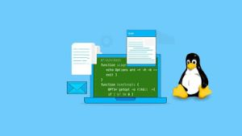

# Introduction 

## *This page contains all the interview questions related to Linux.*


## **Q1. Can you explain the difference between a Linux distribution and the Linux kernel?** ##

### Ans:

- The Linux kernel is the core component of the operating system. It is a software program that manages the computer hardware and provides a foundation for other software to run on top of it. The Linux kernel is developed by a community of developers and is released under an open-source license, which means that anyone can use, modify, and distribute the code.

- A Linux distribution, on the other hand, is a complete operating system that includes not only the Linux kernel, but also other software such as utilities, libraries, applications, and graphical interfaces. The distribution takes the Linux kernel and adds other software to create a functional operating system that can be installed on a computer.

- Linux distributions are created by individuals, organizations, or companies that take the Linux kernel and build their own custom distribution by adding or removing software packages to suit their specific needs or preferences. Some popular Linux distributions include Ubuntu, Debian, Fedora, and CentOS.

In summary, the Linux kernel is the core component of the operating system, while a Linux distribution is a complete operating system that includes the Linux kernel and other software.


## **Q2.Can you describe the process of installing a Linux operating system?** ##

### Ans:


The process of installing a Linux operating system. Here is a general outline of the process:

- **Choose a Linux distribution:** There are many different Linux distributions available, each with their own unique features and characteristics. Some popular distributions include Ubuntu, Fedora, Debian, and CentOS.

- **Download the installation image:** Once you have selected a distribution, you will need to download the installation image. This is typically a large file in the form of an ISO image that you will need to burn to a DVD or USB drive.

- **Create installation media:** Use a USB drive or a DVD to create an installation media using the downloaded image. You can use a tool like Rufus, Unetbootin, or BalenaEtcher to create the bootable media.

- **Boot from the installation media:** Insert the USB drive or DVD into the computer that you want to install Linux on and boot from it. You may need to change the boot order in the BIOS or UEFI settings to boot from the installation media.

- **Select installation options:** Once you have booted from the installation media, you will be presented with a menu of installation options. You will need to select your language, time zone, keyboard layout, and other basic settings.

- **Partition your hard drive:** Linux requires at least one partition to be installed on. You can choose to use the entire disk, create a single partition or multiple partitions based on your needs.

- **Select installation type:** Depending on the distribution, you may be presented with different installation types such as "minimal", "desktop", "server", etc. Choose the type of installation that you want to proceed with.

- **Create a user account:** Create a user account for yourself with a username and password.

- **Install the operating system:** Start the installation and wait for it to complete. This can take some time, depending on the speed of your computer and the size of the installation.

- **Reboot the system:** Once the installation is complete, you will be prompted to reboot your system. Remove the installation media and reboot the computer.

- **Log in and update:** Once the system has rebooted, log in with your user account and update the system to ensure that it is up to date and secure.

That's a general outline of the process of installing a Linux operating system. The exact steps may vary depending on the distribution and the options that you choose.


## **Q3.Can you explain the difference between a GUI and a command line interface (CLI)?** ##

### Ans:

     

-  GUI (Graphical User Interface) is a visual interface that allows users to interact with a computer using graphical elements such as windows, icons, menus, and buttons. The user can navigate and manipulate these elements using a mouse or other pointing device. GUIs are typically used in operating systems, applications, and websites to provide an intuitive, easy-to-use interface for users who may not be comfortable with a text-based interface.

- On the other hand, a CLI (Command Line Interface) is a text-based interface that allows users to interact with a computer using text commands. The user types in commands to a command line prompt, and the computer responds with text-based output. CLI interfaces are typically used by developers, system administrators, and power users who require precise control over the system, as CLI commands can be very specific and powerful.

- One of the main differences between GUIs and CLIs is their level of user-friendliness. GUIs are generally easier to use and require less technical knowledge, while CLIs require a certain level of technical knowledge to use effectively. However, CLIs can be much faster and more efficient for experienced users, as they can perform complex operations quickly using a series of typed commands, without having to navigate through menus and dialog boxes.

- Another difference is the level of control that each interface provides. GUIs typically provide a limited set of options and are designed to simplify tasks for the average user, while CLIs can provide a much wider range of options and enable users to perform more complex tasks and automate repetitive tasks more easily.

In summary, GUIs and CLIs are two different types of interfaces used to interact with a computer. GUIs are graphical, user-friendly, and easier to learn, while CLIs are text-based, require more technical knowledge, but provide more control and are generally faster and more efficient for experienced users.


## **Q4.Can you explain the concept of a Linux file system hierarchy?** ##

### Ans:

  

Certainly! The Linux file system hierarchy is a way of organizing files and directories in a Linux system. It defines a standard structure for where different types of files should be located, and makes it easy for users and system administrators to find and access files.

Here is a brief overview of the different levels of the Linux file system hierarchy:

- **/ :** This is the root directory of the entire file system, and all other directories and files are organized beneath it.

- **/bin :** This directory contains essential system binaries and executables that are necessary for the system to function properly. Examples include commands like "ls" and "mkdir".

- **/boot :** This directory contains the files needed to boot the system, including the kernel and bootloader.

- **/dev :** This directory contains device files, which are special files that represent hardware devices like hard drives, USB drives, and other peripherals.

- **/etc :** This directory contains system-wide configuration files, such as network settings and user accounts.

- **/home :** This directory is where user home directories are located. Each user has a subdirectory here for their personal files and settings.

- **/lib :** This directory contains shared libraries that are needed by the system and by other programs.

- **/media :** This directory is used for mounting removable media like CDs, DVDs, and USB drives.

- **/mnt :** This directory is used for temporarily mounting file systems, such as network file systems or other storage devices.

- **/opt :** This directory is used for optional or third-party software packages.

- **/proc :** This directory provides information about system processes and kernel configuration settings.

- **/root :** This is the home directory of the system administrator, or root user.

- **/run :** This directory contains system state information that is used by various system services.

- **/sbin :** This directory contains system binaries and executables that are only used by the system administrator.

- **/tmp :** This directory is used for temporary files that are created by various system and user processes.

- **/usr :** This directory contains user-level programs, libraries, and documentation.

- **/var :** This directory contains variable data that is generated by the system and by various services, such as log files and spool directories.

This hierarchy provides a logical and consistent way to organize the files and directories in a Linux system, which makes it easy to navigate and manage.


## **Q5.Can you describe the process of creating and deleting files and directories in Linux?** ##

### Ans:

The process of creating and deleting files and directories in Linux.

- **Creating Files:**
To create a new file in Linux, you can use the touch command followed by the name of the file you want to create. For example, to create a file named example.txt, you can use the following command:

 **`touch example.txt `**


Alternatively, you can also create a new file using a text editor such as `nano`, `vi`, or `emacs`. For example, to create a new file named `example.txt` using nano, you can use the following command:

 **`nano example.txt`**

- **Deleting Files:**
To delete a file in Linux, you can use the `rm` command followed by the name of the file you want to delete. For example, to delete a file named `example.txt`, you can use the following command:

 **`rm example.txt`**

Note that this command will permanently delete the file, so use it with caution. If you want to confirm before deleting, you can use the -i option like so:

 **`rm -i example.txt`**

- **Creating Directories:**
To create a new directory in Linux, you can use the `mkdir` command followed by the name of the directory you want to create. For example, to create a directory named `my_folder`, you can use the following command:

 **`mkdir my_folder`**

- **Deleting Directories:**

To delete a directory in Linux, you can use the `rmdir` command followed by the name of the directory you want to delete. For example, to delete a directory named `my_folder`, you can use the following command:

 **`rmdir my_folder`**

Note that this command will only delete an empty directory. If the directory contains files or subdirectories, you can use the `rm `command with the `-r` option to recursively delete the contents of the directory:

 **`rm -r my_folder`**

Again, be careful when using the `rm` command with the `-r` option, as it will permanently delete the contents of the directory.


## **Q6.Can you explain the concept of file permissions in Linux?** ##

### Ans:

  

File permissions in Linux refer to the system of access control that determines who can access, modify or execute files and directories. Each file and directory in a Linux system has three types of permissions that can be set for three types of users: owner, group, and others. These permissions are represented by a set of three characters, rwx, which stand for read, write, and execute, respectively.

The three types of permissions are as follows:

- **Owner permissions:** These permissions determine what the owner of the file can do with it. The owner is the user who created the file or directory. The owner permissions are represented by the first three characters of the permissions string.

- **Group permissions:** These permissions determine what members of the group that the file or directory belongs to can do with it. The group is a set of users who have been assigned to a specific group by the system administrator. The group permissions are represented by the second three characters of the permissions string.

- **Other permissions:** These permissions determine what all other users on the system can do with the file or directory. These are users who are not the owner and are not part of the group to which the file or directory belongs. The other permissions are represented by the third three characters of the permissions string.

Each of these permissions can be set to one of three possible states:

- **Read (r)**: Allows the user to read the contents of the file or directory.
- **Write (w)**: Allows the user to modify or delete the file or directory.
- **Execute (x)**: Allows the user to execute the file or access the contents of the directory.
To set the permissions for a file or directory, you can use the chmod command in the terminal. For example, to give the owner of a file read and write permissions, you can use the command "chmod u+rw filename". Similarly, to give the group execute permissions on a directory, you can use the command "chmod g+x directory".


## **Q7.Can you describe the process of managing users and groups in Linux?** ##

### Ans:

Here is a brief description of the process of managing users and groups in Linux:

- **Adding a User:** To add a new user in Linux, use the useradd command followed by the username. For example, useradd newuser. This will create a new user account with a home directory and some default settings.

- **Setting a Password:** Once the user account is created, set a password for the user account using the passwd command. For example, passwd newuser. You will be prompted to enter and confirm the new password.

- **Modifying User Properties:** To modify the properties of an existing user, use the usermod command. For example, to add the user to a new group, use usermod -a -G newgroup newuser.

- **Deleting a User:** To delete a user account, use the userdel command followed by the username. For example, userdel olduser. This will delete the user account and its home directory.

- **Adding a Group:** To add a new group, use the groupadd command followed by the group name. For example, groupadd newgroup.

- **Modifying Group Properties:** To modify the properties of an existing group, use the groupmod command. For example, to change the group name, use groupmod -n newname oldname.

- **Deleting a Group:** To delete a group, use the groupdel command followed by the group name. For example, groupdel oldgroup. Note that you cannot delete a group if it still has users.

- **Managing User Permissions:** In Linux, users and groups are used to control file and directory permissions. To give a user or group access to a file or directory, use the chmod command. For example, chmod u+r file.txt will give the owner of the file read permission.

That's a basic overview of managing users and groups in Linux. There are many more advanced commands and options available for managing users and groups, but these are the most common ones.


## **Q8.Can you explain the concept of a Linux process and how it is managed?** ##

### Ans:

- In Linux, a process is an instance of a running program that has its own memory space, state, and resources. Each process is identified by a unique process ID (PID) and is managed by the Linux kernel. The kernel is responsible for creating and managing processes, scheduling them for execution on the CPU, and providing them with access to system resources such as memory, input/output devices, and network connections.

- When a program is executed, the kernel creates a new process and assigns it a PID. The process is then loaded into memory, and the kernel begins executing its instructions. As the process runs, it may allocate and deallocate memory, perform input/output operations, and interact with other processes.

- The Linux kernel provides several system calls that allow processes to interact with the operating system and with other processes. For example, a process can use the fork() system call to create a new process that is a copy of itself, or it can use the exec() system call to replace its own program code with a new program.

- Processes are managed by the kernel's process scheduler, which determines which process should be executed next on the CPU. The scheduler uses various scheduling algorithms to determine the order in which processes are executed, based on factors such as process priorities, CPU usage, and I/O operations.

- The Linux kernel also provides tools for monitoring and managing processes, such as the ps command, which displays information about running processes, and the kill command, which can be used to terminate a running process.

In summary, a Linux process is an instance of a running program that has its own memory space, state, and resources. Processes are managed by the kernel, which provides system calls for process management and scheduling algorithms for determining the order in which processes are executed on the CPU. The Linux kernel also provides tools for monitoring and managing processes.


## **Q9.Can you explain the concept of a Linux service and how it is managed?** ##

### Ans:


A Linux service, also known as a daemon, is a program that runs in the background and provides some kind of functionality to the system or other programs. Services are typically started when the system boots up and continue running until the system is shut down.

In Linux, services are managed using a system called Systemd, which is a replacement for the older System V init system. Systemd is responsible for starting, stopping, and managing services, as well as tracking their status and providing logs.

To manage a service in Linux, you can use the systemctl command, which is part of Systemd. Here are some common commands you can use to manage services:

- To start a service: **sudo systemctl start service-name**
- To stop a service: **sudo systemctl stop service-name**
- To restart a service: **sudo systemctl restart service-name**
- To check the status of a service: **sudo systemctl status service-name**
- To enable a service to start automatically at boot time: **sudo systemctl enable service-name**
- To disable a service from starting automatically at boot time: **sudo systemctl disable service-name**

When you start, stop, or restart a service using systemctl, Systemd will also automatically manage any dependencies that the service has on other services. This ensures that services are started and stopped in the correct order, and that the system remains stable.

In addition to these basic commands, Systemd provides many other features for managing services, such as the ability to specify resource limits, control the logging behavior, and more. For more information, you can consult the Systemd documentation or the man pages for the systemctl command.


## **Q10. Can you describe the process of installing and managing software in Linux?** ##

### Ans:
 

Installing and managing software in Linux involves a few different steps, but the process is generally straightforward and can be done through the command line or using a graphical package manager. Here is a general overview of the steps involved:

- **Choose a package manager:** Different Linux distributions use different package managers to install and manage software. Some of the most popular package managers include APT (used in Ubuntu and Debian), YUM/DNF (used in Fedora and CentOS), and Pacman (used in Arch Linux). Each package manager has its own commands and syntax, so it's important to understand which one you're using before you start.

- **Update the package lists:** Before you can install new software, you'll need to update your package lists to make sure you have the latest information about available packages. To do this, you can run a command like sudo apt update (for APT-based systems) or sudo dnf update (for YUM/DNF-based systems).

- **Install software:** Once you have updated your package lists, you can install software using the appropriate package manager command. For example, to install the "gimp" image editing program on an APT-based system, you would run sudo apt install gimp.

- **Manage software:** After you have installed software, you may need to manage it from time to time. This can include updating it to a newer version, uninstalling it, or checking for security vulnerabilities. You can use the package manager to perform these tasks as well. For example, to update all installed packages on an APT-based system, you can run sudo apt upgrade. To uninstall a package, you can run sudo apt remove packagename.

Overall, managing software on Linux can be a little more involved than on other operating systems, but it gives you more control over your system and the ability to customize it to your needs.


## **Q11. Can you explain the concept of a Linux shell and how it is used?** ##

### Ans:
 

In Linux, the shell is a program that interprets your commands and executes them on behalf of the operating system. The shell provides a command-line interface where you can type commands to interact with the operating system and other programs.

There are several shells available in Linux, but the most commonly used one is the Bash shell (short for Bourne-Again SHell). The Bash shell is the default shell in most Linux distributions.

When you open a terminal window, you'll see a prompt, which is usually a dollar sign ($) or a hash symbol (#), depending on whether you're logged in as a regular user or as the root user (the system administrator). You can type commands after the prompt and press Enter to execute them.

**Here are a few basic commands you can try in the Linux shell:**

- **`ls`**: List the files and directories in the current directory.

- **`cd`**: Change to a different directory.

- **`mkdir`**: Create a new directory.

- **`rm`**: Remove a file or directory.

- **`cp`**: Copy a file or directory to a new location.

- **`mv`**: Move a file or directory to a new location.

**The shell also allows you to use special characters and constructs to build more complex commands. For example:**

- **`*`**: Matches any sequence of characters in a filename.

- **`?`**: Matches any single character in a filename.

- **`|`**: Pipes the output of one command into another command.

- **`>`**: Redirects the output of a command to a file.

- **`>>`**: Appends the output of a command to a file.

Using the Linux shell can be a powerful way to interact with your operating system and automate tasks. Many system administrators and developers rely heavily on the shell to manage their systems and write scripts.


## **Q11. Can you describe the process of writing and executing a shell script in Linux?** ##

### Ans:

Here's a basic outline of the process of writing and executing a shell script in Linux:

- **Choose a text editor:** You can use any text editor of your choice to write a shell script. Some popular text editors are nano, vi, vim, gedit, etc.

- **Open the text editor:** Once you have chosen a text editor, open it in the terminal. For example, to open the `nano` text editor, you would type nano in the terminal and hit enter.

- **Write the script:** Write your shell script in the text editor. A shell script is a file containing commands that the shell (the command-line interpreter) will execute. Start the file with the shebang line, which specifies the shell to be used, for example:

    ```#!/bin/bash```

This line tells the system that the script should be run in the Bash shell.

- **Save the script:** Save the script with a .sh extension. For example, if you want to save your script as "myscript", you would save it as "myscript.sh".

- **Make the script executable:** To execute the script, you need to make it executable. Use the `chmod` command to set the execute permission, for example:

   `chmod +x myscript.sh`

- **Execute the script:** To execute the script, simply type its name in the terminal and hit enter. For example:

   `./myscript.sh`

That's it! Your script should now execute and you should see its output in the terminal.


## **Q12. Can you explain the concept of a Linux environment variable and how it is used?** ##

### Ans:

- In Linux, an environment variable is a named value that can be used by programs and scripts to access configuration settings and other information. It consists of a name, which is usually all caps and often contains underscores, and a value, which can be any string.

- Environment variables are used to store information that is used by the system and user applications. For example, the PATH environment variable contains a list of directories that the system should search when trying to find a command to run. Another common use of environment variables is to store configuration settings for programs, such as the number of threads a program should use or the location of a data file.

- You can view the values of environment variables by using the `echo` command in the terminal. For example, to view the value of the PATH variable, you can type `echo $PATH`.

- You can also set the value of an environment variable using the `export` command. For example, to set the value of the MY_VAR variable to **"hello world"**, you can type `export` **MY_VAR="hello world"**. Once you have set an environment variable, it will be available to all processes running in the current shell and any child shells.

- Environment variables can be very useful for scripting and automation, as they allow you to pass information between different programs and scripts. For example, you can use environment variables to set the output directory for a script or to specify the name of a file to be processed.


## **Q13. Can you describe the process of redirecting input and output in Linux?** ##

### Ans:

In Linux, input and output redirection is a powerful feature that allows users to change the default input and output sources for a command or a group of commands. By redirecting input and output, users can control how data flows through the Linux shell and how it interacts with other processes.

Here are some common ways to redirect input and output in Linux:

- **Redirecting standard input (stdin)**: The standard input (stdin) is the default source of input for a command. Users can redirect stdin by using the "<" symbol followed by the name of the file that contains the input data. For example, the command "sort < input.txt" would sort the contents of the "input.txt" file instead of waiting for input from the user.

- **Redirecting standard output (stdout)**: The standard output (stdout) is the default destination for output generated by a command. Users can redirect stdout by using the ">" symbol followed by the name of the file that will receive the output data. For example, the command "ls > filelist.txt" would create a file called "filelist.txt" that contains a list of the files in the current directory.

- **Redirecting standard error (stderr)**: Standard error (stderr) is the default destination for error messages generated by a command. Users can redirect stderr by using the "2>" symbol followed by the name of the file that will receive the error messages. For example, the command "ls /nonexistent 2> error.log" would create a file called "error.log" that contains an error message indicating that the directory "/nonexistent" does not exist.

- **Combining stdout and stderr**: By default, stdout and stderr are separate output streams. Users can combine these streams by using the "2>&1" symbol. For example, the command "ls /nonexistent > output.log 2>&1" would create a file called "output.log" that contains both the list of files in the current directory and the error message indicating that the directory "/nonexistent" does not exist.

- **Appending to a file:** Instead of overwriting a file with new output data, users can append new data to the end of the file by using the ">>" symbol instead of ">". For example, the command "echo "Hello, world!" >> greetings.txt" would add the text "Hello, world!" to the end of the file "greetings.txt" without deleting any existing data.

These are some of the basic ways to redirect input and output in Linux, but there are many other advanced techniques available. With input and output redirection, Linux users can create powerful scripts and automate complex workflows.


## **Q14. Can you explain the concept of a Linux pipe and how it is used?** ##

### Ans:

 

Certainly! In Linux, a pipe is a way to send the output of one command as input to another command. It is represented by the `|` symbol.

When you use a pipe, the output from the first command is sent directly to the input of the second command, without the need for intermediate temporary files or manual copying and pasting. This makes it a very powerful and efficient way to chain together multiple commands to perform complex tasks.

For example, let's say you want to list all the files in a directory and then search for a specific file in that list. You could do this with two separate commands like this:


`$ ls /path/to/directory`

**file1.txt file2.txt file3.txt**

`$ grep "file2" /path/to/directory/*`

**/path/to/directory/file2.txt: This is file 2.**

But with a pipe, you can combine these commands into a single line like this:

`$ ls /path/to/directory | grep "file2"`

**file2.txt**

In this example, the `ls` command lists all the files in the directory, and the output is sent through the pipe to the `grep` command, which searches for the word "file2" in that output.

Pipes can be used with any command that reads from standard input and writes to standard output. Many Linux commands are designed to work well with pipes, so you can use them to perform a wide variety of tasks, from simple text processing to more complex data analysis and manipulation.