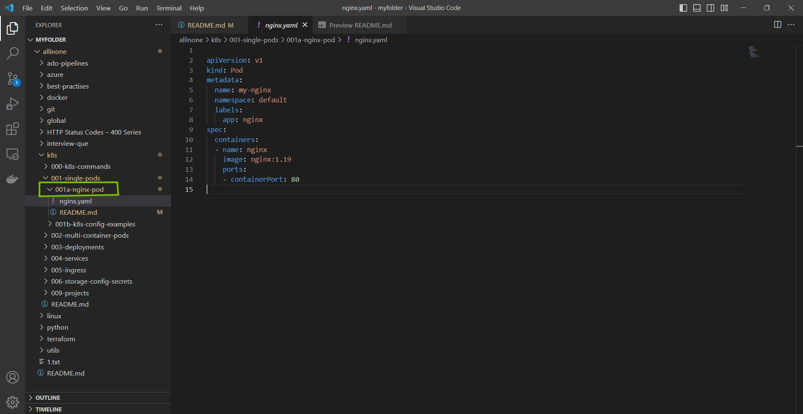
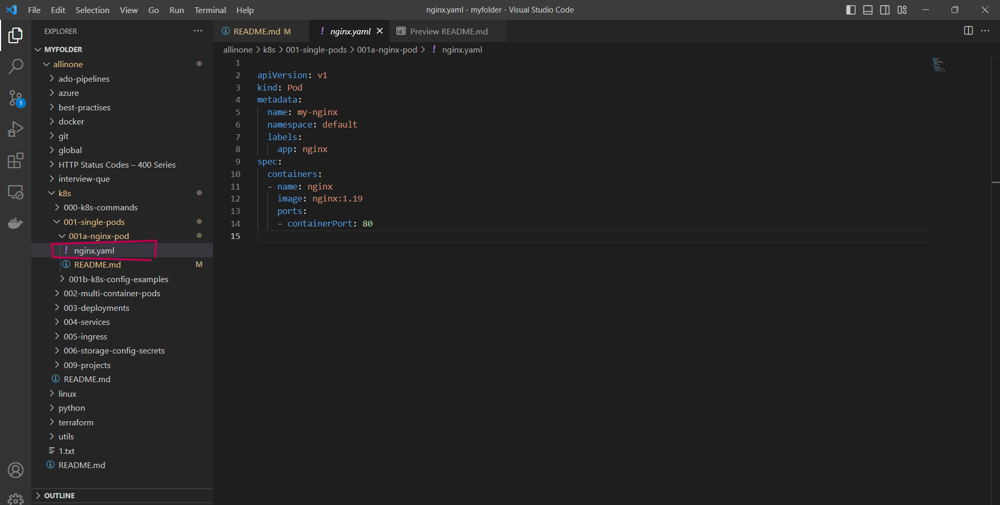
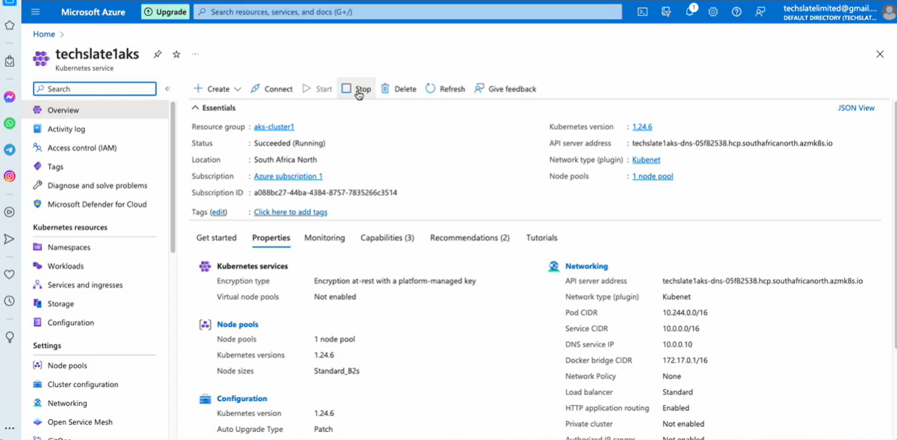
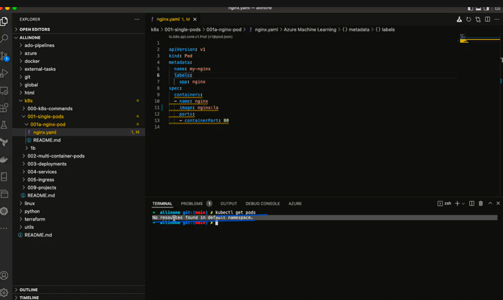
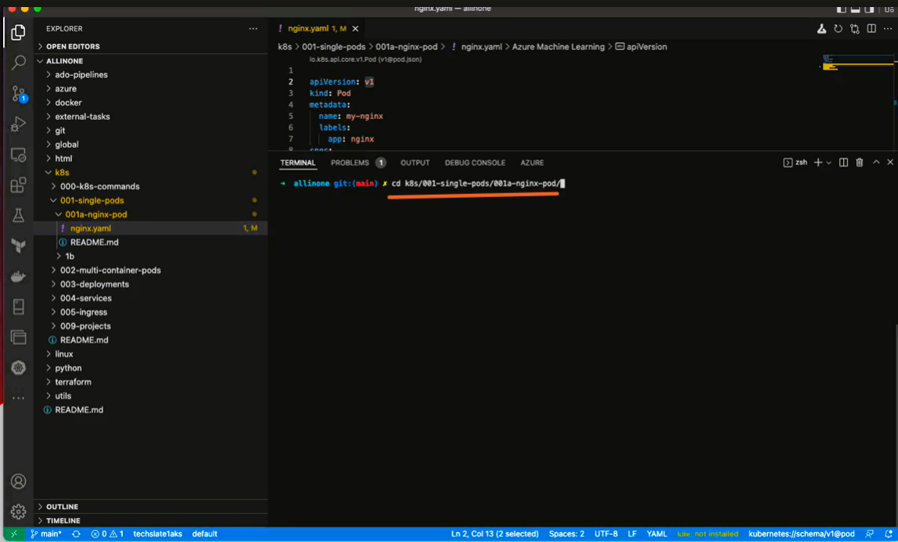
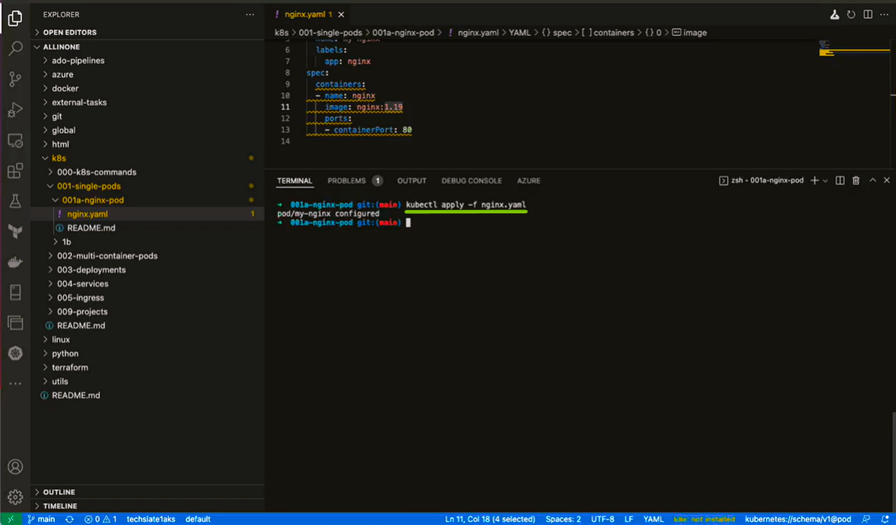
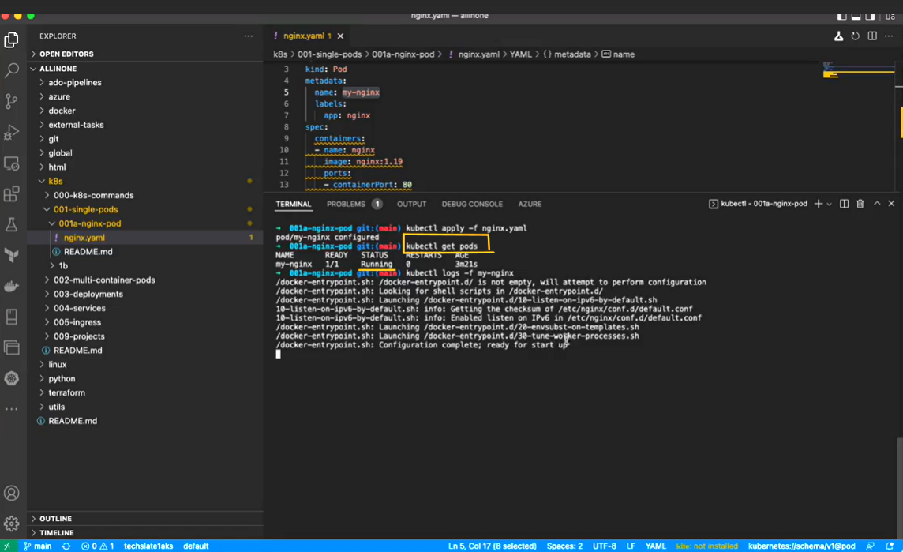
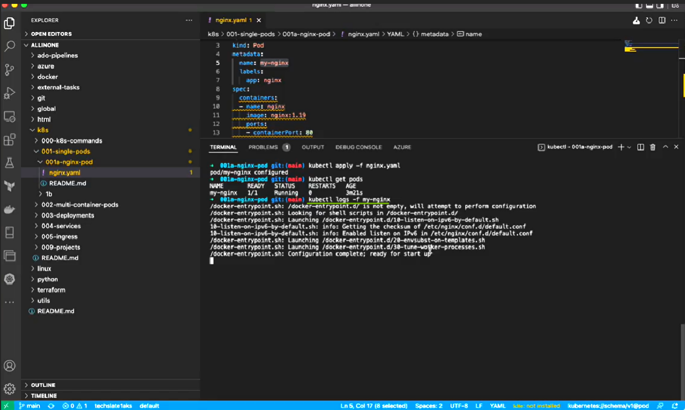
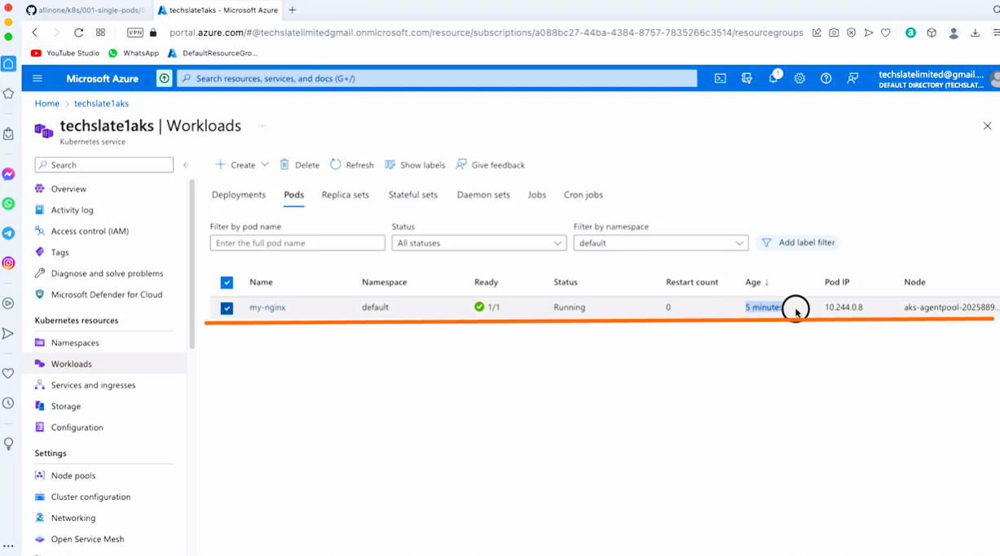

# **How to run a single k8s pod ?**
# Table of contents
1.[Introduction](#introduction)

2.[Prerequisites](#pre-requisites)

3.[How to run a single nginx k8s pod ?](#how-to-run-a-single-nginx-k8s-pod)

## **Introduction**

### **What is Pod?** 

- Pods are the smallest deployable units of computing that you can create and manage in Kubernetes.

- A Pod (as in a pod of whales or pea pod) is a group of one or more containers, with shared storage and network resources, and a specification for how to run the containers. A Pod's contents are always co-located and co-scheduled, and run in a shared context. A Pod models an application-specific "logical host": it contains one or more application containers which are relatively tightly coupled. In non-cloud contexts, applications executed on the same physical or virtual machine are analogous to cloud applications executed on the same logical host.

- As well as application containers, a Pod can contain init containers that run during Pod startup. You can also inject ephemeral containers for debugging if your cluster offers this.

### **Pods in a Kubernetes cluster are used in two main ways:**

- Pods that run a single container. The "one-container-per-Pod" model is the most common Kubernetes use case; in this case, you can think of a Pod as a wrapper around a single container; Kubernetes manages Pods rather than managing the containers directly.

- Pods that run multiple containers that need to work together. A Pod can encapsulate an application composed of multiple co-located containers that are tightly coupled and need to share resources. These co-located containers form a single cohesive unit of service—for example, one container serving data stored in a shared volume to the public, while a separate sidecar container refreshes or updates those files. The Pod wraps these containers, storage resources, and an ephemeral network identity together as a single unit.

***

## **Pre-requisites**

**To run nginx pod, you will need to have the following prerequisites installed and configured on your machine:**

**AKS Cluster (Azure kubernetes service):** 

- AKS is an open-source fully managed container orchestration service that became available in June 2018 and is available on the Microsoft Azure public cloud that can be used to deploy, scale and manage Docker containers and container-based applications in a cluster environment.

- Azure Kubernetes Service offers provisioning, scaling, and upgrades of resources as per requirement or demand without any downtime in the Kubernetes cluster and the best thing about AKS is that you don’t require deep knowledge and expertise in container orchestration to manage AKS.

**YAML file**

- A YAML file is a text document that contains data formatted using YAML (YAML Ain't Markup Language), a human-readable data format used for data serialization. It is used for reading and writing data independent of a specific programming language.

**A text editor:**

- You will need a text editor to create and edit the docker-compose.yml file that defines the configuration for your SonarQube and Postgres containers. Some popular text editors include Visual Studio Code, Sublime Text, and Atom.


***

# **How to run a single nginx k8s pod ?**

- ## First create a folder with appropriate title .



- ## Under `001a-nginx-pod` we shall create one yaml file i.e. `nginx.yaml` .



- ## Now, lets move to the another important step i.e. we need to create and start the aks cluster.



- ## Now lets get back to the terminal and check if our cluster started successfully or not , for that we shall run this command :

```
kubectl get pods 
```


- ## **If cluster is started we should see No resources found in default Namespace once you run ```kubectl get pods```**

- ## Now , lets get into the main path of the folder where our ``nginx.yaml`` is placed.



- ## Run the following command

```
kubectl apply -f nginx.yaml
```


- ## Now , lets run kubectl get pods to see if our nginx pod is running.

```
kubectl get pods
```


- ## We can also see running logs simultaneously , by running the following command

```
 kubectl logs -f my-nginx
```


- ## Now, let's get back to Azure portal and AKS Cluster and see if our pod is created under that cluster.



- ## Yes, we can see that pod is running succesfully.

