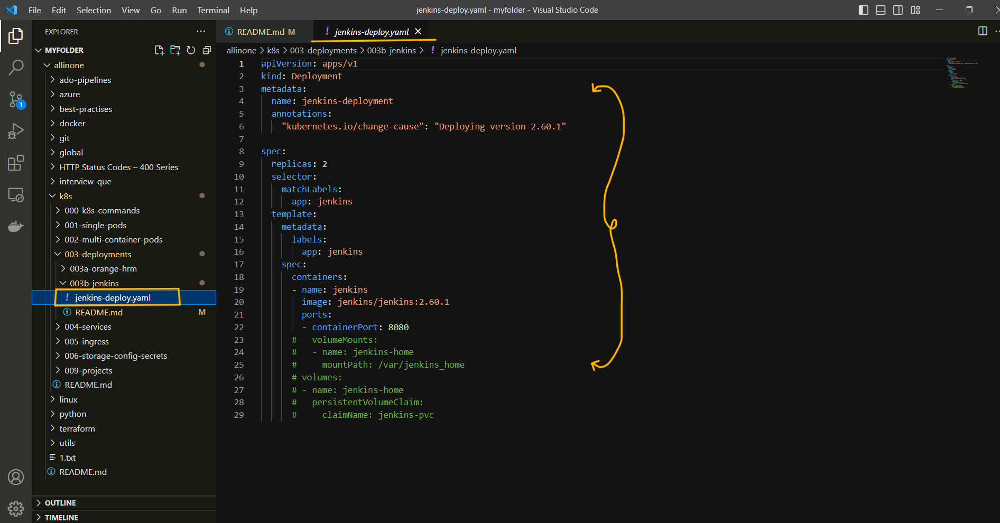
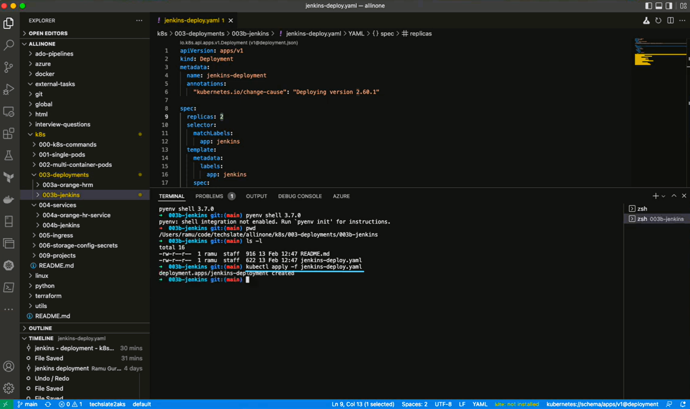
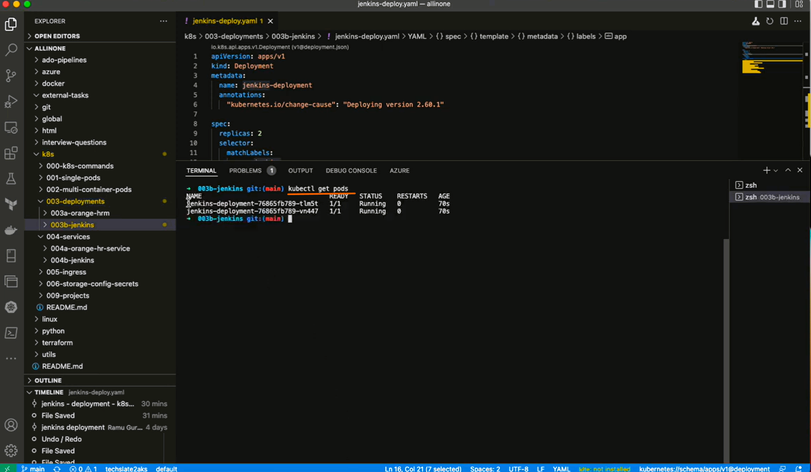
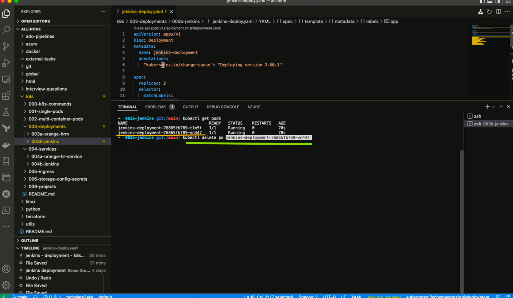
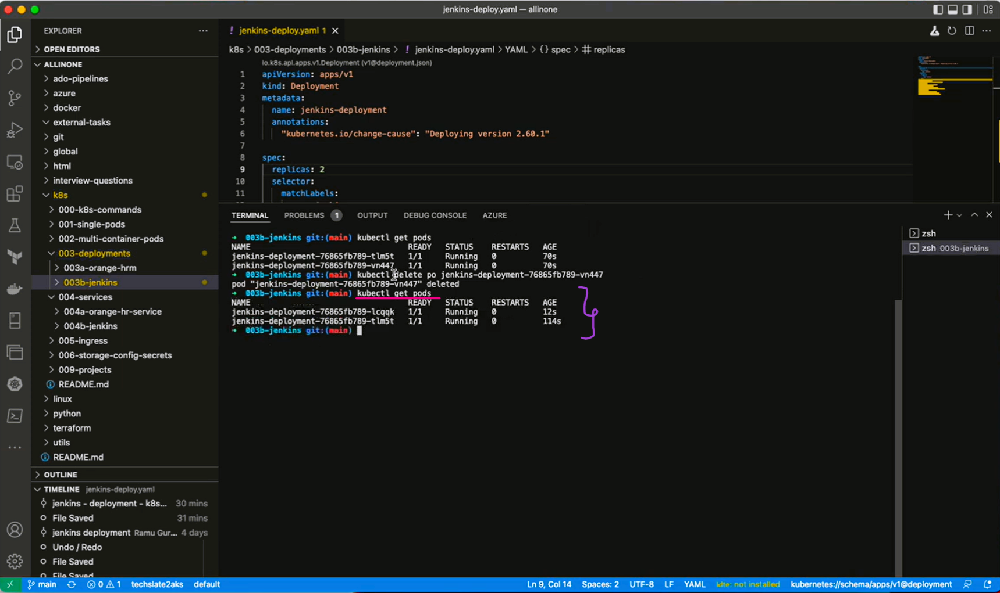
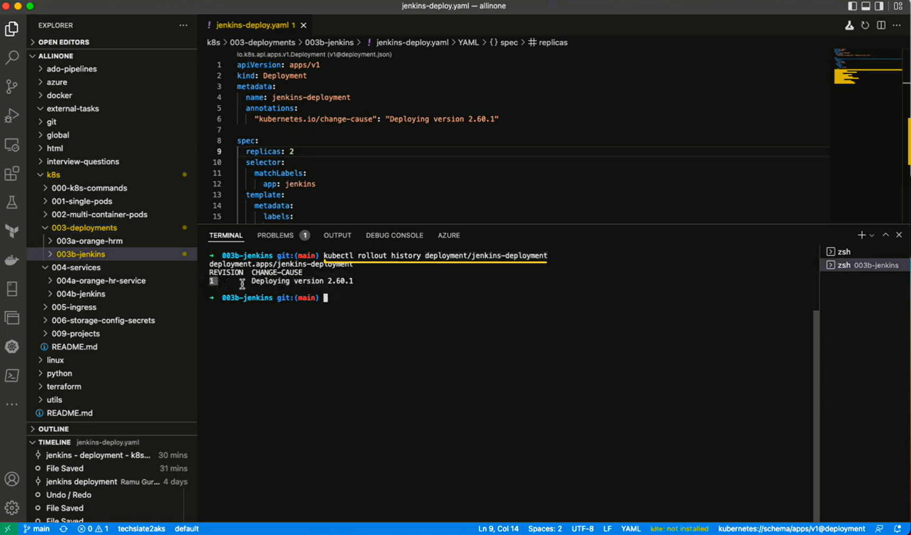

# **How to run a Deployment?**

# Table of contents
1.[Introduction](#introduction)

2.[Prerequisites](#pre-requisites)

3.[How to run a Deployment ?](#how-to-run-a-deployment-1)

## **Introduction**

### **What is Deployment?** 

- A Deployment provides declarative updates for Pods and ReplicaSets.

You describe a desired state in a Deployment, and the Deployment Controller changes the actual state to the desired state at a controlled rate. You can define Deployments to create new ReplicaSets, or to remove existing Deployments and adopt all their resources with new Deployments.

# Jenkins Deployment

- The Deployment has a name of "jenkins-deployment".
- It will create one replica of the Jenkins Pod.
- The selector for the Pod is app: jenkins which means that the Pod will be selected by this label.
The Pod has a container named "jenkins" which runs the jenkins/jenkins:lts image.
The container exposes two ports: 8080 and 50000.
The Pod also has a volume named "jenkins-home" which is mounted at /var/jenkins_home in the container and is backed by a PersistentVolumeClaim named "jenkins-pvc".


***

## **Pre-requisites**

**To run a Deployment , you will need to have the following prerequisites installed and configured on your machine:**

**AKS Cluster (Azure kubernetes service):** 

- AKS is an open-source fully managed container orchestration service that became available in June 2018 and is available on the Microsoft Azure public cloud that can be used to deploy, scale and manage Docker containers and container-based applications in a cluster environment.

- Azure Kubernetes Service offers provisioning, scaling, and upgrades of resources as per requirement or demand without any downtime in the Kubernetes cluster and the best thing about AKS is that you don’t require deep knowledge and expertise in container orchestration to manage AKS.

**YAML file**

- A YAML file is a text document that contains data formatted using YAML (YAML Ain't Markup Language), a human-readable data format used for data serialization. It is used for reading and writing data independent of a specific programming language.

**A text editor:**

- You will need a text editor to create and edit the docker-compose.yml file that defines the configuration for your SonarQube and Postgres containers. Some popular text editors include Visual Studio Code, Sublime Text, and Atom.


***
# **How to run a Deployment ?**

## Lets create an deployment for jenkins.

- ## First create a folder with appropriate title .


- ## Under `003b-jenkins` folder we shall create one yaml file i.e. `jenkins-deploy.yaml` .



```
apiVersion: apps/v1
kind: Deployment
metadata:
  name: jenkins-deployment
  annotations:
    "kubernetes.io/change-cause": "Deploying version 2.60.1"

spec:
  replicas: 2
  selector:
    matchLabels:
      app: jenkins
  template:
    metadata:
      labels:
        app: jenkins
    spec:
      containers:
      - name: jenkins
        image: jenkins/jenkins:2.60.1
        ports:
        - containerPort: 8080
```

- ## Open the terminal and Run the deployment .

**Command to Run Deployment**

```
kubectl apply -f jenkins-deployment.yaml
```


- ## Now , lets run kubectl get pods to see if our pods are running.

```
kubectl get pods
```


- ## In k8s pods are Ephemeral , if we delete the pod , it will recreate it automatically and maintain the no of replicas as mentioned in the yaml file

- ## so lets select on running pod and try to delete it , and see if its recreating or not.

```
kubectl delete po jenkins-deployment-76865fb789-vn447
```


- ## Now lets run ```kubectl get pods``` again to see the pods running.



- ## As said , we can see that the pod has been recreated and there are 2 pods running again.

- ## If you want see the history of deployment , you can run the following command.

```
kubectl rollout history deployment/jenkins-deployment
```



