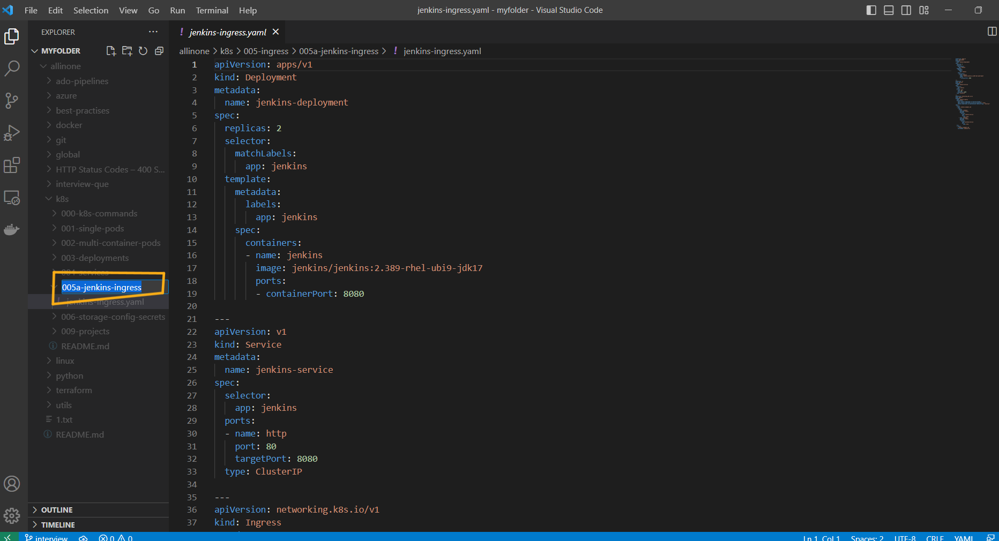
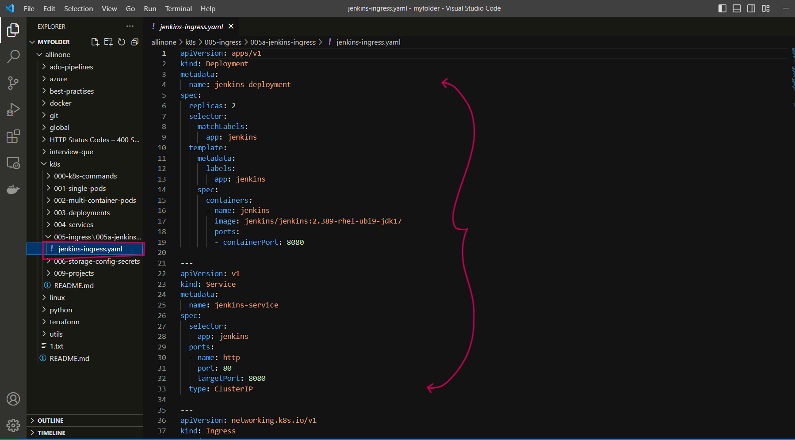
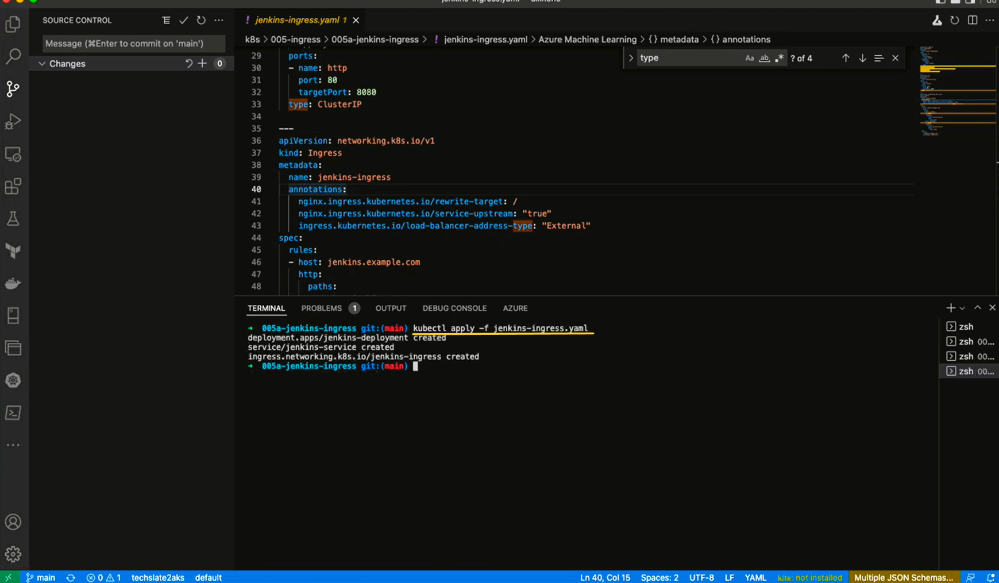
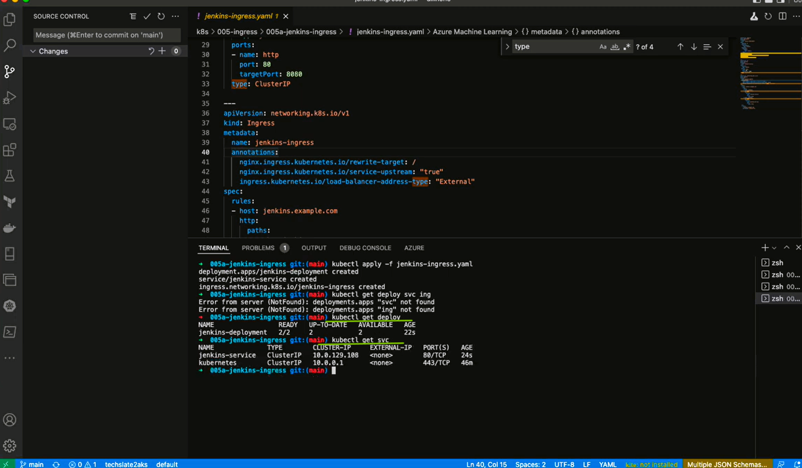
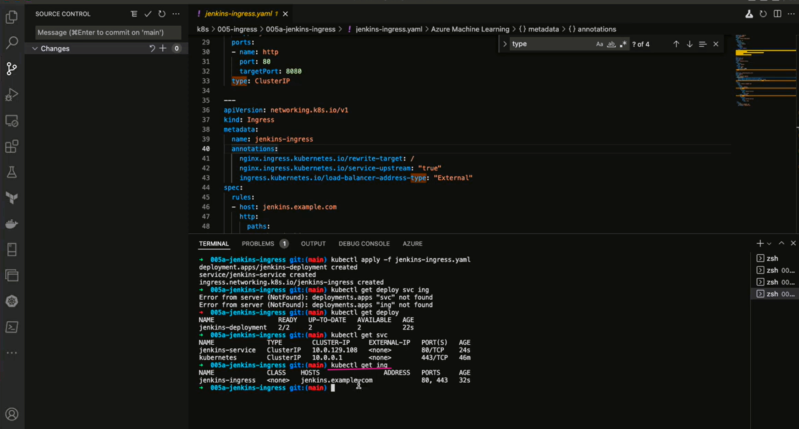
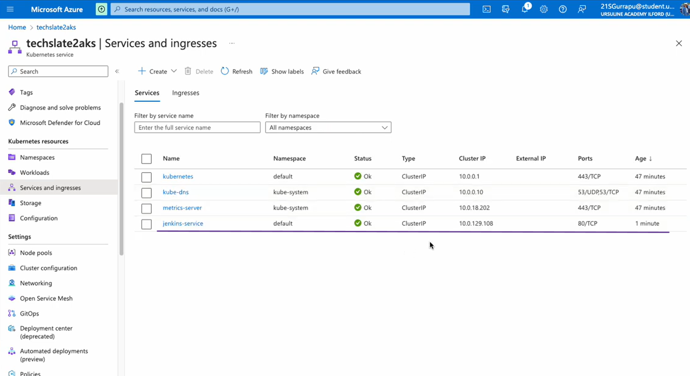
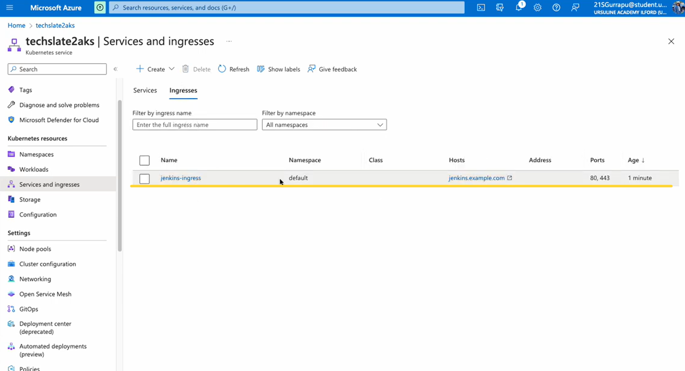

# **How to run ingress ?**

# Table of contents
1.[Introduction](#introduction)

2.[Prerequisites](#pre-requisites)

3.[How to run ingress ?](#how-to-run-ingress-1)

## **Introduction**

### **What is Deployment?** 

- A Deployment provides declarative updates for Pods and ReplicaSets.

You describe a desired state in a Deployment, and the Deployment Controller changes the actual state to the desired state at a controlled rate. You can define Deployments to create new ReplicaSets, or to remove existing Deployments and adopt all their resources with new Deployments.


### **What is Service in k8s ?** 

- In Kubernetes, a Service is a method for exposing a network application that is running as one or more Pods in your cluster.

- A key aim of Services in Kubernetes is that you don't need to modify your existing application to use an unfamiliar service discovery mechanism. You can run code in Pods, whether this is a code designed for a cloud-native world, or an older app you've containerized. You use a Service to make that set of Pods available on the network so that clients can interact with it.

- If you use a Deployment to run your app, that Deployment can create and destroy Pods dynamically. From one moment to the next, you don't know how many of those Pods are working and healthy; you might not even know what those healthy Pods are named. Kubernetes Pods are created and destroyed to match the desired state of your cluster. Pods are emphemeral resources (you should not expect that an individual Pod is reliable and durable).

- Each Pod gets its own IP address (Kubernetes expects network plugins to ensure this). For a given Deployment in your cluster, the set of Pods running in one moment in time could be different from the set of Pods running that application a moment later.

### **What is Kubernetes Ingress?** 

Kubernetes Ingress is an API object that provides routing rules to manage external users' access to the services in a Kubernetes cluster, typically via HTTPS/HTTP. With Ingress, you can easily set up rules for routing traffic without creating a bunch of Load Balancers or exposing each service on the node.


## **Pre-requisites**

**To run a ingress , you will need to have the following prerequisites installed and configured on your machine:**

**AKS Cluster (Azure kubernetes service):** 

- AKS is an open-source fully managed container orchestration service that became available in June 2018 and is available on the Microsoft Azure public cloud that can be used to deploy, scale and manage Docker containers and container-based applications in a cluster environment.

- Azure Kubernetes Service offers provisioning, scaling, and upgrades of resources as per requirement or demand without any downtime in the Kubernetes cluster and the best thing about AKS is that you don’t require deep knowledge and expertise in container orchestration to manage AKS.

**YAML file**

- A YAML file is a text document that contains data formatted using YAML (YAML Ain't Markup Language), a human-readable data format used for data serialization. It is used for reading and writing data independent of a specific programming language.

**A text editor:**

- You will need a text editor to create and edit the docker-compose.yml file that defines the configuration for your SonarQube and Postgres containers. Some popular text editors include Visual Studio Code, Sublime Text, and Atom.


***

# **How to run ingress ?**

## Lets run jenkins service with ingress.

- ## First create a folder with appropriate title .



- ## Under `005a-jenkins-ingress` folder we shall create a yaml file  i.e. `jenkins-ingress.yaml` which includes deployment , service and Ingress.



```
apiVersion: apps/v1
kind: Deployment
metadata:
  name: jenkins-deployment
spec:
  replicas: 2
  selector:
    matchLabels:
      app: jenkins
  template:
    metadata:
      labels:
        app: jenkins
    spec:
      containers:
      - name: jenkins
        image: jenkins/jenkins:2.389-rhel-ubi9-jdk17
        ports:
        - containerPort: 8080

---
apiVersion: v1
kind: Service
metadata:
  name: jenkins-service
spec:
  selector:
    app: jenkins
  ports:
  - name: http
    port: 80
    targetPort: 8080
  type: ClusterIP

---
apiVersion: networking.k8s.io/v1
kind: Ingress
metadata:
  name: jenkins-ingress
  annotations:
    nginx.ingress.kubernetes.io/rewrite-target: /
    nginx.ingress.kubernetes.io/service-upstream: "true"
    ingress.kubernetes.io/load-balancer-address-type: "External"
spec:
  rules:
  - host: jenkins.example.com
    http:
      paths:
      - path: /jenkins
        pathType: Prefix
        backend:
          service:
            name: jenkins-service
            port:
              name: http
      - path: /grafana
        pathType: Prefix
        backend:
          service:
            name: grafana-service
            port:
              name: http
  tls:
  - hosts:
    - jenkins.example.com
    secretName: jenkins-tls

```

- ## Open the terminal and Run the following command.

```
kubectl apply -f jenkins-ingress.yaml
```


- ## Now , lets run following commands to see if our deployment and service are running.

```
kubectl get pods
```

```
kubectl get svc
```



- ## Run following command to see if our Ingress is running.

```
kubectl get ing
```




- ## Now lets , go back to Azure portal and AKS Cluster and see if our jenkins-service and jenkins-ingress is running.






- ## As it's Azure , we arent able to see public IP Address , if you would have runned in local k8s setup you could see public IP Address which would allow us to access Jenkins service.