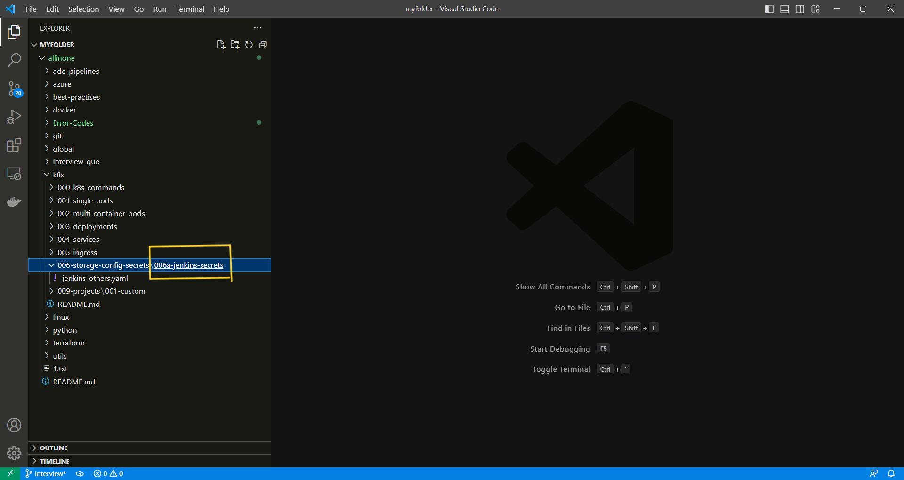
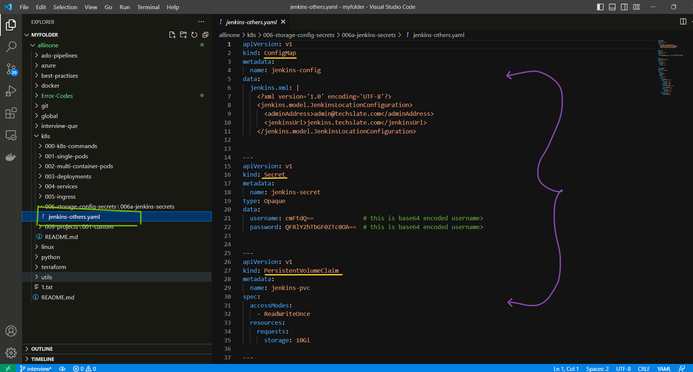
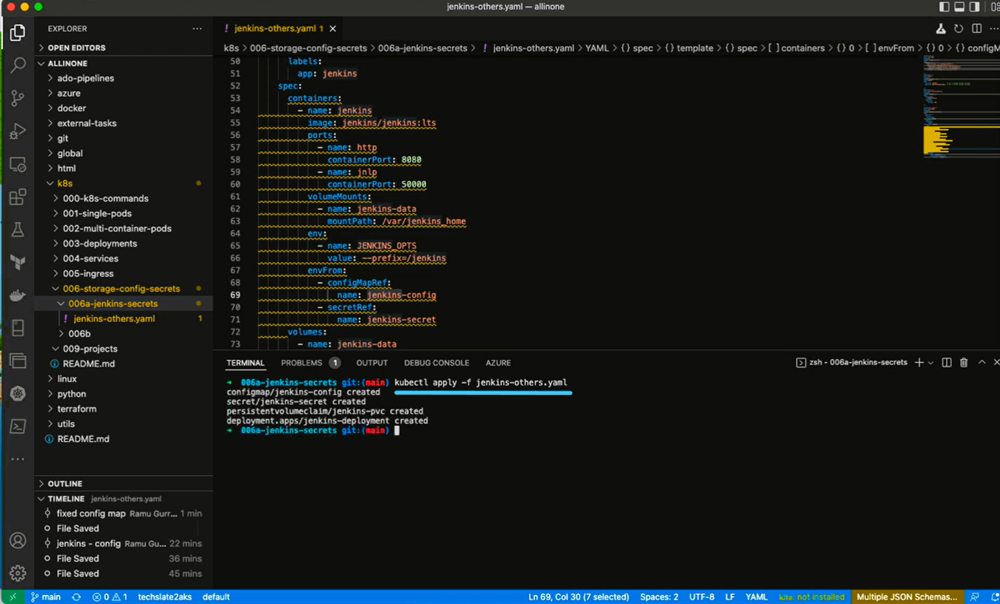
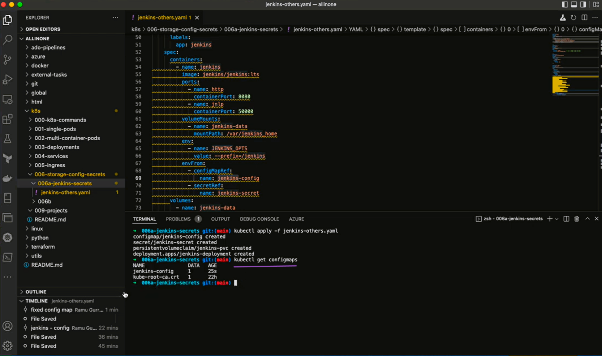
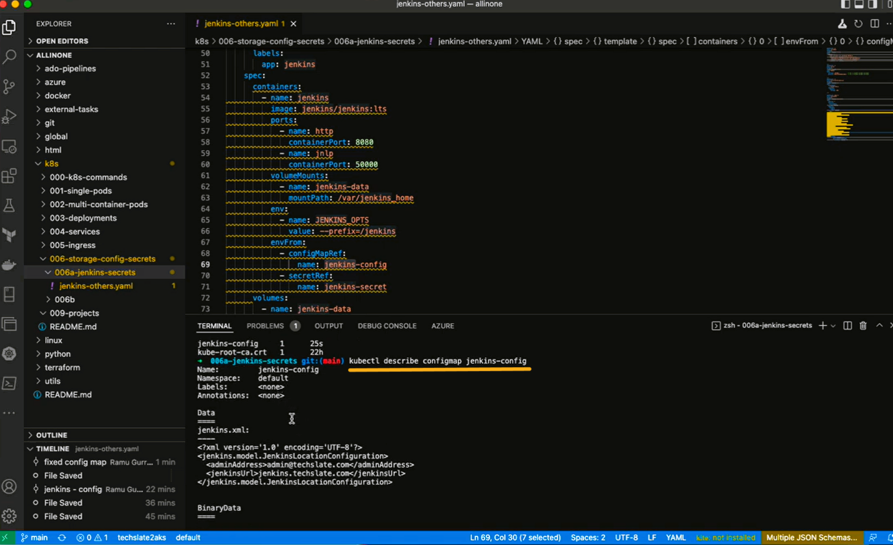
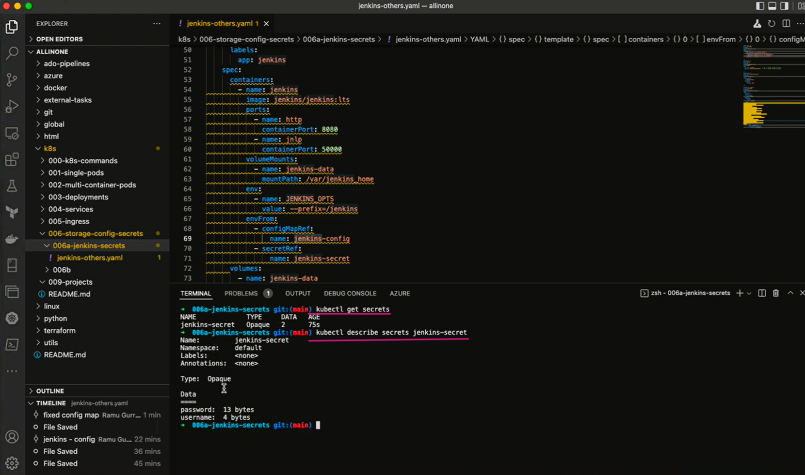

# **How to create Storage ,ConfigMap , Secret in k8s ?**

# Table of contents
1.[Introduction](#introduction)

2.[Prerequisites](#pre-requisites)

3.[How to create Storage ,ConfigMap , Secret in k8s ?](#how-to-create-storage-configmap--secret-in-k8s-1)

## **Introduction**

### **What is Deployment?** 

- A Deployment provides declarative updates for Pods and ReplicaSets.

You describe a desired state in a Deployment, and the Deployment Controller changes the actual state to the desired state at a controlled rate. You can define Deployments to create new ReplicaSets, or to remove existing Deployments and adopt all their resources with new Deployments.


### **What is ConfigMap?** 

- In Kubernetes, Configmap is an API object which is mainly used to store non-confidential data. The data that is stored in ConfigMap is stored as key-value pairs. ConfigMaps are configuration files that may be used by pods as command-line arguments, environment variables, or even as configuration files on a disc. 

- This feature allows us to decouple environment-specific configuration from our container images, after this is done our applications are easily portable. The thing to be noted here is that ConfigMap does not provide any sort of secrecy or encryption, so it is advised to store non-confidential data only we can use secrets to store confidential data. 


### **What is Secret?** 

- A Secret is an object that contains a small amount of sensitive data such as a password, a token, or a key. Such information might otherwise be put in a Pod specification or in a container image. Using a Secret means that you don't need to include confidential data in your application code.

- Because Secrets can be created independently of the Pods that use them, there is less risk of the Secret (and its data) being exposed during the workflow of creating, viewing, and editing Pods. Kubernetes, and applications that run in your cluster, can also take additional precautions with Secrets, such as avoiding writing secret data to nonvolatile storage.

- Secrets are similar to ConfigMaps but are specifically intended to hold confidential data.

### **What is PersistentVolumeClaim (PVC) ?** 

A PersistentVolumeClaim (PVC) is a request for storage by a user. It is similar to a Pod. Pods consume node resources and PVCs consume PV resources. Pods can request specific levels of resources (CPU and Memory). Claims can request specific size and access modes (e.g., they can be mounted ReadWriteOnce, ReadOnlyMany or ReadWriteMany, see AccessModes).


## **Pre-requisites**

**To create Storage ,ConfigMap , Secret in k8s , you will need to have the following prerequisites installed and configured on your machine:**

**AKS Cluster (Azure kubernetes service):** 

- AKS is an open-source fully managed container orchestration service that became available in June 2018 and is available on the Microsoft Azure public cloud that can be used to deploy, scale and manage Docker containers and container-based applications in a cluster environment.

- Azure Kubernetes Service offers provisioning, scaling, and upgrades of resources as per requirement or demand without any downtime in the Kubernetes cluster and the best thing about AKS is that you don’t require deep knowledge and expertise in container orchestration to manage AKS.

**YAML file**

- A YAML file is a text document that contains data formatted using YAML (YAML Ain't Markup Language), a human-readable data format used for data serialization. It is used for reading and writing data independent of a specific programming language.

**A text editor:**

- You will need a text editor to create and edit the docker-compose.yml file that defines the configuration for your SonarQube and Postgres containers. Some popular text editors include Visual Studio Code, Sublime Text, and Atom.


***

# **How to create Storage ,ConfigMap , Secret in k8s ?**

- ## First create a folder with appropriate title .



- ## Under `006a-jenkins-secrets` folder we shall create a yaml file  i.e. `jenkins-others.yaml` which includes deployment , secret , configMap & Persistent volume claim.



```
apiVersion: v1
kind: ConfigMap
metadata:
  name: jenkins-config
data:
  jenkins.xml: |
    <?xml version='1.0' encoding='UTF-8'?>
    <jenkins.model.JenkinsLocationConfiguration>
      <adminAddress>admin@techslate.com</adminAddress>
      <jenkinsUrl>jenkins.techslate.com</jenkinsUrl>
    </jenkins.model.JenkinsLocationConfiguration>


---
apiVersion: v1
kind: Secret
metadata:
  name: jenkins-secret
type: Opaque
data:
  username: cmFtdQ==              # this is base64 encoded username>
  password: QFRlY2hTbGF0ZTc0OA==  # this is base64 encoded username>


---
apiVersion: v1
kind: PersistentVolumeClaim
metadata:
  name: jenkins-pvc
spec:
  accessModes:
    - ReadWriteOnce
  resources:
    requests:
      storage: 10Gi

---

apiVersion: apps/v1
kind: Deployment
metadata:
  name: jenkins-deployment
spec:
  replicas: 1
  selector:
    matchLabels:
      app: jenkins
  template:
    metadata:
      labels:
        app: jenkins
    spec:
      containers:
        - name: jenkins
          image: jenkins/jenkins:lts
          ports:
            - name: http
              containerPort: 8080
            - name: jnlp
              containerPort: 50000
          volumeMounts:
            - name: jenkins-data
              mountPath: /var/jenkins_home
          env:
            - name: JENKINS_OPTS
              value: --prefix=/jenkins
          envFrom:
            - configMapRef:
                name: jenkins-config
            - secretRef:
                name: jenkins-secret
      volumes:
        - name: jenkins-data
          persistentVolumeClaim:
            claimName: jenkins-pvc
```

- ## Open the terminal and Run the following command.

```
kubectl apply -f jenkins-others.yaml
```


- ## Now , lets run following command to see configMaps .

```
kubectl get configmaps
```



- ## Run following command to describe configmap .

```
kubectl describe configmap jenkins-config
```




- ## Now , lets run following command to see Secret and describe Secret.

```
kubectl get secrets
```

```
kubectl describe secrets jenkins-secret
```




- ## Run the following command to see PersistentVolumeClaim (PVC).

```
kubectl get pvc
```


