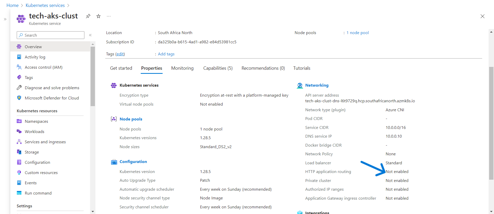
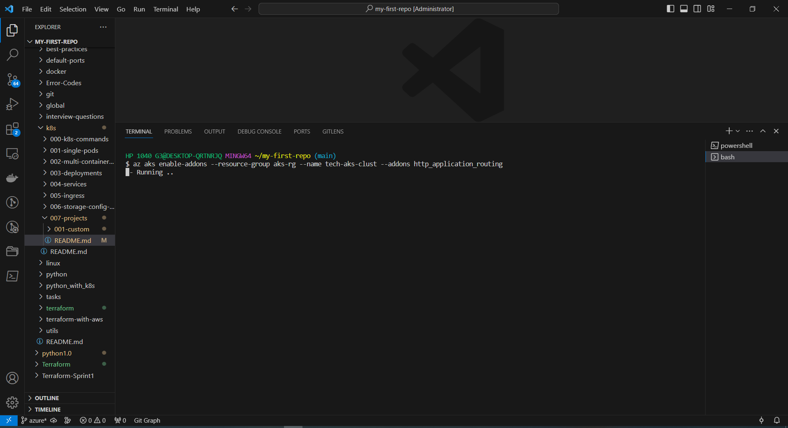
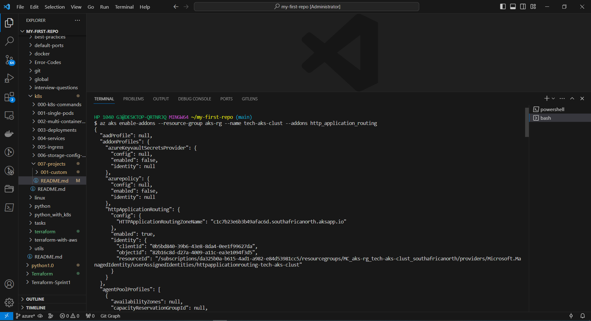
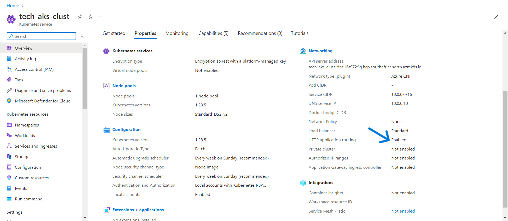

# HOW To Enable HTTP For Kubernetes Cluster  

## Run this command in bash shell

```az aks enable-addons --resource-group <resource-group-name> --name <cluster-name> --addons http_application_routing```

# Process

### In below screenshot after creating cluster you could see HTTP application routing is diasbled we need to enable that to access our application.




### To enable HTTP run above command replacing your Resource group name and Kubernetes cluster names as shown below.




### After running the command it takes few minutes to complete the process, once its done it looks like this in below screenshot.



### Here you can now see HTTP has been enabled for our cluster.


