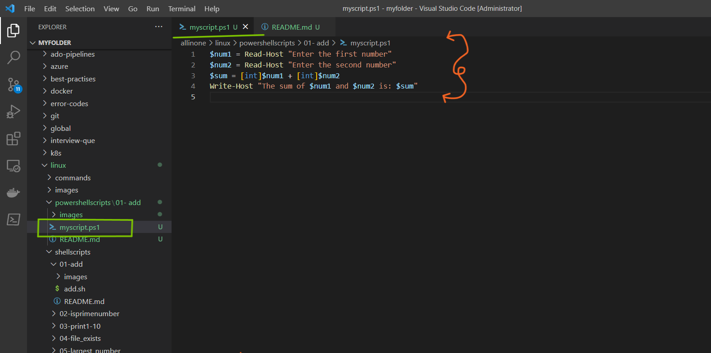
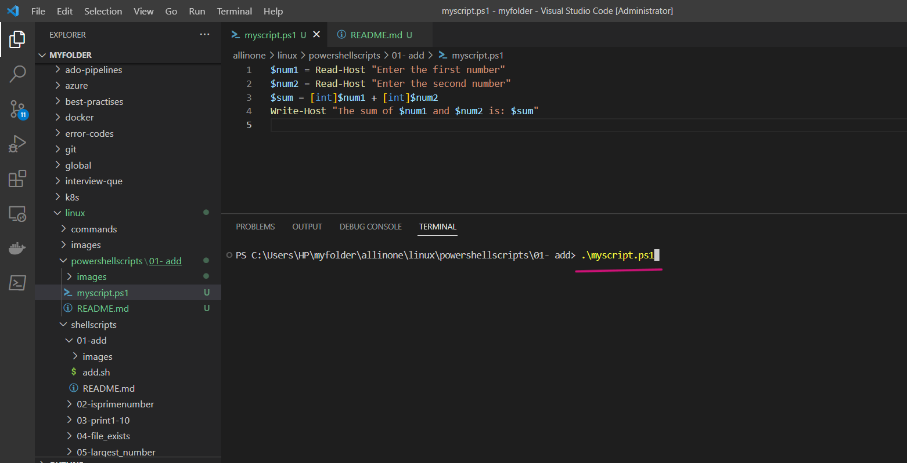
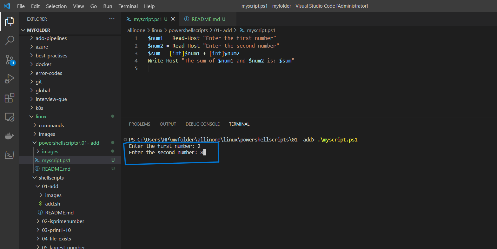
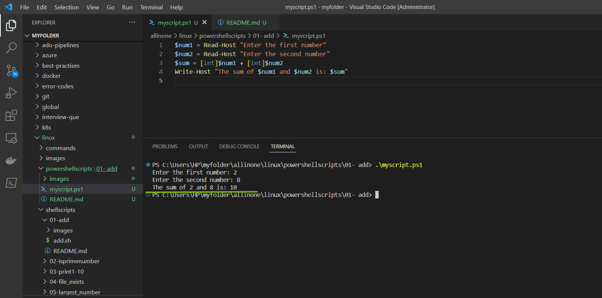

# PowerShell Script: Sum of Two Numbers

### This PowerShell script prompts the user for two numbers, calculates their sum, and displays the result.


# Introduction

## What is PowerShell scripting ?

- PowerShell scripting is a powerful automation tool developed by Microsoft that allows users to automate tasks and system administration tasks on Windows operating systems. It is a command-line shell and scripting language that is designed to automate administrative tasks for Windows-based operating systems, such as managing system configurations, setting up network settings, and working with files and directories. PowerShell scripts can be used to automate a wide range of tasks, including system maintenance, software installation, and configuration management, among others.

- PowerShell scripting works by allowing users to write scripts that can execute commands, manage variables, and manipulate data within the Windows environment. These scripts can be saved as text files with the .ps1 extension and can be executed using the PowerShell command-line interface. PowerShell scripts can also be used in combination with other scripting languages, such as Python or Bash, to automate complex tasks.

- PowerShell scripting has become an important tool for system administrators and IT professionals, as it can save time and reduce errors by automating repetitive tasks. It is also widely used in DevOps and cloud computing environments for automating infrastructure management and deployment tasks.


# Pre-requisites

- To run the PowerShell script that prompts the user for two numbers, calculates their sum, and displays the result, you need to have PowerShell installed on your system. PowerShell is available on Windows systems by default, but you may need to install it on other systems.

- To check if you have PowerShell installed on your system, open a command prompt or PowerShell window and type powershell -v. This will show you the version of PowerShell installed on your system. If you don't have PowerShell installed, you can download and install it from the official Microsoft website.

- Additionally, you may need to adjust the PowerShell execution policy to allow the script to run. By default, PowerShell restricts the execution of scripts for security reasons. To allow the script to run, you can open PowerShell as an administrator and run the following command:

```
Set-ExecutionPolicy RemoteSigned
```

This will allow you to run locally created scripts on your system. However, you should exercise caution when running scripts from unknown sources.

# How to Run

- ### To use this program, simply create a file called  `myscript.ps1` and add the script to it .





- ### Now lets run the following command to do a sum of two numbers.

```
.\myscript.ps1

```




- ### Now, lets enter the two integers for which we want a sum.




- ### So, it displays the sum of two numbers.




# Description

- The script starts by using the `Read-Hos`t cmdlet to prompt the user to enter the first number. The `Read-Host` cmdlet allows you to get input from the user in the PowerShell console.

- The user enters a number, and that value is stored in the `$num1` variable. The variable is created by assigning a value to it using the assignment operator (`=`).

- The script uses the `Read-Host` cmdlet again to prompt the user to enter the second number. The user enters a number, and that value is stored in the `$num2` variable.

- The `$num1` and `$num2` variables are added together using the `+` operator. Note that we're using the [int] type accelerator to ensure that PowerShell treats the values as integers. This is necessary to perform addition on them.

- The result of the addition operation is stored in the `$sum` variable.

- Finally, the script uses the `Write-Host` cmdlet to display a message to the user that includes the sum of the two numbers. The message is constructed using string interpolation, which allows us to insert the values of variables into a string. The `$num1`, `$num2`, and `$sum` variables are included in the message using the `$` symbol followed by the variable name in curly braces (`{}`).


