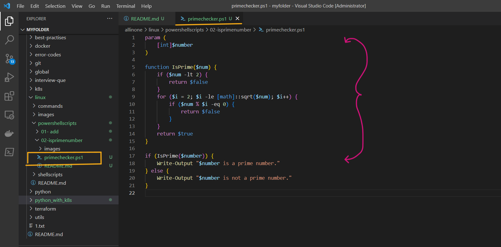
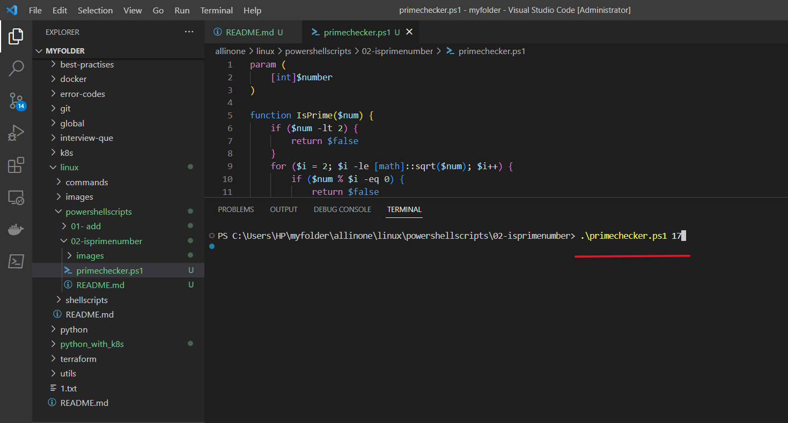
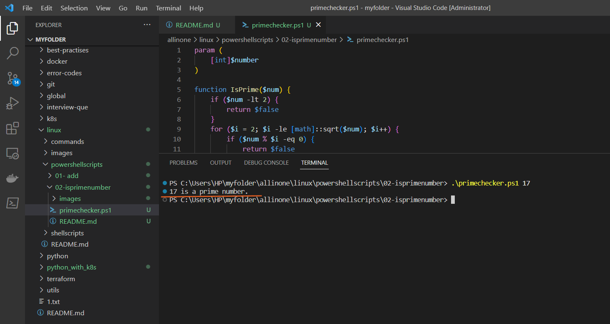

# Prime Checker PowerShell Script

### This is a simple PowerShell script that checks if a number is prime or not. The script takes a single input parameter, which is the number to be checked. It uses a function to determine if the input number is a prime number and then outputs the result to the console.


# Introduction

## What is PowerShell scripting ?

- PowerShell scripting is a powerful automation tool developed by Microsoft that allows users to automate tasks and system administration tasks on Windows operating systems. It is a command-line shell and scripting language that is designed to automate administrative tasks for Windows-based operating systems, such as managing system configurations, setting up network settings, and working with files and directories. PowerShell scripts can be used to automate a wide range of tasks, including system maintenance, software installation, and configuration management, among others.

- PowerShell scripting works by allowing users to write scripts that can execute commands, manage variables, and manipulate data within the Windows environment. These scripts can be saved as text files with the .ps1 extension and can be executed using the PowerShell command-line interface. PowerShell scripts can also be used in combination with other scripting languages, such as Python or Bash, to automate complex tasks.

- PowerShell scripting has become an important tool for system administrators and IT professionals, as it can save time and reduce errors by automating repetitive tasks. It is also widely used in DevOps and cloud computing environments for automating infrastructure management and deployment tasks.


# Pre-requisites

- **PowerShell**: The script requires PowerShell to be installed on your computer. PowerShell is a task automation and configuration management framework from Microsoft, which provides a command-line interface for interacting with the operating system and executing scripts.

- **Execution Policy**: By default, PowerShell's execution policy is set to "Restricted" to prevent malicious scripts from running. To run the script, you need to change the execution policy to "RemoteSigned" or "Unrestricted" by running the following command in PowerShell: `Set-ExecutionPolicy RemoteSigned`. This allows you to run PowerShell scripts that are created on your local computer or are downloaded from the internet, but not scripts that are signed by an untrusted publisher.

- **Input**: The script takes a single input parameter, which is the number to be checked. The input number must be a whole number, otherwise an error will be thrown.

- **Math Library**: The script uses the sqrt method from the Math class to check if a number is prime. The Math class is part of the .NET framework, which is included with PowerShell by default, so no additional libraries are required.

- **Text Editor**: You need a text editor to create and edit the PowerShell script. You can use any text editor, such as Notepad or Visual Studio Code.

# How to Run

- ### To use this program, simply create a file called  `primechecker.ps1` and add the script to it .





- ### Now lets run the following command adding the number to it beside to see whether the integer is prime number or not.

```
.\primechecker.ps1 17

```




- ### So, it displays that 17 as prime number.




# Description

- The script starts by defining a `param` block, which declares a single input parameter named `$number`. This parameter is used to pass the number that needs to be checked if it is prime or not.

- The script then defines a function named `IsPrime`, which takes a single input parameter named `$num`. This function determines if the input number is a prime number or not using a for loop that checks if the number is divisible by any other number between 2 and the square root of the input number. If the number is divisible by any other number, then it is not a prime number and the function returns `$false`. Otherwise, the number is a prime number and the function returns `$true`.

- The script then calls the `IsPrime` function, passing in the input number as an argument. If the function returns `$true`, the script outputs the message "$number is a prime number." to the console. Otherwise, the script outputs the message "$number is not a prime number." to the console.

- The user can run the script in PowerShell by passing in the number to be checked as an argument. If the execution policy is set to "Restricted", the user will need to change the policy to "RemoteSigned" or "Unrestricted" to run the script. The script only works with whole numbers, and any decimal or non-numeric input will result in an error.

- In summary, the script is a simple implementation of a prime number checker using a for loop and a function in PowerShell.


