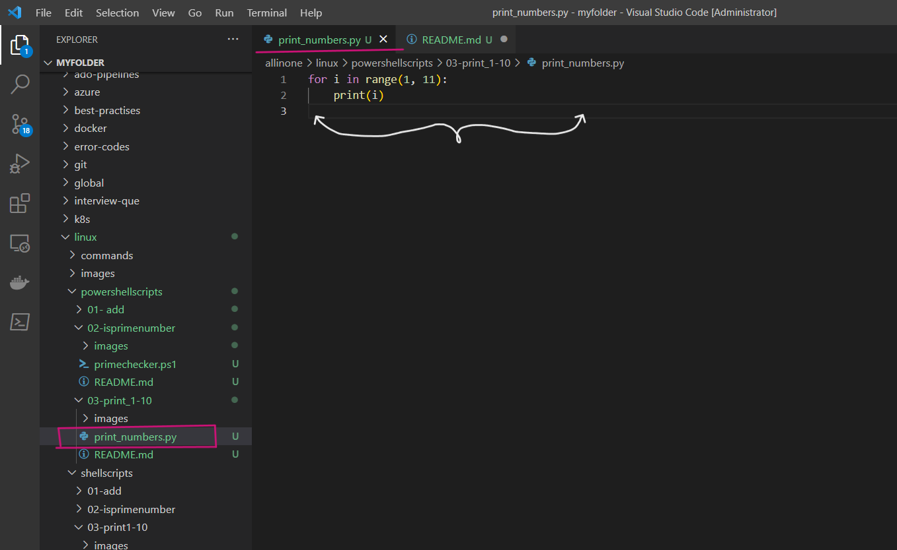
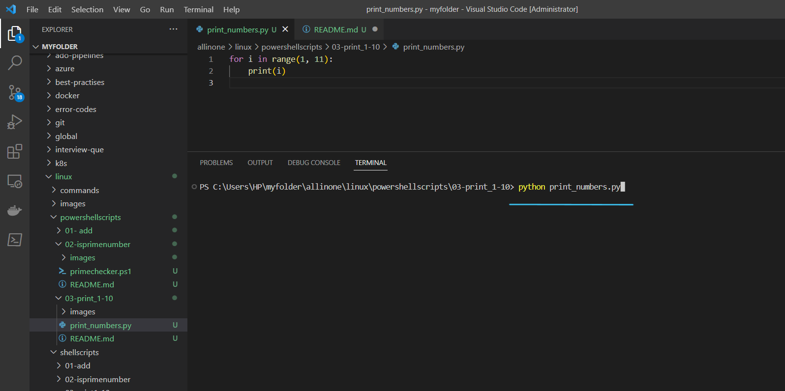
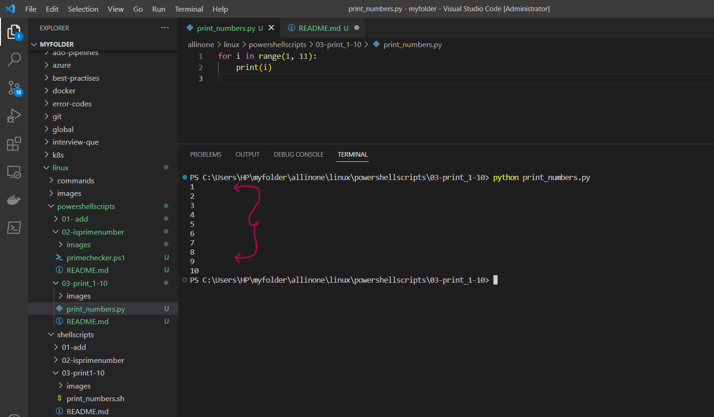

# Python script that prints the numbers 1 to 10

### This script is a simple Python program that prints the numbers 1 to 10, each on a new line. It uses a for loop and the range() function to generate the numbers and the print() function to output them to the console.

# Introduction

## What is PowerShell scripting ?

- PowerShell scripting is a powerful automation tool developed by Microsoft that allows users to automate tasks and system administration tasks on Windows operating systems. It is a command-line shell and scripting language that is designed to automate administrative tasks for Windows-based operating systems, such as managing system configurations, setting up network settings, and working with files and directories. PowerShell scripts can be used to automate a wide range of tasks, including system maintenance, software installation, and configuration management, among others.

- PowerShell scripting works by allowing users to write scripts that can execute commands, manage variables, and manipulate data within the Windows environment. These scripts can be saved as text files with the .ps1 extension and can be executed using the PowerShell command-line interface. PowerShell scripts can also be used in combination with other scripting languages, such as Python or Bash, to automate complex tasks.

- PowerShell scripting has become an important tool for system administrators and IT professionals, as it can save time and reduce errors by automating repetitive tasks. It is also widely used in DevOps and cloud computing environments for automating infrastructure management and deployment tasks.


# Pre-requisites

- **PowerShell**: The script requires PowerShell to be installed on your computer. PowerShell is a task automation and configuration management framework from Microsoft, which provides a command-line interface for interacting with the operating system and executing scripts.

- **Execution Policy**: By default, PowerShell's execution policy is set to "Restricted" to prevent malicious scripts from running. To run the script, you need to change the execution policy to "RemoteSigned" or "Unrestricted" by running the following command in PowerShell: `Set-ExecutionPolicy RemoteSigned`. This allows you to run PowerShell scripts that are created on your local computer or are downloaded from the internet, but not scripts that are signed by an untrusted publisher.

- **Text Editor**: You need a text editor to create and edit the PowerShell script. You can use any text editor, such as Notepad or Visual Studio Code.

# How to Run

- ### To use this program, simply create a file called  `print_numbers.py` and add the script to it .





- ### Now lets run the following command to print numbers from 1 to 10.

```
python print_numbers.py

```




- ### So, Here it displays 1 to 10 numbers .




# Description

- The program uses a `for` loop and the `range()` function to generate a sequence of numbers from 1 to 10, and then it uses the `print()` function to output each number on a new line.

- The `for` loop in the program iterates over a range of numbers generated by the `range()` function. The `range()` function takes two arguments: the starting number (inclusive) and the ending number (exclusive). In this case, we pass `1` and `11` as arguments to generate a sequence of numbers from 1 to 10.

- For each iteration of the `for` loop, the variable `i` takes on a value from the generated sequence, starting with 1 and ending with 10. Inside the loop, we use the `print()` function to output the value of `i` to the console. The `print()` function automatically adds a new line after each output, so each number is printed on a separate line.

- Once the loop has finished iterating over the entire sequence of numbers, the program terminates and the output is displayed in the console.


