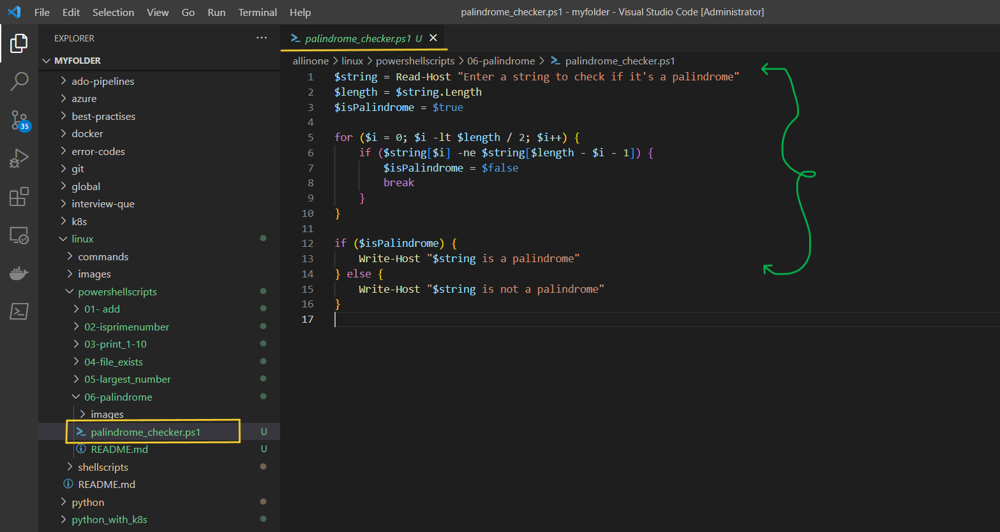
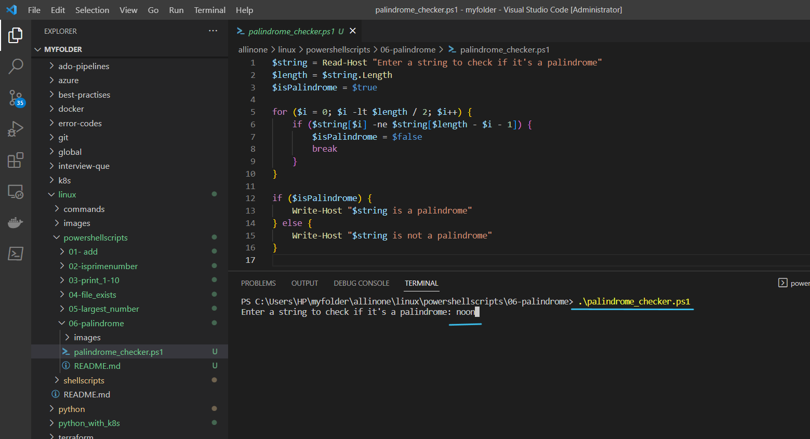
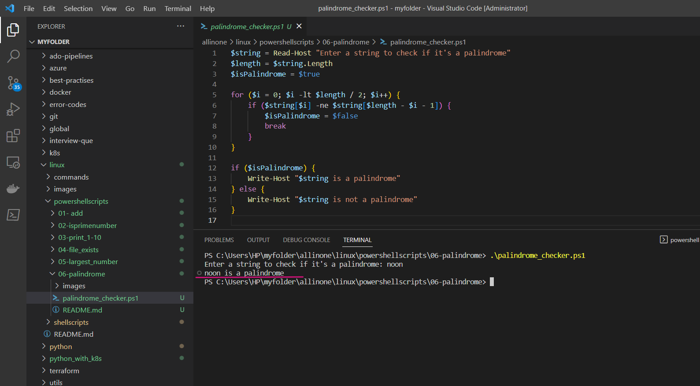

# Palindrome Checker

### This is a PowerShell script that checks if a given string is a palindrome.

# Introduction

## What is PowerShell scripting ?

- PowerShell scripting is a powerful automation tool developed by Microsoft that allows users to automate tasks and system administration tasks on Windows operating systems. It is a command-line shell and scripting language that is designed to automate administrative tasks for Windows-based operating systems, such as managing system configurations, setting up network settings, and working with files and directories. PowerShell scripts can be used to automate a wide range of tasks, including system maintenance, software installation, and configuration management, among others.

- PowerShell scripting works by allowing users to write scripts that can execute commands, manage variables, and manipulate data within the Windows environment. These scripts can be saved as text files with the .ps1 extension and can be executed using the PowerShell command-line interface. PowerShell scripts can also be used in combination with other scripting languages, such as Python or Bash, to automate complex tasks.

- PowerShell scripting has become an important tool for system administrators and IT professionals, as it can save time and reduce errors by automating repetitive tasks. It is also widely used in DevOps and cloud computing environments for automating infrastructure management and deployment tasks.


# Pre-requisites

- **PowerShell**: The script requires PowerShell to be installed on your computer. PowerShell is a task automation and configuration management framework from Microsoft, which provides a command-line interface for interacting with the operating system and executing scripts.

- **Execution Policy**: By default, PowerShell's execution policy is set to "Restricted" to prevent malicious scripts from running. To run the script, you need to change the execution policy to "RemoteSigned" or "Unrestricted" by running the following command in PowerShell: `Set-ExecutionPolicy RemoteSigned`. This allows you to run PowerShell scripts that are created on your local computer or are downloaded from the internet, but not scripts that are signed by an untrusted publisher.

- **Text Editor**: You need a text editor to create and edit the PowerShell script. You can use any text editor, such as Notepad or Visual Studio Code.

# How to Run

- ### To use this program, simply create a file called  `palindrome_checker.ps1` and add the script to it .




- ### Now lets run the following command to check if a given string `(noon)` is a palindrome or not .

```
.\palindrome_checker.ps1

```




- ### Yes , it shows that `noon` is a palindrome .




# Description

- The script prompts the user to enter a string, and then checks if the string is a palindrome. A palindrome is a word, phrase, number, or other sequence of characters that reads the same backward as forward. For example, `"racecar"` , `"noon"` and `"level"` are palindromes.

- To check if a string is a palindrome, the script compares the first character with the last character, the second character with the second-to-last character, and so on, until the middle of the string is reached. If all of the characters match, the string is a palindrome. If any of the characters do not match, the string is not a palindrome.

- The script uses a `for` loop to iterate through the first half of the string, and checks if each character matches its corresponding character in the second half of the string. If a mismatch is found, the loop is exited and the script outputs that the string is not a palindrome. If no mismatches are found, the script outputs that the string is a palindrome.

- This script can be useful in a variety of scenarios where you need to quickly check if a given string is a palindrome, such as in string processing, algorithmic challenges, or text analysis.


