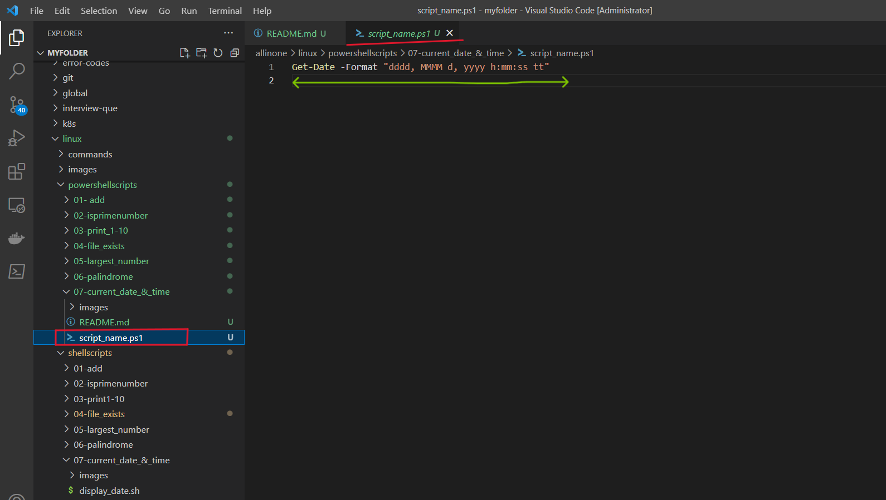
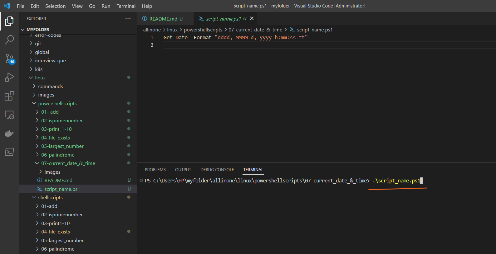
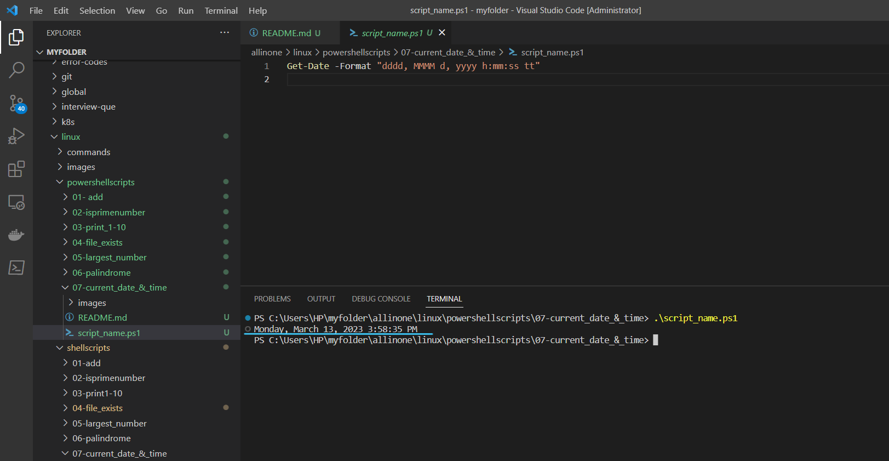

# PowerShell script to display the current date and time.

### This is a simple PowerShell script that displays the current date and time using the Get-Date command. You can run this script in a PowerShell console or terminal window on Windows, macOS, or Linux.

# Introduction

## What is PowerShell scripting ?

- PowerShell scripting is a powerful automation tool developed by Microsoft that allows users to automate tasks and system administration tasks on Windows operating systems. It is a command-line shell and scripting language that is designed to automate administrative tasks for Windows-based operating systems, such as managing system configurations, setting up network settings, and working with files and directories. PowerShell scripts can be used to automate a wide range of tasks, including system maintenance, software installation, and configuration management, among others.

- PowerShell scripting works by allowing users to write scripts that can execute commands, manage variables, and manipulate data within the Windows environment. These scripts can be saved as text files with the .ps1 extension and can be executed using the PowerShell command-line interface. PowerShell scripts can also be used in combination with other scripting languages, such as Python or Bash, to automate complex tasks.

- PowerShell scripting has become an important tool for system administrators and IT professionals, as it can save time and reduce errors by automating repetitive tasks. It is also widely used in DevOps and cloud computing environments for automating infrastructure management and deployment tasks.


# Pre-requisites

- **PowerShell**: The script requires PowerShell to be installed on your computer. PowerShell is a task automation and configuration management framework from Microsoft, which provides a command-line interface for interacting with the operating system and executing scripts.

- **Execution Policy**: By default, PowerShell's execution policy is set to "Restricted" to prevent malicious scripts from running. To run the script, you need to change the execution policy to "RemoteSigned" or "Unrestricted" by running the following command in PowerShell: `Set-ExecutionPolicy RemoteSigned`. This allows you to run PowerShell scripts that are created on your local computer or are downloaded from the internet, but not scripts that are signed by an untrusted publisher.

- **Text Editor**: You need a text editor to create and edit the PowerShell script. You can use any text editor, such as Notepad or Visual Studio Code.

# How to Run

- ### To use this program, simply create a file called  `script_name.ps1` and add the script to it .




- ### Now lets run the following command to display the current date and time .

```
.\script_name.ps1

```




- ### Yes , We can see the current date and time of the system .




# Description

- The PowerShell script provided is a simple program that displays the current date and time using the `Get-Date` command. When executed, the script outputs the current date and time in the default format, which is based on the system's regional settings.

- The script can be run on Windows, macOS, or Linux using the PowerShell console or terminal window. To run the script, the user needs to have PowerShell installed on their system. If PowerShell is not already installed, the user can follow the installation instructions provided by Microsoft.

- The usage of the script is straightforward: the user needs to navigate to the directory where the script is saved, type the name of the script file (including the file extension), and press Enter. The script will output the current date and time in the default format.

- If the user wants to customize the output format, they can modify the script to include the -Format parameter with a format string. The format string specifies the desired date and time format using a combination of format specifiers. The Microsoft documentation provides a list of available format specifiers and examples of how to use them.


