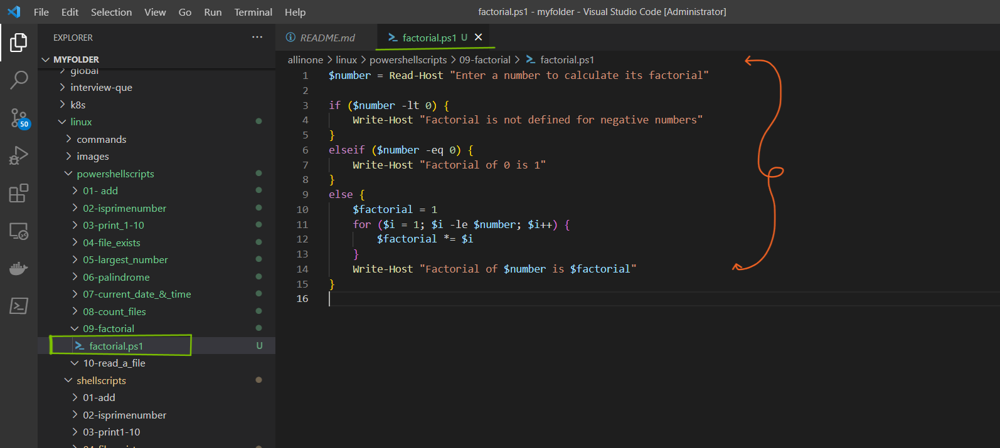
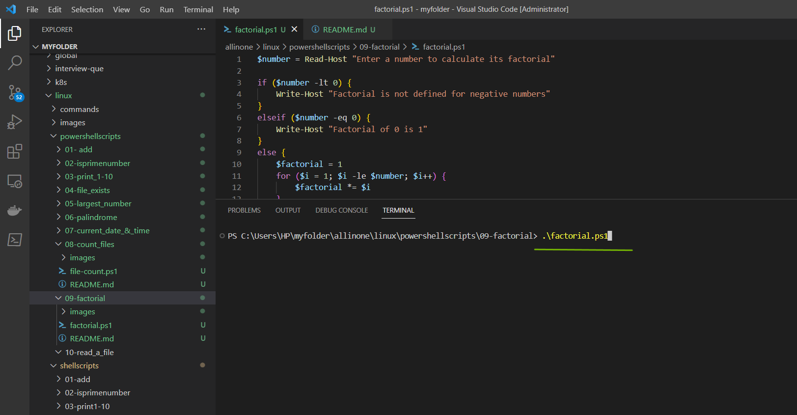
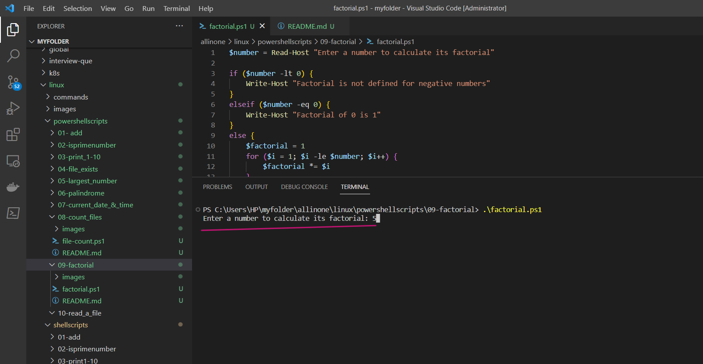
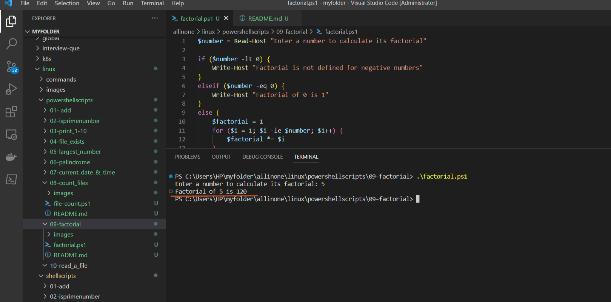

# PowerShell Factorial Script

### This is a PowerShell script that calculates the factorial of a given number. The script prompts the user to input a number and outputs the factorial of that number.

# Introduction

## What is PowerShell scripting ?

- PowerShell scripting is a powerful automation tool developed by Microsoft that allows users to automate tasks and system administration tasks on Windows operating systems. It is a command-line shell and scripting language that is designed to automate administrative tasks for Windows-based operating systems, such as managing system configurations, setting up network settings, and working with files and directories. PowerShell scripts can be used to automate a wide range of tasks, including system maintenance, software installation, and configuration management, among others.

- PowerShell scripting works by allowing users to write scripts that can execute commands, manage variables, and manipulate data within the Windows environment. These scripts can be saved as text files with the .ps1 extension and can be executed using the PowerShell command-line interface. PowerShell scripts can also be used in combination with other scripting languages, such as Python or Bash, to automate complex tasks.

- PowerShell scripting has become an important tool for system administrators and IT professionals, as it can save time and reduce errors by automating repetitive tasks. It is also widely used in DevOps and cloud computing environments for automating infrastructure management and deployment tasks.


# Pre-requisites

- **PowerShell**: The script requires PowerShell to be installed on your computer. PowerShell is a task automation and configuration management framework from Microsoft, which provides a command-line interface for interacting with the operating system and executing scripts.

- **Execution Policy**: By default, PowerShell's execution policy is set to "Restricted" to prevent malicious scripts from running. To run the script, you need to change the execution policy to "RemoteSigned" or "Unrestricted" by running the following command in PowerShell: `Set-ExecutionPolicy RemoteSigned`. This allows you to run PowerShell scripts that are created on your local computer or are downloaded from the internet, but not scripts that are signed by an untrusted publisher.

- **Text Editor**: You need a text editor to create and edit the PowerShell script. You can use any text editor, such as Notepad or Visual Studio Code.

# How to Run

- ### To use this program, simply create a file called  `factorial.ps1` and add the script to it .




- ### Now lets run the following command to calculate the factorial of a given number.

```
.\factorial.ps1

```



- ### Now, lets enter the numbers for which we want to see `factorial`.




- ### Yes , We can see the factorial of a given number is `120`.




# Description

- The PowerShell script prompts the user to input a number and calculates the factorial of that number. The script uses a loop to multiply all positive integers up to and including the input number. The result is then displayed in the PowerShell console.

- The script also includes error checking. If the user enters a negative number, the script displays an error message saying that the factorial is not defined for negative numbers. If the user enters zero, the script displays a message saying that the factorial of zero is one.

- The script can be saved as a .ps1 file and run in PowerShell on a Windows computer. The script requires PowerShell to be installed on the system and the execution policy to be set to allow running scripts. The README file provides instructions for how to run the script and includes notes on the script's functionality.

