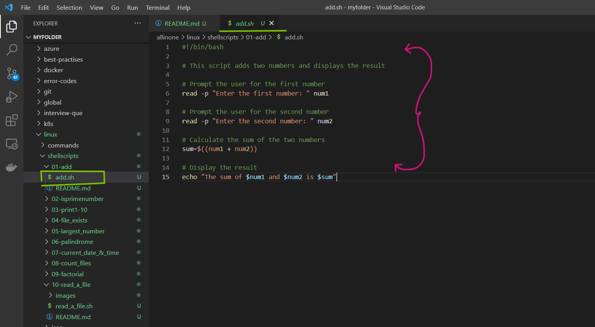
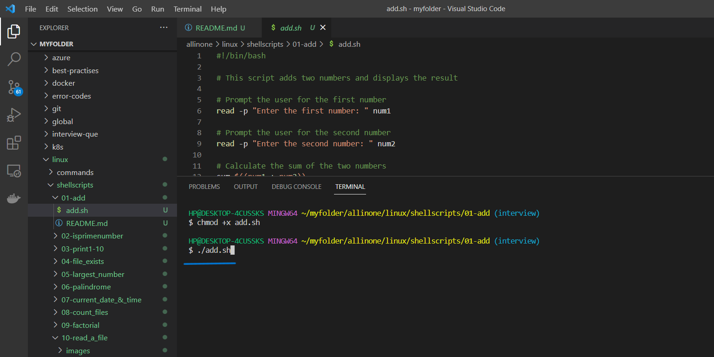
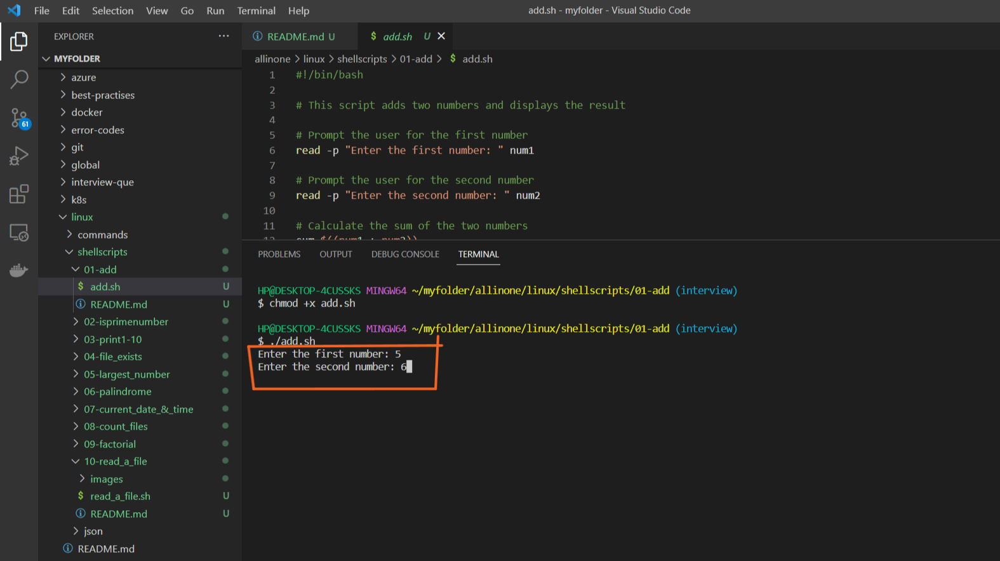
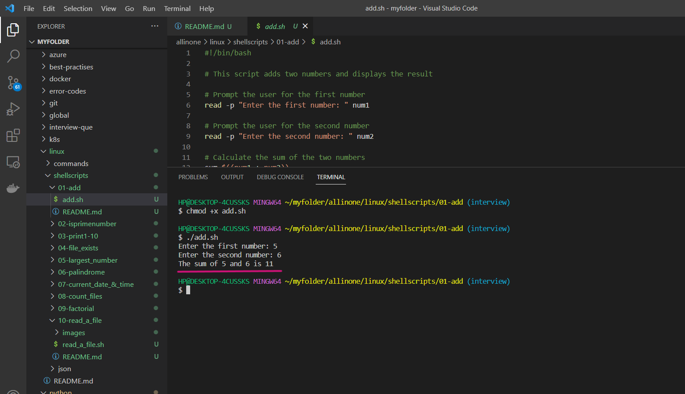

# Adding Two Numbers

### This is a simple Bash script that prompts the user for two numbers, calculates their sum, and displays the result

## What is Shell scripting ?

Shell scripting is a way to automate repetitive tasks or perform a series of commands in a specific sequence by writing a script or program in a shell language.

A shell script is essentially a computer program written in a shell language (e.g., Bash, Zsh, or Korn shell) that instructs the shell how to perform a series of tasks. These tasks may include manipulating files, processing text, executing commands, or even controlling other programs.

Shell scripts are useful for a wide range of tasks, such as automating backups, running system maintenance tasks, and installing software. They are widely used in the Unix and Linux environments, but can also be used on other operating systems such as Windows, with the appropriate shell or command-line interface


# Pre-requisites

- ### This script requires Bash to be installed on your system.

# How to Run

- ### To use this program, simply create a file called  `add.sh` and add the script to it .





- ### Open the terminal and run the following command to make it executable  `chmod +x add.sh`  Then you can run it like this:


```
chmod +x add.sh
```


- ### Now lets run the following command to do a sum of two numbers.

```
./add.sh

```




- ### Now, lets enter the numbers for which we want a sum.




- ### So, it displays the sum of two numbers.




# Description

- The script starts by using the `read` command to prompt the user to enter the first number, which is stored in a variable called `num1`. The same command is used again to prompt for the second number, which is stored in a variable called `num2`.

Next, the script uses the `$(( ))` syntax to calculate the sum of the two numbers, storing the result in a variable called sum.

Finally, the script uses the `echo` command to display a message to the user that includes the original input numbers and the calculated sum.

The script is very simple and does not include any error handling for non-numeric input or other edge cases. It could be modified and expanded to handle more complex input and perform additional arithmetic operations, depending on the needs of the user.


# If

If the execution permisssions are not there for the file, you will see below error

permission denied: ./add.sh