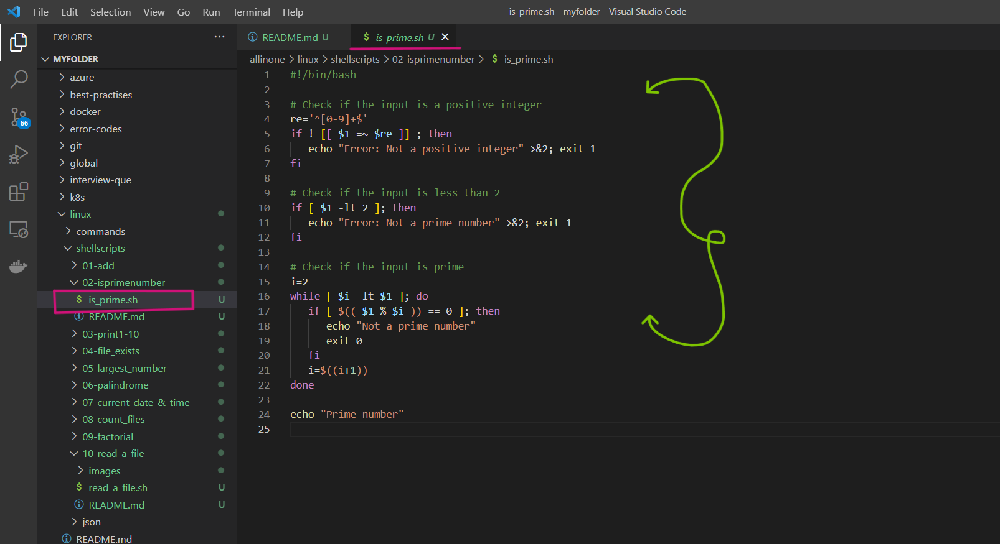
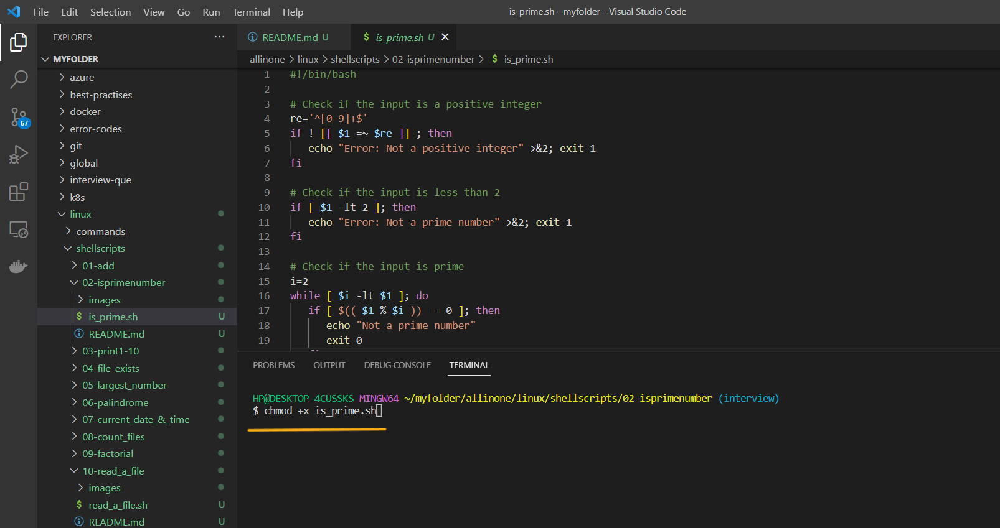
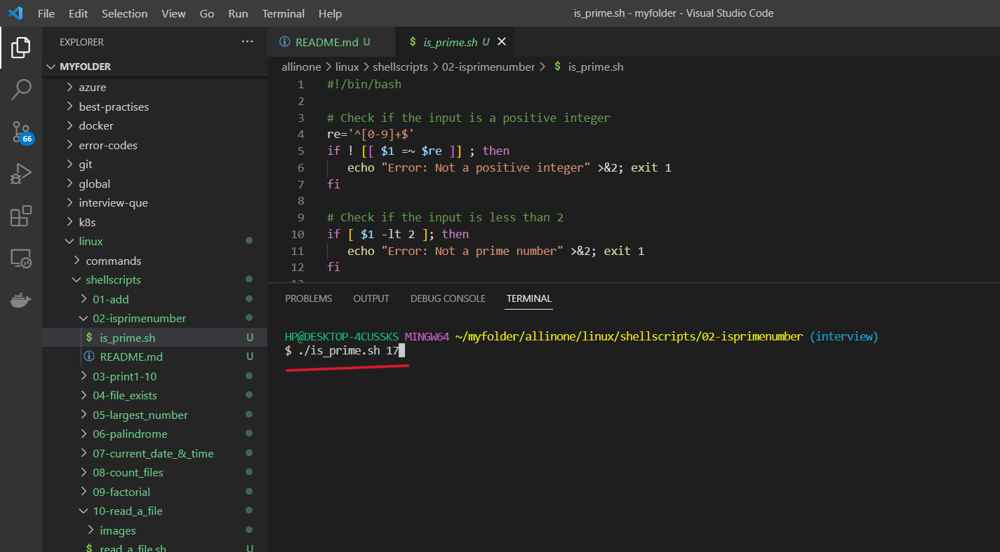
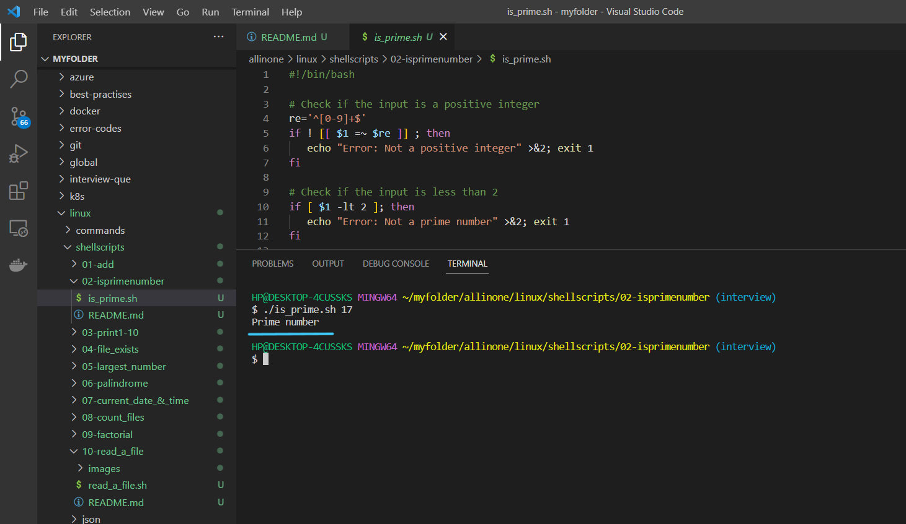
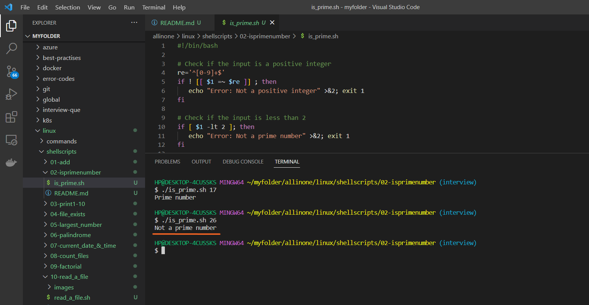

# Introduction

## Prime Number Checker

### Here is a simple script that takes a number as input and determines whether it is prime or not:

## What is Shell scripting ?

Shell scripting is a way to automate repetitive tasks or perform a series of commands in a specific sequence by writing a script or program in a shell language.

A shell script is essentially a computer program written in a shell language (e.g., Bash, Zsh, or Korn shell) that instructs the shell how to perform a series of tasks. These tasks may include manipulating files, processing text, executing commands, or even controlling other programs.

Shell scripts are useful for a wide range of tasks, such as automating backups, running system maintenance tasks, and installing software. They are widely used in the Unix and Linux environments, but can also be used on other operating systems such as Windows, with the appropriate shell or command-line interface


# Pre-requisites

- ### This script requires Bash to be installed on your system.

# How to Run

- ### To use this program, simply create a file called  `is_prime.sh` and add the script to it .





- ### Open the terminal and run the following command to make it executable  `chmod +x is_prime.sh`  Then you can run it like this:


```
chmod +x is_prime.sh
```



- ### Now lets run the following command to  determines whether the number `(17)` is prime or not.

```
./is_prime.sh 17

```




- ### Yes, `(17)` is a prime number.




- ### Lets enter the other number `(26)` and see if its a prime or not .

```
./is_prime.sh 26
```




# Description


- The script starts by checking if the input is a positive integer using regular expressions. It uses the `[[ ... =~ ... ]]` syntax to match the input against the regular expression `^[0-9]+$`, which matches any string that contains only digits. If the input does not match this regular expression, the script prints an error message and exits with an error code.

- Next, the script checks if the input is less than 2. This is because 1 and 0 are not considered prime numbers. If the input is less than 2, the script prints an error message and exits with an error code.

- Finally, the script checks if the input is prime by iterating over all numbers from 2 to the input minus 1. It uses a `while` loop and a counter variable `i` to iterate over the numbers. For each number, it checks if the input is divisible by that number using the modulo operator `%`. If the input is divisible by any of these numbers, it means it is not prime, and the script prints "Not a prime number" and exits with a success code. If the input is not divisible by any of these numbers, it is prime, and the script prints "Prime number" and exits with a success code.

Overall, this script is a simple implementation of a primality test in Bash.

# If

If the execution permisssions are not there for the file, you will see below error

permission denied: ./is_prime.sh