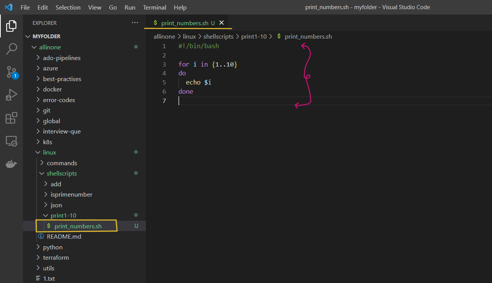
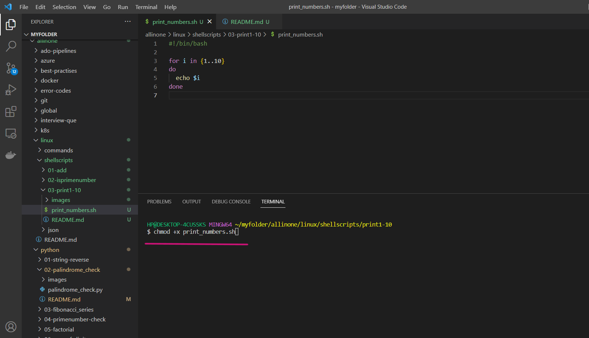
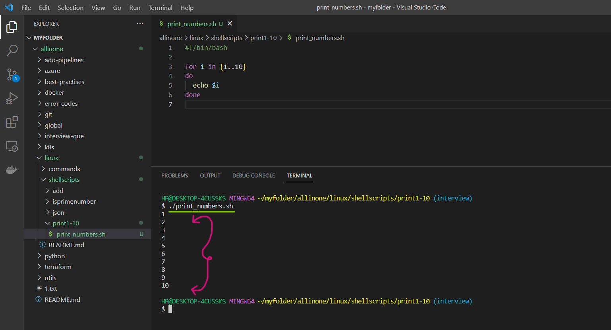

# Print Numbers Shell Script

### Here is a simple script that prints the numbers 1 to 10.

# Introduction

## What is Shell scripting ?

Shell scripting is a way to automate repetitive tasks or perform a series of commands in a specific sequence by writing a script or program in a shell language.

A shell script is essentially a computer program written in a shell language (e.g., Bash, Zsh, or Korn shell) that instructs the shell how to perform a series of tasks. These tasks may include manipulating files, processing text, executing commands, or even controlling other programs.

Shell scripts are useful for a wide range of tasks, such as automating backups, running system maintenance tasks, and installing software. They are widely used in the Unix and Linux environments, but can also be used on other operating systems such as Windows, with the appropriate shell or command-line interface


# Pre-requisites

- ### This script requires Bash to be installed on your system.


# How to Run

- ### To use this program, simply create a file called  `print_numbers.sh` and add the script to it .





- ### Open the terminal and run the following command to make it executable  `chmod +x print_numbers.sh`  Then you can run it like this:


```
chmod +x print_numbers.sh
```


- ### After lets print numbers 1- 10  by running the following command ,

```
./print_numbers.sh
```



# If

- If the execution permisssions are not there for the file, you will see below error

- permission denied: ./print_numbers.sh