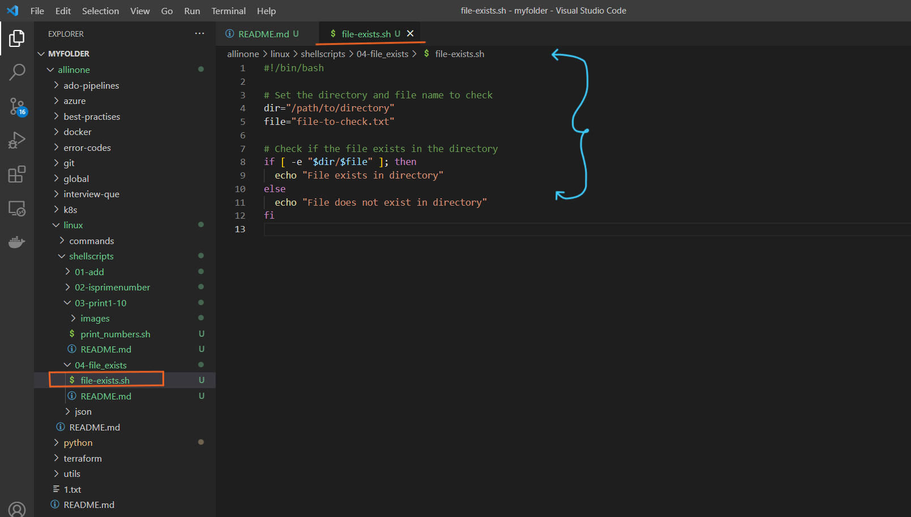
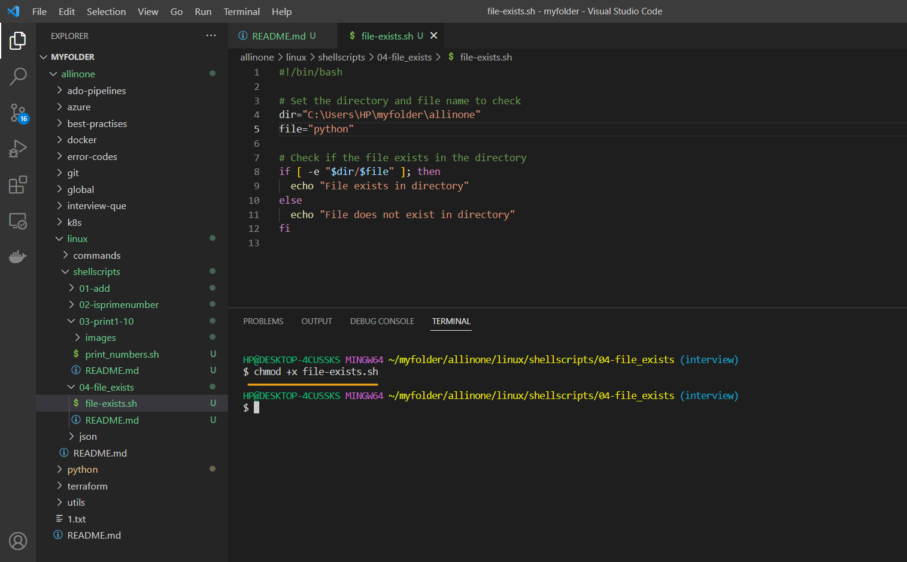
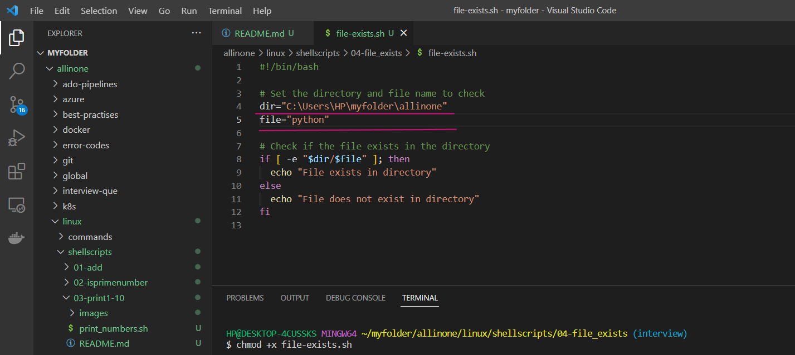
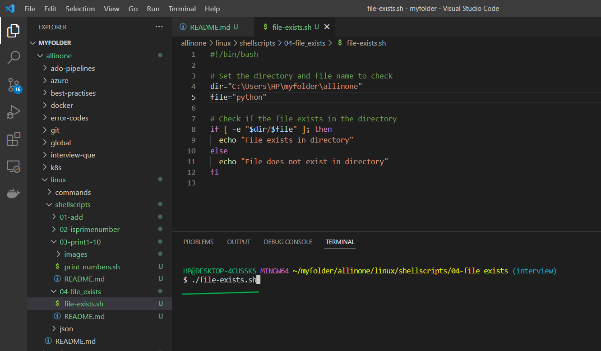
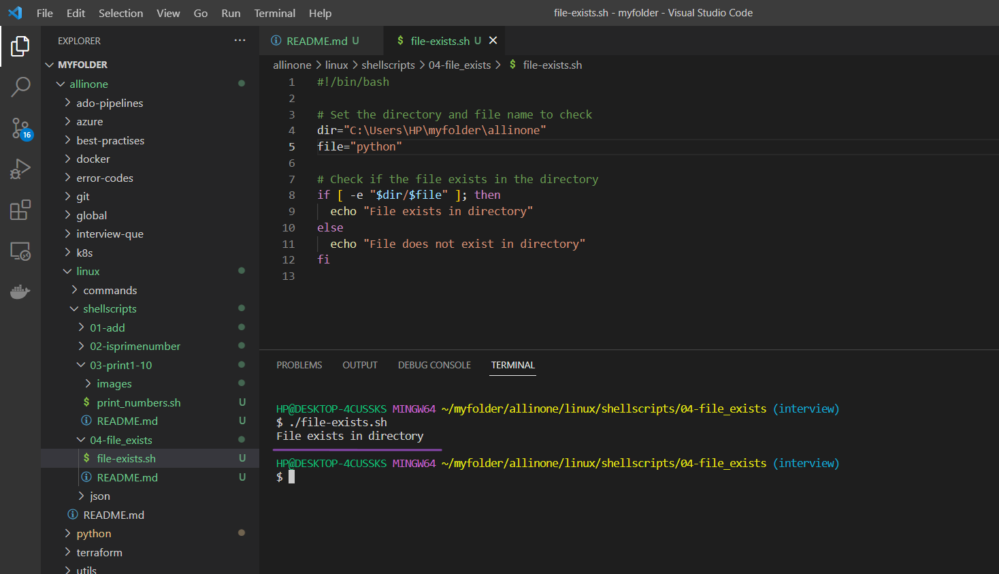

# File Exists Shell Script

### Here is a simple shell script that checks if a specified file exists in a specified directory.

# Introduction

## What is Shell scripting ?

Shell scripting is a way to automate repetitive tasks or perform a series of commands in a specific sequence by writing a script or program in a shell language.

A shell script is essentially a computer program written in a shell language (e.g., Bash, Zsh, or Korn shell) that instructs the shell how to perform a series of tasks. These tasks may include manipulating files, processing text, executing commands, or even controlling other programs.

Shell scripts are useful for a wide range of tasks, such as automating backups, running system maintenance tasks, and installing software. They are widely used in the Unix and Linux environments, but can also be used on other operating systems such as Windows, with the appropriate shell or command-line interface


# Pre-requisites

- ### This script requires Bash to be installed on your system.


# How to Run

- ### To use this program, simply create a file called  `file-exists.sh` and add the script to it .





- ### Open the terminal and run the following command to make it executable  `chmod +x file-exists.sh`  Then you can run it like this:


```
chmod +x file-exists.sh
```



- ### Now lets give the directory path and file name to check if it exists in that directory or not. So ,we have given our directory path and file name ,



- ### Now lets run the following command to see whether the file exists or not .


```
./file-exists.sh
```



- ### yes , it says that the mentioned file exists in that directory...




- ### Also , we can check by giving wrong file name which doesnt exist and ask the script to check for us.


- ### So, it says that the mentioned file does not exists in  directory..


# Description

- The script first sets two variables: `dir` and `file`. You should replace `/path/to/director`y with the actual path to the directory you want to check, and `file-to-check.txt` with the actual name of the file you want to check.

The script uses the `-e` option of the `test` command (which is equivalent to the `[` command) to check if the file exists in the directory. The expression `"$dir/$file"` is the full path to the file.

If the file exists, the script prints "File exists in directory" to the terminal. Otherwise, it prints "File does not exist in directory".

Note that you should replace the variables `dir` and `file` with the actual values you want to use in your script. Additionally, make sure to set the correct file permissions to execute the script using the command `chmod +x file-exists.sh`


# If

- If the execution permisssions are not there for the file, you will see below error

- permission denied: ./file-exists.sh