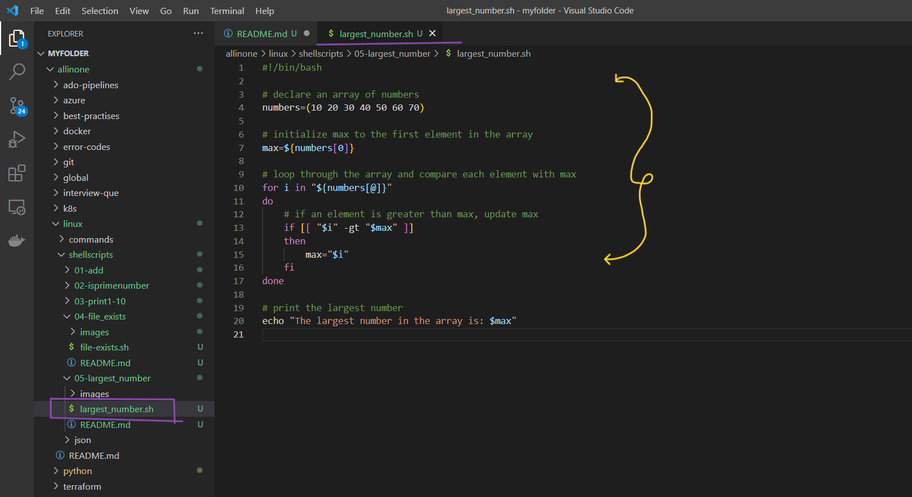
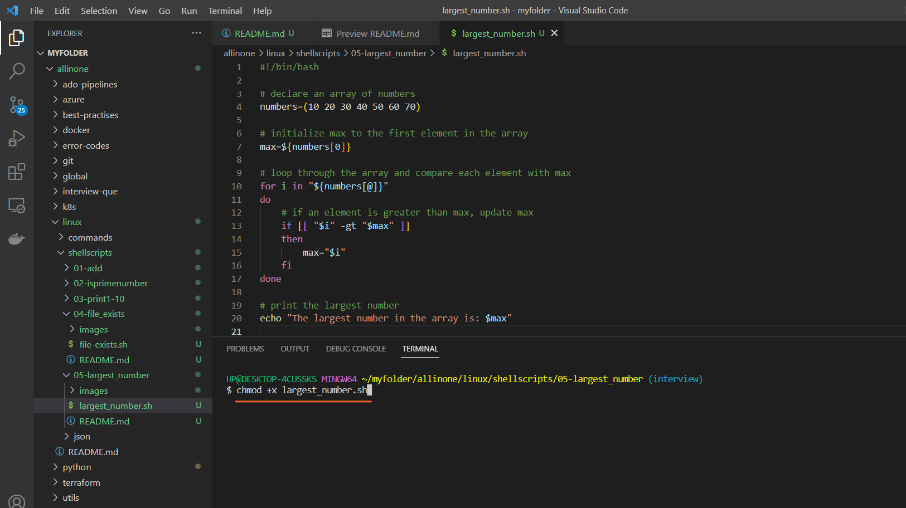
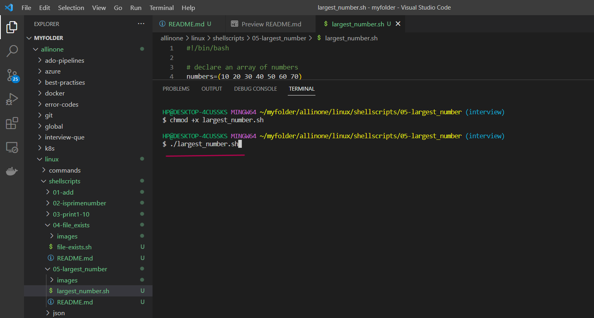
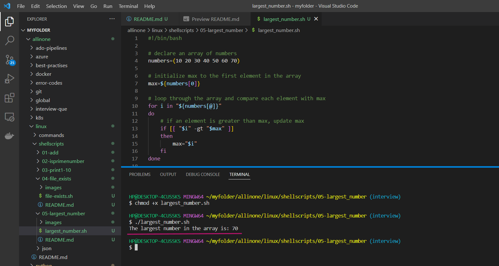

# Find the Largest Number in an Array

### This is a simple shell script that finds the largest number in an array of numbers. It uses a for loop to iterate through each element in the array and compare it with the current maximum value. If an element is greater than the current maximum, the maximum value is updated.

# Introduction

## What is Shell scripting ?

Shell scripting is a way to automate repetitive tasks or perform a series of commands in a specific sequence by writing a script or program in a shell language.

A shell script is essentially a computer program written in a shell language (e.g., Bash, Zsh, or Korn shell) that instructs the shell how to perform a series of tasks. These tasks may include manipulating files, processing text, executing commands, or even controlling other programs.

Shell scripts are useful for a wide range of tasks, such as automating backups, running system maintenance tasks, and installing software. They are widely used in the Unix and Linux environments, but can also be used on other operating systems such as Windows, with the appropriate shell or command-line interface


# Pre-requisites

- ### This script requires Bash to be installed on your system.

# How to Run

- ### To use this program, simply create a file called  `largest_number.sh` and add the script to it .





- ### Open the terminal and run the following command to make it executable  `chmod +x largest_number.sh`  Then you can run it like this:


```
chmod +x largest_number.sh 
```



- ### Now lets run the following command to see the largest number in the given array .

```
./print_numbers.sh
```




- ### So, it shows that 70 is the largest number in given array.




# Description

- The script starts by declaring an array of numbers. In this example, the array is initialized with the values ```10 20 30 40 50 60 70```, but you can modify this array to contain any set of numbers you like.

- The script then initializes the ```max``` variable to the first element in the array.

- The script uses a ```for``` loop to iterate through each element in the array. For each element, it compares the element with the current value of ```max``` using an ```if``` statement. If the element is greater than ```max```, the value of ```max``` is updated to the value of the element.

- After the loop has finished iterating through the array, the script outputs the value of ```max``` to the console.

# If

- If the execution permisssions are not there for the file, you will see below error

- permission denied: ./largest_number.sh