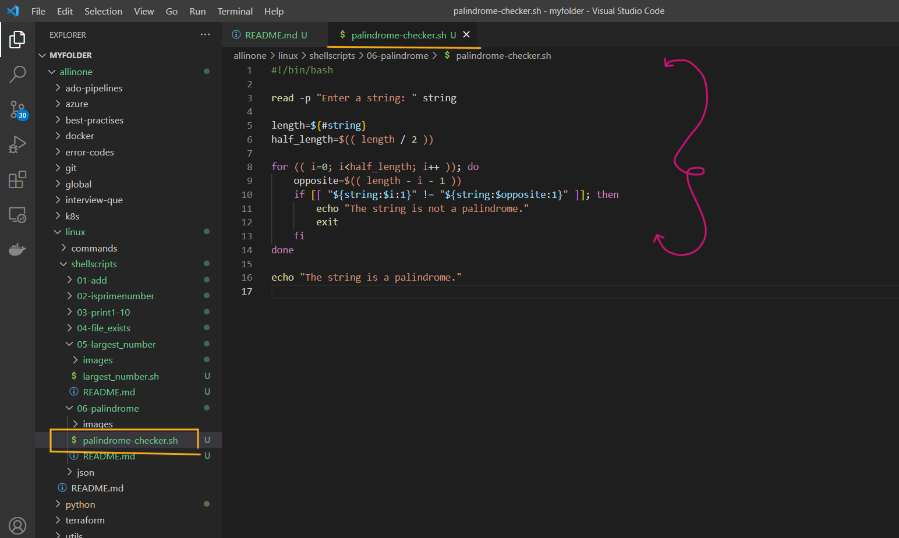
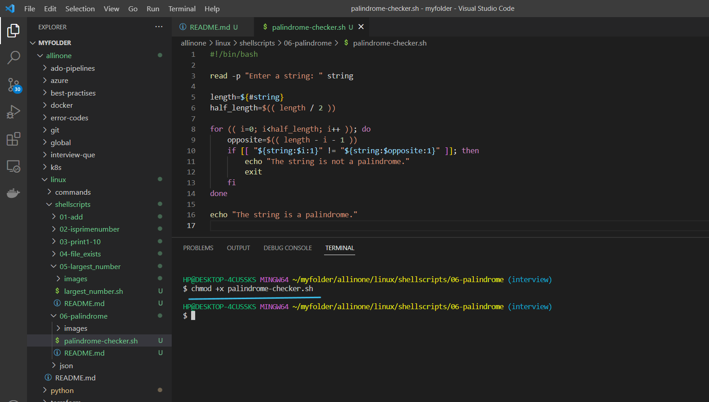
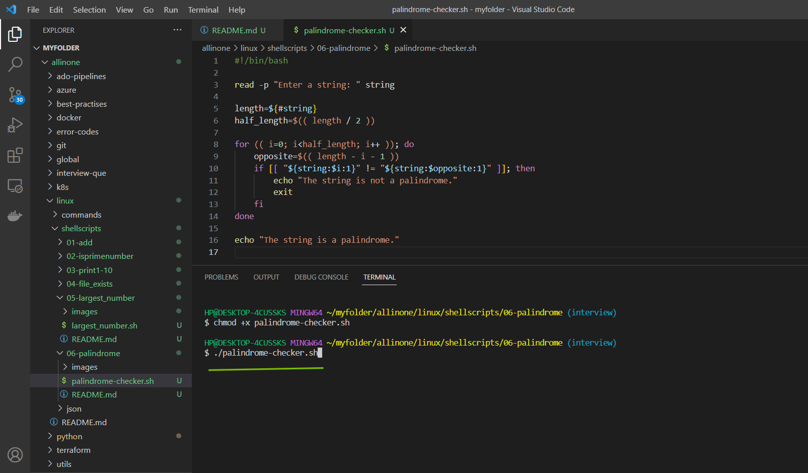
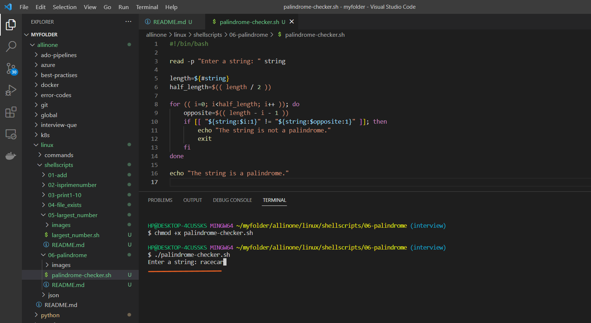
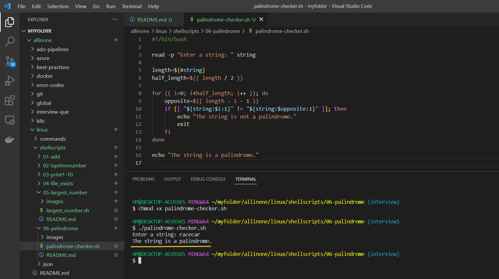

# Palindrome Checker Shell Script

### This is a shell script that checks if a given string is a palindrome.

# Introduction

## What is Shell scripting ?

Shell scripting is a way to automate repetitive tasks or perform a series of commands in a specific sequence by writing a script or program in a shell language.

A shell script is essentially a computer program written in a shell language (e.g., Bash, Zsh, or Korn shell) that instructs the shell how to perform a series of tasks. These tasks may include manipulating files, processing text, executing commands, or even controlling other programs.

Shell scripts are useful for a wide range of tasks, such as automating backups, running system maintenance tasks, and installing software. They are widely used in the Unix and Linux environments, but can also be used on other operating systems such as Windows, with the appropriate shell or command-line interface


# Pre-requisites

- ### This script requires Bash to be installed on your system.

# How to Run

- ### To use this program, simply create a file called  `palindrome-checker.sh` and add the script to it .





- ### Open the terminal and run the following command to make it executable  `chmod +x palindrome-checker.sh`  Then you can run it like this:


```
chmod +x palindrome-checker.sh
```



- ### Now lets run the following command to check if a given string is a `palindrome`.

```
./palindrome-checker.sh

```




- ### Now, enter the string to which you want to check if its a `palindrome` .




- ### Yes , the entered string is a palindrome .




# Description

- The script starts by prompting the user to enter a string using the read command, and storing the string in a variable called string.

- The length of the string is determined using the ${#string} syntax, and divided by 2 to obtain the halfway point. This is stored in a variable called half_length.

- A for loop is used to iterate over the first half of the string, using the length variable and the half_length variable to determine the range of indices to check.

- Inside the loop, the index of the character at the opposite end of the string is determined using the formula length - i - 1. This index is stored in a variable called opposite.

- The if statement inside the loop checks whether the character at the current index and the character at the opposite index are the same. If they are not, then the string is not a palindrome and the script exits.

- If the loop completes without exiting, then the string is a palindrome and the script outputs a message indicating this.

- The script uses a different method compared to the previous palindrome checker script. Instead of reversing the string and comparing it to the original, this script compares the characters at each end of the string, iterating over the first half of the string and checking against the corresponding character at the other end.


# If

- If the execution permisssions are not there for the file, you will see below error

- permission denied: ./palindrome-checker.sh