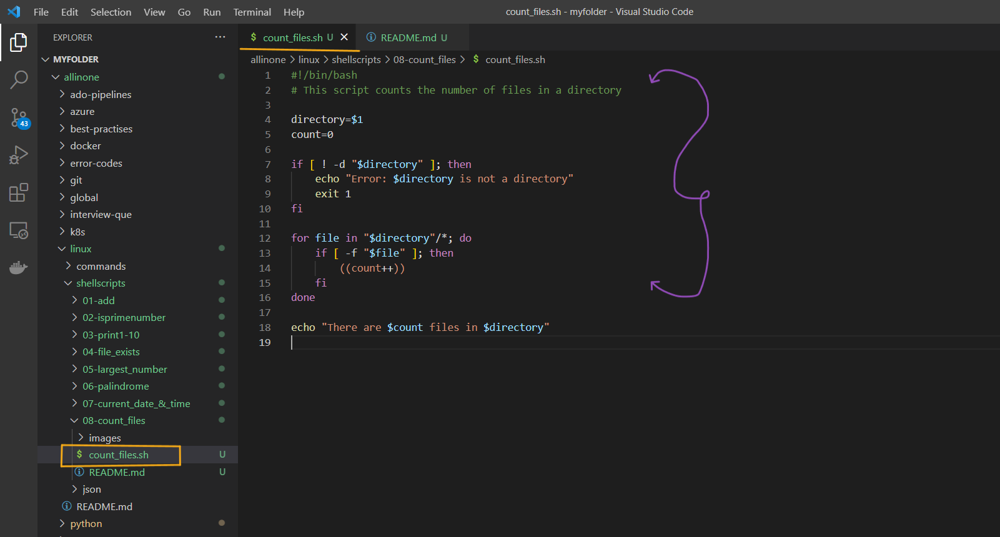
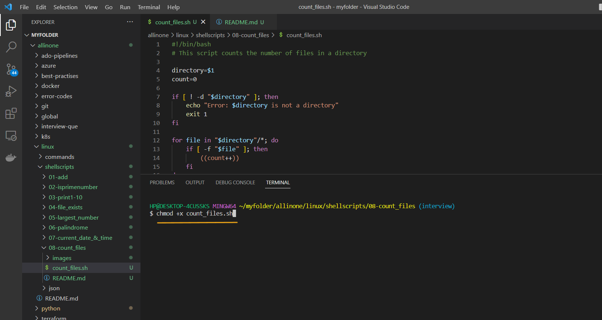
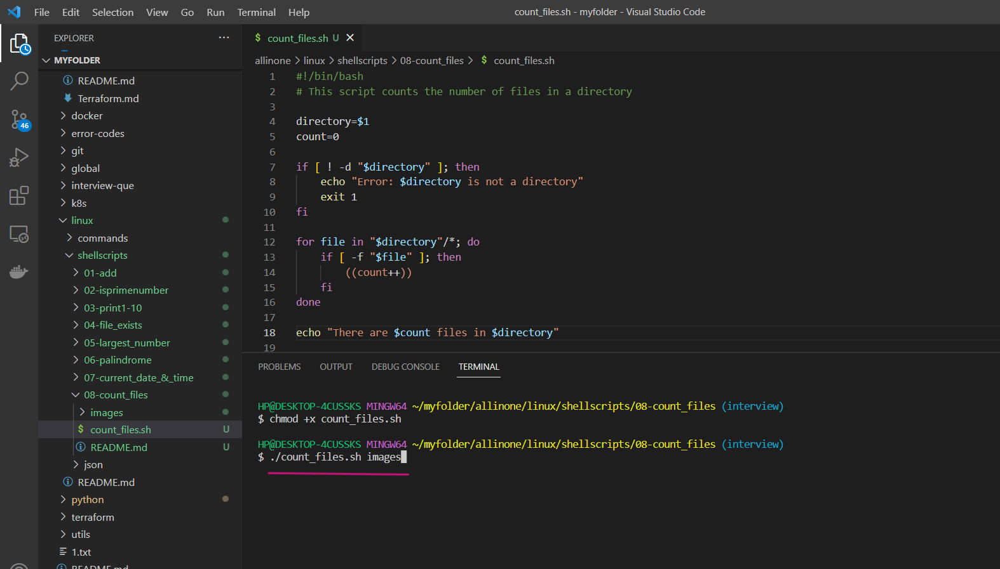
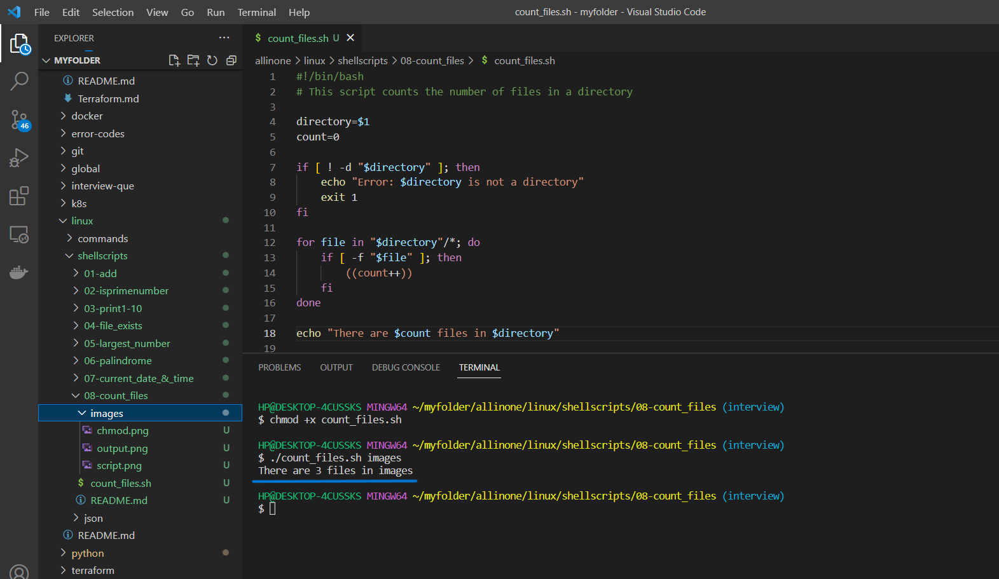

#  Count Files in Directory

### This script counts the number of files in a directory..

# Introduction

## What is Shell scripting ?

Shell scripting is a way to automate repetitive tasks or perform a series of commands in a specific sequence by writing a script or program in a shell language.

A shell script is essentially a computer program written in a shell language (e.g., Bash, Zsh, or Korn shell) that instructs the shell how to perform a series of tasks. These tasks may include manipulating files, processing text, executing commands, or even controlling other programs.

Shell scripts are useful for a wide range of tasks, such as automating backups, running system maintenance tasks, and installing software. They are widely used in the Unix and Linux environments, but can also be used on other operating systems such as Windows, with the appropriate shell or command-line interface


# Pre-requisites

- ### This script requires Bash to be installed on your system.

# How to Run

- ### To use this program, simply create a file called  `count_files.sh` and add the script to it .





- ### Open the terminal and run the following command to make it executable  `chmod +x count_files.sh`  Then you can run it like this:


```
chmod +x count_files.sh 
```



- ### Now lets run the following command along with directory name to see the number of files in that directory

```
./count_files.sh
```




- ### So, it shows the count of number of files in a directory.




# Description

```
if [ ! -d "$directory" ]; then
    echo "Error: $directory is not a directory"
    exit 1
fi
```
- This block of code checks if the specified directory exists. If it doesn't, the script will output an error message and exit with an error code of 1. The -d flag checks if $directory is a directory.

```
for file in "$directory"/*; do
    if [ -f "$file" ]; then
        ((count++))
    fi
done

```
- This block of code uses a for loop to iterate through each file in the specified directory. If a file is found, the script checks if it is a regular file (i.e., not a directory, device file, etc.) using the -f flag. If the file is a regular file, the count variable is incremented by 1.

```
echo "There are $count files in $directory"

```
Finally, this line prints out the total number of files found in the specified directory.

Overall, this shell script is a simple and useful tool for counting the number of files in a directory. It can be helpful for various applications such as data analysis, image processing, and more.


# If

- If the execution permisssions are not there for the file, you will see below error

- permission denied: ./count_files.sh