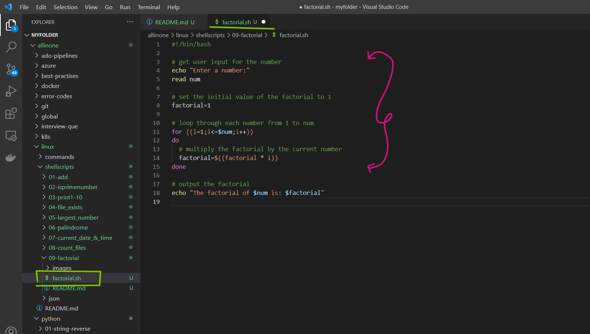
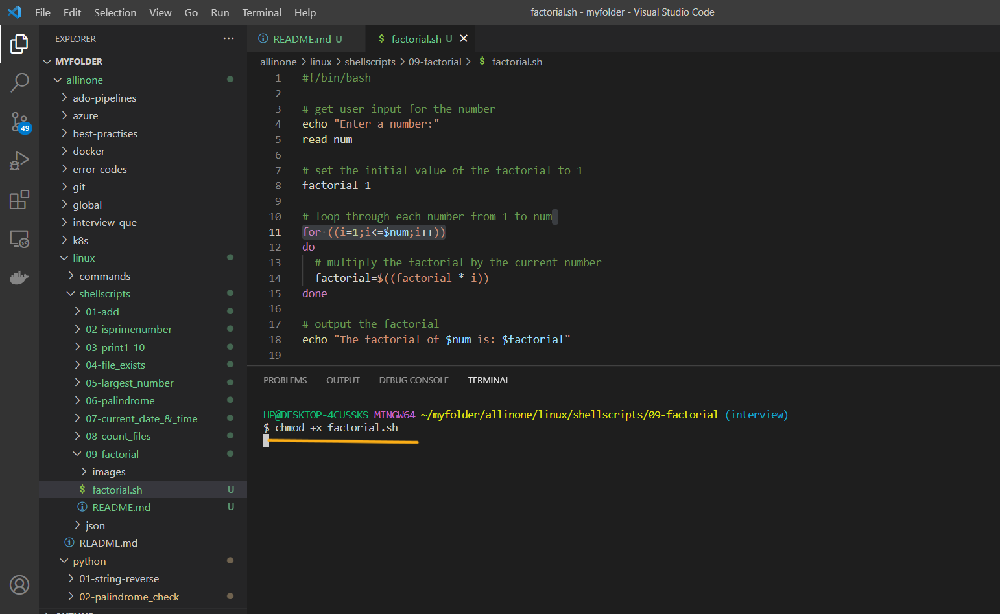
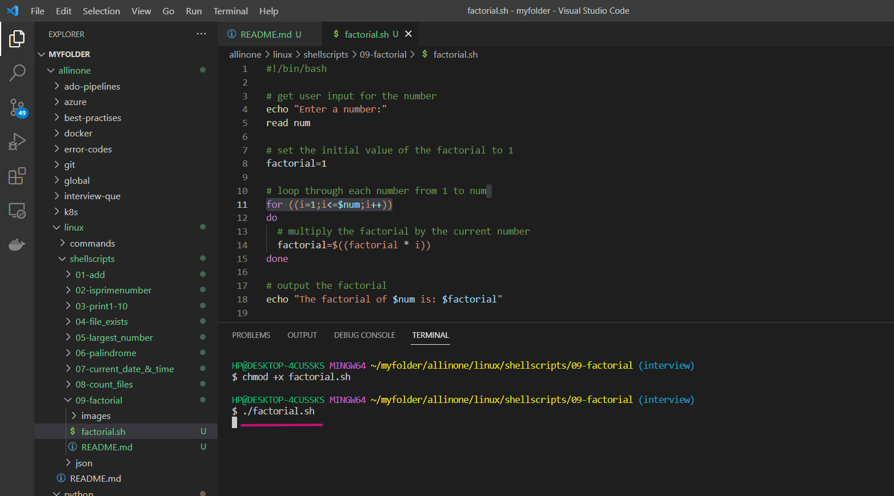
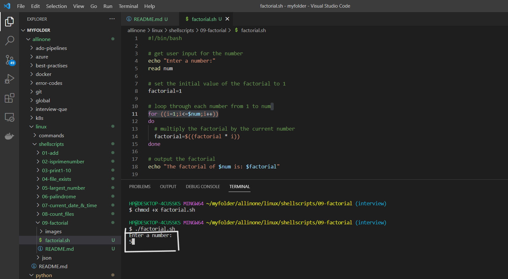
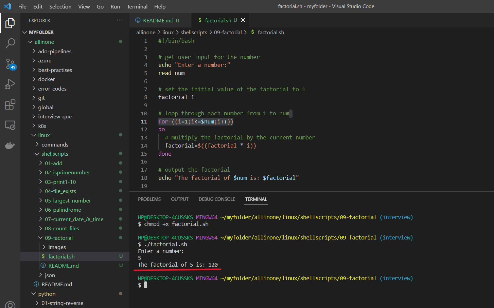

# Factorial Calculator

### This is a simple shell script that calculates the factorial of a given number. It takes a user input number and outputs the factorial of that number.

# Introduction

## What is Shell scripting ?

Shell scripting is a way to automate repetitive tasks or perform a series of commands in a specific sequence by writing a script or program in a shell language.

A shell script is essentially a computer program written in a shell language (e.g., Bash, Zsh, or Korn shell) that instructs the shell how to perform a series of tasks. These tasks may include manipulating files, processing text, executing commands, or even controlling other programs.

Shell scripts are useful for a wide range of tasks, such as automating backups, running system maintenance tasks, and installing software. They are widely used in the Unix and Linux environments, but can also be used on other operating systems such as Windows, with the appropriate shell or command-line interface


# Pre-requisites

- ### This script requires Bash to be installed on your system.

# How to Run

- ### To use this program, simply create a file called  `factorial.sh` and add the script to it .





- ### Open the terminal and run the following command to make it executable  `chmod +x factorial.sh`  Then you can run it like this:


```
chmod +x factorial.sh
```



- ### Now lets run the following command to check if a given string is a `palindrome`.

```
./factorial.sh

```




- ### Now, enter the number for which you want to see factorial .




- ### So , the factorial of `5` is `120`.
```
5! = 5 * 4 * 3 * 2 * 1

When we multiply these numbers together, we get:

5! = 120
```




# Description

- The script begins by prompting the user to enter a number, which is read using the read command and stored in a variable called `num`.

- Next, the script initializes a variable called `factorial` to 1, which will be used to store the final result of the factorial calculation.

- The script then uses a `for` loop to iterate from 1 to `num`. Inside the loop, the script multiplies the `factorial` variable by the current loop iteration number i. This is done using the arithmetic expansion syntax `$(( ))` in Bash, which allows for basic mathematical operations.

- Once the loop completes, the script outputs the `factorial` variable using `echo`.

- Finally, the script has been provided with the necessary permissions to run as an executable file using the chmod command, so it can be run by typing `./factorial.sh` into the terminal. When the script is run, it will prompt the user for input, calculate the factorial, and output the result.

- Overall, this script provides a simple and straightforward way to calculate the factorial of a given number using Bash.


# If

- If the execution permisssions are not there for the file, you will see below error

- permission denied: ./factorial.sh