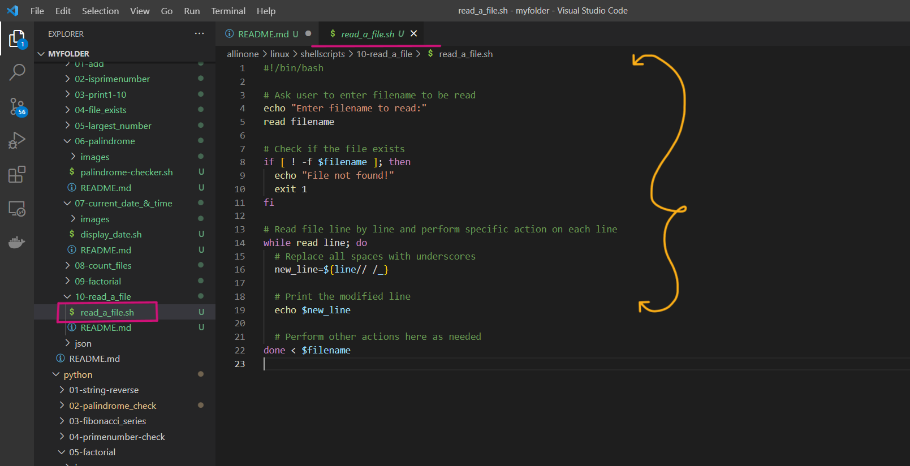
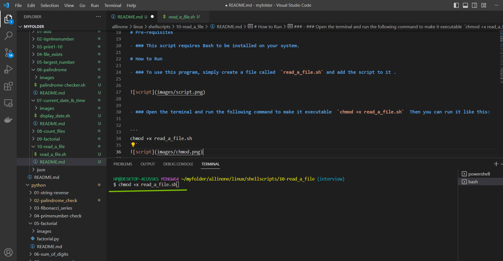
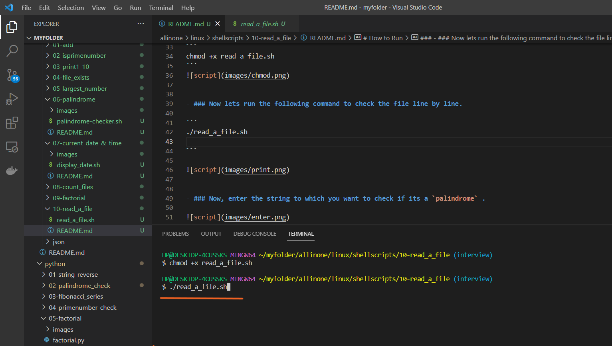
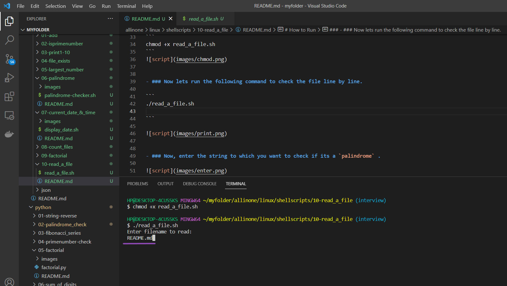
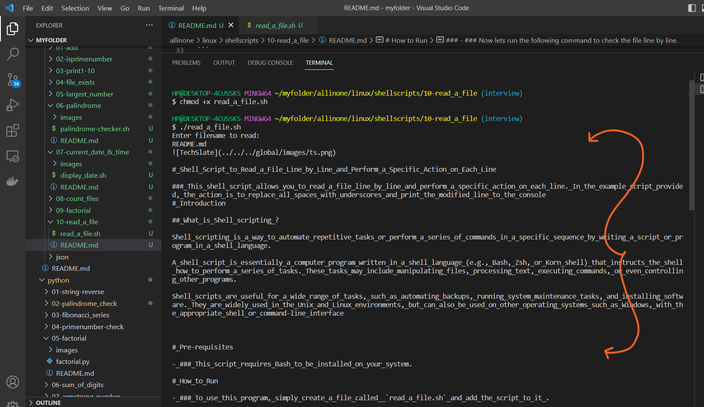

# Read a File Line by Line and Perform a Specific Action on Each Line

### This shell script allows you to read a file line by line and perform a specific action on each line. In the example script provided, the action is to replace all spaces with underscores and print the modified line to the console
# Introduction

## What is Shell scripting ?

Shell scripting is a way to automate repetitive tasks or perform a series of commands in a specific sequence by writing a script or program in a shell language.

A shell script is essentially a computer program written in a shell language (e.g., Bash, Zsh, or Korn shell) that instructs the shell how to perform a series of tasks. These tasks may include manipulating files, processing text, executing commands, or even controlling other programs.

Shell scripts are useful for a wide range of tasks, such as automating backups, running system maintenance tasks, and installing software. They are widely used in the Unix and Linux environments, but can also be used on other operating systems such as Windows, with the appropriate shell or command-line interface


# Pre-requisites

- ### This script requires Bash to be installed on your system.

# How to Run

- ### To use this program, simply create a file called  `read_a_file.sh` and add the script to it .





- ### Open the terminal and run the following command to make it executable  `chmod +x read_a_file.sh`  Then you can run it like this:


```
chmod +x read_a_file.sh
```



- ### Now lets run the following command to check the file line by line.

```
./read_a_file.sh

```




- ### Now, enter the file name , which you want see line to line .




- ### So, it displays the line to line content of README.md file which i wanted to see .




# Description

- The script first prompts the user to enter the filename to be read.

- It then checks if the file exists using the [ -f filename ] command. If the file does not exist, the script prints an error message and exits with a status code of 1 using the exit command.

-  If the file exists, the script uses a while loop to read the file line by line using the read command. The loop continues until there are no more lines to read.

- For each line read by the loop, the script performs a specific action on the line. In the example script provided, the action is to replace all spaces in the line with underscores using the ${variable//pattern/replacement} syntax, and then print the modified line to the console using the echo command. You can modify this action to perform any task you need on each line.

- The done keyword marks the end of the loop.

- The < filename syntax at the end of the while loop is used to redirect input to the loop from the specified file. This tells the loop to read each line from the specified file instead of from standard input (i.e., the keyboard).

- Overall, this shell script provides a simple way to read a file line by line and perform a specific action on each line using Bash. You can modify the script to perform different actions on each line, depending on your specific needs.


# If

- If the execution permisssions are not there for the file, you will see below error

- permission denied: ./read_a_file.sh