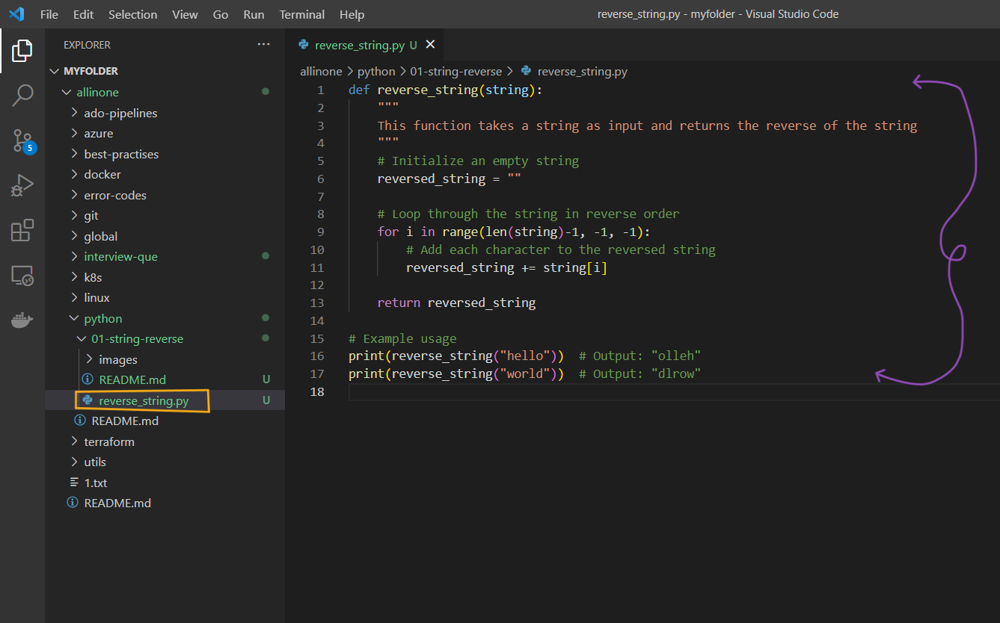
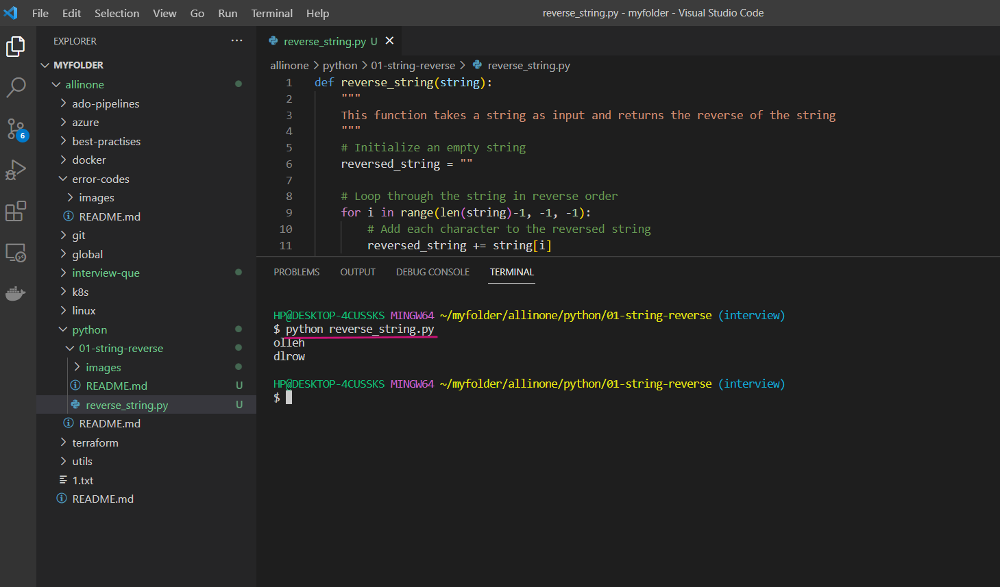
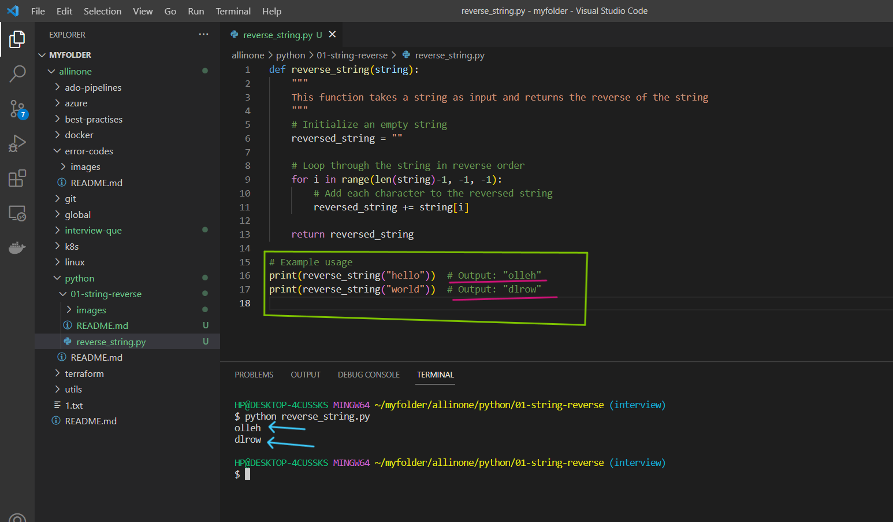

# String Reversal Program

### This is a simple Python program that takes a string as input and returns the reverse of that string.


# Introduction 

## What is string reversal program  ?

- A string reversal program is a program that takes a string as input and outputs the reverse of the string. For example, if the input is "hello", the output would be "olleh". This can be done using different programming languages and techniques, such as using loops or built-in functions that allow us to manipulate strings.


# Pre-requistes

- This program requires Python 3.x to be installed on your system. If you don't have Python installed, you can download it from the official website(https://www.python.org/downloads/).


# How to run ?

- ### To use this program, simply create a file called reverse_string.py and add the code to it .




- ### Open the Terminal and run the following command .

   ```
   python reverse_string.py
   ```




- ### As mentioned in the code , the expected output would be `olleh` and `dlrow` , which are reverse string of `hello` and `world`.





# Description 

- In this program, we define a function reverse_string that takes a string as input and returns the reverse of that string. 

- We initialize an empty string reversed_string, and then loop through the characters of the input string in reverse order using a for loop. 

- In each iteration of the loop, we add the current character to the reversed_string. 

- Finally, we return the reversed_string.

- When we call the reverse_string function with an input string, it returns the reverse of that string. In the example usage above, we call the function with the input strings "hello" and "world", and it returns their respective reversed strings `"olleh"` and `"dlrow"`.

